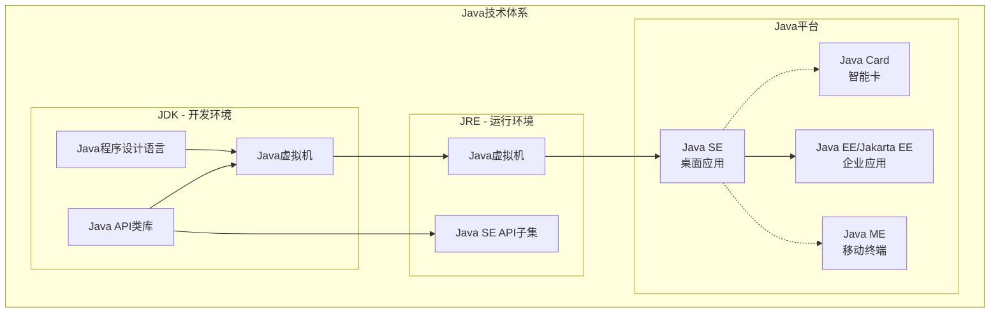
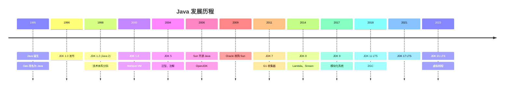
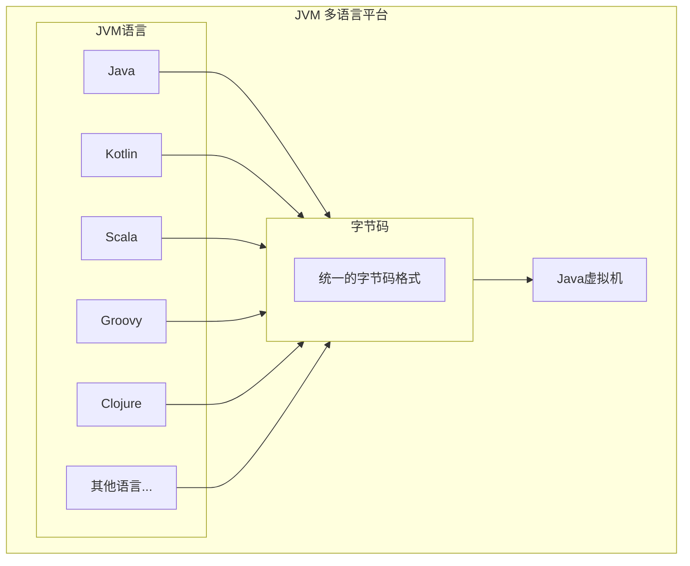
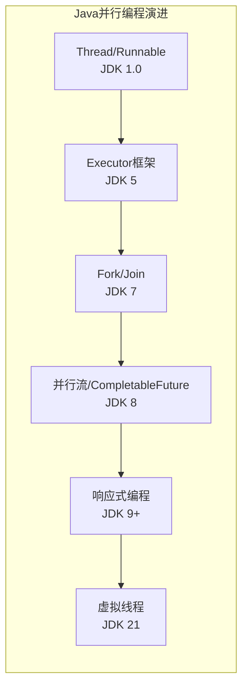
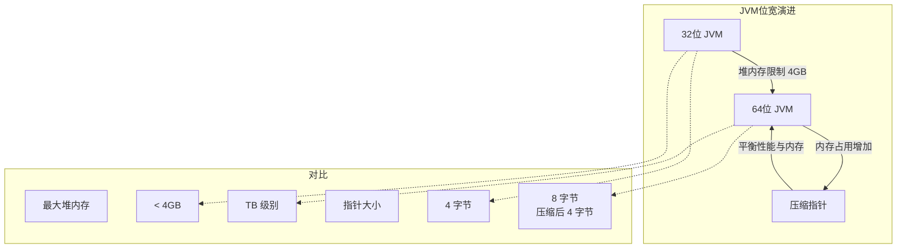
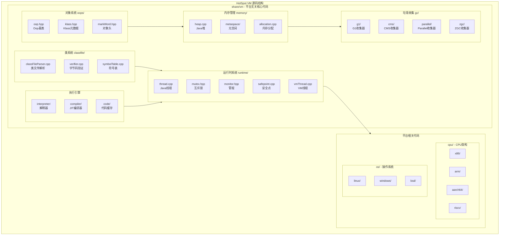
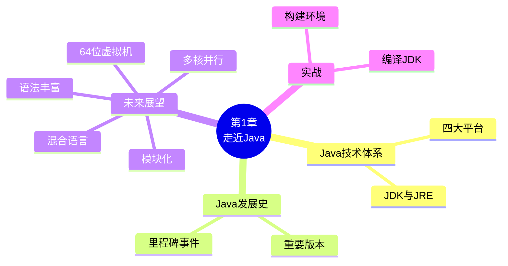

# 第1章 走近Java

## 1.1 概述

Java 不仅仅是一门编程语言，而是一个由一系列计算机软件和规范组成的技术体系。这个技术体系提出了"一次编写，到处运行"（Write Once, Run Anywhere）的理想，并提供了跨平台部署的能力。

Java 技术体系主要包括以下几个组成部分：

- **Java 程序设计语言**
- **各种硬件平台上的 Java 虚拟机（JVM）**
- **Java API 类库**
- **来自商业机构和开源社区的第三方 Java 类库**

JDK（Java Development Kit）是用于支持 Java 程序开发的最小环境，包含了 Java 程序设计语言、Java 虚拟机和 Java API 类库这三部分。JRE（Java Runtime Environment）则是支持 Java 程序运行的标准环境，包含了 Java 虚拟机和 Java API 类库中的 Java SE API 子集。

## 1.2 Java技术体系

Java 技术体系可以划分为四个平台：

### 1.2.1 Java Card

支持 Java 小程序（Applets）运行在小内存设备（如智能卡）上的平台。

### 1.2.2 Java ME（Micro Edition）

支持 Java 程序运行在移动终端（手机、PDA）上的平台。前身是 J2ME，现已逐渐被 Android 取代。

### 1.2.3 Java SE（Standard Edition）

支持面向桌面级应用（如 Windows 下的应用程序）的 Java 平台，提供了完整的 Java 核心 API。

### 1.2.4 Java EE（Enterprise Edition）

支持使用多层架构的企业级应用（如 ERP、CRM 应用）的 Java 平台，除了提供 Java SE API 外，还对其做了大量的扩充并提供了相关的部署支持。前身是 J2EE，2017 年后更名为 Jakarta EE。



## 1.3 Java发展史

Java 诞生于 1995 年，由 Sun 公司的 James Gosling 领导的 Green 项目发展而来。以下是 Java 发展的重要里程碑：

### 重要版本发布历程

| 年份 | 版本 | 重要特性 |
|------|------|----------|
| 1996 | JDK 1.0 | 首个正式版本，Sun Classic VM |
| 1998 | JDK 1.2 | 技术体系分拆为 J2SE/J2EE/J2ME，内置 JIT 编译器 |
| 2000 | JDK 1.3 | HotSpot VM 成为默认虚拟机 |
| 2002 | JDK 1.4 | NIO、正则表达式、异常链、XML 解析器 |
| 2004 | JDK 5 | 泛型、注解、枚举、自动装箱、增强 for 循环、并发包 |
| 2006 | JDK 6 | 脚本语言支持、编译器 API、HTTP 服务器 API |
| 2011 | JDK 7 | G1 收集器、NIO.2、try-with-resources、switch 字符串 |
| 2014 | JDK 8 | Lambda 表达式、Stream API、新日期时间 API、Nashorn |
| 2017 | JDK 9 | 模块化系统（Jigsaw）、JShell、G1 成为默认 GC |
| 2018 | JDK 10 | 局部变量类型推断（var） |
| 2018 | JDK 11 | ZGC、HTTP Client API、长期支持（LTS）版本 |
| 2019 | JDK 12-13 | Switch 表达式、文本块 |
| 2020 | JDK 14-15 | Records、密封类、ZGC 正式版、Shenandoah |
| 2021 | JDK 16-17 | 模式匹配、新 macOS 渲染管道、LTS 版本 |
| 2022 | JDK 18-19 | UTF-8 默认字符集、虚拟线程（预览） |
| 2023 | JDK 20-21 | 虚拟线程正式版、分代 ZGC、Record 模式、LTS 版本 |



## 1.4 展望Java技术的未来

### 1.4.1 模块化

JDK 9 引入的模块化系统（Jigsaw 项目）解决了 Java 平台长期存在的 Jar Hell 问题。模块化带来的好处：

- **更小的运行时**：只包含必要的模块
- **更好的封装性**：强封装内部 API
- **改进的安全性**：减少攻击面
- **更好的性能**：更快的启动时间和更小的内存占用

### 1.4.2 混合语言

JVM 不仅是 Java 的运行平台，也成为了其他语言的运行平台。在 JVM 上运行的主要语言：

| 语言 | 特点 | 适用场景 |
|------|------|----------|
| Kotlin | 简洁、安全、与 Java 互操作 | Android 开发、服务端开发 |
| Scala | 函数式编程、面向对象 | 大数据处理、并发编程 |
| Groovy | 动态类型、脚本化 | 构建工具（Gradle）、测试 |
| Clojure | Lisp 方言、函数式 | 并发编程、数据处理 |
| JRuby/Jython | Ruby/Python 的 JVM 实现 | 脚本任务、快速原型 |



### 1.4.3 多核并行

随着 CPU 核心数的增加，Java 在并行计算方面持续演进：

- **Fork/Join 框架**（JDK 7）：分治任务的并行执行
- **并行流**（JDK 8）：Stream API 的并行版本
- **CompletableFuture**（JDK 8）：异步编程模型
- **响应式流**（JDK 9）：Reactive Streams 标准支持
- **虚拟线程**（JDK 21）：Project Loom 的成果，轻量级线程



### 1.4.4 进一步丰富语法

Java 语法持续演进，变得更加简洁和强大：

- **JDK 8**：Lambda 表达式、方法引用、默认方法
- **JDK 10**：局部变量类型推断（var）
- **JDK 12-13**：Switch 表达式、文本块（多行字符串）
- **JDK 14-16**：Records（数据类）、模式匹配 instanceof
- **JDK 17**：密封类（Sealed Classes）
- **JDK 21**：Record 模式、Switch 模式匹配

### 1.4.5 64位虚拟机

64 位 JVM 已成为主流，带来了：

- **更大的堆内存**：突破 4GB 限制，可支持 TB 级堆内存
- **更宽的指针**：64 位指针，更大的寻址空间
- **压缩指针**（Compressed Oops）：通过压缩技术减少内存占用
- **性能优化**：64 位寄存器和指令集的优势



## 1.5 实战：自己编译JDK

### 1.5.1 OpenJDK 源码结构

OpenJDK 源码是理解 JVM 实现的最佳途径。以下是完整的源码目录结构：

```
openjdk/
├── make/                          # 构建脚本和配置文件
│   ├── autoconf/                  # Autoconf 配置
│   ├── common/                    # 通用构建模块
│   ├── devkit/                    # 开发工具包配置
│   ├── scripts/                   # 构建脚本
│   └── ...
│
├── src/                           # 源码目录
│   ├── hotspot/                   # HotSpot 虚拟机源码（C/C++/汇编）
│   │   ├── cpu/                   # CPU 架构相关代码
│   │   │   ├── x86/               # x86/x86_64 架构
│   │   │   ├── arm/               # ARM 架构
│   │   │   ├── aarch64/           # ARM64 架构
│   │   │   ├── ppc/               # PowerPC 架构
│   │   │   ├── s390/              # IBM System Z 架构
│   │   │   └── riscv/             # RISC-V 架构
│   │   │
│   │   ├── os/                    # 操作系统相关代码
│   │   │   ├── linux/             # Linux 系统
│   │   │   ├── windows/           # Windows 系统
│   │   │   ├── posix/             # POSIX 兼容层
│   │   │   ├── bsd/               # BSD 系统（macOS/FreeBSD）
│   │   │   └── aix/               # IBM AIX 系统
│   │   │
│   │   ├── os_cpu/                # CPU+OS 组合代码
│   │   │   ├── linux_x86/         # Linux x86
│   │   │   ├── linux_aarch64/     # Linux ARM64
│   │   │   ├── windows_x86/       # Windows x86
│   │   │   ├── bsd_x86/           # BSD x86
│   │   │   └── ...
│   │   │
│   │   └── share/                 # 平台无关的通用代码
│   │       ├── vm/                # 虚拟机核心代码
│   │       │   ├── classfile/     # 类文件解析、验证、符号表
│   │       │   ├── compiler/      # JIT 编译器（C1/C2编译器）
│   │       │   ├── gc/            # 垃圾收集器
│   │       │   │   ├── g1/        # G1 收集器
│   │       │   │   ├── cms/       # CMS 收集器
│   │       │   │   ├── parallel/  # Parallel 收集器
│   │       │   │   ├── serial/    # Serial 收集器
│   │       │   │   ├── zgc/       # ZGC 收集器
│   │       │   │   ├── shenandoah/# Shenandoah 收集器
│   │       │   │   └── shared/    # GC 通用代码
│   │       │   │
│   │       │   ├── interpreter/   # 解释器
│   │       │   │   ├── bytecodeInterpreter.cpp  # 字节码解释器
│   │       │   │   ├── cppInterpreter/          # C++ 解释器
│   │       │   │   └── templateInterpreter/     # 模板解释器
│   │       │   │
│   │       │   ├── memory/        # 内存管理
│   │       │   │   ├── heap.cpp   # Java 堆实现
│   │       │   │   ├── metaspace/ # 元空间实现
│   │       │   │   ├── allocation.cpp  # 内存分配
│   │       │   │   └── barrierSet/     # 内存屏障
│   │       │   │
│   │       │   ├── oops/          # 普通对象指针（Ordinary Object Pointers）
│   │       │   │   ├── oop.hpp    # Oop 基类定义
│   │       │   │   ├── instanceOop.hpp  # 实例对象
│   │       │   │   ├── arrayOop.hpp     # 数组对象
│   │       │   │   ├── markWord.hpp     # 对象头标记字
│   │       │   │   └── klass.hpp        # Klass 类元数据
│   │       │   │
│   │       │   ├── runtime/       # 运行时系统
│   │       │   │   ├── thread.cpp # Java 线程实现
│   │       │   │   ├── mutex.hpp  # 互斥锁
│   │       │   │   ├── monitor.hpp# 管程（synchronized）
│   │       │   │   ├── safepoint.cpp    # 安全点
│   │       │   │   ├── vmThread.cpp     # VM 线程
│   │       │   │   ├── os.cpp           # 操作系统抽象层
│   │       │   │   └── stubRoutines.cpp # 例程存根
│   │       │   │
│   │       │   ├── prims/         # JNI 和 JVM TI 实现
│   │       │   │   ├── jni.cpp           # JNI 实现
│   │       │   │   ├── jvm.cpp           # JVM 入口
│   │       │   │   ├── unsafe.cpp        # Unsafe 类实现
│   │       │   │   └── jvmti/            # JVM 工具接口
│   │       │   │
│   │       │   ├── services/      # JMX 服务
│   │       │   ├── utilities/     # 工具类
│   │       │   ├── logging/       # 日志系统
│   │       │   ├── jfr/           # Java Flight Recorder
│   │       │   ├── cds/           # 类数据共享
│   │       │   ├── code/          # 代码缓存
│   │       │   └── c1/ c2/        # C1/C2 编译器特定代码
│   │       │
│   │       └── adlc/              # 架构描述语言编译器
│   │
│   ├── java.base/                 # Java 基础模块
│   │   ├── share/
│   │   │   ├── classes/java/      # Java 核心类库
│   │   │   │   ├── lang/          # java.lang 包
│   │   │   │   │   ├── Object.java
│   │   │   │   │   ├── Class.java
│   │   │   │   │   ├── String.java
│   │   │   │   │   ├── Thread.java
│   │   │   │   │   ├── System.java
│   │   │   │   │   └── ...
│   │   │   │   ├── io/            # java.io 包
│   │   │   │   ├── net/           # java.net 包
│   │   │   │   ├── nio/           # java.nio 包
│   │   │   │   ├── util/          # java.util 包
│   │   │   │   ├── time/          # java.time 包
│   │   │   │   ├── math/          # java.math 包
│   │   │   │   ├── security/      # java.security 包
│   │   │   │   └── reflect/       # java.lang.reflect 包
│   │   │   │
│   │   │   ├── native/            # JNI 本地方法实现
│   │   │   ├── conf/              # 配置文件
│   │   │   └── resources/         # 资源文件
│   │   │
│   │   ├── unix/                  # Unix 平台特定代码
│   │   ├── windows/               # Windows 平台特定代码
│   │   └── macosx/                # macOS 平台特定代码
│   │
│   ├── jdk.compiler/              # Java 编译器模块（javac）
│   │   └── share/classes/com/sun/tools/javac/
│   │       ├── Main.java          # 编译器入口
│   │       ├── api/               # 编译器 API
│   │       ├── code/              # 字节码生成
│   │       ├── comp/              # 语义分析
│   │       ├── parser/            # 语法分析
│   │       ├── tree/              # AST 抽象语法树
│   │       └── util/              # 工具类
│   │
│   ├── jdk.jdi/                   # Java 调试接口
│   ├── jdk.jfr/                   # Java Flight Recorder
│   ├── jdk.management/            # JVM 管理接口
│   ├── jdk.net/                   # 网络扩展
│   ├── jdk.nio/                   # NIO 扩展
│   ├── jdk.security.auth/         # 安全认证
│   ├── jdk.security.jgss/         # 安全服务
│   └── ...                        # 其他模块
│
├── test/                          # 测试代码
│   ├── hotspot/                   # HotSpot 测试
│   ├── jdk/                       # JDK 测试
│   └── ...
│
├── doc/                           # 文档
├── configure                      # 配置脚本
└── Makefile                       # 主 Makefile
```

### 1.5.2 HotSpot 虚拟机核心模块详解



### 1.5.3 关键源码文件说明

| 目录/文件 | 说明 | 对应本书章节 |
|-----------|------|-------------|
| `src/hotspot/share/vm/runtime/` | 运行时系统：线程、锁、安全点、VM线程 | 第8章、第12章 |
| `src/hotspot/share/vm/memory/` | 内存管理：堆、元空间、内存分配 | 第2章、第3章 |
| `src/hotspot/share/vm/gc/` | 垃圾收集器：Serial、CMS、G1、ZGC、Shenandoah | 第3章 |
| `src/hotspot/share/vm/classfile/` | 类加载系统：类文件解析、验证、符号表 | 第6章、第7章 |
| `src/hotspot/share/vm/interpreter/` | 解释器：字节码解释执行 | 第8章 |
| `src/hotspot/share/vm/compiler/` | JIT 编译器：C1（Client）和 C2（Server） | 第11章 |
| `src/hotspot/share/vm/oops/` | 对象表示：Oop、Klass、MarkWord | 第2章 |
| `src/hotspot/share/vm/prims/` | JNI 和 JVM TI 实现 | 第7章 |
| `src/hotspot/share/vm/cds/` | 类数据共享（Class Data Sharing） | 第6章 |
| `src/hotspot/share/vm/jfr/` | Java Flight Recorder | 第4章 |
| `src/hotspot/share/vm/services/` | JMX 管理服务 | 第4章 |
| `src/hotspot/share/vm/logging/` | 统一日志系统 | - |
| `src/hotspot/share/vm/code/` | 代码缓存和方法编译结果 | 第11章 |
| `src/java.base/share/classes/` | Java 核心类库源码 | 全书 |
| `src/jdk.compiler/share/classes/` | Java 编译器（javac）源码 | 第10章 |

### 1.5.4 获取JDK源码

OpenJDK 源码可以从以下途径获取：

```bash
# 使用 Mercurial 克隆（官方仓库）
hg clone https://hg.openjdk.org/jdk/jdk

# 或使用 Git 镜像
git clone https://github.com/openjdk/jdk.git

# 切换到特定版本
cd jdk
git checkout jdk-17+35
```

### 1.5.5 系统需求

编译 JDK 需要满足以下系统要求：

| 组件 | 最低要求 |
|------|----------|
| 操作系统 | Linux/macOS/Windows |
| 内存 | 至少 4GB，推荐 8GB+ |
| 磁盘空间 | 至少 10GB 可用空间 |
| Boot JDK | 比目标版本低一个主要版本的 JDK |
| 编译器 | GCC/Clang/Visual Studio |

### 1.5.6 构建编译环境

以 Ubuntu 为例：

```bash
# 安装依赖
sudo apt-get update
sudo apt-get install -y \
    build-essential \
    libfreetype6-dev \
    libcups2-dev \
    libx11-dev \
    libxext-dev \
    libxrender-dev \
    libxrandr-dev \
    libxtst-dev \
    libxt-dev \
    libasound2-dev \
    libfontconfig1-dev \
    liblcms2-dev \
    libpng-dev \
    autoconf \
    zip \
    unzip
```

### 1.5.7 准备依赖项

```bash
# 配置环境变量
export BOOT_JDK=/path/to/boot/jdk
export PATH=$BOOT_JDK/bin:$PATH

# 验证 Boot JDK
java -version

# 运行配置脚本
bash configure \
    --with-boot-jdk=$BOOT_JDK \
    --with-debug-level=slowdebug \
    --enable-debug
```

### 1.5.8 进行编译

```bash
# 开始编译
make images

# 编译完成后，测试
./build/*/images/jdk/bin/java -version

# 运行测试套件
make test
```

## 1.6 本章小结

本章介绍了 JVM 的背景知识：

1. **Java 技术体系**：Java 不仅是语言，还包括 JVM、API 类库等，分为 Card、ME、SE、EE 四个平台
2. **Java 发展史**：从 1995 年诞生至今，经历了多次重大变革，JDK 8、11、17、21 是重要的 LTS 版本
3. **Java 的未来**：模块化、多语言支持、多核并行、语法丰富、64 位虚拟机等方向持续发展
4. **编译 JDK**：通过实战了解 JDK 的构建过程，加深对 JVM 的理解


