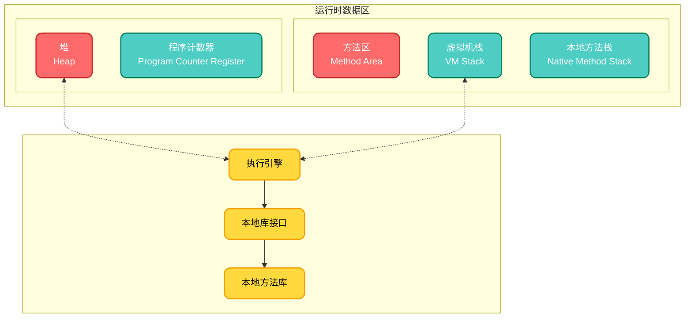
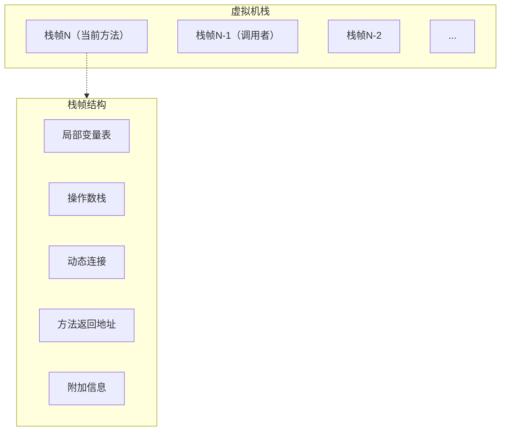
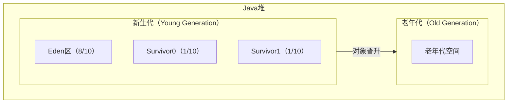
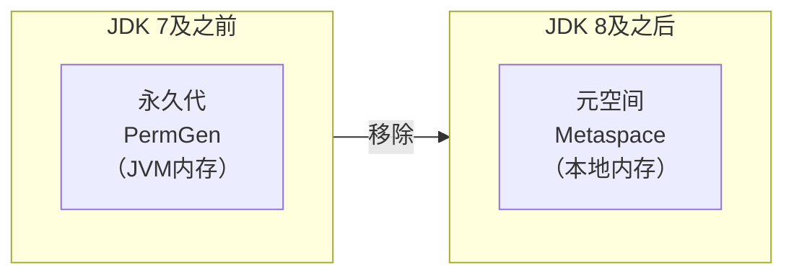
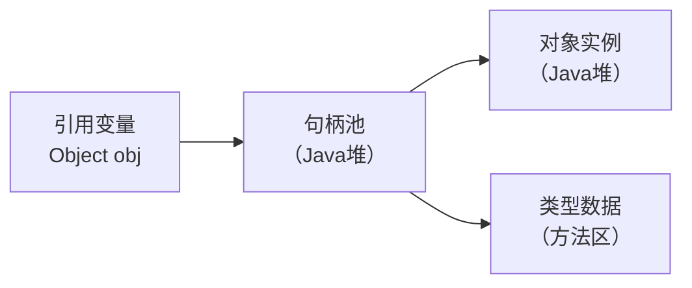
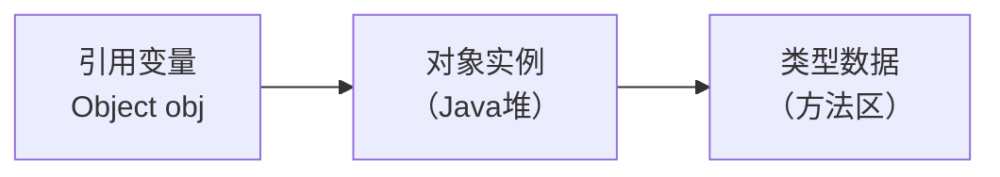
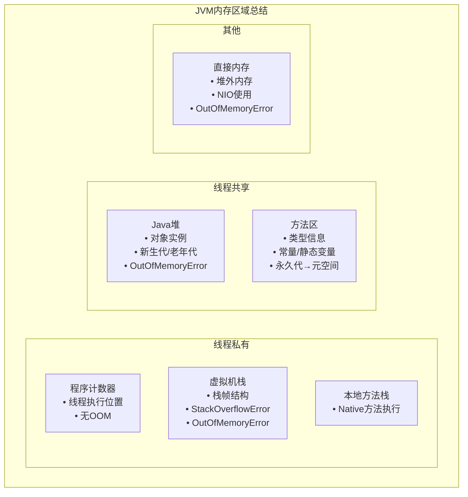

# 第2章 Java内存区域与内存溢出异常

## 2.1 概述

内存管理是编程语言的核心机制之一。C++采用**手动内存管理**，程序员通过`new`/`delete`精确控制内存，拥有完全控制权但需承担内存泄漏、野指针等风险。Java则采用**自动内存管理**，通过JVM的垃圾收集器（GC）自动回收无用对象，程序员专注于业务逻辑而无需关注内存释放。

| 对比维度 | C++ | Java |
|----------|-----|------|
| **管理主体** | 程序员 | JVM垃圾收集器 |
| **分配方式** | `new`/`malloc` | `new`（关键字） |
| **释放方式** | `delete`/`free`（必须显式） | 自动GC回收 |
| **内存泄漏** | 常见，需程序员避免 | 较少，但仍有泄漏可能 |
| **野指针** | 常见，危险 | 不存在（有引用机制） |
| **性能开销** | 低（无GC开销） | 高（GC暂停、内存占用） |
| **开发效率** | 低（需关注内存） | 高（专注业务逻辑） |

Java选择自动内存管理的主要原因包括：提高开发效率、增强安全性、跨平台一致性，以及适应现代硬件发展（内存成本降低，GC开销可接受）。理解这种设计哲学有助于深入理解JVM内存区域的划分原理。

---

## 2.2 运行时数据区域

Java虚拟机在执行Java程序的过程中会把它所管理的内存划分为若干个不同的数据区域。这些区域有各自的用途，以及创建和销毁的时间，有的区域随着虚拟机进程的启动而一直存在，有些区域则是依赖用户线程的启动和结束而建立和销毁。



**图2-1 Java虚拟机运行时数据区**

根据《Java虚拟机规范》的规定，Java虚拟机所管理的内存将会包括以下几个运行时数据区域：程序计数器、Java虚拟机栈、本地方法栈、Java堆、方法区。下面将逐一介绍各区域的作用和特点。

### 2.2.1 程序计数器

程序计数器（Program Counter Register）是一块较小的内存空间，它可以看作是当前线程所执行的字节码的行号指示器。

**核心特点**：

| 特性 | 说明 |
|------|------|
| **线程私有** | 每个线程都有独立的程序计数器 |
| **记录位置** | 当前线程执行的字节码指令地址 |
| **Native方法** | 执行本地方法时，计数器值为空（Undefined） |
| **内存溢出** | **唯一不会发生OOM的区域** |

**为什么需要程序计数器？**

Java虚拟机的多线程是通过线程轮流切换、分配处理器执行时间的方式来实现的。为了线程切换后能恢复到正确的执行位置，每个线程都需要有一个独立的程序计数器。

```
线程A执行 → 时间片用完 → 保存计数器值
                          ↓
线程B执行 → 时间片用完 → 恢复线程A计数器 → 继续执行
```

---

### 2.2.2 Java虚拟机栈

Java虚拟机栈（Java Virtual Machine Stack）是线程私有的，它的生命周期与线程相同。虚拟机栈描述的是Java方法执行的线程内存模型。

**栈帧（Stack Frame）**：

每个方法被执行的时候，Java虚拟机都会同步创建一个栈帧用于存储局部变量表、操作数栈、动态连接、方法出口等信息。



#### 局部变量表

局部变量表（Local Variables Table）是一组变量值的存储空间，用于存放方法参数和方法内部定义的局部变量。

**特点**：
- 以**变量槽（Variable Slot）**为最小单位，每个Slot占用32位
- **long和double**类型占用2个Slot（64位）
- 其他基本数据类型和引用类型占用1个Slot
- 局部变量表的大小在编译期确定

**示例**：
```java
public void method(int a, long b, Object obj) {
    int c = 10;        // Slot 3 (a=0, b=1-2, obj=3, c=4)
    double d = 3.14;   // Slot 5-6
}
```

#### 操作数栈

操作数栈（Operand Stack）是一个后入先出（LIFO）的栈，用于存放操作数和运算结果。

**工作过程**：
```
方法调用: iconst_1    → 将int 1压入栈
         iconst_2    → 将int 2压入栈  
         iadd        → 弹出2和1，相加后将3压入栈
         istore_1    → 将3存入局部变量表Slot 1
```

#### 动态连接

每个栈帧都包含一个指向运行时常量池中该栈帧所属方法的引用，持有这个引用是为了支持方法调用过程中的**动态连接（Dynamic Linking）**。

- **静态解析**：编译期可知的方法（静态方法、构造方法、私有方法等）
- **动态连接**：运行期才能确定的方法（虚方法、接口方法等）

#### 方法返回地址

方法执行完毕后的返回位置：
- **正常返回**：执行引擎遇到返回指令（ireturn、lreturn等）
- **异常返回**：方法执行过程中出现异常且未处理

#### 栈溢出异常

虚拟机栈可能抛出两种异常：

| 异常类型 | 触发条件 | 示例 |
|----------|----------|------|
| **StackOverflowError** | 栈深度超过虚拟机允许的最大深度 | 无限递归 |
| **OutOfMemoryError** | 栈扩展时无法申请到足够内存 | 大量创建线程 |

**VM参数设置**：
```bash
-Xss256k    # 设置每个线程的栈大小为256KB
-Xss1m      # 设置每个线程的栈大小为1MB
```

---

### 2.2.3 本地方法栈

本地方法栈（Native Method Stacks）与虚拟机栈所发挥的作用是非常相似的，其区别只是虚拟机栈为虚拟机执行Java方法（也就是字节码）服务，而本地方法栈则是为虚拟机使用到的**本地（Native）方法**服务。

**特点**：
- 线程私有
- 与虚拟机栈一样，也会抛出 StackOverflowError 和 OutOfMemoryError
- HotSpot虚拟机将本地方法栈和虚拟机栈合二为一

---

### 2.2.4 Java堆

Java堆（Java Heap）是虚拟机所管理的内存中最大的一块，是被所有线程共享的一块内存区域，在虚拟机启动时创建。

**核心作用**：存放对象实例，"几乎"所有的对象实例都在这里分配内存。



#### 堆内存划分

| 区域 | 说明 | 默认比例 |
|------|------|----------|
| **新生代（Young）** | 存放新创建的对象 | 堆的1/3 |
| - Eden区 | 新对象首先分配在这里 | 新生代的8/10 |
| - Survivor0 | 存活对象复制区域 | 新生代的1/10 |
| - Survivor1 | 存活对象复制区域 | 新生代的1/10 |
| **老年代（Old）** | 存放长期存活的对象 | 堆的2/3 |

**对象晋升过程**：
```
对象创建 → Eden区 → Minor GC后存活 → Survivor区
                                      ↓
                    经历多次GC（默认15次）后仍存活
                                      ↓
                                老年代（Old）
```

#### 堆内存参数

```bash
-Xms512m        # 堆初始大小（Initial Heap Size）
-Xmx2g          # 堆最大大小（Maximum Heap Size）
-Xmn256m        # 新生代大小（New Generation Size）
-XX:NewRatio=2  # 老年代/新生代比例（默认2，即老年代占2/3）
-XX:SurvivorRatio=8  # Eden/Survivor比例（默认8）
```

**建议**：-Xms 和 -Xmx 设置为相同值，避免运行时动态扩展带来的性能开销。

---

### 2.2.5 方法区

方法区（Method Area）是各个线程共享的内存区域，它用于存储已被虚拟机加载的**类型信息、常量、静态变量、即时编译器编译后的代码缓存**等数据。

**存储内容**：

| 数据类型 | 说明 |
|----------|------|
| **类型信息** | 类/接口/枚举/注解的完整名称、修饰符、父类、接口列表 |
| **字段信息** | 字段名称、类型、修饰符 |
| **方法信息** | 方法名称、返回类型、参数类型、修饰符、字节码 |
| **静态变量** | 类变量（static修饰） |
| **常量池** | 编译期生成的字面量和符号引用 |
| **JIT编译代码** | 即时编译器编译后的本地机器码 |

#### 永久代 vs 元空间

方法区的实现在不同JDK版本有重大变化：



| 特性 | 永久代（PermGen） | 元空间（Metaspace） |
|------|-------------------|---------------------|
| **位置** | JVM堆内存中 | 本地内存（Native Memory） |
| **大小限制** | 固定，-XX:MaxPermSize | 受限于系统内存 |
| **OOM风险** | 高，容易出现PermGen space OOM | 低，但可能耗尽系统内存 |
| **垃圾回收** | 频率低，效率差 | 更高效的GC |
| **参数** | -XX:PermSize, -XX:MaxPermSize | -XX:MetaspaceSize, -XX:MaxMetaspaceSize |

**为什么移除永久代？**
1. **避免OOM**：永久代大小固定，类加载过多时容易溢出
2. **与JRockit统一**：Oracle收购BEA后统一虚拟机实现
3. **简化GC**：减少Full GC的复杂度

---

### 2.2.6 运行时常量池

运行时常量池（Runtime Constant Pool）是方法区的一部分。Class文件中除了有类的版本、字段、方法、接口等描述信息外，还有一项信息是**常量池表（Constant Pool Table）**，用于存放编译期生成的各种字面量与符号引用，这部分内容将在类加载后存放到方法区的运行时常量池中。

**存储内容**：
- **字面量**：文本字符串、声明为final的常量值
- **符号引用**：类和接口的全限定名、字段名称和描述符、方法名称和描述符

**动态添加**：
运行时常量池具有动态性，运行期间也可以将新的常量放入池中（如String.intern()方法）。

```java
String s1 = new String("hello");  // 堆中创建对象
String s2 = s1.intern();          // 将字符串放入常量池
String s3 = "hello";              // 直接使用常量池中的引用
System.out.println(s2 == s3);     // true
```

---

### 2.2.7 直接内存

直接内存（Direct Memory）并不是虚拟机运行时数据区的一部分，但是这部分内存也被频繁地使用，而且也可能导致OutOfMemoryError异常出现。

**特点**：

| 特性 | 说明 |
|------|------|
| **位置** | 堆外内存，不受JVM堆大小限制 |
| **分配** | 通过Unsafe类或ByteBuffer.allocateDirect() |
| **回收** | 不受GC直接管理，需要显式释放或等待Cleaner |
| **性能** | 避免了Java堆和Native堆之间的数据复制 |

**使用场景**：
- NIO操作（文件通道、网络通道）
- 大数据处理（避免堆内存压力）
- 缓存系统（Ehcache、Memcached客户端）

**代码示例**：
```java
// 分配直接内存
ByteBuffer directBuffer = ByteBuffer.allocateDirect(1024 * 1024 * 100); // 100MB

// 使用
// ... 读写操作 ...

// 释放（Cleaner机制或等待GC）
directBuffer = null;
System.gc(); // 建议GC，但不保证立即释放
```

**VM参数**：
```bash
-XX:MaxDirectMemorySize=512m  # 设置直接内存最大大小（默认与堆最大值相同）
```

**OOM示例**：
```
java.lang.OutOfMemoryError: Direct buffer memory
```

---

## 2.3 对象访问

在Java语言中，对象访问是如何进行的呢？以最常见的访问为例：

```java
Object obj = new Object();
```

这行代码涉及三个内存区域：
1. **Object obj**：引用变量，存储在虚拟机栈的局部变量表中
2. **new Object()**：对象实例，存储在Java堆中
3. **类型数据**：存储在方法区中

### 对象访问方式

主流的访问方式主要有两种：

#### 句柄访问



**优点**：对象被移动时（GC时），只需改变句柄中的实例数据指针，引用本身不需要修改。

#### 直接指针访问



**优点**：访问速度快，节省了一次指针定位的时间开销。

**HotSpot虚拟机使用直接指针访问**。

---

## 2.4 实战：OutOfMemoryError异常

在JVM规范中，除了程序计数器外，虚拟机内存的其他几个运行时区域都有可能发生OutOfMemoryError（OOM）异常。

### 2.4.1 Java堆溢出

Java堆用于存储对象实例，只要不断地创建对象，并且保证GC Roots到对象之间有可达路径来避免垃圾回收，那么在对象数量到达最大堆的容量限制后就会产生内存溢出异常。

**示例代码**：
```java
/**
 * VM Args: -Xms20m -Xmx20m -XX:+HeapDumpOnOutOfMemoryError
 */
public class HeapOOM {
    static class OOMObject {
        private byte[] data = new byte[1024 * 1024]; // 1MB
    }
    
    public static void main(String[] args) {
        List<OOMObject> list = new ArrayList<>();
        while (true) {
            list.add(new OOMObject());
        }
    }
}
```

**异常信息**：
```
java.lang.OutOfMemoryError: Java heap space
Dumping heap to java_pid1234.hprof ...
Heap dump file created [23456789 bytes in 0.456 secs]
```

**解决方案**：
1. 通过内存映像分析工具（如Eclipse Memory Analyzer）分析堆转储快照
2. 确认是内存泄漏（Memory Leak）还是内存溢出（Memory Overflow）
3. 内存泄漏：找到泄漏对象到GC Roots的引用链，定位泄漏代码
4. 内存溢出：调整堆大小（-Xmx）或优化对象生命周期

---

### 2.4.2 虚拟机栈和本地方法栈溢出

由于HotSpot虚拟机并不区分虚拟机栈和本地方法栈，因此**-Xoss参数（设置本地方法栈大小）虽然存在，但实际上是无效的**，栈容量只能由-Xss参数来设定。

#### StackOverflowError（栈深度溢出）

**示例代码**：
```java
/**
 * VM Args: -Xss128k
 */
public class JavaVMStackSOF {
    private int stackLength = 1;
    
    public void stackLeak() {
        stackLength++;
        stackLeak();  // 无限递归
    }
    
    public static void main(String[] args) {
        JavaVMStackSOF oom = new JavaVMStackSOF();
        try {
            oom.stackLeak();
        } catch (Throwable e) {
            System.out.println("stack length:" + oom.stackLength);
            throw e;
        }
    }
}
```

**异常信息**：
```
stack length: 11423
Exception in thread "main" java.lang.StackOverflowError
    at JavaVMStackSOF.stackLeak(JavaVMStackSOF.java:7)
```

#### OutOfMemoryError（栈容量不足）

**示例代码**：
```java
/**
 * VM Args: -Xss2m
 */
public class JavaVMStackOOM {
    private void dontStop() {
        while (true) {}
    }
    
    public void stackLeakByThread() {
        while (true) {
            Thread thread = new Thread(() -> dontStop());
            thread.start();
        }
    }
    
    public static void main(String[] args) {
        JavaVMStackOOM oom = new JavaVMStackOOM();
        oom.stackLeakByThread();
    }
}
```

**注意**：在Windows平台，Java线程的映射是直接的，如果代码导致无限创建线程，可能会导致系统假死。

---

### 2.4.3 运行时常量池溢出

String.intern()是一个Native方法，它的作用是：如果字符串常量池中已经包含一个等于此String对象的字符串，则返回代表池中这个字符串的String对象；否则，将此String对象包含的字符串添加到常量池中，并返回此String对象的引用。

**示例代码（JDK 6）**：
```java
/**
 * VM Args: -XX:PermSize=10m -XX:MaxPermSize=10m
 */
public class RuntimeConstantPoolOOM {
    public static void main(String[] args) {
        // 使用List保持引用，避免Full GC回收
        List<String> list = new ArrayList<>();
        int i = 0;
        while (true) {
            list.add(String.valueOf(i++).intern());
        }
    }
}
```

**JDK 6异常**：
```
java.lang.OutOfMemoryError: PermGen space
```

**JDK 7+**：由于字符串常量池移到了Java堆中，此代码会导致Java堆溢出。

---

### 2.4.4 方法区溢出

方法区用于存放Class的相关信息，如类名、访问修饰符、常量池、字段描述、方法描述等。

**示例思路**：
借助CGLib直接操作字节码运行时生成大量的动态类。

```java
/**
 * VM Args: -XX:PermSize=10m -XX:MaxPermSize=10m (JDK 7)
 * VM Args: -XX:MetaspaceSize=10m -XX:MaxMetaspaceSize=10m (JDK 8+)
 */
public class JavaMethodAreaOOM {
    public static void main(String[] args) {
        while (true) {
            Enhancer enhancer = new Enhancer();
            enhancer.setSuperclass(OOMObject.class);
            enhancer.setUseCache(false);
            enhancer.setCallback((MethodInterceptor) (obj, method, args1, proxy) 
                -> proxy.invokeSuper(obj, args1));
            enhancer.create();
        }
    }
    
    static class OOMObject {}
}
```

**JDK 7异常**：
```
java.lang.OutOfMemoryError: PermGen space
```

**JDK 8+异常**：
```
java.lang.OutOfMemoryError: Metaspace
```

**常见场景**：
- Spring框架使用CGLib进行类增强
- 大量JSP动态编译
- 动态语言支持（如Groovy）
- OSGi等动态模块系统

---

### 2.4.5 本机直接内存溢出

直接内存的容量可通过-XX:MaxDirectMemorySize指定，如果不指定，则默认与Java堆最大值（-Xmx）一致。

**示例代码**：
```java
/**
 * VM Args: -Xmx20m -XX:MaxDirectMemorySize=10m
 */
public class DirectMemoryOOM {
    private static final int _1MB = 1024 * 1024;
    
    public static void main(String[] args) throws Exception {
        Field unsafeField = Unsafe.class.getDeclaredFields()[0];
        unsafeField.setAccessible(true);
        Unsafe unsafe = (Unsafe) unsafeField.get(null);
        
        while (true) {
            unsafe.allocateMemory(_1MB);  // 分配直接内存
        }
    }
}
```

**异常信息**：
```
Exception in thread "main" java.lang.OutOfMemoryError
    at sun.misc.Unsafe.allocateMemory(Native Method)
```

**特点**：
- 直接内存溢出时，Heap Dump文件中不会看到明显的异常
- 如果OOM后Dump文件很小，而程序中又直接或间接使用了NIO，可以考虑直接内存方面的原因

---

## 2.5 本章小结

本章详细讲解了JVM内存区域的划分、各区域的作用及可能产生的异常。

### 核心知识点回顾



### 关键对比表

| 内存区域 | 线程私有 | 主要存储内容 | 异常类型 |
|----------|----------|--------------|----------|
| 程序计数器 | ✓ | 字节码指令地址 | 无 |
| 虚拟机栈 | ✓ | 栈帧（局部变量、操作数栈等） | StackOverflowError, OOM |
| 本地方法栈 | ✓ | Native方法信息 | StackOverflowError, OOM |
| Java堆 | ✗ | 对象实例 | OutOfMemoryError |
| 方法区 | ✗ | 类信息、常量、静态变量 | OutOfMemoryError |
| 直接内存 | - | NIO缓冲区 | OutOfMemoryError |

### 常见OOM场景速查

| OOM类型 | 触发区域 | 常见原因 | 解决思路 |
|----------|----------|----------|----------|
| Java heap space | 堆 | 对象过多、内存泄漏 | 堆转储分析、调整堆大小 |
| GC overhead limit exceeded | 堆 | GC效率过低 | 优化代码、调整GC策略 |
| PermGen space | 方法区(JDK<8) | 类加载过多 | 增大PermSize |
| Metaspace | 方法区(JDK8+) | 类加载过多 | 增大MetaspaceSize |
| Unable to create new native thread | 栈 | 线程创建过多 | 减小栈大小、限制线程数 |
| Direct buffer memory | 直接内存 | NIO使用不当 | 限制直接内存大小 |

---

## 参考资料

1. 《深入理解Java虚拟机》（第3版）第2章
2. JVM规范：https://docs.oracle.com/javase/specs/jvms/se17/html/
3. Java SE HotSpot Virtual Machine Garbage Collection Tuning Guide
