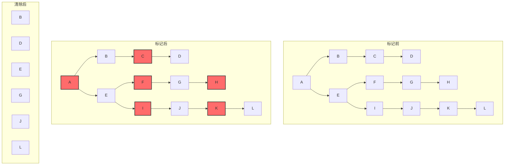
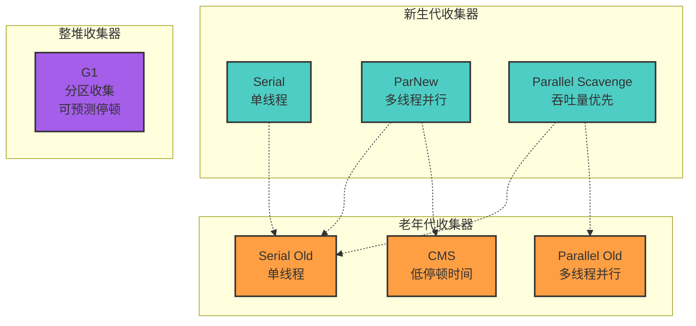

# 第3章 垃圾收集器与内存分配策略

## 3.1 概述

垃圾收集（Garbage Collection，GC）是Java虚拟机的重要特性之一，它自动管理内存的分配和回收，让程序员从繁琐的内存管理工作中解放出来。与C/C++需要手动调用`malloc/free`或`new/delete`不同，Java程序员不需要关心对象的销毁，垃圾收集器会自动回收不再使用的内存空间。

然而，这种自动化并非没有代价。垃圾收集器需要消耗计算资源来跟踪对象的使用情况，并在适当的时机执行回收操作。理解垃圾收集的工作原理，对于编写高性能的Java应用程序至关重要。

### 垃圾收集的三个基本问题

垃圾收集器需要解决三个核心问题：

1. **哪些内存需要回收？** —— 对象存活判定
2. **什么时候回收？** —— 回收时机选择
3. **如何回收？** —— 垃圾收集算法

本章将围绕这三个问题，深入探讨Java虚拟机的垃圾收集机制。

### 运行时数据区域的回收策略

根据第2章的介绍，Java虚拟机的运行时数据区域中，程序计数器、虚拟机栈和本地方法栈三个区域随线程而生，随线程而灭，栈中的栈帧随着方法的进入和退出而有条不紊地执行着出栈和入栈操作。每一个栈帧中分配多少内存基本上是在类结构确定下来时就已知的，因此这几个区域的内存分配和回收都具备确定性。

而Java堆和方法区则不一样，一个接口中的多个实现类需要的内存可能不一样，一个方法中的多个分支需要的内存也可能不一样，我们只有在程序处于运行期间时才能知道会创建哪些对象，这部分内存的分配和回收都是动态的。垃圾收集器所关注的正是这部分内存。

***

## 3.2 对象已死？

在堆里面存放着Java世界中几乎所有的对象实例，垃圾收集器在对堆进行回收前，第一件事情就是要确定这些对象之中哪些还"存活"着，哪些已经"死去"（即不可能再被任何途径使用的对象）。

### 3.2.1 引用计数算法

**原理**

引用计数算法（Reference Counting）是一种简单直观的对象存活判定算法：

- 给对象中添加一个引用计数器
- 每当有一个地方引用它时，计数器值就加1
- 当引用失效时，计数器值就减1
- 任何时刻计数器为0的对象就是不可能再被使用的

**优点**

- 实现简单，判定效率高
- 回收及时，对象变为垃圾后立即回收
- 不需要暂停应用程序（理论上）

**缺点**

引用计数算法有一个致命的缺陷：**无法解决对象之间相互循环引用的问题**。

```java
public class ReferenceCountingGC {
    public Object instance = null;
    
    public static void testGC() {
        ReferenceCountingGC objA = new ReferenceCountingGC();
        ReferenceCountingGC objB = new ReferenceCountingGC();
        
        // 循环引用
        objA.instance = objB;
        objB.instance = objA;
        
        objA = null;
        objB = null;
        
        // 如果采用引用计数算法，objA和objB的引用计数都不为0，无法回收
        // 但实际上这两个对象已经不可能再被访问
        System.gc();
    }
}
```

在上面的例子中，虽然`objA`和`objB`已经被赋值为`null`，但由于它们互相引用，引用计数器的值都不为0，引用计数算法无法回收它们。但实际上，这两个对象已经不可能再被访问，应该被回收。

**Java的选择**

由于循环引用问题的存在，Java虚拟机**没有选用**引用计数算法来管理内存。

### 3.2.2 可达性分析算法

**原理**

在主流的商用程序语言（Java、C#等）的主流实现中，都是称通过\*\*可达性分析（Reachability Analysis）\*\*来判定对象是否存活的。

这个算法的基本思路就是通过一系列的称为"**GC Roots**"的对象作为起始点，从这些节点开始向下搜索，搜索所走过的路径称为**引用链（Reference Chain）**，当一个对象到GC Roots没有任何引用链相连（用图论的话来说，就是从GC Roots到这个对象不可达）时，则证明此对象是不可用的。

```
          GC Roots
             │
    ┌────────┼────────┐
    │        │        │
   objA     objB     objC
    │        │
   objD─────┘
    │
   objE

objF (孤立对象，无引用链)
```

在上图中，`objA`、`objB`、`objC`、`objD`、`objE`都与GC Roots存在引用链，因此它们是存活的；而`objF`虽然被`objE`引用，但`objE`本身不可达，所以`objF`也是不可达的，可以被回收。

**GC Roots的对象**

在Java语言中，可作为GC Roots的对象包括以下几种：

1. **虚拟机栈（栈帧中的本地变量表）中引用的对象**
   ```java
   public void method() {
       Object localVar = new Object(); // localVar是GC Root
       // ...
   }
   ```
2. **方法区中类静态属性引用的对象**
   ```java
   public class MyClass {
       private static Object staticVar = new Object(); // staticVar是GC Root
   }
   ```
3. **方法区中常量引用的对象**
   ```java
   public class MyClass {
       private static final Object CONSTANT = new Object(); // CONSTANT是GC Root
   }
   ```
4. **本地方法栈中JNI（即一般说的Native方法）引用的对象**
   - 通过Java Native Interface调用的本地代码中引用的Java对象
5. **Java虚拟机内部的引用**
   - 如基本数据类型对应的Class对象
   - 一些常驻的异常对象（如NullPointerException、OutOfMemoryError等）
   - 系统类加载器
6. **所有被同步锁（synchronized关键字）持有的对象**
7. **反映Java虚拟机内部情况的JMXBean、JVMTI中注册的回调、本地代码缓存等**

### 3.2.3 再谈引用

无论是通过引用计数算法判断对象的引用数量，还是通过可达性分析算法判断对象的引用链是否可达，判定对象是否存活都与"引用"有关。

在JDK 1.2之前，Java中的引用的定义很传统：如果reference类型的数据中存储的数值代表的是另外一块内存的起始地址，就称这块内存代表着一个引用。这种定义很纯粹，但是太过狭隘，一个对象在这种定义下只有被引用或者没有被引用两种状态，对于如何描述一些"食之无味，弃之可惜"的对象就显得无能为力。

我们希望能描述这样一类对象：当内存空间还足够时，则能保留在内存之中；如果内存空间在进行垃圾收集后还是非常紧张，则可以抛弃这些对象。很多系统的缓存功能都符合这样的应用场景。

在JDK 1.2之后，Java对引用的概念进行了扩充，将引用分为**强引用（Strong Reference）**、**软引用（Soft Reference）**、**弱引用（Weak Reference）**、\*\*虚引用（Phantom Reference）\*\*4种，这4种引用强度依次逐渐减弱。

#### 强引用（Strong Reference）

强引用是指在程序代码之中普遍存在的，类似`Object obj = new Object()`这类的引用。只要强引用还存在，垃圾收集器永远不会回收掉被引用的对象。

```java
// 强引用示例
Object strongRef = new Object();
// 只要strongRef不为null，对象就不会被回收
strongRef = null; // 断开强引用后，对象才可能被回收
```

#### 软引用（Soft Reference）

软引用是用来描述一些还有用但并非必需的对象。对于软引用关联着的对象，在系统将要发生内存溢出异常之前，将会把这些对象列进回收范围之中进行第二次回收。如果这次回收还没有足够的内存，才会抛出内存溢出异常。

```java
import java.lang.ref.SoftReference;

public class SoftReferenceDemo {
    public static void main(String[] args) {
        // 创建强引用
        Object strongRef = new Object();
        
        // 创建软引用
        SoftReference<Object> softRef = new SoftReference<>(strongRef);
        
        // 断开强引用
        strongRef = null;
        
        // 获取软引用对象
        Object obj = softRef.get();
        if (obj != null) {
            System.out.println("对象还未被回收");
        } else {
            System.out.println("对象已被回收");
        }
        
        // 在内存不足时，软引用对象会被回收
        // 可以通过软引用实现缓存功能
    }
}
```

**应用场景**：软引用通常用来实现内存敏感的缓存。比如网页缓存、图片缓存等，当内存充足时保留缓存，内存不足时自动清理。

#### 弱引用（Weak Reference）

弱引用也是用来描述非必需对象的，但是它的强度比软引用更弱一些，被弱引用关联的对象只能生存到下一次垃圾收集发生之前。当垃圾收集器工作时，无论当前内存是否足够，都会回收掉只被弱引用关联的对象。

```java
import java.lang.ref.WeakReference;

public class WeakReferenceDemo {
    public static void main(String[] args) {
        // 创建弱引用
        WeakReference<Object> weakRef = new WeakReference<>(new Object());
        
        // 获取弱引用对象
        System.out.println(weakRef.get()); // 可能输出: java.lang.Object@xxxx
        
        // 建议GC（不保证立即执行）
        System.gc();
        
        // 等待GC执行
        try {
            Thread.sleep(1000);
        } catch (InterruptedException e) {
            e.printStackTrace();
        }
        
        // 再次获取，可能已被回收
        System.out.println(weakRef.get()); // 可能输出: null
    }
}
```

**应用场景**：弱引用常用于实现规范化映射（Canonicalizing Mappings），比如`WeakHashMap`。当某个键不再被其他地方强引用时，`WeakHashMap`会自动清理对应的条目。

#### 虚引用（Phantom Reference）

虚引用也称为幽灵引用或者幻影引用，它是最弱的一种引用关系。一个对象是否有虚引用的存在，完全不会对其生存时间构成影响，也无法通过虚引用来取得一个对象实例。为一个对象设置虚引用关联的唯一目的就是能在这个对象被收集器回收时收到一个系统通知。

```java
import java.lang.ref.PhantomReference;
import java.lang.ref.ReferenceQueue;

public class PhantomReferenceDemo {
    public static void main(String[] args) {
        // 创建引用队列
        ReferenceQueue<Object> queue = new ReferenceQueue<>();
        
        // 创建虚引用
        Object obj = new Object();
        PhantomReference<Object> phantomRef = new PhantomReference<>(obj, queue);
        
        // 虚引用的get()方法永远返回null
        System.out.println(phantomRef.get()); // 输出: null
        
        // 断开强引用
        obj = null;
        
        // 建议GC
        System.gc();
        
        // 等待对象被回收
        try {
            Thread.sleep(1000);
        } catch (InterruptedException e) {
            e.printStackTrace();
        }
        
        // 检查引用队列，可能收到通知
        if (queue.poll() != null) {
            System.out.println("对象已被回收");
        }
    }
}
```

**应用场景**：虚引用主要用于跟踪对象被垃圾回收的状态，允许在对象被回收前执行一些清理操作。比如直接内存的回收就使用了虚引用机制。

#### 引用类型对比

| 引用类型 | 回收时机    | 使用场景     | 能否通过get()获取 |
| ---- | ------- | -------- | ----------- |
| 强引用  | 永不回收    | 普通对象引用   | 是           |
| 软引用  | 内存不足时回收 | 缓存实现     | 是           |
| 弱引用  | 下次GC时回收 | 规范化映射    | 是           |
| 虚引用  | 随时可能回收  | 跟踪对象回收状态 | 否（永远返回null） |

### 3.2.4 生存还是死亡？

即使在可达性分析算法中不可达的对象，也并非是"非死不可"的，这时候它们暂时处于"缓刑"阶段，要真正宣告一个对象死亡，至少要经历两次标记过程。

**第一次标记**：如果对象在进行可达性分析后发现没有与GC Roots相连接的引用链，那它将会被第一次标记并且进行一次筛选，筛选的条件是此对象是否有必要执行`finalize()`方法。当对象没有覆盖`finalize()`方法，或者`finalize()`方法已经被虚拟机调用过，虚拟机将这两种情况都视为"没有必要执行"。

**第二次标记**：如果这个对象被判定为有必要执行`finalize()`方法，那么这个对象将会放置在一个叫做F-Queue的队列之中，并在稍后由一条由虚拟机自动建立的、低优先级的Finalizer线程去执行它。这里所谓的"执行"是指虚拟机会触发这个方法，但并不承诺会等待它运行结束，这样做的原因是，如果一个对象在`finalize()`方法中执行缓慢，或者发生了死循环（更极端的情况），将很可能会导致F-Queue队列中其他对象永久处于等待，甚至导致整个内存回收系统崩溃。

`finalize()`方法是对象逃脱死亡命运的最后一次机会，稍后GC将对F-Queue中的对象进行第二次小规模的标记，如果对象要在`finalize()`中成功拯救自己——只要重新与引用链上的任何一个对象建立关联即可，譬如把自己（this关键字）赋值给某个类变量或者对象的成员变量，那在第二次标记时它将被移除出"即将回收"的集合；如果对象这时候还没有逃脱，那基本上它就真的被回收了。

```java
public class FinalizeEscapeGC {
    public static FinalizeEscapeGC SAVE_HOOK = null;
    
    public void isAlive() {
        System.out.println("yes, i am still alive :)");
    }
    
    @Override
    protected void finalize() throws Throwable {
        super.finalize();
        System.out.println("finalize method executed!");
        FinalizeEscapeGC.SAVE_HOOK = this; // 自我拯救
    }
    
    public static void main(String[] args) throws Throwable {
        SAVE_HOOK = new FinalizeEscapeGC();
        
        // 对象第一次成功拯救自己
        SAVE_HOOK = null;
        System.gc();
        // 因为Finalizer方法优先级很低，暂停0.5秒，以等待它
        Thread.sleep(500);
        if (SAVE_HOOK != null) {
            SAVE_HOOK.isAlive();
        } else {
            System.out.println("no, i am dead :(");
        }
        
        // 下面这段代码与上面的完全相同，但是这次自救却失败了
        SAVE_HOOK = null;
        System.gc();
        // 因为Finalizer方法优先级很低，暂停0.5秒，以等待它
        Thread.sleep(500);
        if (SAVE_HOOK != null) {
            SAVE_HOOK.isAlive();
        } else {
            System.out.println("no, i am dead :(");
        }
    }
}
```

运行结果：

```
finalize method executed!
yes, i am still alive :)
no, i am dead :(
```

**注意**：

1. 任何一个对象的`finalize()`方法都只会被系统自动调用一次
2. 如果对象面临下一次回收，它的`finalize()`方法不会被再次执行
3. 不建议使用`finalize()`方法，它的运行代价高昂，不确定性大，无法保证各个对象的调用顺序
4. 可以使用`try-finally`或其他方式替代`finalize()`的功能

### 3.2.5 回收方法区

很多人认为方法区（或者HotSpot虚拟机中的永久代/元空间）是没有垃圾收集的，Java虚拟机规范中确实说过可以不要求虚拟机在方法区实现垃圾收集，而且在方法区中进行垃圾收集的"性价比"一般比较低。

方法区的垃圾收集主要回收两部分内容：**废弃常量**和**无用的类**。

#### 废弃常量的回收

回收废弃常量与回收Java堆中的对象非常类似。以常量池中字面量的回收为例，假如一个字符串"abc"已经进入了常量池中，但是当前系统没有任何一个String对象是叫做"abc"的，换句话说，就是没有任何String对象引用常量池中的"abc"常量，也没有其他地方引用了这个字面量，如果这时发生内存回收，而且必要的话，这个"abc"常量就会被系统清理出常量池。

#### 无用的类的回收

判定一个常量是否是"废弃常量"比较简单，而要判定一个类是否是"无用的类"的条件则相对苛刻许多。类需要同时满足下面3个条件才能算是"无用的类"：

1. **该类所有的实例都已经被回收**，也就是Java堆中不存在该类的任何实例
2. **加载该类的ClassLoader已经被回收**
3. **该类对应的java.lang.Class对象没有在任何地方被引用**，无法在任何地方通过反射访问该类的方法

虚拟机可以对满足上述3个条件的无用类进行回收，这里说的仅仅是"可以"，而并不是和对象一样，不使用了就必然会回收。是否对类进行回收，HotSpot虚拟机提供了`-Xnoclassgc`参数进行控制，还可以使用`-verbose:class`以及`-XX:+TraceClassLoading`、`-XX:+TraceClassUnLoading`查看类加载和卸载信息。

**应用场景**：在大量使用反射、动态代理、CGLib等ByteCode框架、动态生成JSP以及OSGi这类频繁自定义ClassLoader的场景都需要虚拟机具备类卸载的功能，以保证方法区不会溢出。

***

## 3.3 垃圾收集算法

垃圾收集算法是内存回收的方法论，不同的垃圾收集器实现了不同的垃圾收集算法。本节介绍几种经典的垃圾收集算法思想。

### 3.3.1 分代收集理论

**弱分代假说（Weak Generational Hypothesis）**

当前商业虚拟机的垃圾收集器，大多数都遵循了"分代收集（Generational Collection）"的理论进行设计，分代收集名为理论，实质是一套符合大多数程序运行实际情况的经验法则，它建立在两个分代假说之上：

1. **弱分代假说（Weak Generational Hypothesis）**：绝大多数对象都是朝生夕灭的。
2. **强分代假说（Strong Generational Hypothesis）**：熬过越多次垃圾收集过程的对象就越难以消亡。

这两个分代假说共同奠定了多款常用的垃圾收集器的一致的设计原则：收集器应该将Java堆划分出不同的区域，然后将回收对象依据其年龄（年龄即对象熬过垃圾收集过程的次数）分配到不同的区域之中存储。

**跨代引用假说（Intergenerational Reference Hypothesis）**

假如要现在进行一次只局限于新生代区域内的收集（Minor GC），但新生代中的对象是完全有可能被老年代所引用的，为了找出该区域中的存活对象，不得不在固定的GC Roots之外，再额外遍历整个老年代中所有对象来确保可达性分析结果的正确性，反过来也是一样。

因此，就有了第三条经验法则：

3. **跨代引用假说（Intergenerational Reference Hypothesis）**：跨代引用相对于同代引用来说仅占极少数。

依据这条假说，我们就不应再为了少量的跨代引用去扫描整个老年代，也不必浪费空间专门记录每一个对象是否存在及存在哪些跨代引用，只需在新生代上建立一个全局的数据结构（该结构被称为"记忆集"，Remembered Set）。

### 3.3.2 标记-清除算法

**算法思想**

标记-清除（Mark-Sweep）算法是最基础的收集算法，如同它的名字一样，算法分为"标记"和"清除"两个阶段：

1. **标记阶段**：首先标记出所有需要回收的对象
2. **清除阶段**：在标记完成后统一回收所有被标记的对象



**图示说明**：红色节点（marked）表示被标记为可回收的对象，清除后这些对象被回收，内存空间变为空闲。

**优点**

- 实现简单，是最基础的收集算法
- 不需要移动对象

**缺点**

1. **效率问题**：标记和清除两个过程的效率都不高
2. **空间问题**：标记清除之后会产生大量不连续的内存碎片，空间碎片太多可能会导致以后在程序运行过程中需要分配较大对象时，无法找到足够的连续内存而不得不提前触发另一次垃圾收集动作

**适用场景**

- 适用于老年代（对象存活率高）
- CMS收集器使用此算法

### 3.3.2 复制算法

**算法思想**

复制（Copying）算法解决了标记-清除算法的效率问题。它将可用内存按容量划分为大小相等的两块，每次只使用其中的一块。当这一块的内存用完了，就将还存活着的对象复制到另外一块上面，然后再把已使用过的内存空间一次清理掉。

```
初始状态:              使用后:               回收后:
┌─────────┬─────────┐  ┌─────────┬─────────┐  ┌─────────┬─────────┐
│         │         │  │A B C D E│         │  │         │A B C D E│
│  From   │   To    │  │F G H    │         │  │         │F G H    │
│ (使用)  │ (空闲)  │  │(使用)   │ (空闲)  │  │ (空闲)  │(新使用) │
└─────────┴─────────┘  └─────────┴─────────┘  └─────────┴─────────┘

A-H: 存活对象
```

这样使得每次都是对整个半区进行内存回收，内存分配时也就不用考虑内存碎片等复杂情况，只要移动堆顶指针，按顺序分配内存即可，实现简单，运行高效。

**优点**

- 实现简单，运行高效
- 没有内存碎片问题
- 回收速度快

**缺点**

1. **内存利用率低**：将内存缩小为原来的一半，代价太高
2. **对象存活率高时效率低**：如果对象存活率较高，需要进行较多的复制操作，效率会变低

**优化：Appel式回收**

现在的商业虚拟机都采用这种收集算法来回收**新生代**。研究表明，新生代中的对象98%是"朝生夕死"的，所以并不需要按照1:1的比例来划分内存空间。

HotSpot虚拟机的实现是将内存分为一块较大的**Eden空间**和两块较小的**Survivor空间**，每次使用Eden和其中一块Survivor。当回收时，将Eden和Survivor中还存活着的对象一次性地复制到另外一块Survivor空间上，最后清理掉Eden和刚才用过的Survivor空间。

HotSpot虚拟机默认Eden和Survivor的大小比例是**8:1**，也就是每次新生代中可用内存空间为整个新生代容量的90%（80%+10%），只有10%的内存会被"浪费"。当然，98%的对象可回收只是一般场景下的数据，我们没有办法保证每次回收都只有不多于10%的对象存活，当Survivor空间不够用时，需要依赖其他内存（这里指老年代）进行分配担保（Handle Promotion）。

```
Eden : Survivor0 : Survivor1 = 8 : 1 : 1

新生代总大小 = 10MB
Eden = 8MB
Survivor0 = 1MB
Survivor1 = 1MB

使用Eden + Survivor0，Survivor1作为备用
```

**适用场景**

- 适用于新生代（对象存活率低）
- Serial、ParNew、Parallel Scavenge收集器使用此算法

### 3.3.3 标记-整理算法

**算法思想**

复制收集算法在对象存活率较高时就要进行较多的复制操作，效率将会变低。更关键的是，如果不想浪费50%的空间，就需要有额外的空间进行分配担保，以应对被使用的内存中所有对象都100%存活的极端情况，所以在老年代一般不能直接选用这种算法。

标记-整理（Mark-Compact）算法的标记过程仍然与"标记-清除"算法一样，但后续步骤不是直接对可回收对象进行清理，而是让所有存活的对象都向一端移动，然后直接清理掉端边界以外的内存。

```
标记前:          标记后:          整理后:         清除后:
┌─┬─┬─┬─┐       ┌─┬─┬─┬─┐       ┌─┬─┬─┬─┐       ┌─┬─┬─┬─┐
│A│ │B│ │       │✓│ │✓│ │       │A│B│ │ │       │A│B│ │ │
├─┼─┼─┼─┤       ├─┼─┼─┼─┤       ├─┼─┼─┼─┤       ├─┼─┼─┼─┤
│ │C│ │D│   →   │ │✓│ │✓│   →   │C│D│ │ │   →   │C│D│ │ │
├─┼─┼─┼─┤       ├─┼─┼─┼─┤       ├─┼─┼─┼─┤       ├─┼─┼─┼─┤
│E│ │ │F│       │✓│ │ │✓│       │E│F│ │ │       │E│F│ │ │
└─┴─┴─┴─┘       └─┴─┴─┴─┘       └─┴─┴─┴─┘       └─┴─┴─┴─┘

✓ = 标记为存活对象
```

**优点**

- 没有内存碎片问题
- 内存利用率高（不需要额外的空间）

**缺点**

- 移动对象需要更新引用地址
- 停顿时间比标记-清除算法长

**适用场景**

- 适用于老年代（对象存活率高）
- Serial Old、Parallel Old收集器使用此算法

---

## 3.4 HotSpot的算法细节实现

### 3.4.1 根节点枚举

**问题背景**

在可达性分析算法中，需要从GC Roots开始遍历对象图。但固定可作为GC Roots的节点主要在全局性的引用（如常量或类静态属性）与执行上下文（如栈帧中的本地变量表）中，尽管目标明确，但查找过程要做到高效并非一件容易的事情。

**HotSpot的解决方案**

目前所有收集器在根节点枚举这一步骤时都是必须暂停用户线程的，因此根节点枚举与之前提及的整理内存碎片一样，会面临相似的"Stop The World"的困扰。现在可达性分析算法耗时最长的查找引用链的过程已经可以做到与用户线程一起并发，但根节点枚举始终还是必须在一个能保障一致性的快照中才得以进行——这里"一致性"的意思是整个枚举期间执行子系统看起来就像被冻结在某个时间点上，不会出现分析过程中，根节点集合的对象引用关系还在不断变化的情况，若这点不能满足的话，分析结果准确性也就无法保证。这是导致垃圾收集过程必须停顿所有用户线程的其中一个重要原因，即使是号称停顿时间可控，或者（几乎）不会发生停顿的CMS、G1、ZGC等收集器，枚举根节点时也是必须要停顿的。

由于目前主流Java虚拟机使用的都是准确式垃圾收集（这个概念在第1章介绍Exact VM相对于Classic VM的改进时介绍过），所以当用户线程停顿下来之后，其实并不需要一个不漏地检查完所有执行上下文和全局的引用位置，虚拟机应当是有办法直接得到哪些地方存放着对象引用的。在HotSpot的解决方案里，是使用一组称为**OopMap**的数据结构来达到这个目的。一旦类加载动作完成的时候，HotSpot就会把对象内什么偏移量上是什么类型的数据计算出来，在即时编译过程中，也会在特定的位置记录下栈里和寄存器里哪些位置是引用。这样收集器在扫描时就可以直接得知这些信息了，并不需要真正一个不漏地从方法区等GC Roots开始查找。

### 3.4.2 安全点

**问题背景**

在OopMap的协助下，HotSpot可以快速准确地完成GC Roots枚举，但一个很现实的问题随之而来：可能导致引用关系变化，或者说导致OopMap内容变化的指令非常多，如果为每一条指令都生成对应的OopMap，那将会需要大量的额外存储空间，这样GC的空间成本将会变得很高昂。

**安全点的概念**

实际上，HotSpot也的确没有为每条指令都生成OopMap，只是在"特定的位置"记录了这些信息，这些位置被称为**安全点（Safepoint）**。有了安全点的设定，也就决定了用户程序执行时并非在代码指令流的任意位置都能够停顿下来开始垃圾收集，而是强制要求必须执行到达安全点后才能够暂停。

**安全点的选择**

安全点的选定既不能太少以至于让收集器等待时间过长，也不能太过频繁以至于过分增大运行时的内存负荷。安全点位置的选取基本上是以"是否具有让程序长时间执行的特征"为标准进行选定的，因为每条指令执行的时间都非常短暂，程序不太可能因为指令流长度太长这样的原因而长时间执行，"长时间执行"的最明显特征就是指令序列的复用，例如方法调用、循环跳转、异常跳转等都属于指令序列复用，所以只有具有这些功能的指令才会产生安全点。

**如何在垃圾收集发生时让所有线程都跑到最近的安全点？**

这里有两种方案可供选择：

1. **抢先式中断（Preemptive Suspension）**
   - 不需要线程的执行代码主动去配合
   - 在垃圾收集发生时，系统首先把所有用户线程全部中断
   - 如果发现有用户线程中断的地方不在安全点上，就恢复这条线程执行，让它一会再重新中断，直到跑到安全点上
   - **现在几乎没有虚拟机实现采用抢先式中断来暂停线程响应GC事件**
2. **主动式中断（Voluntary Suspension）**
   - 当垃圾收集需要中断线程的时候，不直接对线程操作，仅仅简单地设置一个标志位
   - 各个线程执行过程时会不停地主动去轮询这个标志，一旦发现中断标志为真时就自己在最近的安全点上主动中断挂起
   - 轮询标志的地方和安全点是重合的，另外还要加上所有创建对象和其他需要在Java堆上分配内存的地方，这是为了检查是否即将要发生垃圾收集，避免没有足够内存分配新对象

由于轮询操作在代码中会频繁出现，HotSpot使用内存保护陷阱的方式，把轮询操作精简至只有一条汇编指令的程度。

### 3.4.3 安全区域

**问题背景**

使用安全点的设计似乎已经完美解决如何停顿用户线程，让虚拟机进入垃圾回收状态的问题了，但实际情况却并不一定。安全点机制保证了程序执行时，在不太长的时间内就会遇到可进入垃圾收集过程的安全点。但是，程序"不执行"的时候呢？所谓的程序不执行就是没有分配处理器时间，典型的场景便是用户线程处于Sleep状态或者Blocked状态，这时候线程无法响应虚拟机的中断请求，不能再走到安全的地方去中断挂起自己，虚拟机也显然不可能持续等待线程重新被分配处理器时间。对于这种情况，就必须引入\*\*安全区域（Safe Region）\*\*来解决。

**安全区域的概念**

安全区域是指能够确保在某一段代码片段之中，引用关系不会发生变化，因此，在这个区域中任意地方开始垃圾收集都是安全的。我们也可以把安全区域看作被扩展拉伸了的安全点。

**安全区域的执行流程**

当用户线程执行到安全区域里面的代码时，首先会标识自己已经进入了安全区域，那样当这段时间里虚拟机要发起垃圾收集时就不必去管这些已声明自己在安全区域的线程了。当线程要离开安全区域时，它要检查虚拟机是否已经完成了根节点枚举（或者垃圾收集过程中其他需要暂停用户线程的阶段）：

1. 如果完成了，那线程就当作没事发生过，继续执行
2. 如果没有完成，它就必须一直等待，直到收到可以离开安全区域的信号为止

### 3.4.4 记忆集与卡表

**问题背景**

讲解分代收集理论的时候，我们提到了为解决对象跨代引用所带来的问题，垃圾收集器在新生代中建立了名为\*\*记忆集（Remembered Set）\*\*的数据结构，用以避免把整个老年代加进GC Roots扫描范围。事实上并不只是新生代、老年代之间才有跨代引用的问题，所有涉及部分区域收集（Partial GC）行为的垃圾收集器，典型的如G1、ZGC和Shenandoah收集器，都会面临相同的问题，因此我们有必要进一步理清记忆集的原理和实现方式。

**记忆集的概念**

记忆集是一种用于记录从非收集区域指向收集区域的指针集合的抽象数据结构。如果我们不考虑效率和成本的话，最简单的实现可以用非收集区域中所有含跨代引用的对象数组来实现。

```
记忆集简化示意:

老年代对象A ──→ 新生代对象X
老年代对象B ──→ 新生代对象Y
老年代对象C ──→ 新生代对象Z

记忆集 = [A的引用, B的引用, C的引用]
```

这种记录全部含跨代引用对象的实现方案，无论是空间占用还是维护成本都相当高昂。而在垃圾收集的场景中，收集器只需要通过记忆集判断出某一块非收集区域是否存在有指向了收集区域的指针就可以了，并不需要了解这些跨代指针的全部细节。那设计者在实现记忆集的时候，便可以选择更为粗犷的记录粒度来节省记忆集的存储和维护成本，下面列举了一些可供选择（当然也可以选择这个范围以外的）的记录精度：

- **字长精度**：每个记录精确到一个机器字长（就是处理器的寻址位数，如常见的32位或64位），该字包含跨代指针
- **对象精度**：每个记录精确到一个对象，该对象里有字段含有跨代指针
- **卡精度**：每个记录精确到一块内存区域，该区域内有对象含有跨代指针

**卡表（Card Table）**

其中，第三种"卡精度"所指的是用一种称为"卡表（Card Table）"的方式去实现记忆集，这也是目前最常用的一种记忆集实现形式，一些资料中甚至直接把它和记忆集混为一谈。前面定义中提到记忆集其实是一种"抽象"的数据结构，抽象的意思是只定义了记忆集的行为意图，并没有定义其行为的具体实现。卡表就是记忆集的一种具体实现，它定义了记忆集的记录精度、与堆内存的映射关系等。

卡表最简单的形式可以只是一个字节数组，而HotSpot虚拟机确实也是这样做的。以下这行代码是HotSpot默认的卡表标记逻辑：

```
CARD_TABLE [this address >> 9] = 0;
```

字节数组CARD\_TABLE的每一个元素都对应着其标识的内存区域中一块特定大小的内存块，这个内存块被称作"卡页（Card Page）"。一般来说，卡页大小都是以2的N次幂的字节数，通过上面代码可以看出HotSpot中使用的卡页是2的9次幂，即512字节（地址右移9位，相当于用地址除以512）。那如果卡表标识内存区域的起始地址是0x0000的话，数组CARD\_TABLE的第0、1、2号元素，分别对应了地址范围为0x0000～0x01FF、0x0200～0x03FF、0x0400～0x05FF的卡页内存块：

```
卡表与卡页对应关系:

┌─────────────────────────────────────────────────────┐
│  卡表 (Card Table)                                   │
├─────┬─────┬─────┬─────┬─────┬─────┬─────┬─────┬─────┤
│  0  │  1  │  2  │  3  │ ... │     │     │     │  n  │
└─────┴─────┴─────┴─────┴─────┴─────┴─────┴─────┴─────┘
   │     │     │
   ▼     ▼     ▼
┌─────────┐ ┌─────────┐ ┌─────────┐
│ 0x0000  │ │ 0x0200  │ │ 0x0400  │
│  ～     │ │  ～     │ │  ～     │
│ 0x01FF  │ │ 0x03FF  │ │ 0x05FF  │
└─────────┘ └─────────┘ └─────────┘
  卡页0      卡页1       卡页2
(512字节)  (512字节)   (512字节)
```

一个卡页的内存中通常包含不止一个对象，只要卡页内有一个（或更多）对象的字段存在着跨代指针，那就将对应卡表的数组元素的值标识为1，称为这个元素变脏（Dirty），没有则标识为0。在垃圾收集发生时，只要筛选出卡表中变脏的元素，就能轻易得出哪些卡页内存块中包含跨代指针，把它们加入GC Roots中一并扫描。

### 3.4.5 写屏障

**问题背景**

我们已经解决了如何使用记忆集来缩减GC Roots扫描范围的问题，但还没有解决卡表元素如何维护的问题，例如它们何时变脏、谁来把它们变脏等。

**卡表元素的维护**

卡表元素何时变脏的答案是很明确的——有其他分代区域中对象引用了本区域对象时，其对应的卡表元素就应该变脏，变脏时间点原则上应该发生在引用类型字段赋值的那一刻。但问题是如何变脏，即如何在对象赋值的那一刻去更新维护卡表呢？假如是解释执行的字节码，那相对好处理，虚拟机负责每条字节码指令的执行，有充分的介入空间；但在编译执行的场景中呢？经过即时编译后的代码已经是纯粹的机器指令流了，这就必须找到一个在机器码层面的手段，把维护卡表的动作放到每一个赋值操作之中。

**写屏障的概念**

在HotSpot虚拟机里是通过\*\*写屏障（Write Barrier）\*\*技术维护卡表状态的。写屏障可以看作在虚拟机层面对"引用类型字段赋值"这个动作的AOP切面，在引用对象赋值时会产生一个环形（Around）通知，供程序执行额外的动作，也就是说赋值的前后都在写屏障的覆盖范畴内。在赋值前的部分的写屏障叫作写前屏障（Pre-Write Barrier），在赋值后的则叫作写后屏障（Post-Write Barrier）。HotSpot虚拟机的许多收集器中都有使用到写屏障，但直至G1收集器出现之前，其他收集器都只用到了写后屏障。

**写屏障的简单实现**

应用写屏障后，虚拟机就会为所有赋值操作生成相应的指令，一旦收集器在写屏障中增加了更新卡表操作，无论更新的是不是老年代对新生代对象的引用，每次只要对引用进行更新，就会产生额外的开销，不过这个开销与Minor GC时扫描整个老年代的代价相比还是低得多的。

```
写屏障伪代码示意:

void oop_field_store(oop* field, oop new_value) {
    // 写前屏障（Pre-Write Barrier）- 某些收集器使用
    pre_write_barrier(field);
    
    // 实际引用赋值操作
    *field = new_value;
    
    // 写后屏障（Post-Write Barrier）- 更新卡表
    post_write_barrier(field, new_value);
}
```

**伪共享问题**

除了写屏障的开销外，卡表在高并发场景下还面临着"伪共享（False Sharing）"问题。伪共享是处理并发底层细节时一种经常需要考虑的问题，现代中央处理器的缓存系统中是以缓存行（Cache Line）为单位存储的，当多线程修改互相独立的变量时，如果这些变量恰好共享同一个缓存行，就会彼此影响（写回、无效化或者同步）而导致性能降低，这就是伪共享问题。

假设处理器的缓存行大小为64字节，由于一个卡表元素占1个字节，64个卡表元素将共享同一个缓存行。这64个卡表元素对应的卡页总的内存为32KB（64×512字节），也就是说如果不同线程更新的对象正好处于这32KB的内存区域内，就会导致更新卡表时正好写入同一个缓存行而影响性能。为了避免伪共享问题，一种简单的解决方案是不采用无条件的写屏障，而是先检查卡表标记，只有当该卡表元素未被标记过时才将其标记为变脏，即将卡表更新的逻辑变为以下代码所示：

```
if (CARD_TABLE [this address >> 9] != 0)
    CARD_TABLE [this address >> 9] = 0;
```

在JDK 7之后，HotSpot虚拟机增加了一个新的参数`-XX:+UseCondCardMark`，用来决定是否开启卡表更新的条件判断。开启会增加一次额外判断的开销，但能够避免伪共享问题，两者各有性能损耗，是否打开要根据应用实际运行情况来进行测试权衡。

### 3.4.6 并发的可达性分析

**问题背景**

在3.2节中曾经提到了当前主流编程语言的垃圾收集器基本上都是依靠可达性分析算法来判定对象是否存活的，可达性分析算法理论上要求全过程都基于一个能保障一致性的快照中才能够进行分析，这意味着必须全程冻结用户线程的运行。在根节点枚举这个步骤中，由于GC Roots相比起整个Java堆中全部的对象毕竟还算是极少数，且在各种优化技巧（如OopMap）的加持下，它带来的停顿已经是非常短暂且相对固定（不随堆容量而增长）的了。可从GC Roots再继续往下遍历对象图，这一步骤的停顿时间就必定会与Java堆容量直接成正比例关系了：堆越大，存储的对象越多，对象图结构越复杂，要标记更多对象而产生的停顿时间自然就更长，这听起来是理所当然的事情。

要知道包含"标记"阶段是所有追踪式垃圾收集算法的共同特征，如果这个阶段会随着堆变大而等比例增加停顿时间，其影响就会波及几乎所有的垃圾收集器，同理可知，如果能够削减这部分停顿时间的话，那收益也将会是系统性的。

**三色标记工具**

想解决或者降低用户线程的停顿，就要先搞清楚为什么必须在一个能保障一致性的快照上才能进行对象图的遍历？为了能解释清楚这个问题，我们引入\*\*三色标记（Tri-color Marking）\*\*作为工具来辅助推导，把遍历对象图过程中遇到的对象，按照"是否访问过"这个条件标记成以下三种颜色：

- **白色**：表示对象尚未被垃圾收集器访问过。显然在可达性分析刚刚开始的阶段，所有的对象都是白色的，若在分析结束的阶段，仍然是白色的对象，即代表不可达。
- **黑色**：表示对象已经被垃圾收集器访问过，且这个对象的所有引用都已经扫描过。黑色的对象代表已经扫描过，它是安全存活的，如果有其他对象引用指向了黑色对象，无须重新扫描一遍。黑色对象不可能直接（不经过灰色对象）指向某个白色对象。
- **灰色**：表示对象已经被垃圾收集器访问过，但这个对象上至少存在一个引用还没有被扫描过。

```
三色标记示意图:

        黑色对象 (已扫描完成)
              │
    ┌─────────┼─────────┐
    │         │         │
   灰色      灰色      黑色
 (部分扫描) (部分扫描) (已扫描)
    │         │
    ▼         ▼
   白色      白色
 (未扫描)   (未扫描)

黑色: 已扫描完成，所有引用都已处理
灰色: 已扫描，但至少还有一个引用未处理
白色: 未扫描，最终仍为白色则被回收
```

关于可达性分析的扫描过程，读者不妨发挥一下想象力，把它看作对象图上一股以灰色为波峰的波纹从黑向白推进的过程，如果用户线程此时是冻结的，只有收集器线程在工作，那不会有任何问题。但如果用户线程与收集器是并发工作呢？收集器在对象图上标记颜色，同时用户线程在修改引用关系——即修改对象图的结构，这样可能出现两种后果：

**对象消失问题**

一种是把原本消亡的对象错误标记为存活，这不是好事，但其实是可以容忍的，只不过产生了一点逃过本次收集的浮动垃圾而已，下次收集清理掉就好。另一种是把原本存活的对象错误标记为已消亡，这就是非常致命的后果了，程序肯定会因此发生错误，下面表3-1演示了这样的致命错误具体是如何产生的。

```
表3-1 并发扫描时对象消失的例子

初始状态:
┌─────┐      ┌─────┐      ┌─────┐
│  A  │─────→│  B  │─────→│  C  │
│(黑色)│      │(灰色)│      │(白色)│
└─────┘      └─────┘      └─────┘

步骤1: 用户线程断开B到C的引用
┌─────┐      ┌─────┐      ┌─────┐
│  A  │─────→│  B  │   X   │  C  │
│(黑色)│      │(灰色)│       │(白色)│
└─────┘      └─────┘      └─────┘

步骤2: 用户线程让A引用C
┌─────┐      ┌─────┐      ┌─────┐
│  A  │─────→│  B  │      │  C  │←────┐
│(黑色)│      │(灰色)│      │(白色)│     │
└─────┘      └─────┘      └─────┘     │
   │                                   │
   └───────────────────────────────────┘

步骤3: 收集器完成B的扫描，C仍然是白色
┌─────┐      ┌─────┐      ┌─────┐
│  A  │      │  B  │      │  C  │
│(黑色)│      │(黑色)│      │(白色)│← 将被错误回收！
└─────┘      └─────┘      └─────┘
```

Wilson于1994年在理论上证明了，当且仅当以下两个条件同时满足时，会产生"对象消失"的问题，即原本应该是黑色的对象被误标为白色：

- 赋值器插入了一条或多条从黑色对象到白色对象的新引用
- 赋值器删除了全部从灰色对象到该白色对象的直接或间接引用

**解决方案**

因此，我们要解决并发扫描时的对象消失问题，只需破坏这两个条件的任意一个即可。由此分别产生了两种解决方案：

1. **增量更新（Incremental Update）**
   - 破坏第一个条件：当黑色对象插入新的指向白色对象的引用关系时，就将这个新插入的引用记录下来
   - 等并发扫描结束之后，再将这些记录过的引用关系中的黑色对象为根，重新扫描一次
   - 这可以简化理解为，黑色对象一旦新插入了指向白色对象的引用之后，它就变回灰色对象了
   - **CMS收集器采用增量更新**
2. **原始快照（Snapshot At The Beginning，SATB）**
   - 破坏第二个条件：当灰色对象要删除指向白色对象的引用关系时，就将这个要删除的引用记录下来
   - 在并发扫描结束之后，再将这些记录过的引用关系中的灰色对象为根，重新扫描一次
   - 这也可以简化理解为，无论引用关系删除与否，都会按照刚刚开始扫描那一刻的对象图快照来进行搜索
   - **G1、Shenandoah收集器采用原始快照**

以上无论是对引用关系记录的插入还是删除，虚拟机的记录操作都是通过写屏障实现的。在HotSpot虚拟机中，增量更新和原始快照这两种解决方案都有实际应用，譬如，CMS是基于增量更新来做并发标记的，G1、Shenandoah则是用原始快照来实现。

***

## 3.5 经典垃圾收集器

如果说收集算法是内存回收的方法论，那么垃圾收集器就是内存回收的具体实现。Java虚拟机规范中对垃圾收集器应该如何实现并没有任何规定，因此不同的厂商、不同版本的虚拟机所提供的垃圾收集器都可能会有很大差别。

本节介绍的收集器基于JDK 1.7 Update 14之后的HotSpot虚拟机，这个虚拟机包含的所有收集器如下图所示：



**收集器搭配关系说明：**

| 新生代收集器            | 可搭配的老年代收集器              |
| ----------------- | ----------------------- |
| Serial            | Serial Old              |
| ParNew            | CMS、Serial Old          |
| Parallel Scavenge | Parallel Old、Serial Old |
| G1                | 整堆收集，不需要搭配              |

### 3.5.1 Serial收集器

**基本介绍**

Serial收集器是最基本、发展历史最悠久的收集器，曾经（在JDK 1.3.1之前）是虚拟机新生代收集的唯一选择。

**特点**

- **单线程**：只会使用一个CPU或一条收集线程去完成垃圾收集工作
- **Stop The World**：在进行垃圾收集时，必须暂停其他所有的工作线程，直到它收集结束

**工作过程**

```
用户线程运行 → 暂停所有线程 → Serial收集器工作 → 恢复用户线程
     │              │               │              │
     └──────────────┴───────────────┴──────────────┘
                    ↑
              Stop The World
```

**优点**

- 简单高效（与其他收集器的单线程比）
- 对于限定单个CPU的环境来说，Serial收集器由于没有线程交互的开销，专心做垃圾收集自然可以获得最高的单线程收集效率

**适用场景**

- Client模式下的默认新生代收集器
- 内存不大（几十MB到几百MB）的桌面应用

**JVM参数**

```bash
-XX:+UseSerialGC  # 使用Serial + Serial Old组合
```

### 3.5.2 ParNew收集器

**基本介绍**

ParNew收集器其实就是Serial收集器的多线程版本，除了使用多条线程进行垃圾收集之外，其余行为包括Serial收集器可用的所有控制参数（例如：`-XX:SurvivorRatio`、`-XX:PretenureSizeThreshold`、`-XX:HandlePromotionFailure`等）、收集算法、Stop The World、对象分配规则、回收策略等都与Serial收集器完全一样。

**特点**

- **多线程并行**：使用多条线程进行垃圾收集
- **Stop The World**：与Serial一样需要暂停所有工作线程
- **与CMS搭配**：除了Serial收集器外，目前只有它能与CMS收集器配合工作

**工作过程**

```
用户线程运行 → 暂停所有线程 → ParNew多线程收集 → 恢复用户线程
     │              │                  │              │
     └──────────────┴──────────────────┴──────────────┘
                       ↑
                 Stop The World
                     (多线程并行)
```

**优点**

- 在多CPU环境下，可以充分利用多核优势，提高收集效率
- 是Server模式下首选的新生代收集器（与CMS搭配）

**适用场景**

- Server模式下的新生代收集器
- 需要与CMS收集器配合使用的场景

**JVM参数**

```bash
-XX:+UseParNewGC        # 使用ParNew + Serial Old组合
-XX:ParallelGCThreads=n # 设置并行收集线程数，默认与CPU数量相同
```

### 3.4.3 Parallel Scavenge收集器

**基本介绍**

Parallel Scavenge收集器是一个新生代收集器，它也是使用复制算法的收集器，又是并行的多线程收集器，看上去和ParNew都一样，那它有什么特别之处呢？

**特点**

- **吞吐量优先**：Parallel Scavenge收集器的目标是达到一个可控制的吞吐量（Throughput）
- **自适应调节策略**：可以自动调整新生代大小、Eden与Survivor比例等参数

**吞吐量定义**

吞吐量 = 运行用户代码时间 / (运行用户代码时间 + 垃圾收集时间)

高吞吐量可以高效率地利用CPU时间，尽快完成程序的运算任务，主要适合在后台运算而不需要太多交互的任务。

**JVM参数**

```bash
-XX:+UseParallelGC      # 使用Parallel Scavenge + Parallel Old组合
-XX:MaxGCPauseMillis=n  # 设置最大垃圾收集停顿时间（毫秒）
-XX:GCTimeRatio=n       # 设置吞吐量大小，n为整数，范围0-99
                        # 默认值为99，即允许最大1%（1/(1+99)）的垃圾收集时间
-XX:+UseAdaptiveSizePolicy  # 开启自适应调节策略
```

**自适应调节策略**

开启`-XX:+UseAdaptiveSizePolicy`参数后，虚拟机会根据当前系统的运行情况收集性能监控信息，动态调整这些参数以提供最合适的停顿时间或最大的吞吐量，这种调节方式称为**GC自适应的调节策略（GC Ergonomics）**。

**适用场景**

- 后台运算型应用（如批处理、科学计算）
- 对吞吐量要求高的场景

### 3.5.4 Serial Old收集器

**基本介绍**

Serial Old是Serial收集器的老年代版本，它同样是一个单线程收集器，使用"标记-整理"算法。

**适用场景**

1. Client模式下的虚拟机使用
2. Server模式下，作为CMS收集器的后备预案，在并发收集发生Concurrent Mode Failure时使用

**JVM参数**

```bash
-XX:+UseSerialGC  # 新生代和老年代都使用Serial系列
```

### 3.4.5 Parallel Old收集器

**基本介绍**

Parallel Old是Parallel Scavenge收集器的老年代版本，使用多线程和"标记-整理"算法。

**产生背景**

在Parallel Old出现之前，如果新生代选择了Parallel Scavenge收集器，老年代除了Serial Old收集器外别无选择。由于Serial Old收集器在服务端应用性能上的"拖累"，使用了Parallel Scavenge收集器也未必能在整体应用上获得吞吐量最大化的效果。

**特点**

- 多线程并行收集
- 使用标记-整理算法
- 与Parallel Scavenge搭配，实现真正的吞吐量优先

**适用场景**

- 注重吞吐量的应用
- 与Parallel Scavenge组成"吞吐量优先"组合

**JVM参数**

```bash
-XX:+UseParallelOldGC  # 使用Parallel Scavenge + Parallel Old组合
```

### 3.4.6 CMS收集器

**基本介绍**

CMS（Concurrent Mark Sweep）收集器是一种以获取最短回收停顿时间为目标的收集器。目前很大一部分的Java应用集中在互联网站或者B/S系统的服务端上，这类应用尤其重视服务的响应速度，希望系统停顿时间最短，以给用户带来较好的体验。CMS收集器就非常符合这类应用的需求。

**特点**

- **并发收集**：可以与用户线程同时工作
- **低停顿**：追求最短停顿时间
- **标记-清除算法**：会产生内存碎片

**运作过程**

CMS收集器是基于"标记-清除"算法实现的，它的运作过程相对于前面几种收集器来说更复杂一些，整个过程分为4个步骤：

```
CMS收集器工作流程:

初始标记 ──→ 并发标记 ──→ 重新标记 ──→ 并发清除
   │            │            │            │
   │            │            │            └─ 与用户线程并发执行
   │            │            └─ Stop The World（时间较短）
   │            └─ 与用户线程并发执行
   └─ Stop The World（时间很短）
```

1. **初始标记（CMS initial mark）**
   - 需要"Stop The World"
   - 标记GC Roots能直接关联到的对象
   - 速度很快
2. **并发标记（CMS concurrent mark）**
   - 与用户线程并发执行
   - 进行GC Roots Tracing的过程
   - 时间较长，但不影响用户线程
3. **重新标记（CMS remark）**
   - 需要"Stop The World"
   - 修正并发标记期间因用户程序继续运作而导致标记产生变动的那一部分对象的标记记录
   - 时间比初始标记长，但远比并发标记短
4. **并发清除（CMS concurrent sweep）**
   - 与用户线程并发执行
   - 清除被标记的对象
   - 时间较长，但不影响用户线程

**优点**

- 并发收集、低停顿
- 适合对响应时间要求高的应用

**缺点**

1. **CPU资源敏感**：CMS默认启动的回收线程数是`(CPU数量+3)/4`，也就是当CPU在4个以上时，并发回收时垃圾收集线程不少于25%的CPU资源。当CPU不足4个时，CMS对用户程序的影响就可能变得很大。
2. **无法处理浮动垃圾（Floating Garbage）**：由于CMS并发清理阶段用户线程还在运行着，伴随程序运行自然就还会有新的垃圾不断产生，这一部分垃圾出现在标记过程之后，CMS无法在当次收集中处理掉它们，只好留待下一次GC时再清理掉。这一部分垃圾就称为"浮动垃圾"。

   也是由于在垃圾收集阶段用户线程还需要运行，那也就还需要预留有足够的内存空间给用户线程使用，因此CMS收集器不能像其他收集器那样等到老年代几乎完全被填满了再进行收集，需要预留一部分空间提供并发收集时的程序运作使用。在JDK 1.5的默认设置下，CMS收集器当老年代使用了68%的空间后就会被激活，这是一个偏保守的设置，如果在应用中老年代增长不是太快，可以适当调高参数`-XX:CMSInitiatingOccupancyFraction`的值来提高触发百分比，以便降低内存回收次数从而获取更好的性能。

   要是CMS运行期间预留的内存无法满足程序需要，就会出现一次"Concurrent Mode Failure"失败，这时虚拟机将启动后备预案：临时启用Serial Old收集器来重新进行老年代的垃圾收集，这样停顿时间就很长了。
3. **内存碎片问题**：CMS是一款基于"标记-清除"算法实现的收集器，这意味着收集结束时会有大量空间碎片产生。空间碎片过多时，将会给大对象分配带来很大麻烦，往往会出现老年代还有很大空间剩余，但是无法找到足够大的连续空间来分配当前对象，不得不提前触发一次Full GC。

**JVM参数**

```bash
-XX:+UseConcMarkSweepGC      # 使用ParNew + CMS + Serial Old组合
-XX:CMSInitiatingOccupancyFraction=68  # 设置触发CMS的内存使用百分比
-XX:+UseCMSCompactAtFullCollection    # 在Full GC时开启内存碎片整理
-XX:CMSFullGCsBeforeCompaction=0       # 设置执行多少次不压缩的Full GC后执行一次压缩
-XX:+CMSParallelRemarkEnabled          # 开启并行重新标记
```

**适用场景**

- 互联网站或B/S系统的服务端
- 对响应时间要求高的应用
- 重视服务体验的应用

### 3.4.7 G1收集器

**基本介绍**

G1（Garbage-First）收集器是当今收集器技术发展的最前沿成果之一，早在JDK 1.7刚刚确立项目目标，Sun公司给出的JDK 1.7 RoadMap里面，它就被视为JDK 1.7中HotSpot虚拟机的一个重要进化特征。

G1是一款面向服务端应用的垃圾收集器。HotSpot开发团队赋予它的使命是（在比较长期的）未来可以替换掉JDK 1.5中发布的CMS收集器。

**特点**

与其他GC收集器相比，G1具备如下特点：

1. **并行与并发**：G1能充分利用多CPU、多核环境下的硬件优势，使用多个CPU来缩短Stop-The-World停顿的时间，部分其他收集器原本需要停顿Java线程执行的GC动作，G1收集器仍然可以通过并发的方式让Java程序继续执行。
2. **分代收集**：与其他收集器一样，分代概念在G1中依然得以保留。虽然G1可以不需要其他收集器配合就能独立管理整个GC堆，但它能够采用不同的方式去处理新创建的对象和已经存活了一段时间、熬过多次GC的旧对象以获取更好的收集效果。
3. **空间整合**：与CMS的"标记-清理"算法不同，G1从整体来看是基于"标记-整理"算法实现的收集器，从局部（两个Region之间）上来看是基于"复制"算法实现的，但无论如何，这两种算法都意味着G1运作期间不会产生内存空间碎片，收集后能提供规整的可用内存。这种特性有利于程序长时间运行，分配大对象时不会因为无法找到连续内存空间而提前触发下一次GC。
4. **可预测的停顿**：这是G1相对于CMS的另一大优势，降低停顿时间是G1和CMS共同的关注点，但G1除了追求低停顿外，还能建立可预测的停顿时间模型，能让使用者明确指定在一个长度为M毫秒的时间片段内，消耗在垃圾收集上的时间不得超过N毫秒，这几乎已经是实时Java（RTSJ）的中软实时垃圾收集器特征了。

**内存布局**

在G1之前的其他收集器进行收集的范围都是整个新生代或者老年代，而G1不再是这样。使用G1收集器时，Java堆的内存布局就与其他收集器有很大差别，它将整个Java堆划分为多个大小相等的独立区域（Region），虽然还保留有新生代和老年代的概念，但新生代和老年代不再是物理隔离的了，它们都是一部分Region（不需要连续）的集合。

```
G1收集器的内存布局:

┌────┬────┬────┬────┬────┬────┬────┬────┬────┬────┐
│ E  │ E  │ S  │ S  │ O  │ O  │ H  │ O  │ E  │ O  │
├────┼────┼────┼────┼────┼────┼────┼────┼────┼────┤
│ O  │ E  │ E  │ O  │ O  │ S  │ O  │ E  │ O  │ O  │
├────┼────┼────┼────┼────┼────┼────┼────┼────┼────┤
│ O  │ O  │ E  │ E  │ O  │ O  │ O  │ O  │ E  │ E  │
└────┴────┴────┴────┴────┴────┴────┴────┴────┴────┘

E = Eden Region (新生代)
S = Survivor Region (幸存者区)
O = Old Region (老年代)
H = Humongous Region (大对象区，用于存放大对象)

每个Region大小: 1MB ~ 32MB，必须是2的幂
```

**运作过程**

如果不计算维护Remembered Set的操作，G1收集器的运作大致可划分为以下几个步骤：

```
G1收集器工作流程:

初始标记 ──→ 并发标记 ──→ 最终标记 ──→ 筛选回收
   │            │            │            │
   │            │            │            └─ Stop The World（并行）
   │            │            └─ Stop The World（时间较短）
   │            └─ 与用户线程并发执行
   └─ Stop The World（时间很短）
```

1. **初始标记（Initial Marking）**
   - 需要"Stop The World"
   - 标记GC Roots能直接关联到的对象
   - 修改TAMS（Next Top at Mark Start）的值
   - 让下一阶段用户程序并发运行时，能在正确可用的Region中创建新对象
2. **并发标记（Concurrent Marking）**
   - 与用户线程并发执行
   - 从GC Roots开始对堆中对象进行可达性分析
   - 找出存活的对象
   - 这阶段耗时较长，但可与用户程序并发执行
3. **最终标记（Final Marking）**
   - 需要"Stop The World"
   - 修正并发标记期间因用户程序继续运作而导致标记产生变动的那一部分标记记录
   - 虚拟机将这段时间对象变化记录在线程Remembered Set Logs里面
   - 最终标记阶段需要把Remembered Set Logs的数据合并到Remembered Set中
4. **筛选回收（Live Data Counting and Evacuation）**
   - 需要"Stop The World"
   - 首先对各个Region的回收价值和成本进行排序
   - 根据用户所期望的GC停顿时间来制定回收计划
   - 采用复制算法回收Region
   - 因为只回收一部分Region，时间是用户可控制的

**Remembered Set**

G1收集器之所以能建立可预测的停顿时间模型，是因为它可以有计划地避免在整个Java堆中进行全区域的垃圾收集。G1跟踪各个Region里面的垃圾堆积的价值大小（回收所获得的空间大小以及回收所需时间的经验值），在后台维护一个优先列表，每次根据允许的收集时间，优先回收价值最大的Region（这也就是Garbage-First名称的来由）。

但是Region不可能是孤立的，一个对象分配在某个Region中，它并非只能被本Region中的其他对象引用，而是可以与整个Java堆任意的对象发生引用关系。那在做可达性判定确定对象是否存活的时候，岂不是还得扫描整个Java堆才能保证准确性？

在G1收集器中，Region之间的对象引用以及其他收集器中的新生代与老年代之间的对象引用，虚拟机都是使用**Remembered Set**来避免全堆扫描的。G1中每个Region都有一个与之对应的Remembered Set，虚拟机发现程序在对Reference类型的数据进行写操作时，会产生一个Write Barrier暂时中断写操作，检查Reference引用的对象是否处于不同的Region之中（在分代的例子中就是检查是否老年代中的对象引用了新生代中的对象），如果是，便通过CardTable把相关引用信息记录到被引用对象所属的Region的Remembered Set之中。当进行内存回收时，在GC根节点的枚举范围中加入Remembered Set即可保证不对全堆扫描也不会有遗漏。

**JVM参数**

```bash
-XX:+UseG1GC                    # 使用G1收集器
-XX:MaxGCPauseMillis=200        # 设置最大GC停顿时间（毫秒），默认200
-XX:G1HeapRegionSize=n          # 设置Region大小，1-32MB，必须是2的幂
-XX:InitiatingHeapOccupancyPercent=45  # 设置触发并发GC的堆占用百分比
-XX:G1NewSizePercent=5          # 设置新生代最小占比
-XX:G1MaxNewSizePercent=60      # 设置新生代最大占比
-XX:G1ReservePercent=10         # 设置保留内存百分比，防止晋升失败
```

**适用场景**

1. **大堆内存**：G1适合堆内存较大（通常6GB以上）的应用
2. **可预测停顿**：需要控制GC停顿时间的应用
3. **避免内存碎片**：长时间运行的应用，需要避免内存碎片问题
4. **替换CMS**：作为CMS的替代方案

### 3.5.8 垃圾收集器参数总结

#### 收集器选择参数

| 参数                        | 说明                                 | 组合                                   |
| ------------------------- | ---------------------------------- | ------------------------------------ |
| `-XX:+UseSerialGC`        | 使用Serial + Serial Old              | 新生代Serial，老年代Serial Old              |
| `-XX:+UseParNewGC`        | 使用ParNew + Serial Old              | 新生代ParNew，老年代Serial Old              |
| `-XX:+UseParallelGC`      | 使用Parallel Scavenge + Serial Old   | 新生代Parallel Scavenge，老年代Serial Old   |
| `-XX:+UseParallelOldGC`   | 使用Parallel Scavenge + Parallel Old | 新生代Parallel Scavenge，老年代Parallel Old |
| `-XX:+UseConcMarkSweepGC` | 使用ParNew + CMS + Serial Old        | 新生代ParNew，老年代CMS（失败时用Serial Old）     |
| `-XX:+UseG1GC`            | 使用G1收集器                            | 整堆G1                                 |

#### 通用参数

| 参数                           | 说明              | 默认值                            |
| ---------------------------- | --------------- | ------------------------------ |
| `-Xms`                       | 初始堆大小           | 物理内存的1/64                      |
| `-Xmx`                       | 最大堆大小           | 物理内存的1/4                       |
| `-Xmn`                       | 新生代大小           | 堆的1/3                          |
| `-XX:SurvivorRatio`          | Eden与Survivor比例 | 8（Eden:S0:S1 = 8:1:1）          |
| `-XX:NewRatio`               | 老年代与新生代比例       | 2（Old:Young = 2:1）             |
| `-XX:MaxTenuringThreshold`   | 晋升老年代年龄阈值       | 15（Parallel Scavenge为15，CMS为6） |
| `-XX:PretenureSizeThreshold` | 大对象直接进入老年代的阈值   | 0（不启用）                         |

#### 收集器特定参数

**CMS参数**

| 参数                                   | 说明            | 默认值 |
| ------------------------------------ | ------------- | --- |
| `-XX:CMSInitiatingOccupancyFraction` | CMS触发百分比      | 68  |
| `-XX:+UseCMSCompactAtFullCollection` | Full GC时压缩    | 开启  |
| `-XX:CMSFullGCsBeforeCompaction`     | 多少次Full GC后压缩 | 0   |
| `-XX:+CMSParallelRemarkEnabled`      | 并行重新标记        | 关闭  |
| `-XX:+CMSClassUnloadingEnabled`      | CMS回收永久代      | 关闭  |

**G1参数**

| 参数                                   | 说明            | 默认值       |
| ------------------------------------ | ------------- | --------- |
| `-XX:MaxGCPauseMillis`               | 最大GC停顿时间      | 200ms     |
| `-XX:G1HeapRegionSize`               | Region大小      | 根据堆大小自动计算 |
| `-XX:InitiatingHeapOccupancyPercent` | 触发并发GC的堆占用百分比 | 45        |
| `-XX:G1NewSizePercent`               | 新生代最小占比       | 5         |
| `-XX:G1MaxNewSizePercent`            | 新生代最大占比       | 60        |
| `-XX:G1ReservePercent`               | 保留内存百分比       | 10        |

#### 日志与监控参数

| 参数                                | 说明         |
| --------------------------------- | ---------- |
| `-XX:+PrintGC`                    | 打印GC日志     |
| `-XX:+PrintGCDetails`             | 打印详细GC日志   |
| `-XX:+PrintGCTimeStamps`          | 打印GC时间戳    |
| `-XX:+PrintGCDateStamps`          | 打印GC日期戳    |
| `-Xloggc:file`                    | 将GC日志输出到文件 |
| `-XX:+HeapDumpOnOutOfMemoryError` | OOM时生成堆转储  |
| `-XX:HeapDumpPath=path`           | 堆转储文件路径    |

***

## 3.6 低延迟垃圾收集器

### 3.6.1 Shenandoah收集器

**背景介绍**

Shenandoah收集器是由Red Hat公司独立发展的新型收集器项目，并在2014年通过OpenJDK 12的JEP 189正式成为OpenJDK的一部分。Shenandoah是一款只有OpenJDK才会包含的收集器，OracleJDK中并不包含。Shenandoah项目的目标是实现一种能在任何堆内存大小下都把垃圾收集的停顿时间限制在10毫秒以内的低延迟收集器。

**核心特点**

Shenandoah与G1有许多相似之处，例如都是基于Region的堆内存布局，同样有着用于存放大对象的Humongous Region，默认的回收策略也是优先处理回收价值最大的Region。但在管理堆内存方面，它与G1至少有三个明显的不同之处：

1. **支持并发的整理算法**：G1的回收阶段是可以多线程并行的，但却不能与用户线程并发，Shenandoah通过使用转发指针（Brooks Pointer）和读屏障实现了并发整理
2. **默认不使用分代收集**：Shenandoah没有分代的概念，而是将整堆作为回收目标
3. **使用连接矩阵代替记忆集**：摒弃了G1中耗费大量内存和计算资源去维护的记忆集，改用连接矩阵（Connection Matrix）的全局数据结构来记录跨Region的引用关系

**连接矩阵（Connection Matrix）**

连接矩阵可以简单理解为一张二维表格，如果Region N有对象指向Region M，就在表格的N行M列中打上一个标记：

```
连接矩阵示意图:

       Region0  Region1  Region2  Region3  ...
      ┌────────┬────────┬────────┬────────┬───
Reg0  │   0    │   1    │   0    │   0    │
      ├────────┼────────┼────────┼────────┼───
Reg1  │   0    │   0    │   1    │   0    │
      ├────────┼────────┼────────┼────────┼───
Reg2  │   1    │   0    │   0    │   1    │
      ├────────┼────────┼────────┼────────┼───
Reg3  │   0    │   0    │   0    │   0    │
      └────────┴────────┴────────┴────────┴───

1 = 存在跨Region引用
0 = 无跨Region引用
```

连接矩阵降低了伪共享问题的发生概率，相比记忆集，连接矩阵的内存占用和计算复杂度都要更小。

**转发指针（Brooks Pointer）**

Shenandoah收集器实现并发整理的核心是使用了**转发指针（Brooks Pointer）**。在原有对象布局结构的最前面统一增加一个新的引用字段，在正常不处于并发移动的情况下，该引用指向对象自己。当对象拥有了一份新的副本时，只需要修改一处指针的值，即旧对象上代表新对象地址的引用位置，使其指向新对象，便可将所有对该对象的访问转发到新的副本上。

```
转发指针示意图:

移动前:                    移动后:
┌─────────────┐           ┌─────────────┐
│ Brooks Ptr  │──────┐    │ Brooks Ptr  │──────┐
│ (指向自己)   │      │    │ (指向新对象) │      │
├─────────────┤      │    ├─────────────┤      │
│   对象头     │      │    │   对象头     │      │
├─────────────┤      │    ├─────────────┤      │
│   实例数据   │      │    │   实例数据   │      │
│   ...       │      │    │   ...       │      │
└─────────────┘      │    └─────────────┘      │
                     │                         │
                     └────────────────────────→┐
                                               │
                                          ┌────┴────┐
                                          │ Brooks  │
                                          │ Pointer │
                                          ├─────────┤
                                          │  对象头  │
                                          ├─────────┤
                                          │ 实例数据 │
                                          │  ...    │
                                          └─────────┘
                                          新对象副本
```

**工作阶段**

Shenandoah收集器的工作过程大致可以划分为以下九个阶段：

```
Shenandoah工作阶段:

初始标记 ──→ 并发标记 ──→ 最终标记 ──→ 并发清理 ──→ 并发回收
   │            │            │            │            │
  STW         并发          STW         并发         并发

──→ 初始引用更新 ──→ 并发引用更新 ──→ 最终引用更新 ──→ 并发清理
       │               │               │               │
      STW             并发            STW             并发
```

1. **初始标记（Initial Marking）**：与G1一样，首先标记与GC Roots直接关联的对象，这个阶段仍是"Stop The World"的，但停顿时间与堆大小无关，只与GC Roots的数量相关。
2. **并发标记（Concurrent Marking）**：与G1一样，遍历对象图，标记出全部可达的对象，这个阶段是与用户线程一起并发的，时间长短取决于堆中存活对象的数量以及对象图的结构复杂程度。
3. **最终标记（Final Marking）**：与G1一样，处理剩余的SATB扫描，并在这个阶段统计出回收价值最高的Region，将这些Region构成一组回收集（Collection Set）。最终标记阶段也会有一小段短暂的停顿。
4. **并发清理（Concurrent Cleanup）**：这个阶段用于清理那些整个区域内连一个存活对象都没有找到的Region（这类Region被称为Immediate Garbage Region）。
5. **并发回收（Concurrent Evacuation）**：这个阶段是Shenandoah与之前HotSpot中其他收集器的核心差异。在这个阶段，Shenandoah要把回收集里面的存活对象先复制一份到其他未被使用的Region之中。复制对象这件事情如果将用户线程冻结起来再做那是相当简单的，但如果两者必须要同时并发进行的话，就变得困难多了。其困难点是在移动对象的同时，用户线程仍然可能不停对被移动的对象进行读写访问，移动对象是一次性的行为，但移动之后整个内存中所有指向该对象的引用都还是旧对象的地址，这是很难一瞬间全部改变过来的。对于并发回收阶段遇到的这些困难，Shenandoah将会通过读屏障和被称为"Brooks Pointers"的转发指针来解决。
6. **初始引用更新（Initial Update Reference）**：并发回收阶段复制对象结束后，还需要把堆中所有指向旧对象的引用修正到复制后的新地址，这个操作称为引用更新。引用更新的初始化阶段实际上并未做什么具体的处理，设立这个阶段只是为了建立一个线程集合点，确保所有并发回收阶段中进行的收集器线程都已完成分配给它们的对象移动任务而已。初始引用更新时间非常短暂，会产生一个非常短暂的停顿。
7. **并发引用更新（Concurrent Update Reference）**：真正开始进行引用更新操作，这个阶段是与用户线程一起并发的，时间长短取决于内存中涉及的引用数量的多少。并发引用更新与并发标记不同，它不再需要沿着对象图来搜索，只需要按照内存物理地址的顺序，线性地搜索出引用类型，把旧值改为新值即可。
8. **最终引用更新（Final Update Reference）**：解决了堆中的引用更新后，还要修正存在于GC Roots中的引用。这个阶段是Shenandoah的最后一次停顿，停顿时间只与GC Roots的数量相关。
9. **并发清理（Concurrent Cleanup）**：经过并发回收和引用更新之后，整个回收集中所有的Region已再无存活对象，这些Region都变成Immediate Garbage Regions了，最后再调用一次并发清理过程来回收这些Region的内存空间，供以后新对象分配使用。

**JVM参数**

```bash
-XX:+UseShenandoahGC            # 使用Shenandoah收集器（OpenJDK）
-XX:ShenandoahGCHeuristics=...  # 设置启发式策略
```

### 3.6.2 ZGC收集器

**背景介绍**

ZGC（Z Garbage Collector）是一款在JDK 11中新加入的具有实验性质的低延迟垃圾收集器，是由Oracle公司研发的。ZGC和Shenandoah的目标高度相似，都希望在尽可能对吞吐量影响不太大的前提下，实现在任意堆内存大小下都可以把垃圾收集的停顿时间限制在十毫秒以内的低延迟。

**核心特征**

ZGC收集器是一款基于Region内存布局的，（暂时）不设分代的，使用了读屏障、染色指针和内存多重映射等技术来实现可并发的标记-整理算法的，以低延迟为首要目标的一款垃圾收集器。

**内存布局**

ZGC也采用基于Region的堆内存布局，但与G1和Shenandoah不同的是，ZGC的Region具有动态性——动态创建和销毁，以及动态的区域容量大小。在x64硬件平台下，ZGC的Region可以具有大、中、小三类容量：

- **小型Region（Small Region）**：容量固定为2MB，用于放置小于256KB的小对象
- **中型Region（Medium Region）**：容量固定为32MB，用于放置大于等于256KB但小于4MB的对象
- **大型Region（Large Region）**：容量不固定，可以动态变化，但必须为2MB的整数倍，用于放置4MB或以上的大对象。每个大型Region中只会存放一个大对象，这也预示着虽然名字叫作"大型Region"，但它的实际容量完全有可能小于中型Region，最小容量可低至4MB

```
ZGC内存布局:

┌─────────┬─────────┬─────────┬─────────┬─────────┬─────────┐
│ Small   │ Small   │ Medium  │  Large  │ Small   │ Small   │
│  2MB    │  2MB    │  32MB   │  64MB   │  2MB    │  2MB    │
├─────────┼─────────┼─────────┼─────────┼─────────┼─────────┤
│ Small   │ Medium  │ Small   │ Small   │  Large  │ Small   │
│  2MB    │  32MB   │  2MB    │  2MB    │  128MB  │  2MB    │
└─────────┴─────────┴─────────┴─────────┴─────────┴─────────┘

小型Region: 2MB，存放 < 256KB 的对象
中型Region: 32MB，存放 256KB ~ 4MB 的对象
大型Region: 2MB的整数倍，存放 >= 4MB 的对象
```

**染色指针（Colored Pointer）**

染色指针是ZGC的核心技术之一。ZGC的染色指针是最直接、最纯粹的，它直接把标记信息记在引用对象的指针上。染色指针是一种直接将少量额外的信息存储在指针上的技术，在64位系统中，理论可以访问的内存高达16EB（2的64次幂）字节。实际上，基于需求（用不到那么多内存）、性能（地址越宽在做地址转换时需要的页表级数越多）和成本（消耗更多晶体管）的考虑，在AMD64架构中只支持到52位（4PB）的地址总线和48位（256TB）的虚拟地址空间，所以目前64位的硬件实际能够支持的最大内存只有256TB。

尽管Linux下64位指针的高18位不能用来寻址，但剩余的46位指针所能支持的64TB内存在今天仍然能够充分满足大型服务器的需要。鉴于此，ZGC的染色指针技术继续盯上了这剩下的46位指针宽度，将其高4位提取出来存储四个标志信息，通过这些标志位，虚拟机可以直接从指针中看到其引用对象的三色标记状态、是否进入了重分配集（即被移动过）、是否只能通过finalize()方法才能被访问到。

```
64位染色指针结构:

┌────┬────┬────┬────┬────────────────────────────────────────┐
│ 18 │ 1  │ 1  │ 1  │ 1  │              42位                   │
│未用 │Finalizable │ Remapped │ Marked1 │ Marked0 │ 对象地址   │
│    │    │    │    │                                        │
└────┴────┴────┴────┴────────────────────────────────────────┘

18位: 未使用（保留）
Finalizable: 表示对象是否只能通过finalize()访问
Remapped: 表示对象是否已重分配（移动）
Marked1/Marked0: 用于三色标记
42位: 实际对象地址（支持4TB内存）
```

**染色指针的三大优势**

1. **染色指针可以使得一旦某个Region的存活对象被移走之后，这个Region立即就能够被释放和重用掉**，而不必等待整个堆中所有指向该Region的引用都被修正后才能清理。这使得理论上只要还有一个空闲Region，ZGC就能完成收集。
2. **染色指针可以大幅减少在垃圾收集过程中内存屏障的使用数量**，设置内存屏障，尤其是写屏障的目的通常是为了记录对象引用的变动情况，如果将这些信息直接维护在指针中，显然就可以省去一些专门的记录操作。
3. **染色指针可以作为一种可扩展的存储结构用来记录更多与对象标记、重定位过程相关的数据**，以便日后进一步提高性能。

**内存多重映射（Multi-Mapping）**

由于染色指针只是将高4位用于存储标记信息，剩余42位仍然用于寻址，因此ZGC能够管理的内存不可以超过4TB（2的42次幂）。ZGC的内存多重映射技术通过将多个不同的虚拟内存地址映射到同一个物理内存地址，解决了染色指针中地址位数限制的问题。

**工作阶段**

ZGC的运作过程大致可划分为以下四个大的阶段。全部四个阶段都是可以并发执行的，仅是两个阶段中间会存在短暂的停顿小阶段：

```
ZGC工作阶段:

并发标记 ──→ 并发预备重分配 ──→ 并发重分配 ──→ 并发重映射
   │              │                │              │
   └──────────────┴────────────────┴──────────────┘
          这四个阶段都是并发的
          仅在阶段间有短暂停顿
```

1. **并发标记（Concurrent Mark）**：与G1、Shenandoah一样，并发标记是遍历对象图做可达性分析的阶段，前后也要经过类似于G1、Shenandoah的初始标记、最终标记（尽管ZGC中的名字不叫这些）的短暂停顿，而且这些停顿阶段所做的事情在目标上也是相类似的。ZGC的标记是在指针上而不是在对象上进行的，标记阶段会更新染色指针中的Marked0、Marked1标志位。
2. **并发预备重分配（Concurrent Prepare for Relocate）**：这个阶段需要根据特定的查询条件统计得出本次收集过程要清理哪些Region，将这些Region组成重分配集（Relocation Set）。ZGC每次回收都会扫描所有的Region，用范围更大的扫描成本换取省去G1中记忆集的维护成本。因此，ZGC的重分配集只是决定了里面的存活对象会被重新复制到其他的Region中，里面的Region会被释放，而并不能说回收行为就只是针对这个集合里面的Region进行，因为ZGC的回收是支持并发的。
3. **并发重分配（Concurrent Relocate）**：重分配是ZGC执行过程中的核心阶段，这个过程要把重分配集中的存活对象复制到新的Region上，并为重分配集中的每个Region维护一个转发表（Forward Table），记录从旧对象到新对象的转向关系。得益于染色指针的支持，ZGC收集器能仅从引用上就明确得知一个对象是否处于重分配集之中，如果用户线程此时并发访问了位于重分配集中的对象，这次访问将会被预置的内存屏障所截获，然后立即根据Region上的转发表记录将访问转发到新复制的对象上，并同时修正更新该引用的值，使其直接指向新对象，ZGC将这种行为称为指针的"自愈"（Self-Healing）能力。
4. **并发重映射（Concurrent Remap）**：重映射所做的就是修正整个堆中指向重分配集中旧对象的所有引用，这一点从目标角度看是与Shenandoah的并发引用更新阶段一样的，但是ZGC的并发重映射并不是一个必须要"迫切"去完成的任务，因为前面说过，即使是旧引用也是可以通过染色指针和转发表来自愈的。因此，ZGC很巧妙地把并发重映射阶段要做的工作，合并到了下一次垃圾收集循环中的并发标记阶段里去完成，反正它们都是要遍历所有对象的，这样合并就节省了一次遍历对象图的开销。一旦所有指针都被修正之后，原来记录新旧对象关系的转发表就可以释放掉了。

**JVM参数**

```bash
-XX:+UnlockExperimentalVMOptions  # 解锁实验性参数
-XX:+UseZGC                      # 使用ZGC收集器
-XX:ZCollectionInterval=...      # 设置GC周期间隔
-XX:ZAllocationSpikeTolerance=... # 设置分配速率容忍度
-XX:ZFragmentationLimit=...      # 设置碎片限制
```

**ZGC与Shenandoah对比**

| 特性            | Shenandoah | ZGC            |
| ------------- | ---------- | -------------- |
| **开发者**       | Red Hat    | Oracle         |
| **加入JDK版本**   | OpenJDK 12 | JDK 11（实验性）    |
| **目标停顿时间**    | < 10ms     | < 10ms         |
| **最大堆内存**     | 与G1相同      | 4TB（42位地址）     |
| **核心技术**      | 转发指针 + 读屏障 | 染色指针 + 读屏障     |
| **分代收集**      | 不支持        | 不支持（JDK 21+支持） |
| **OracleJDK** | 不包含        | 包含             |

***

## 3.7 选择合适的垃圾收集器

### 3.7.1 Epsilon收集器

**背景介绍**

Epsilon（A No-Op Garbage Collector）是一款以不能够进行垃圾收集为"卖点"的垃圾收集器。这款收集器在JDK 11中出现，是一个实验性质的收集器，它提供了一个完全消极的GC实现。

**设计目标**

Epsilon收集器主要用于以下场景：

1. **性能测试**：用于性能测试，排除GC对性能的影响
2. **内存压力测试**：测试系统在内存压力下的表现
3. **VM接口测试**：验证JVM的GC接口
4. **极短生命周期的任务**：如微服务、Serverless函数，任务执行完就退出
5. **明确知道不需要GC的应用**：如只分配不回收的特殊应用

**工作原理**

Epsilon收集器只做内存分配而不做回收，当堆内存耗尽时，直接抛出OutOfMemoryError。

**JVM参数**

```bash
-XX:+UnlockExperimentalVMOptions
-XX:+UseEpsilonGC
```

### 3.7.2 收集器的权衡

**选择收集器的三个维度**

1. **内存占用（Footprint）**
2. **吞吐量（Throughput）**
3. **延迟（Latency）**

这三个维度共同构成了一个"不可能三角"。三者总体的表现会随技术进步而越来越好，但是要在这三个方面同时具有卓越表现的"完美"收集器是极其困难甚至是不可能的，一款优秀的收集器通常最多可以同时达成其中的两项。

**各收集器的权衡**

| 收集器        | 内存占用 | 吞吐量 | 延迟 | 适用场景       |
| ---------- | ---- | --- | -- | ---------- |
| Serial     | 低    | 中   | 高  | 小内存、客户端应用  |
| Parallel   | 中    | 高   | 中  | 后台计算、批处理   |
| CMS        | 中    | 中   | 低  | 互联网应用、响应敏感 |
| G1         | 中    | 中   | 低  | 大堆、可预测停顿   |
| Shenandoah | 中    | 中   | 极低 | 超低延迟需求     |
| ZGC        | 中    | 中   | 极低 | 超大堆、超低延迟   |

**JDK版本演进**

- **JDK 8及之前**：Parallel Scavenge + Parallel Old（默认）
- **JDK 9 \~ JDK 17**：G1（默认）
- **JDK 18+**：G1（默认），ZGC生产就绪

### 3.7.3 虚拟机及垃圾收集器日志

**JDK 9之前的日志参数**

```bash
-XX:+PrintGC                    # 打印GC基本信息
-XX:+PrintGCDetails             # 打印GC详细信息
-XX:+PrintGCTimeStamps          # 打印GC时间戳（相对于JVM启动时间）
-XX:+PrintGCDateStamps          # 打印GC日期戳（绝对时间）
-XX:+PrintHeapAtGC              # 在GC前后打印堆信息
-XX:+PrintTenuringDistribution  # 打印对象年龄分布
-XX:+PrintGCApplicationStoppedTime  # 打印应用停顿时间
-XX:+PrintGCApplicationConcurrentTime  # 打印应用并发时间
-Xloggc:/path/to/gc.log         # GC日志输出到文件
```

**JDK 9及之后的统一日志**

JDK 9引入了统一的日志框架，使用`-Xlog`参数：

```bash
-Xlog:gc                        # 打印GC基本信息
-Xlog:gc*                       # 打印所有GC相关信息
-Xlog:gc:file=gc.log            # 输出到文件
-Xlog:gc:file=gc.log:time       # 带时间戳
-Xlog:gc+heap=debug             # 打印堆详细信息
```

**GC日志解读示例**

```
[GC (Allocation Failure) [PSYoungGen: 65536K->10752K(76288K)] 
 65536K->19472K(251392K), 0.0123456 secs] 
 [Times: user=0.05 sys=0.01, real=0.01 secs]

解读:
- [GC (Allocation Failure)]: 这是一次新生代GC，原因是分配失败
- [PSYoungGen: 65536K->10752K(76288K)]: 
  - 使用Parallel Scavenge收集器
  - GC前新生代使用65536K
  - GC后新生代使用10752K
  - 新生代总大小76288K
- 65536K->19472K(251392K):
  - 整个堆GC前使用65536K
  - 整个堆GC后使用19472K
  - 堆总大小251392K
- 0.0123456 secs: GC耗时
- [Times: user=0.05 sys=0.01, real=0.01 secs]: CPU时间
```

### 3.7.4 垃圾收集器参数总结

#### 收集器选择参数

| 参数                                             | 说明                                 | 组合                                   |
| ---------------------------------------------- | ---------------------------------- | ------------------------------------ |
| `-XX:+UseSerialGC`                             | 使用Serial + Serial Old              | 新生代Serial，老年代Serial Old              |
| `-XX:+UseParNewGC`                             | 使用ParNew + Serial Old              | 新生代ParNew，老年代Serial Old              |
| `-XX:+UseParallelGC`                           | 使用Parallel Scavenge + Serial Old   | 新生代Parallel Scavenge，老年代Serial Old   |
| `-XX:+UseParallelOldGC`                        | 使用Parallel Scavenge + Parallel Old | 新生代Parallel Scavenge，老年代Parallel Old |
| `-XX:+UseConcMarkSweepGC`                      | 使用ParNew + CMS + Serial Old        | 新生代ParNew，老年代CMS（失败时用Serial Old）     |
| `-XX:+UseG1GC`                                 | 使用G1收集器                            | 整堆G1                                 |
| `-XX:+UseShenandoahGC`                         | 使用Shenandoah收集器                    | 整堆Shenandoah（OpenJDK）                |
| `-XX:+UnlockExperimentalVMOptions -XX:+UseZGC` | 使用ZGC收集器                           | 整堆ZGC                                |

#### 通用参数

| 参数                           | 说明              | 默认值                            |
| ---------------------------- | --------------- | ------------------------------ |
| `-Xms`                       | 初始堆大小           | 物理内存的1/64                      |
| `-Xmx`                       | 最大堆大小           | 物理内存的1/4                       |
| `-Xmn`                       | 新生代大小           | 堆的1/3                          |
| `-XX:SurvivorRatio`          | Eden与Survivor比例 | 8（Eden:S0:S1 = 8:1:1）          |
| `-XX:NewRatio`               | 老年代与新生代比例       | 2（Old:Young = 2:1）             |
| `-XX:MaxTenuringThreshold`   | 晋升老年代年龄阈值       | 15（Parallel Scavenge为15，CMS为6） |
| `-XX:PretenureSizeThreshold` | 大对象直接进入老年代的阈值   | 0（不启用）                         |

#### 收集器特定参数

**CMS参数**

| 参数                                   | 说明            | 默认值 |
| ------------------------------------ | ------------- | --- |
| `-XX:CMSInitiatingOccupancyFraction` | CMS触发百分比      | 68  |
| `-XX:+UseCMSCompactAtFullCollection` | Full GC时压缩    | 开启  |
| `-XX:CMSFullGCsBeforeCompaction`     | 多少次Full GC后压缩 | 0   |
| `-XX:+CMSParallelRemarkEnabled`      | 并行重新标记        | 关闭  |
| `-XX:+CMSClassUnloadingEnabled`      | CMS回收永久代      | 关闭  |

**G1参数**

| 参数                                   | 说明            | 默认值       |
| ------------------------------------ | ------------- | --------- |
| `-XX:MaxGCPauseMillis`               | 最大GC停顿时间      | 200ms     |
| `-XX:G1HeapRegionSize`               | Region大小      | 根据堆大小自动计算 |
| `-XX:InitiatingHeapOccupancyPercent` | 触发并发GC的堆占用百分比 | 45        |
| `-XX:G1NewSizePercent`               | 新生代最小占比       | 5         |
| `-XX:G1MaxNewSizePercent`            | 新生代最大占比       | 60        |
| `-XX:G1ReservePercent`               | 保留内存百分比       | 10        |

**ZGC参数**

| 参数                              | 说明      | 默认值    |
| ------------------------------- | ------- | ------ |
| `-XX:ZCollectionInterval`       | GC周期间隔  | 0（自适应） |
| `-XX:ZAllocationSpikeTolerance` | 分配速率容忍度 | 2      |
| `-XX:ZFragmentationLimit`       | 碎片限制    | 25     |
| `-XX:ZMarkStackSpaceLimit`      | 标记栈空间限制 | 8GB    |

#### 日志与监控参数

| 参数                                | 说明                   |
| --------------------------------- | -------------------- |
| `-XX:+PrintGC`                    | 打印GC日志（JDK 8及之前）     |
| `-XX:+PrintGCDetails`             | 打印详细GC日志（JDK 8及之前）   |
| `-XX:+PrintGCTimeStamps`          | 打印GC时间戳（JDK 8及之前）    |
| `-XX:+PrintGCDateStamps`          | 打印GC日期戳（JDK 8及之前）    |
| `-Xloggc:file`                    | 将GC日志输出到文件（JDK 8及之前） |
| `-Xlog:gc`                        | 打印GC日志（JDK 9+）       |
| `-Xlog:gc*`                       | 打印所有GC相关信息（JDK 9+）   |
| `-XX:+HeapDumpOnOutOfMemoryError` | OOM时生成堆转储            |
| `-XX:HeapDumpPath=path`           | 堆转储文件路径              |

***

## 3.8 实战：内存分配与回收策略

Java技术体系中所提倡的自动内存管理最终可以归结为自动化地解决了两个问题：给对象分配内存以及回收分配给对象的内存。关于回收内存这一点，我们已经使用了大量的篇幅去介绍虚拟机中的垃圾收集器体系以及运作原理，本节主要讲解给对象分配内存的那些事儿。

对象的内存分配，往大方向讲，就是在堆上分配（但也可能经过JIT编译后被拆散为标量类型并间接地栈上分配），对象主要分配在新生代的Eden区上，如果启动了本地线程分配缓冲，将按线程优先在TLAB上分配。少数情况下也可能会直接分配在老年代中，分配的规则并不是百分之百固定的，其细节取决于当前使用的是哪一种垃圾收集器组合，还有虚拟机中与内存相关的参数的设置。

### 3.8.1 对象优先在Eden分配

大多数情况下，对象在新生代Eden区中分配。当Eden区没有足够空间进行分配时，虚拟机将发起一次Minor GC。

**Minor GC和Full GC的区别**

- **Minor GC（新生代GC）**：指发生在新生代的垃圾收集动作，因为Java对象大多都具备朝生夕灭的特性，所以Minor GC非常频繁，一般回收速度也比较快。
- **Major GC/Full GC（老年代GC）**：指发生在老年代的GC，出现了Major GC，经常会伴随至少一次的Minor GC（但非绝对的，在Parallel Scavenge收集器的收集策略里就有直接进行Major GC的策略选择过程）。Major GC的速度一般会比Minor GC慢10倍以上。

**示例**

```java
/**
 * VM参数：-verbose:gc -Xms20M -Xmx20M -Xmn10M -XX:+PrintGCDetails -XX:SurvivorRatio=8
 */
public class EdenAllocation {
    private static final int _1MB = 1024 * 1024;
    
    public static void testAllocation() {
        byte[] allocation1, allocation2, allocation3, allocation4;
        
        allocation1 = new byte[2 * _1MB];
        allocation2 = new byte[2 * _1MB];
        allocation3 = new byte[2 * _1MB];
        // 出现一次Minor GC
        allocation4 = new byte[4 * _1MB];
    }
    
    public static void main(String[] args) {
        testAllocation();
    }
}
```

运行结果：

```
[GC [DefNew: 6487K->152K(9216K), 0.0049383 secs] 6487K->6296K(19456K), 0.0049934 secs] [Times: user=0.00 sys=0.00, real=0.00 secs] 
Heap
 def new generation   total 9216K, used 4408K [0x029d0000, 0x033d0000, 0x033d0000)
  eden space 8192K,  51% used [0x029d0000, 0x02dd7fd8, 0x031d0000)
  from space 1024K,  14% used [0x032d0000, 0x032f6030, 0x033d0000)
  to   space 1024K,   0% used [0x031d0000, 0x031d0000, 0x032d0000)
 tenured generation   total 10240K, used 6144K [0x033d0000, 0x03dd0000, 0x03dd0000)
   the space 10240K,  60% used [0x033d0000, 0x039d0030, 0x039d0200, 0x03dd0000)
 compacting perm gen  total 12288K, used 2114K [0x03dd0000, 0x049d0000, 0x07dd0000)
   the space 12288K,  17% used [0x03dd0000, 0x03fe0998, 0x03fe0a00, 0x049d0000)
No shared spaces configured.
```

**分析**：

- 新生代总可用空间为9216KB（Eden区的8192KB加上Survivor from区的1024KB）
- 前三个2MB的对象分配在Eden区
- 当分配第四个4MB对象时，Eden区空间不足，触发Minor GC
- 由于Survivor区只有1MB，无法容纳6MB的存活对象，通过分配担保机制提前转移到老年代
- 最终allocation4分配在Eden区，allocation1-3在老年代

### 3.5.2 大对象直接进入老年代

所谓的大对象是指，需要大量连续内存空间的Java对象，最典型的大对象就是那种很长的字符串以及数组（byte\[]数组就是典型的大对象）。大对象对虚拟机的内存分配来说就是一个坏消息（比遇到一个大对象更加坏的消息就是遇到一群"朝生夕灭"的"短命大对象"，写程序的时候应当避免），经常出现大对象容易导致内存还有不少空间时就提前触发垃圾收集以获取足够的连续空间来"安置"它们。

虚拟机提供了一个`-XX:PretenureSizeThreshold`参数，令大于这个设置值的对象直接在老年代分配。这样做的目的是避免在Eden区及两个Survivor区之间发生大量的内存复制（新生代采用复制算法收集内存）。

**注意**：`-XX:PretenureSizeThreshold`参数只对Serial和ParNew两款收集器有效，Parallel Scavenge收集器不认识这个参数，Parallel Scavenge收集器一般并不需要设置。如果遇到必须使用此参数的场合，可以考虑ParNew加CMS的收集器组合。

**示例**

```java
/**
 * VM参数：-verbose:gc -Xms20M -Xmx20M -Xmn10M -XX:+PrintGCDetails -XX:SurvivorRatio=8
 *         -XX:PretenureSizeThreshold=3145728
 */
public class PretenureSizeThreshold {
    private static final int _1MB = 1024 * 1024;
    
    public static void testPretenureSizeThreshold() {
        byte[] allocation;
        // 直接分配在老年代
        allocation = new byte[4 * _1MB];
    }
    
    public static void main(String[] args) {
        testPretenureSizeThreshold();
    }
}
```

### 3.5.3 长期存活的对象将进入老年代

既然虚拟机采用了分代收集的思想来管理内存，那么内存回收时就必须能识别哪些对象应放在新生代，哪些对象应放在老年代中。为了做到这点，虚拟机给每个对象定义了一个对象年龄（Age）计数器。

如果对象在Eden出生并经过第一次Minor GC后仍然存活，并且能被Survivor容纳的话，将被移动到Survivor空间中，并且对象年龄设为1。对象在Survivor区中每"熬过"一次Minor GC，年龄就增加1岁，当它的年龄增加到一定程度（默认为15岁），就将会被晋升到老年代中。

对象晋升老年代的年龄阈值，可以通过参数`-XX:MaxTenuringThreshold`设置。

**示例**

```java
/**
 * VM参数：-verbose:gc -Xms20M -Xmx20M -Xmn10M -XX:+PrintGCDetails -XX:SurvivorRatio=8
 *         -XX:MaxTenuringThreshold=1 -XX:+PrintTenuringDistribution
 */
public class TenuringThreshold {
    private static final int _1MB = 1024 * 1024;
    
    @SuppressWarnings("unused")
    public static void testTenuringThreshold() {
        byte[] allocation1 = new byte[_1MB / 4];
        // 什么时候进入老年代取决于XX:MaxTenuringThreshold设置
        byte[] allocation2 = new byte[4 * _1MB];
        byte[] allocation3 = new byte[4 * _1MB];
        allocation3 = null;
        allocation3 = new byte[4 * _1MB];
    }
    
    public static void main(String[] args) {
        testTenuringThreshold();
    }
}
```

### 3.5.4 动态对象年龄判定

为了能更好地适应不同程序的内存状况，虚拟机并不是永远地要求对象的年龄必须达到了`MaxTenuringThreshold`才能晋升老年代，如果在Survivor空间中相同年龄所有对象大小的总和大于Survivor空间的一半，年龄大于或等于该年龄的对象就可以直接进入老年代，无须等到`MaxTenuringThreshold`中要求的年龄。

**示例场景**

假设Survivor空间为1MB，`MaxTenuringThreshold`为15：

```
Survivor空间: 1MB

年龄1对象: 100KB
年龄2对象: 100KB
年龄3对象: 400KB  ← 年龄3对象总和(400KB) > Survivor/2(512KB)? 否
...
年龄5对象: 200KB  ← 年龄5对象总和(200KB+400KB=600KB) > 512KB? 是！

此时年龄>=5的对象可以直接晋升老年代
```

### 3.8.5 空间分配担保

在发生Minor GC之前，虚拟机会先检查老年代最大可用的连续空间是否大于新生代所有对象总空间，如果这个条件成立，那么Minor GC可以确保是安全的。如果不成立，则虚拟机会查看`HandlePromotionFailure`设置值是否允许担保失败。如果允许，那么会继续检查老年代最大可用的连续空间是否大于历次晋升到老年代对象的平均大小，如果大于，将尝试着进行一次Minor GC，尽管这次Minor GC是有风险的；如果小于，或者`HandlePromotionFailure`设置不允许冒险，那这时也要改为进行一次Full GC。

**冒险的含义**

新生代使用复制收集算法，但为了内存利用率，只使用其中一个Survivor空间来作为轮换备份，因此当出现大量对象在Minor GC后仍然存活的情况（最极端的情况就是内存回收后新生代中所有对象都存活），就需要老年代进行分配担保，把Survivor无法容纳的对象直接进入老年代。

与生活中的贷款担保类似，老年代要进行这样的担保，前提是老年代本身还有容纳这些对象的剩余空间，一共有多少对象会活下来在实际完成内存回收之前是无法明确知道的，所以只好取之前每一次回收晋升到老年代对象容量的平均大小值作为经验值，与老年代的剩余空间进行比较，决定是否进行Full GC来让老年代腾出更多空间。

取平均值进行比较其实仍然是一种动态概率的手段，也就是说，如果某次Minor GC存活后的对象突增，远远高于平均值的话，依然会导致担保失败（Handle Promotion Failure）。如果出现了担保失败，那就只好在失败后重新发起一次Full GC。虽然担保失败时绕的圈子是最大的，但大部分情况下都还是会将`HandlePromotionFailure`开关打开，避免Full GC过于频繁。

```
空间分配担保流程:

开始Minor GC?
    │
    ▼
老年代连续空间 > 新生代总对象空间?
    │
    ├── 是 ──→ 安全进行Minor GC
    │
    └── 否 ──→ HandlePromotionFailure允许?
                  │
                  ├── 否 ──→ 进行Full GC
                  │
                  └── 是 ──→ 老年代连续空间 > 历次晋升平均大小?
                                    │
                                    ├── 是 ──→ 尝试Minor GC（有风险）
                                    │              │
                                    │              ├── 成功 ──→ 完成
                                    │              │
                                    │              └── 失败 ──→ Full GC
                                    │
                                    └── 否 ──→ 进行Full GC
```

**JVM参数**

```bash
-XX:+HandlePromotionFailure    # JDK 6 Update 24之后已移除，默认开启
```

***

## 3.9 本章小结

本章从虚拟机内存管理的角度，介绍了垃圾收集的算法、多款JDK中的垃圾收集器特点以及运作原理，还介绍了HotSpot虚拟机中垃圾收集相关的实现细节，以及内存分配与回收策略。

### 本章重点回顾

1. **对象存活判定**
   - 引用计数算法：简单但无法解决循环引用，Java未采用
   - 可达性分析算法：通过GC Roots判定对象是否可达，Java采用
   - 引用类型：强引用、软引用、弱引用、虚引用
   - finalize()机制：对象逃脱死亡的最后机会，但不建议使用
2. **垃圾收集算法**
   - 标记-清除算法：基础算法，会产生内存碎片
   - 复制算法：高效但内存利用率低，适用于新生代
   - 标记-整理算法：无内存碎片，适用于老年代
   - 分代收集算法：根据对象存活周期采用不同算法
3. **HotSpot算法细节**
   - 根节点枚举：使用OopMap快速定位GC Roots
   - 安全点：程序执行中可停顿的特定位置
   - 安全区域：引用关系不会变化的代码区域
   - 记忆集与卡表：记录跨代引用，避免全堆扫描
   - 写屏障：维护卡表状态的技术
   - 三色标记：并发可达性分析的工具
   - 增量更新与原始快照：解决并发标记的对象消失问题
4. **经典垃圾收集器**
   - Serial：单线程，适用于Client模式
   - ParNew：Serial的多线程版本，配合CMS使用
   - Parallel Scavenge：吞吐量优先
   - CMS：低停顿，并发收集
   - G1：分区收集，可预测停顿
5. **低延迟垃圾收集器**
   - Shenandoah：RedHat开发，使用转发指针和连接矩阵
   - ZGC：Oracle开发，使用染色指针和内存多重映射
   - 目标：在任意堆大小下停顿时间<10ms
6. **选择合适的收集器**
   - Epsilon：无操作收集器，用于测试
   - 收集器权衡：内存占用、吞吐量、延迟的"不可能三角"
   - 日志分析：JDK 9前后的日志参数变化
   - 参数总结：收集器选择、通用参数、特定参数
7. **内存分配策略**
   - 对象优先在Eden分配
   - 大对象直接进入老年代
   - 长期存活的对象进入老年代
   - 动态对象年龄判定
   - 空间分配担保

### 收集器选择指南

| 应用场景       | 推荐收集器                            | 理由             |
| ---------- | -------------------------------- | -------------- |
| 单CPU，小内存   | Serial + Serial Old              | 简单高效，无线程开销     |
| 多CPU，追求吞吐量 | Parallel Scavenge + Parallel Old | 充分利用多核，高吞吐量    |
| 多CPU，追求低停顿 | ParNew + CMS 或 G1                | 并发收集，用户体验好     |
| 大堆内存（6GB+） | G1                               | 分区管理，可预测停顿     |
| 超大堆，超低延迟   | ZGC / Shenandoah                 | <10ms停顿，支持TB级堆 |
| 测试、短生命周期   | Epsilon                          | 无GC开销          |

### JDK版本演进

- **JDK 8及之前**：Parallel Scavenge + Parallel Old（默认）
- **JDK 9 \~ JDK 17**：G1（默认）
- **JDK 18+**：G1（默认），ZGC生产就绪

理解垃圾收集器的工作原理和适用场景，是进行JVM调优的基础。在实际应用中，需要根据具体的业务场景、硬件环境和性能要求，选择合适的收集器组合和参数配置。没有固定的收集器、参数组合，也没有最优的调优方法，虚拟机也没有什么必然的内存行为，只有根据实际应用需求、实现方式选择最优的收集方式才能获取最好的性能。
