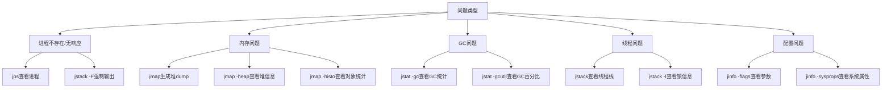

# 第4章 虚拟机性能监控与故障处理工具

## 4.1 概述

Java虚拟机（JVM）的性能监控和故障处理是Java应用运维和开发中不可或缺的重要环节。本章将详细介绍JDK自带的命令行工具和可视化工具，帮助开发者深入了解JVM的运行状态，快速定位和解决性能问题。

JVM监控工具主要提供以下能力：
- **进程监控**：查看Java进程的基本信息
- **内存分析**：监控堆内存、非堆内存的使用情况
- **GC分析**：分析垃圾收集的频率和效率
- **线程分析**：查看线程状态和死锁情况
- **配置查看**：查看和修改JVM参数

## 4.2 基础故障处理工具

JDK的bin目录下提供了一系列用于监控和故障处理的命令行工具，这些工具大多数是`lib/tools.jar`类库的一层薄包装。

### 4.2.1 jps：虚拟机进程状况工具

**功能说明**

jps（JVM Process Status Tool）用于列出正在运行的Java虚拟机进程，并显示虚拟机执行主类名称以及这些进程的本地虚拟机唯一ID（LVMID，Local Virtual Machine Identifier）。

对于本地虚拟机进程来说，LVMID与操作系统的进程ID（PID）是一致的。

**命令格式**

```bash
jps [options] [hostid]
```

**常用选项**

| 选项 | 作用 |
|------|------|
| `-q` | 只输出LVMID，省略主类的名称 |
| `-m` | 输出虚拟机进程启动时传递给main()函数的参数 |
| `-l` | 输出主类的全名，如果进程执行的是JAR包，则输出JAR路径 |
| `-v` | 输出虚拟机进程启动时的JVM参数 |
| `-V` | 输出通过flag文件传递到JVM中的参数 |

**使用示例**

```bash
# 列出所有Java进程
$ jps
12345 JpsDemo
6789 SpringBootApplication

# 显示主类全名和JAR路径
$ jps -l
12345 com.example.JpsDemo
6789 /path/to/application.jar

# 显示传递给main()函数的参数
$ jps -m
12345 JpsDemo arg1 arg2
6789 SpringBootApplication --server.port=8080

# 显示JVM启动参数
$ jps -v
12345 JpsDemo -Xmx512m -XX:+UseG1GC
6789 SpringBootApplication -Xms1g -Xmx1g -Dspring.profiles.active=prod
```

**实现原理**

jps工具通过Java的`Attach API`与目标JVM进程通信，获取进程信息。在Linux/Unix系统上，它还会查找`/tmp/hsperfdata_<username>`目录下的性能数据文件。

### 4.2.2 jstat：虚拟机统计信息监视工具

**功能说明**

jstat（JVM Statistics Monitoring Tool）是用于监视虚拟机各种运行状态信息的命令行工具。它可以显示本地或远程虚拟机进程中的类加载、内存、垃圾收集、即时编译等运行数据。

**命令格式**

```bash
jstat [option vmid [interval [s|ms] [count]]]
```

**常用选项**

| 选项 | 作用 |
|------|------|
| `-class` | 监视类加载、卸载数量、总空间以及类装载所耗费的时间 |
| `-gc` | 监视Java堆状况，包括Eden区、两个Survivor区、老年代、永久代等的容量、已用空间、GC时间合计等信息 |
| `-gccapacity` | 监视内容与-gc基本相同，但输出主要关注Java堆各个区域使用到的最大、最小空间 |
| `-gcutil` | 监视内容与-gc基本相同，但输出主要关注已使用空间占总空间的百分比 |
| `-gccause` | 与-gcutil功能一样，但是会额外输出导致上一次GC产生的原因 |
| `-gcnew` | 监视新生代GC状况 |
| `-gcold` | 监视老年代GC状况 |
| `-gcpermcapacity` | 输出永久代使用到的最大、最小空间 |
| `-compiler` | 输出JIT编译器编译过的方法、耗时等信息 |
| `-printcompilation` | 输出已经被JIT编译的方法 |

**使用示例**

```bash
# 监视GC情况，每250毫秒查询一次，共查询20次
$ jstat -gc 2764 250 20
 S0C    S1C    S0U    S1U      EC       EU        OC         OU       MC     MU    CCSC   CCSU   YGC     YGCT    FGC    FGCT     GCT
10752.0 10752.0  0.0    0.0   65536.0  5248.0   175104.0   157974.3  48640.0 47271.6 6144.0 5808.8     12    0.256   2      0.312    0.568

# 监视GC百分比情况
$ jstat -gcutil 2764
  S0     S1     E      O      M     CCS    YGC     YGCT    FGC    FGCT     GCT
  0.00   0.00  12.50  89.50  97.20  94.50   12    0.256    2     0.312    0.568

# 监视类加载情况
$ jstat -class 2764
Loaded  Bytes  Unloaded  Bytes     Time
  8756 15678.3      123   234.5      12.34
```

**输出字段说明**

| 字段 | 说明 |
|------|------|
| `S0C/S1C` | Survivor 0/1区容量（KB） |
| `S0U/S1U` | Survivor 0/1区已使用（KB） |
| `EC/EU` | Eden区容量/已使用（KB） |
| `OC/OU` | 老年代容量/已使用（KB） |
| `MC/MU` | 元空间容量/已使用（KB） |
| `YGC/YGCT` | Young GC次数/耗时（秒） |
| `FGC/FGCT` | Full GC次数/耗时（秒） |
| `GCT` | GC总耗时（秒） |

### 4.2.3 jinfo：Java配置信息工具

**功能说明**

jinfo（Configuration Info for Java）的作用是实时查看和调整虚拟机各项参数。使用`jps -v`可以查看虚拟机启动时显式指定的参数列表，但如果想知道未被显式指定的参数的系统默认值，可以使用jinfo的`-flag`选项进行查询。

**命令格式**

```bash
jinfo [option] pid
```

**常用选项**

| 选项 | 作用 |
|------|------|
| `-flag name` | 输出对应名称的参数值 |
| `-flag [+\|-]name` | 开启或关闭对应名称的参数 |
| `-flag name=value` | 设置对应名称的参数值 |
| `-flags` | 输出全部的虚拟机参数 |
| `-sysprops` | 输出系统属性 |

**使用示例**

```bash
# 查看所有JVM参数
$ jinfo -flags 2764
Attaching to process ID 2764, please wait...
Debugger attached successfully.
Server compiler detected.
JVM version is 17.0.1+12-39

Non-default VM flags: -XX:CICompilerCount=4 -XX:InitialHeapSize=268435456 -XX:MaxHeapSize=4294967296
Command line: -Xms256m -Xmx4g -XX:+UseG1GC

# 查看特定参数值
$ jinfo -flag MaxHeapSize 2764
-XX:MaxHeapSize=4294967296

# 查看系统属性
$ jinfo -sysprops 2764
Java System Properties:
#Thu Mar 28 10:30:00 CST 2026
java.runtime.name=OpenJDK Runtime Environment
java.vm.version=17.0.1+12-39
java.vendor=Oracle Corporation
java.vm.name=OpenJDK 64-Bit Server VM

# 动态启用GC日志（仅部分参数支持动态修改）
$ jinfo -flag +PrintGCDetails 2764
```

**注意事项**

并非所有JVM参数都支持动态修改，只有被标记为`manageable`的参数才能使用jinfo在运行时修改。

### 4.2.4 jmap：Java内存映像工具

**功能说明**

jmap（Memory Map for Java）用于生成堆转储快照（heap dump），还可以查询finalize执行队列、Java堆和方法区的详细信息，如空间使用率、当前用的是哪种收集器等。

**命令格式**

```bash
jmap [option] vmid
```

**常用选项**

| 选项 | 作用 |
|------|------|
| `-dump` | 生成Java堆转储快照。格式为`-dump:[live,]format=b,file=<filename> pid`，live子参数表示只dump出存活的对象 |
| `-finalizerinfo` | 显示在F-Queue中等待Finalizer线程执行finalize方法的对象 |
| `-heap` | 显示Java堆详细信息，如使用哪种回收器、参数配置、分代状况等 |
| `-histo` | 显示堆中对象统计信息，包括类、实例数量、合计容量 |
| `-permstat` | 以ClassLoader为统计口径显示永久代内存状态（JDK 8之前） |
| `-clstats` | 以ClassLoader为统计口径显示类加载器统计信息（JDK 8+） |

**使用示例**

```bash
# 生成堆转储快照
$ jmap -dump:format=b,file=/tmp/heapdump.hprof 2764
Dumping heap to /tmp/heapdump.hprof ...
Heap dump file created

# 只dump存活对象
$ jmap -dump:live,format=b,file=/tmp/heapdump_live.hprof 2764

# 查看堆详细信息
$ jmap -heap 2764
Attaching to process ID 2764, please wait...
Debugger attached successfully.
Server compiler detected.
JVM version is 17.0.1+12-39

using thread-local object allocation.
Garbage-First (G1) GC with 8 thread(s)

Heap Configuration:
   MinHeapFreeRatio         = 40
   MaxHeapFreeRatio         = 70
   MaxHeapSize              = 4294967296 (4096.0MB)
   NewSize                  = 1363144 (1.2999954223632812MB)
   MaxNewSize               = 2576351232 (2457.0MB)
   OldSize                  = 5452592 (5.1999969482421875MB)

Heap Usage:
G1 Heap:
   regions  = 256
   capacity = 268435456 (256.0MB)
   used     = 157286400 (150.0MB)
   free     = 111149056 (106.0MB)
   58.59375% used

# 查看对象统计信息
$ jmap -histo 2764 | head -20

 num     #instances         #bytes  class name
----------------------------------------------
   1:         45678       12345678  [B
   2:         34567        9876543  [C
   3:         23456        7654321  java.lang.String
   4:         12345        6543210  java.util.HashMap$Node
```

**堆转储文件分析**

生成的`.hprof`文件可以使用以下工具分析：
- VisualVM
- Eclipse MAT（Memory Analyzer Tool）
- jhat（JDK自带，已废弃）
- IntelliJ IDEA内置分析器

### 4.2.5 jhat：虚拟机堆转储快照分析工具

**功能说明**

jhat（JVM Heap Analysis Tool）用于分析jmap生成的堆转储快照文件。它会建立一个HTTP/HTML服务器，让用户可以在浏览器上查看分析结果。

**命令格式**

```bash
jhat [options] heap-dump-file
```

**常用选项**

| 选项 | 作用 |
|------|------|
| `-stack false\|true` | 关闭跟踪对象分配调用栈信息 |
| `-refs false\|true` | 关闭对象引用跟踪 |
| `-port port-number` | 设置jhat HTTP服务器的端口号，默认7000 |
| `-exclude exclude-file` | 指定对象查询时需要排除的数据成员 |
| `-baseline exclude-file` | 指定一个基准堆转储 |
| `-debug int` | 设置debug级别 |
| `-version` | 启动后显示版本信息就退出 |

**使用示例**

```bash
# 分析堆转储文件
$ jhat /tmp/heapdump.hprof
Reading from /tmp/heapdump.hprof...
Dump file created Thu Mar 28 10:30:00 CST 2026
Snapshot read, resolving...
Resolving 1234567 objects...
Chasing references, expect 246 dots...
Eliminating duplicate references...
Snapshot resolved.
Started HTTP server on port 7000
Server is ready.
```

然后访问 `http://localhost:7000` 即可在浏览器中查看分析结果。

**注意事项**

jhat在JDK 9中已被标记为废弃，在JDK 11中已被移除。建议使用VisualVM或Eclipse MAT替代。

### 4.2.6 jstack：Java堆栈跟踪工具

**功能说明**

jstack（Stack Trace for Java）用于生成虚拟机当前时刻的线程快照（一般称为threaddump或javacore文件）。线程快照就是当前虚拟机内每一条线程正在执行的方法堆栈的集合，生成线程快照的目的通常是定位线程出现长时间停顿的原因，如线程间死锁、死循环、请求外部资源导致的长时间挂起等。

**命令格式**

```bash
jstack [option] vmid
```

**常用选项**

| 选项 | 作用 |
|------|------|
| `-F` | 当正常输出的请求不被响应时，强制输出线程堆栈 |
| `-l` | 除堆栈外，显示关于锁的附加信息 |
| `-m` | 如果调用到本地方法的话，可以显示C/C++的堆栈 |

**使用示例**

```bash
# 生成线程快照
$ jstack -l 2764 > /tmp/threaddump.txt

# 查看线程快照
$ jstack 2764
2026-03-28 10:30:00
Full thread dump OpenJDK 64-Bit Server VM (17.0.1+12-39 mixed mode, sharing):

"DestroyJavaVM" #15 prio=5 os_prio=0 cpu=1234.56ms elapsed=3600.00s tid=0x00007f123456789 nid=0x1234 waiting on condition  [0x0000000000000000]
   java.lang.Thread.State: RUNNABLE

"main" #1 prio=5 os_prio=0 cpu=1000.00ms elapsed=3600.00s tid=0x00007f123456789a nid=0x1 waiting on condition  [0x00007f1234567000]
   java.lang.Thread.State: WAITING (parking)
        at jdk.internal.misc.Unsafe.park(java.base@17.0.1/Native Method)
        - parking to wait for  <0x00000000d5f01234> (a java.util.concurrent.locks.AbstractQueuedSynchronizer$ConditionObject)
        at java.util.concurrent.locks.LockSupport.park(java.base@17.0.1/LockSupport.java:341)
        at java.util.concurrent.locks.AbstractQueuedSynchronizer$ConditionNode.block(java.base@17.0.1/AbstractQueuedSynchronizer.java:506)
        at java.util.concurrent.ForkJoinPool.managedBlock(java.base@17.0.1/ForkJoinPool.java:3437)
        at java.util.concurrent.locks.AbstractQueuedSynchronizer$ConditionObject.await(java.base@17.0.1/AbstractQueuedSynchronizer.java:1623)
        at java.util.concurrent.LinkedBlockingQueue.take(java.base@17.0.1/LinkedBlockingQueue.java:435)
        at com.example.Application.main(Application.java:20)

   Locked ownable synchronizers:
        - None

"GC Thread#0" os_prio=0 cpu=100.00ms elapsed=3600.00s tid=0x00007f123456788 nid=0x2 runnable

"G1 Main Marker" os_prio=0 cpu=10.00ms elapsed=3600.00s tid=0x00007f123456787 nid=0x3 runnable

...
```

**线程状态说明**

| 状态 | 说明 |
|------|------|
| `NEW` | 线程刚被创建，还未启动 |
| `RUNNABLE` | 线程正在Java虚拟机中执行 |
| `BLOCKED` | 线程被阻塞，等待监视器锁 |
| `WAITING` | 线程无限期等待另一个线程执行特定操作 |
| `TIMED_WAITING` | 线程在指定时间内等待另一个线程执行操作 |
| `TERMINATED` | 线程已退出 |

**死锁检测**

使用`-l`选项可以显示锁信息，帮助检测死锁：

```bash
$ jstack -l 2764
...
Found one Java-level deadlock:
=============================

"Thread-1":
  waiting to lock monitor 0x00007f1234560000 (object 0x00000000d5f01234, a java.lang.Object),
  which is held by "Thread-2"
"Thread-2":
  waiting to lock monitor 0x00007f1234560001 (object 0x00000000d5f01235, a java.lang.Object),
  which is held by "Thread-1"

Java stack information for the threads listed above:
===================================================
"Thread-1":
        at com.example.DeadlockDemo.method1(DeadlockDemo.java:20)
        - waiting to lock <0x00000000d5f01234> (a java.lang.Object)
        - locked <0x00000000d5f01235> (a java.lang.Object)
"Thread-2":
        at com.example.DeadlockDemo.method2(DeadlockDemo.java:35)
        - waiting to lock <0x00000000d5f01235> (a java.lang.Object)
        - locked <0x00000000d5f01234> (a java.lang.Object)

Found 1 deadlock.
```

### 4.2.7 基础工具总结



## 4.3 可视化故障处理工具

### 4.3.1 JHSDB：基于服务性代理的调试工具

**功能说明**

JHSDB（Java HotSpot Debugger）是JDK 9引入的图形化工具，基于Serviceability Agent（SA）实现。它可以用于分析运行中的Java进程或core dump文件，提供了比命令行工具更直观的界面。

**启动方式**

```bash
# 分析正在运行的进程
$ jhsdb hsdb --pid 2764

# 分析core dump文件
$ jhsdb hsdb --core /path/to/core.dump --exe /path/to/java
```

**主要功能**

1. **Inspector**：查看对象详细信息
2. **Memory Viewer**：查看内存内容
3. **Stack Memory**：查看栈内存
4. **Threads**：查看线程信息
5. **Classes**：查看已加载的类
6. **Code Viewer**：查看JIT编译后的代码

**使用场景**

- 分析堆内存中的对象引用关系
- 查看类的静态字段值
- 分析线程栈和局部变量
- 调试HotSpot虚拟机内部结构

### 4.3.2 JConsole：Java监视与管理控制台

**功能说明**

JConsole（Java Monitoring and Management Console）是JDK自带的可视化监控工具，基于JMX（Java Management Extensions）实现。它可以监控本地或远程的Java进程，提供内存、线程、类加载、GC等信息的实时监控。

**启动方式**

```bash
$ jconsole
```

**主要功能模块**

#### 1. 概览（Overview）

显示堆内存、线程、类加载、CPU使用率的实时图表。

#### 2. 内存（Memory）

- 显示堆内存和非堆内存的使用情况
- 可以手动触发GC
- 查看内存池详细信息
- 显示内存使用历史图表

#### 3. 线程（Threads）

- 实时显示线程数量
- 查看线程详细信息
- 检测死锁
- 显示线程CPU时间

#### 4. 类（Classes）

- 显示已加载类数量
- 显示已卸载类数量
- 类加载历史图表

#### 5. VM摘要（VM Summary）

- JVM版本信息
- 启动参数
- 系统属性
- 线程和内存统计

#### 6. MBeans

- 查看和调用MBean操作
- 查看MBean属性
- 接收MBean通知

**远程连接配置**

启动Java应用时添加JMX参数：

```bash
java -Dcom.sun.management.jmxremote \
     -Dcom.sun.management.jmxremote.port=9010 \
     -Dcom.sun.management.jmxremote.ssl=false \
     -Dcom.sun.management.jmxremote.authenticate=false \
     -jar application.jar
```

然后在JConsole中输入远程主机IP和端口9010进行连接。

### 4.3.3 VisualVM：多合一故障处理工具

**功能说明**

VisualVM是功能最强大的JDK可视化监控工具，它整合了多个JDK命令行工具的功能，并提供了插件扩展机制。VisualVM可以监控本地和远程的Java进程，支持性能分析和内存分析。

**启动方式**

```bash
$ jvisualvm  # JDK 8及之前
$ visualvm   # 需要单独下载安装（JDK 9+）
```

**主要功能**

#### 1. 监控（Monitor）

- CPU、内存、类加载、线程的实时监控
- 堆转储生成和分析
- 线程转储生成和分析
- 应用程序快照

#### 2. 线程（Threads）

- 实时线程状态监控
- 线程转储分析
- 死锁检测

#### 3. 抽样器（Sampler）

- CPU抽样：分析方法执行时间
- 内存抽样：分析对象分配

#### 4. 分析器（Profiler）

- CPU分析：详细的方法级性能分析
- 内存分析：对象分配追踪

#### 5. Visual GC插件

- 可视化GC活动
- 显示Eden、Survivor、老年代、永久代的实时状态
- GC次数和耗时统计

**使用示例：分析内存泄漏**

1. 启动VisualVM并连接目标进程
2. 在"Monitor"标签页点击"Heap Dump"
3. 切换到"Classes"视图，按实例数量排序
4. 查找异常增长的类
5. 右键点击类，选择"View in Instances View"
6. 分析对象引用链，定位泄漏源

### 4.3.4 Java Mission Control：可持续在线的监控工具

**功能说明**

Java Mission Control（JMC）是JDK 7 Update 40引入的监控工具，在JDK 11之前是商业特性，JDK 11之后开源。它提供了低开销的持续监控能力，特别适合生产环境使用。

**启动方式**

```bash
$ jmc
```

**主要功能**

#### 1. JVM浏览器（JVM Browser）

- 发现和连接本地及远程JVM
- 支持JMX和JFR两种连接方式

#### 2. JMX控制台（JMX Console）

- 实时MBean监控
- 自定义仪表板
- 触发器和警报

#### 3. 飞行记录器（Java Flight Recorder，JFR）

JFR是JMC的核心功能，它可以：
- 以极低的性能开销记录详细的运行时信息
- 记录事件包括：线程、锁、GC、方法采样、异常、I/O等
- 生成详细的性能分析报告

**启动JFR记录**

```bash
# 在启动应用时启用JFR
java -XX:StartFlightRecording=duration=60s,filename=myrecording.jfr \
     -jar application.jar

# 使用jcmd启动JFR
$ jcmd <pid> JFR.start duration=60s filename=myrecording.jfr
```

**JFR分析维度**

| 维度 | 说明 |
|------|------|
| 代码（Code） | 热点方法、异常、编译 |
| 内存（Memory） | 对象统计、GC、TLAB |
| 线程（Thread） | 线程状态、锁竞争、上下文切换 |
| I/O（Input/Output） | 文件I/O、Socket I/O |
| 系统（System） | 环境变量、系统属性 |

## 4.4 HotSpot虚拟机插件及工具

### 4.4.1 HSDIS：反汇编插件

HSDIS（HotSpot Disassembler）是HotSpot虚拟机的一个插件，用于将JIT编译后的机器码反汇编为汇编代码。

**使用方式**

```bash
java -XX:+UnlockDiagnosticVMOptions \
     -XX:+PrintAssembly \
     -XX:CompileCommand=print,*MyClass.myMethod \
     MyClass
```

**应用场景**

- 分析JIT编译优化效果
- 理解JVM内部实现
- 性能调优时查看汇编代码

### 4.4.2 LogCompilation

JDK 9引入了统一的日志系统，可以详细记录JIT编译过程。

```bash
java -XX:+LogCompilation -XX:LogFile=compilation.log MyClass
```

## 4.5 Arthas：阿里巴巴开源的Java诊断工具

### 4.5.1 Arthas简介

Arthas（阿尔萨斯）是阿里巴巴开源的Java诊断工具，深受开发者喜爱。它采用命令行交互模式，支持JDK 6+，同时支持Linux/Mac/Windows操作系统。

相比JDK自带工具，Arthas具有以下优势：
- **实时性**：无需重启应用即可诊断问题
- **无侵入**：不需要修改代码或添加依赖
- **功能丰富**：提供类加载、方法执行、线程、JVM等全方位诊断能力
- **易于使用**：命令行交互，支持Tab自动补全

### 4.5.2 安装与启动

**快速安装**

```bash
# 使用arthas-boot（推荐）
curl -O https://arthas.aliyun.com/arthas-boot.jar
java -jar arthas-boot.jar

# 或者下载完整包
curl -O https://arthas.aliyun.com/arthas-packaging-3.7.2-bin.zip
unzip arthas-packaging-3.7.2-bin.zip
```

**启动Arthas**

```bash
$ java -jar arthas-boot.jar
[INFO] arthas-boot version: 3.7.2
[INFO] Found existing java process, please choose one and input the serial number of the process, eg : 1. Then hit ENTER.
* [1]: 12345 com.example.Application
  [2]: 6789 org.springframework.boot.loader.JarLauncher
1
[INFO] arthas home: /root/.arthas/lib/3.7.2/arthas
[INFO] Try to attach process 12345
[INFO] Attach process 12345 success.
[INFO] arthas-client connect 127.0.0.1 3658
  ,---.  ,------. ,--------.,--.  ,--.  ,---.   ,---.
 /  O  \ |  .--. ''--.  .--'|  '--'  | /  O  \ '   .-'
|  .-.  ||  '--'.'   |  |   |  .--.  ||  .-.  |`.  `-.
|  | |  ||  |\  \    |  |   |  |  |  ||  | |  |.-'    |
`--' `--'`--' '--'   `--'   `--'  `--'`--' `--'`-----'

wiki       https://arthas.aliyun.com/doc
version    3.7.2
main_class com.example.Application
pid        12345
```

### 4.5.3 核心命令详解

#### 1. dashboard - 系统实时数据面板

显示当前系统的实时数据面板，包括线程、内存、GC、运行时等信息。

```bash
$ dashboard
ID   NAME                          GROUP          PRIORITY   STATE     %CPU      DELTA_TIME TIME      INTERRUPTE DAEMON
1    main                          main           5          RUNNABLE  0.0       0.000      0:0.046   false      false
2    Reference Handler             system         10         RUNNING   0.0       0.000      0:0.000   false      true
...

Memory                    used      total      max       usage     GC
heap                      65MB      256MB      4096MB    1.58%     gc.g1_young_generation.count   12
g1_eden_space             32MB      128MB      -1        25.00%    gc.g1_young_generation.time(ms) 156
g1_survivor_space         4MB       4MB        -1        100.00%   gc.g1_old_generation.count     2
g1_old_gen                29MB      124MB      4096MB    0.71%     gc.g1_old_generation.time(ms)  89
```

#### 2. thread - 线程信息查看

查看当前JVM的线程堆栈信息。

```bash
# 查看所有线程
$ thread

# 查看线程统计
$ thread -n 3
"C1 CompilerThread0" [Internal] cpuUsage=2.45% deltaTime=5ms time=1250ms

# 查看指定线程
$ thread 1

# 查看CPU占用最高的线程
$ thread -n 3
```

#### 3. jad - 反编译类

反编译指定已加载类的源码。

```bash
# 反编译类
$ jad com.example.Service

# 反编译指定方法
$ jad com.example.Service getUser

# 保存到文件
$ jad --source-only com.example.Service > /tmp/Service.java
```

#### 4. watch - 方法执行数据观测

让你能方便的观察到指定方法的调用情况，包括入参、返回值、异常等。

```bash
# 查看方法入参和返回值
$ watch com.example.Service getUser '{params,returnObj}' -x 2

# 查看方法执行异常
$ watch com.example.Service getUser '{params,throwExp}' -e

# 查看方法执行耗时
$ watch com.example.Service getUser '{params,returnObj}' '#cost>200' -x 2

# 条件过滤
$ watch com.example.Service getUser '{params[0],returnObj}' 'params[0].id>100' -x 2
```

表达式说明：
- `params`：方法入参数组
- `returnObj`：方法返回值
- `throwExp`：方法抛出的异常
- `#cost`：方法执行耗时（毫秒）
- `-x 2`：展开层级为2

#### 5. trace - 方法内部调用路径和耗时

显示方法内部调用路径，并输出方法路径上的每个节点上耗时。

```bash
# 跟踪方法
$ trace com.example.Service getUser

# 跟踪多个类
$ trace com.example.*Service* *

# 条件过滤
$ trace com.example.Service getUser '#cost>100'

# 跳过JDK方法
$ trace --skipJDKMethod false com.example.Service getUser
```

输出示例：
```
`---ts=2026-03-28 10:30:00;thread_name=http-nio-8080-exec-1;id=1f;is_daemon=false;priority=5;TCCL=org.springframework.boot.web.embedded.tomcat.TomcatEmbeddedWebappClassLoader@6a5fc7f7
    `---[10.234ms] com.example.Service:getUser()
        +---[0.023ms] com.example.DAO:queryById() #55
        +---[5.123ms] com.example.Cache:get() #56
        `---[4.567ms] com.example.Mapper:selectById() #58
```

#### 6. stack - 方法执行路径

输出当前方法被调用的调用路径。

```bash
# 查看方法调用栈
$ stack com.example.Service getUser

# 条件过滤
$ stack com.example.Service getUser 'params[0].id>100'
```

#### 7. tt - 方法执行时空隧道

Time Tunnel，记录下指定方法每次调用的入参和返回信息，并能对这些不同时间下调用的信息进行观测。

```bash
# 记录方法调用
$ tt -t com.example.Service getUser

# 查看记录列表
$ tt -l

# 查看具体调用详情
$ tt -i 1000

# 重放调用
$ tt -i 1000 -p

# 重放指定次数
$ tt -i 1000 -p --replay-times 5

# 修改入参重放
$ tt -i 1000 -p 'params[0]=new com.example.User(123)'
```

#### 8. monitor - 方法执行监控

非侵入式地监控方法的调用次数、成功次数、失败次数、平均耗时等。

```bash
# 监控方法
$ monitor -c 5 com.example.Service getUser

# 监控类下所有方法
$ monitor -c 5 com.example.Service *
```

输出示例：
```
 timestamp            class              method        total  success  fail  avg-rt(ms)  fail-rate
-----------------------------------------------------------------------------------------------------------------
 2026-03-28 10:30:00  com.example.Service  getUser       120    118      2     15.23       1.67%
```

#### 9. heapdump - 生成堆转储文件

生成堆内存转储文件，类似于jmap。

```bash
# 生成堆转储
$ heapdump

# 只dump存活对象
$ heapdump --live

# 指定文件路径
$ heapdump /tmp/dump.hprof
```

#### 10. classloader - 类加载器信息

查看类加载器的信息，包括类加载器的层次结构、加载的类数量等。

```bash
# 查看类加载器统计
$ classloader

# 查看类加载器层次结构
$ classloader -t

# 查看类加载器加载的类
$ classloader -l
```

#### 11. sc - 查看JVM已加载的类

Search Class，查看JVM已加载的类信息。

```bash
# 查找类
$ sc com.example.Service

# 显示类详细信息
$ sc -d com.example.Service

# 显示类成员变量
$ sc -df com.example.Service
```

#### 12. sm - 查看已加载类的方法信息

Search Method，查看已加载类的方法信息。

```bash
# 查找方法
$ sm com.example.Service

# 显示方法详细信息
$ sm -d com.example.Service getUser
```

### 4.5.4 高级功能

#### 1. 热更新代码（retransform）

Arthas支持热更新代码，无需重启应用。

```bash
# 1. 使用jad反编译类
$ jad --source-only com.example.Service > /tmp/Service.java

# 2. 修改代码
# 编辑 /tmp/Service.java

# 3. 使用mc命令编译
$ mc /tmp/Service.java -d /tmp

# 4. 使用retransform热更新
$ retransform /tmp/com/example/Service.class
```

#### 2. 火焰图（profiler）

使用async-profiler生成CPU/内存火焰图。

```bash
# 启动CPU分析
$ profiler start

# 查看分析状态
$ profiler status

# 停止并生成火焰图
$ profiler stop --format html

# 生成SVG火焰图
$ profiler stop --file /tmp/flamegraph.svg
```

#### 3. 内存分析（vmtool）

强制GC、获取对象实例等。

```bash
# 强制GC
$ vmtool --action forceGc

# 获取对象实例
$ vmtool --action getInstances --className com.example.Service --limit 10
```

### 4.5.5 实战案例

#### 案例1：线上接口响应慢

**现象**：用户反馈某个接口响应慢

**排查步骤**：

1. 使用`dashboard`查看系统整体状态
2. 使用`thread -n 3`找到CPU占用高的线程
3. 使用`trace`跟踪接口方法，定位耗时长的内部调用
4. 使用`watch`观察慢请求的入参和返回值

```bash
# 跟踪接口方法，查看耗时
$ trace com.example.controller.UserController getUser '#cost>1000'

# 观察慢请求详情
$ watch com.example.controller.UserController getUser '{params,returnObj,#cost}' '#cost>1000' -x 2
```

#### 案例2：线上偶发异常

**现象**：线上偶尔出现NullPointerException，但难以复现

**排查步骤**：

1. 使用`tt`记录方法调用
2. 当异常发生时，查看记录
3. 分析异常时的入参

```bash
# 记录方法调用
$ tt -t com.example.Service processOrder

# 当异常发生后，查看异常记录
$ tt -l

# 查看异常详情
$ tt -i 1000

# 重放调用复现问题
$ tt -i 1000 -p
```

#### 案例3：热修复线上Bug

**现象**：线上发现简单Bug，需要紧急修复但不想重启

**修复步骤**：

1. 使用`jad`反编译问题类
2. 修改代码
3. 使用`mc`编译
4. 使用`retransform`热更新

```bash
# 反编译
$ jad --source-only com.example.Service > /tmp/Service.java

# 修改代码后编译
$ mc /tmp/Service.java -d /tmp

# 热更新
$ retransform /tmp/com/example/Service.class

# 验证更新
$ jad com.example.Service
```

### 4.5.6 Arthas与JDK工具对比

| 功能 | JDK工具 | Arthas | 说明 |
|------|---------|--------|------|
| 查看进程 | jps | arthas-boot | Arthas自动发现进程 |
| 线程分析 | jstack | thread | Arthas支持实时查看 |
| 内存分析 | jmap | heapdump | 功能类似 |
| GC监控 | jstat | dashboard | Arthas界面更友好 |
| 方法追踪 | 无 | trace/watch | Arthas独有功能 |
| 反编译 | 无 | jad | Arthas独有功能 |
| 热更新 | 无 | retransform | Arthas独有功能 |
| 火焰图 | 无 | profiler | Arthas独有功能 |

### 4.5.7 使用建议

1. **生产环境使用**：Arthas对性能影响极小，适合生产环境诊断
2. **安全考虑**：建议限制Arthas访问权限，避免敏感信息泄露
3. **配合日志**：复杂问题仍需结合应用日志分析
4. **学习曲线**：Arthas功能丰富，建议先掌握常用命令

## 4.6 实战：综合故障排查案例

### 案例1：内存溢出排查

**现象**：应用频繁出现OutOfMemoryError

**排查步骤**：

1. 使用`jstat -gcutil`监控GC情况
2. 发现老年代使用率持续上升，Full GC频繁但效果不佳
3. 使用`jmap -dump:live,format=b,file=heap.hprof <pid>`生成堆转储
4. 使用VisualVM或MAT分析堆转储文件
5. 发现某类实例数量异常，占用了大量内存
6. 检查代码，发现对象未正确释放或缓存未设置上限

### 案例2：CPU使用率过高

**现象**：应用CPU使用率持续100%

**排查步骤**：

1. 使用`top`或`ps`找到CPU占用高的Java进程
2. 使用`top -Hp <pid>`找到占用CPU高的线程
3. 将线程ID转换为16进制：`printf "%x\n" <tid>`
4. 使用`jstack <pid>`导出线程栈
5. 在jstack输出中查找16进制线程ID
6. 定位到具体代码位置，发现死循环或频繁GC

### 案例3：应用无响应

**现象**：应用不报错但无响应

**排查步骤**：

1. 使用`jstack -l <pid>`导出线程栈
2. 查看线程状态，发现大量线程BLOCKED或WAITING
3. 查找锁竞争情况，发现死锁
4. 分析代码，修复锁顺序或使用并发工具类

## 4.7 本章小结

本章详细介绍了JDK提供的各种性能监控和故障处理工具，以及阿里巴巴开源的Arthas诊断工具：

| 工具类型 | 工具名称 | 主要用途 | 适用场景 |
|---------|---------|---------|---------|
| 命令行工具 | jps | 查看Java进程 | 快速查看进程列表 |
| 命令行工具 | jstat | 监控GC和内存 | 持续监控GC情况 |
| 命令行工具 | jinfo | 查看/修改JVM参数 | 查看配置信息 |
| 命令行工具 | jmap | 生成堆转储 | 内存分析 |
| 命令行工具 | jstack | 生成线程快照 | 线程/死锁分析 |
| 命令行工具 | jhat | 分析堆转储（已废弃） | - |
| 可视化工具 | JHSDB | 基于SA的调试 | 底层调试 |
| 可视化工具 | JConsole | 基础监控 | 简单监控需求 |
| 可视化工具 | VisualVM | 综合监控分析 | 开发环境深度分析 |
| 可视化工具 | JMC/JFR | 生产环境监控 | 生产环境低开销监控 |
| 诊断工具 | Arthas | 全方位Java诊断 | 生产环境实时诊断 |

### 工具选择建议

**开发环境**：
- 深度分析：VisualVM
- 快速诊断：Arthas
- 性能剖析：JMC/JFR

**生产环境**：
- 首选：Arthas（功能丰富、低侵入）
- 持续监控：JMC/JFR
- 应急诊断：命令行工具（jstat、jstack等）

**不同场景**：
- 内存问题：jmap/Arthas heapdump + VisualVM/MAT
- CPU问题：Arthas profiler/thread + jstack
- 方法追踪：Arthas trace/watch/tt
- 热修复：Arthas retransform

掌握这些工具的使用，是Java开发和运维人员的基本技能，也是快速定位和解决JVM相关问题的重要手段。建议优先掌握Arthas的常用命令，它在生产环境诊断中非常实用。
