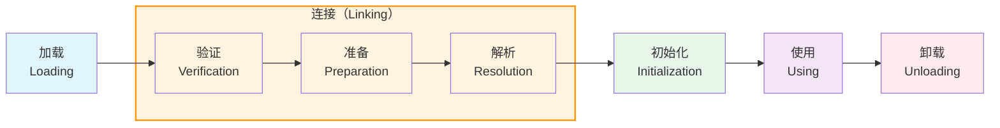

# 第7章 虚拟机类加载机制

## 7.1 概述

虚拟机把描述类的数据从Class文件加载到内存，并对数据进行校验、转换解析和初始化，最终形成可以被虚拟机直接使用的Java类型，这个过程被称作虚拟机的**类加载机制**。

与那些在编译时需要进行连接工作的语言不同，在Java语言里面，类型的加载、连接和初始化过程都是在程序运行期间完成的，这种策略让Java语言进行提前编译会面临额外的困难，也会让类加载时稍微增加一些性能开销，但是却为Java应用提供了极高的扩展性和灵活性，Java天生可以动态扩展的语言特性就是依赖运行期动态加载和动态连接这个特点实现的。

---

## 7.2 类加载的时机

一个类型从被加载到虚拟机内存中开始，到卸载出内存为止，它的整个生命周期将会经历**加载（Loading）**、**验证（Verification）**、**准备（Preparation）**、**解析（Resolution）**、**初始化（Initialization）**、**使用（Using）**和**卸载（Unloading）**七个阶段，其中验证、准备、解析三个部分统称为**连接（Linking）**。



### 7.2.1 必须立即对类进行初始化的场景

《Java虚拟机规范》严格规定了有且只有六种情况必须立即对类进行"初始化"（而加载、验证、准备自然需要在此之前开始）：

**1. 遇到new、getstatic、putstatic或invokestatic这四条字节码指令时**

- 使用new关键字实例化对象
- 读取或设置一个类型的静态字段（被final修饰、已在编译期把结果放入常量池的静态字段除外）
- 调用一个类型的静态方法

**2. 使用java.lang.reflect包的方法对类型进行反射调用时**

```java
Class.forName("com.example.MyClass");
MyClass.class.getDeclaredMethod("method");
```

**3. 当初始化类的时候，如果发现其父类还没有进行过初始化，则需要先触发其父类的初始化**

**4. 当虚拟机启动时，用户需要指定一个要执行的主类（包含main()方法的那个类），虚拟机会先初始化这个主类**

**5. 当使用JDK 7新加入的动态语言支持时**

如果一个java.lang.invoke.MethodHandle实例最后的解析结果为REF_getStatic、REF_putStatic、REF_invokeStatic、REF_newInvokeSpecial四种类型的方法句柄，并且这个方法句柄对应的类没有进行过初始化，则需要先触发其初始化。

**6. 当一个接口中定义了JDK 8新加入的默认方法（被default关键字修饰的接口方法）时**

如果有这个接口的实现类发生了初始化，那该接口要在其之前被初始化。

### 7.2.2 被动引用示例

除了上述六种情况外，所有引用类的方式都不会触发初始化，称为**被动引用**。

**示例1：通过子类引用父类的静态字段**

```java
public class SuperClass {
    static {
        System.out.println("SuperClass init!");
    }
    public static int value = 123;
}

public class SubClass extends SuperClass {
    static {
        System.out.println("SubClass init!");
    }
}

// 测试
public class Test {
    public static void main(String[] args) {
        System.out.println(SubClass.value);
        // 输出：SuperClass init! 和 123
        // 不会输出 SubClass init!
    }
}
```

**说明**：对于静态字段，只有直接定义这个字段的类才会被初始化。

**示例2：通过数组定义来引用类**

```java
public class Test {
    public static void main(String[] args) {
        SuperClass[] sca = new SuperClass[10];
        // 不会触发SuperClass的初始化
    }
}
```

**说明**：数组类型由虚拟机自动生成，继承自java.lang.Object。

**示例3：常量在编译阶段存入调用类的常量池**

```java
public class ConstClass {
    static {
        System.out.println("ConstClass init!");
    }
    public static final String HELLO = "hello world";
}

public class Test {
    public static void main(String[] args) {
        System.out.println(ConstClass.HELLO);
        // 不会输出 ConstClass init!
    }
}
```

**说明**：编译阶段常量已存入Test类的常量池，本质上没有引用ConstClass。

---

## 7.3 类加载的过程

### 7.3.1 加载

"加载"（Loading）阶段是整个类加载过程的一个阶段，在加载阶段，Java虚拟机需要完成以下三件事情：

1. **通过一个类的全限定名来获取定义此类的二进制字节流**
2. **将这个字节流所代表的静态存储结构转化为方法区的运行时数据结构**
3. **在内存中生成一个代表这个类的java.lang.Class对象，作为方法区这个类的各种数据的访问入口**

#### 获取二进制字节流的方式

《Java虚拟机规范》对这三点要求其实并不是特别具体，留给虚拟机实现与Java应用的灵活度都是相当大的。例如"通过一个类的全限定名来获取定义此类的二进制字节流"这条规则，它并没有指明二进制字节流必须得从某个Class文件中获取，确切地说是根本没有指明要从哪里获取、如何获取。

**常见的获取方式：**

| 方式 | 说明 | 应用场景 |
|------|------|----------|
| 本地文件系统 | 从Class文件读取 | 普通Java应用 |
| 网络 | 从URL读取 | Applet、Web Start |
| 压缩包 | 从JAR、EAR、WAR读取 | 企业级应用 |
| 数据库 | 从数据库读取 | 特殊场景 |
| 运行时计算生成 | 动态代理、CGLIB | AOP、ORM |
| 其他文件生成 | 由JSP文件生成 | Web应用 |
| 加密文件 | 从加密Class文件解密读取 | 代码保护 |

#### 数组类的加载

数组类本身不通过类加载器创建，它是由Java虚拟机直接在内存中动态构造的。但数组类的元素类型（Element Type，指的是数组去掉所有维度的类型）最终还是要靠类加载器来完成加载。

**数组类的创建规则：**

| 数组类型 | 组件类型 | 类加载器 |
|----------|----------|----------|
| `int[]` | int（基本类型） | 引导类加载器 |
| `String[]` | String（引用类型） | 加载String的类加载器 |
| `Object[][]` | Object[]（数组类型） | 加载Object的类加载器 |

#### 加载阶段完成后

加载阶段完成后，Java虚拟机外部的二进制字节流就按照虚拟机所设定的格式存储在方法区之中了，方法区中的数据存储格式完全由虚拟机实现自行定义。类型数据妥善安置在方法区之后，会在Java堆内存中实例化一个java.lang.Class类的对象，这个对象将作为程序访问方法区中的类型数据的外部接口。

### 7.3.2 验证

验证是连接阶段的第一步，这一阶段的目的是确保Class文件的字节流中包含的信息符合《Java虚拟机规范》的全部约束要求，保证这些信息被当作代码运行后不会危害虚拟机自身的安全。

验证阶段是非常重要的，这个阶段是否严谨，直接决定了Java虚拟机是否能承受恶意代码的攻击，从代码量和耗费的执行性能的角度上讲，验证阶段的工作量在虚拟机的类加载过程中占了相当大的比重。

**验证阶段大致上会完成下面四个阶段的检验动作：**

#### 1. 文件格式验证

第一阶段要验证字节流是否符合Class文件格式的规范，并且能被当前版本的虚拟机处理。

**验证内容：**
- 是否以魔数0xCAFEBABE开头
- 主、次版本号是否在当前Java虚拟机接受范围之内
- 常量池的常量中是否有不被支持的常量类型（检查常量tag标志）
- 指向常量的各种索引值中是否有指向不存在的常量或不符合类型的常量
- CONSTANT_Utf8_info型的常量中是否有不符合UTF-8编码的数据
- Class文件中各个部分及文件本身是否有被删除的或附加的其他信息

**目的**：保证输入的字节流能正确地解析并存储于方法区之内。

#### 2. 元数据验证

第二阶段是对字节码描述的信息进行语义分析，以保证其描述的信息符合《Java语言规范》的要求。

**验证内容：**
- 这个类是否有父类（除了java.lang.Object之外，所有的类都应当有父类）
- 这个类的父类是否继承了不允许被继承的类（被final修饰的类）
- 如果这个类不是抽象类，是否实现了其父类或接口之中要求实现的所有方法
- 类中的字段、方法是否与父类产生矛盾（例如覆盖了父类的final字段，或者出现不符合规则的方法重载）

**目的**：对类的元数据信息进行语义校验，保证不存在与《Java语言规范》定义相悖的元数据信息。

#### 3. 字节码验证

第三阶段是整个验证过程中最复杂的一个阶段，主要目的是通过数据流分析和控制流分析，确定程序语义是合法的、符合逻辑的。

**验证内容：**
- 保证任意时刻操作数栈的数据类型与指令代码序列都能配合工作
- 保证任何跳转指令都不会跳转到方法体以外的字节码指令上
- 保证方法体中的类型转换是有效的

**示例问题：**
```java
// 非法的类型转换
void badMethod() {
    Object obj = new Object();
    String str = (String) obj;  // 编译期合法，但可能运行时出错
}
```

**注意**：JDK 6之后的Javac编译器和Java虚拟机进行了一项联合优化，把尽可能多的校验辅助措施挪到Javac编译器里进行。具体做法是给方法体Code属性的属性表中新增加了一项名为"StackMapTable"的新属性，这项属性描述了方法体所有的基本块（Basic Block）开始时本地变量表和操作栈应有的状态。

#### 4. 符号引用验证

最后一个阶段的校验行为发生在虚拟机将符号引用转化为直接引用的时候，这个转化动作将在连接的第三阶段——解析阶段中发生。

**验证内容：**
- 符号引用中通过字符串描述的全限定名是否能找到对应的类
- 在指定类中是否存在符合方法的字段描述符及简单名称所描述的方法和字段
- 符号引用中的类、字段、方法的可访问性（private、protected、public、`<package>`）是否可被当前类访问

**目的**：确保解析动作能正常执行，如果无法通过符号引用验证，Java虚拟机将会抛出一个java.lang.IncompatibleClassChangeError的子类异常。

### 7.3.3 准备

准备阶段是正式为类中定义的变量（即静态变量，被static修饰的变量）分配内存并设置类变量初始值的阶段。

**关键要点：**

1. **分配内存**：这时候进行内存分配的仅包括类变量，而不包括实例变量
2. **初始值**：通常是数据类型的零值

**基本数据类型的零值：**

| 数据类型 | 零值 |
|----------|------|
| int | 0 |
| long | 0L |
| short | (short)0 |
| char | '\u0000' |
| byte | (byte)0 |
| boolean | false |
| float | 0.0f |
| double | 0.0d |
| reference | null |

**示例：**

```java
public static int value = 123;
```

在准备阶段过后的初始值为0而不是123，因为这时尚未开始执行任何Java方法，而把value赋值为123的putstatic指令是程序被编译后，存放于类构造器`<clinit>()`方法之中，所以把value赋值为123的动作要到类的初始化阶段才会被执行。

**特殊情况——常量：**

```java
public static final int value = 123;
```

编译时Javac将会为value生成ConstantValue属性，在准备阶段虚拟机就会根据ConstantValue的设置将value赋值为123。

### 7.3.4 解析

解析阶段是Java虚拟机将常量池内的符号引用替换为直接引用的过程。

**符号引用（Symbolic References）**：符号引用以一组符号来描述所引用的目标，符号可以是任何形式的字面量，只要使用时能无歧义地定位到目标即可。

**直接引用（Direct References）**：直接引用是可以直接指向目标的指针、相对偏移量或者是一个能间接定位到目标的句柄。

**解析动作主要针对以下七类符号引用进行：**

| 符号引用类型 | 常量池类型 | 说明 |
|--------------|------------|------|
| 类或接口 | CONSTANT_Class_info | 解析类或接口的符号引用 |
| 字段 | CONSTANT_Fieldref_info | 解析字段的符号引用 |
| 类方法 | CONSTANT_Methodref_info | 解析类方法的符号引用 |
| 接口方法 | CONSTANT_InterfaceMethodref_info | 解析接口方法的符号引用 |
| 方法类型 | CONSTANT_MethodType_info | 解析方法类型 |
| 方法句柄 | CONSTANT_MethodHandle_info | 解析方法句柄 |
| 调用点限定符 | CONSTANT_InvokeDynamic_info | 解析动态调用点 |

#### 类与接口的解析

假设当前代码所处的类为D，如果要把一个从未解析过的符号引用N解析为一个类或接口C的直接引用，那虚拟机完成整个解析过程需要包括以下3个步骤：

1. 如果C不是一个数组类型，那虚拟机将会把代表N的全限定名传递给D的类加载器去加载这个类C。
2. 如果C是一个数组类型，并且数组的元素类型为对象，那将会按照第1点的规则加载数组元素类型。
3. 如果上面两步没有出现任何异常，那么C在虚拟机中实际上已经成为一个有效的类或接口了，但在解析完成前还要进行符号引用验证，确认D是否具备对C的访问权限。

#### 字段解析

要解析一个未被解析过的字段符号引用，首先将会对字段表内class_index项中索引的CONSTANT_Class_info符号引用进行解析，也就是字段所属的类或接口的符号引用。

**解析步骤：**

1. 如果C本身就包含了简单名称和字段描述符都与目标相匹配的字段，则返回这个字段的直接引用，查找结束。
2. 否则，如果在C中实现了接口，将会按照继承关系从下往上递归搜索各个接口和它的父接口。
3. 否则，如果C不是java.lang.Object的话，将会按照继承关系从下往上递归搜索其父类。
4. 否则，查找失败，抛出java.lang.NoSuchFieldError异常。

#### 方法解析

方法解析的第一个步骤与字段解析一样，也是需要先解析出方法表的class_index项中索引的方法所属的类或接口的符号引用。

**解析步骤：**

1. 由于Class文件格式中类的方法和接口的方法符号引用的常量类型定义是分开的，如果在类方法表中发现class_index中索引的C是个接口的话，那就直接抛出java.lang.IncompatibleClassChangeError异常。
2. 如果通过了第1步，在类C中查找是否有简单名称和描述符都与目标相匹配的方法，如果有则返回这个方法的直接引用，查找结束。
3. 否则，在类C的父类中递归查找是否有简单名称和描述符都与目标相匹配的方法，如果有则返回这个方法的直接引用，查找结束。
4. 否则，在类C实现的接口列表及它们的父接口之中递归查找是否有简单名称和描述符都与目标相匹配的方法，如果存在匹配的方法，说明类C是一个抽象类，这时候查找结束，抛出java.lang.AbstractMethodError异常。
5. 否则，宣告方法查找失败，抛出java.lang.NoSuchMethodError。

### 7.3.5 初始化

类的初始化阶段是类加载过程的最后一个步骤，直到初始化阶段，Java虚拟机才真正开始执行类中编写的Java程序代码，将主导权移交给应用程序。

**`<clinit>()`方法的特点：**

1. **组成**：`<clinit>()`方法是由编译器自动收集类中的所有类变量的赋值动作和静态语句块（static{}块）中的语句合并产生的。
2. **顺序**：编译器收集的顺序是由语句在源文件中出现的顺序决定的，静态语句块中只能访问到定义在静态语句块之前的变量。

```java
public class Test {
    static {
        i = 0;  // 可以给后面的变量赋值
        // System.out.println(i);  // 编译错误：非法前向引用
    }
    static int i = 1;
}
```

3. **与`<init>()`的区别**：`<clinit>()`方法与类的构造函数（即在虚拟机视角中的实例构造器`<init>()`方法）不同，它不需要显式地调用父类构造器，Java虚拟机会保证在子类的`<clinit>()`方法执行前，父类的`<clinit>()`方法已经执行完毕。

4. **执行顺序**：由于父类的`<clinit>()`方法先执行，也就意味着父类中定义的静态语句块要优先于子类的变量赋值操作。

```java
public class Parent {
    public static int A = 1;
    static {
        A = 2;
    }
}

public class Sub extends Parent {
    public static int B = A;
}

// B的值是2，不是1
```

5. **非必需**：`<clinit>()`方法对于类或接口来说并不是必需的，如果一个类中没有静态语句块，也没有对变量的赋值操作，那么编译器可以不为这个类生成`<clinit>()`方法。

6. **接口的特殊性**：
   - 接口中不能使用静态语句块
   - 接口中变量赋值操作会生成`<clinit>()`方法
   - 执行接口的`<clinit>()`方法不需要先执行父接口的`<clinit>()`方法
   - 只有当父接口中定义的变量被使用时，父接口才会被初始化

7. **线程安全**：Java虚拟机必须保证一个类的`<clinit>()`方法在多线程环境中被正确地加锁同步，如果多个线程同时去初始化一个类，那么只会有其中一个线程去执行这个类的`<clinit>()`方法，其他线程都需要阻塞等待。

```java
public class DeadLoopClass {
    static {
        // 如果不加上这个if语句，编译器将提示"Initializer does not complete normally"
        if (true) {
            System.out.println(Thread.currentThread() + "init DeadLoopClass");
            while (true) {
                // 模拟长时间初始化
            }
        }
    }
}

// 测试
public class Test {
    public static void main(String[] args) {
        Runnable script = () -> {
            System.out.println(Thread.currentThread() + "start");
            DeadLoopClass dlc = new DeadLoopClass();
            System.out.println(Thread.currentThread() + "run over");
        };
        
        Thread thread1 = new Thread(script);
        Thread thread2 = new Thread(script);
        thread1.start();
        thread2.start();
    }
}
```

---

## 7.4 类加载器

Java虚拟机设计团队有意把类加载阶段中的"通过一个类的全限定名来获取描述该类的二进制字节流"这个动作放到Java虚拟机外部去实现，以便让应用程序自己决定如何去获取所需的类。实现这个动作的代码被称为"类加载器"（Class Loader）。

### 7.4.1 类与类加载器

类加载器虽然只用于实现类的加载动作，但它在Java程序中起到的作用却远超类加载阶段。对于任意一个类，都必须由加载它的类加载器和这个类本身一起共同确立其在Java虚拟机中的唯一性，每一个类加载器，都拥有一个独立的类名称空间。

**比较两个类是否相等：**

只有在这两个类是由同一个类加载器加载的前提下才有意义，否则，即使这两个类来源于同一个Class文件，被同一个Java虚拟机加载，只要加载它们的类加载器不同，那这两个类就必定不相等。

```java
public class ClassLoaderTest {
    public static void main(String[] args) throws Exception {
        ClassLoader myLoader = new ClassLoader() {
            @Override
            public Class<?> loadClass(String name) throws ClassNotFoundException {
                try {
                    String fileName = name.substring(name.lastIndexOf(".") + 1) + ".class";
                    InputStream is = getClass().getResourceAsStream(fileName);
                    if (is == null) {
                        return super.loadClass(name);
                    }
                    byte[] b = new byte[is.available()];
                    is.read(b);
                    return defineClass(name, b, 0, b.length);
                } catch (IOException e) {
                    throw new ClassNotFoundException(name);
                }
            }
        };
        
        Object obj = myLoader.loadClass("ClassLoaderTest").newInstance();
        System.out.println(obj.getClass());  // class ClassLoaderTest
        System.out.println(obj instanceof ClassLoaderTest);  // false
    }
}
```

### 7.4.2 双亲委派模型

站在Java虚拟机的角度来看，只存在两种不同的类加载器：

1. **启动类加载器（Bootstrap Class Loader）**：这个类加载器使用C++语言实现，是虚拟机自身的一部分
2. **其他所有的类加载器**：这些类加载器都由Java语言实现，独立存在于虚拟机外部，并且全都继承自抽象类java.lang.ClassLoader

**三层类加载器：**

| 类加载器 | 实现语言 | 加载范围 | 说明 |
|----------|----------|----------|------|
| 启动类加载器（Bootstrap） | C++ | <JAVA_HOME>\lib | 无法被Java程序直接引用 |
| 扩展类加载器（Extension） | Java | <JAVA_HOME>\lib\ext | 由sun.misc.Launcher$ExtClassLoader实现 |
| 应用程序类加载器（Application） | Java | classpath | 由sun.misc.Launcher$AppClassLoader实现，默认类加载器 |

**双亲委派模型的工作过程：**

```
          ┌─────────────────────────────────────┐
          │         自定义类加载器              │
          │    (User Custom ClassLoader)        │
          └──────────────┬──────────────────────┘
                         │ 委派
                         ↓
          ┌─────────────────────────────────────┐
          │       应用程序类加载器              │
          │    (Application ClassLoader)        │
          └──────────────┬──────────────────────┘
                         │ 委派
                         ↓
          ┌─────────────────────────────────────┐
          │        扩展类加载器                 │
          │    (Extension ClassLoader)          │
          └──────────────┬──────────────────────┘
                         │ 委派
                         ↓
          ┌─────────────────────────────────────┐
          │        启动类加载器                 │
          │    (Bootstrap ClassLoader)          │
          │        ↑ 尝试加载                    │
          │        ↓ 无法加载                    │
          └─────────────────────────────────────┘
```

**双亲委派模型的代码实现：**

```java
protected synchronized Class<?> loadClass(String name, boolean resolve) 
        throws ClassNotFoundException {
    // 首先，检查请求的类是否已经被加载过了
    Class<?> c = findLoadedClass(name);
    if (c == null) {
        try {
            if (parent != null) {
                c = parent.loadClass(name, false);
            } else {
                c = findBootstrapClassOrNull(name);
            }
        } catch (ClassNotFoundException e) {
            // 如果父类加载器抛出ClassNotFoundException
            // 说明父类加载器无法完成加载请求
        }
        if (c == null) {
            // 在父类加载器无法加载时
            // 再调用本身的findClass方法来进行类加载
            c = findClass(name);
        }
    }
    if (resolve) {
        resolveClass(c);
    }
    return c;
}
```

**双亲委派模型的优点：**

1. **避免类的重复加载**：确保一个类只被加载一次
2. **保证Java核心API的安全性**：防止核心类库被篡改

**示例：**

```java
// 如果用户自定义了一个java.lang.Object类
// 由于双亲委派模型，这个类永远不会被加载
// 因为启动类加载器会优先加载JDK自带的Object类
```

### 7.4.3 破坏双亲委派模型

双亲委派模型并不是一个具有强制性约束的模型，而是Java设计者推荐给开发者们的类加载器实现方式。在Java的世界中大部分的类加载器都遵循这个模型，但也有例外的情况。

**第一次破坏：JDK 1.2之前**

在JDK 1.2之前，自定义类加载器必须覆盖loadClass()方法，而双亲委派模型是在JDK 1.2之后才被引入的。

**第二次破坏：线程上下文类加载器（Thread Context ClassLoader）**

在Java中，SPI（Service Provider Interface）机制被广泛使用，如JDBC、JNDI等。

**问题**：SPI的接口由启动类加载器加载，但实现类在classpath中，由应用程序类加载器加载。

**解决方案**：线程上下文类加载器（Thread Context ClassLoader）

```java
// 获取线程上下文类加载器
ClassLoader contextClassLoader = Thread.currentThread().getContextClassLoader();

// 设置线程上下文类加载器
Thread.currentThread().setContextClassLoader(classLoader);
```

**JDBC示例：**

```java
// JDBC接口在java.sql包中，由启动类加载器加载
// 但具体驱动实现（如mysql-connector-java）在classpath中
// 通过线程上下文类加载器打破双亲委派模型

// DriverManager的静态代码块
static {
    loadInitialDrivers();
    println("JDBC DriverManager initialized");
}

private static void loadInitialDrivers() {
    // 使用线程上下文类加载器加载驱动
    ServiceLoader<Driver> loadedDrivers = ServiceLoader.load(Driver.class);
    // ...
}
```

**第三次破坏：OSGi和热部署**

OSGi（Open Service Gateway Initiative）是Java动态化模块化系统的一系列规范。OSGi实现模块化热部署的关键是它自定义的类加载器机制的实现。

**OSGi类加载器特点：**
- 每一个程序模块（OSGi中称为Bundle）都有一个自己的类加载器
- 当需要更换一个Bundle时，就把Bundle连同类加载器一起换掉以实现代码的热替换

**Tomcat类加载器架构：**

```
      Bootstrap
          |
       Common
       /     \
  Catalina  Shared
            /    \
       Webapp1  Webapp2
       (每个Web应用有自己的类加载器)
```

**Tomcat为什么要破坏双亲委派模型：**

1. **隔离性**：不同Web应用使用不同版本的类库（如Spring 3和Spring 5）
2. **热部署**：可以独立重新加载某个Web应用
3. **共享**：公共类库放在Shared类加载器中

---

## 7.5 Java模块化系统

JDK 9引入了Java模块化系统（Java Platform Module System，JPMS），这是自Java诞生以来最重要的新软件工程技术之一。

### 7.5.1 模块的兼容性

**模块化的目标：**

1. **可配置的封装隔离机制**：解决JDK 9之前基于类路径（ClassPath）来查找依赖的可靠性问题
2. **更完善的访问控制**：public不再意味着程序的所有地方的代码都可以访问它们
3. **模块化的关键目标**：解决JDK 9之前JDK和JRE臃肿、难以裁剪的问题

**模块声明（module-info.java）：**

```java
module com.example.module {
    // 导出包，其他模块可以访问
    exports com.example.api;
    
    // 限定导出，只有指定模块可以访问
    exports com.example.internal to com.example.test;
    
    // 依赖其他模块
    requires java.base;
    requires transitive java.sql;
    
    // 使用服务
    uses com.example.service.MyService;
    
    // 提供服务实现
    provides com.example.service.MyService 
        with com.example.impl.MyServiceImpl;
    
    // 开放包用于反射
    opens com.example.entity;
}
```

### 7.5.2 模块化下的类加载器

为了保证兼容性，JDK 9并没有从根本上动摇从JDK 1.2以来运行了二十年之久的三层类加载器架构以及双亲委派模型。

**JDK 9类加载器的变化：**

1. **扩展类加载器被平台类加载器取代**：
   - 平台类加载器（Platform Class Loader）取代扩展类加载器
   - 加载<JAVA_HOME>\lib\modules中的模块

2. **启动类加载器的改变**：
   - 启动类加载器现在是由Java代码实现的（使用JVMCI）
   - 加载<JAVA_HOME>\lib\modules中的核心模块

3. **类加载器的继承关系变化**：

```
// JDK 9之前的继承关系
java.lang.ClassLoader
    └─ sun.misc.Launcher$ExtClassLoader
    └─ sun.misc.Launcher$AppClassLoader

// JDK 9之后的继承关系
java.lang.ClassLoader
    └─ jdk.internal.loader.ClassLoaders$PlatformClassLoader
    └─ jdk.internal.loader.ClassLoaders$AppClassLoader
```

**模块化的类加载过程：**

1. 在模块化下，类加载器需要首先确定该类所属的模块
2. 然后根据模块的依赖关系进行加载
3. 双亲委派模型仍然适用，但增加了模块级别的访问控制

**示例：**

```java
// JDK 9之前：通过类路径加载
java -cp lib/* com.example.Main

// JDK 9之后：通过模块路径加载
java -p modules -m com.example.module/com.example.Main
```

---

## 7.6 本章小结

本章详细讲解了Java虚拟机的类加载机制，包括：

1. **类加载的时机**：六种必须立即初始化的情况和被动引用示例
2. **类加载的过程**：
   - 加载：获取二进制字节流，生成Class对象
   - 验证：确保字节流安全合法
   - 准备：为类变量分配内存并设置零值
   - 解析：符号引用转换为直接引用
   - 初始化：执行`<clinit>()`方法
3. **类加载器**：
   - 启动类加载器、扩展类加载器、应用程序类加载器
   - 双亲委派模型及其优点
   - 三次破坏双亲委派模型的场景
4. **Java模块化系统**：
   - 模块声明和访问控制
   - JDK 9类加载器的变化

理解类加载机制对于以下场景非常重要：
- 解决类加载相关的异常（ClassNotFoundException、NoClassDefFoundError）
- 实现自定义类加载器
- 开发Java Agent和字节码增强工具
- 设计模块化系统
- 解决jar包冲突问题

---

## 参考工具

**查看类加载信息：**

```bash
# 查看类加载路径
java -verbose:class Main 2>&1 | head -50

# 使用jcmd查看类加载统计
jcmd <pid> VM.classloader_stats

# 使用jmap查看类加载器
jmap -clstats <pid>
```

**调试类加载：**

```bash
# 打印类加载日志
java -Djava.class.debug=true Main

# 打印类加载器委托链
java -Dsun.misc.URLClassPath.debug=true Main
```
