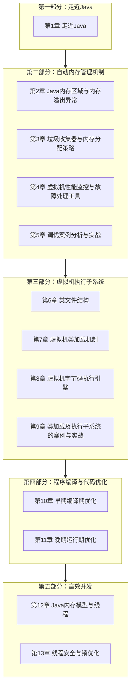
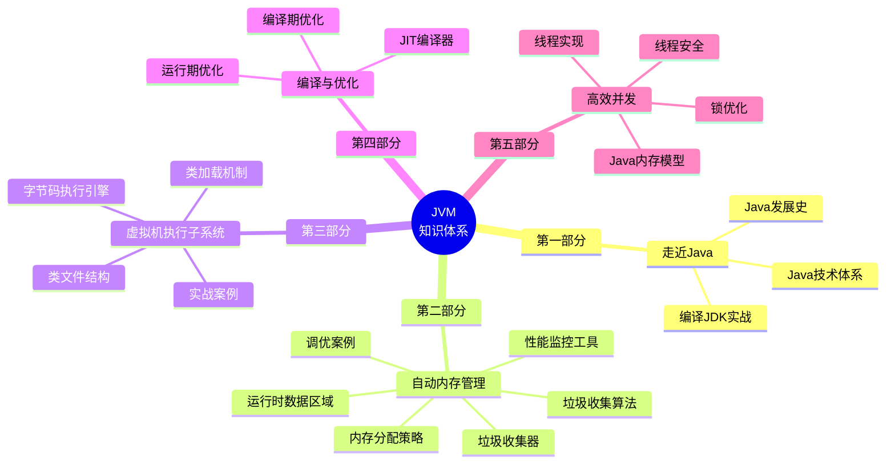
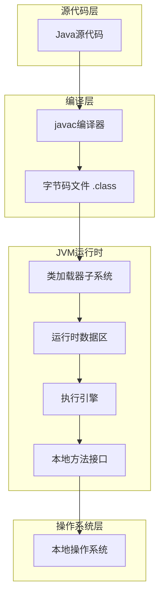
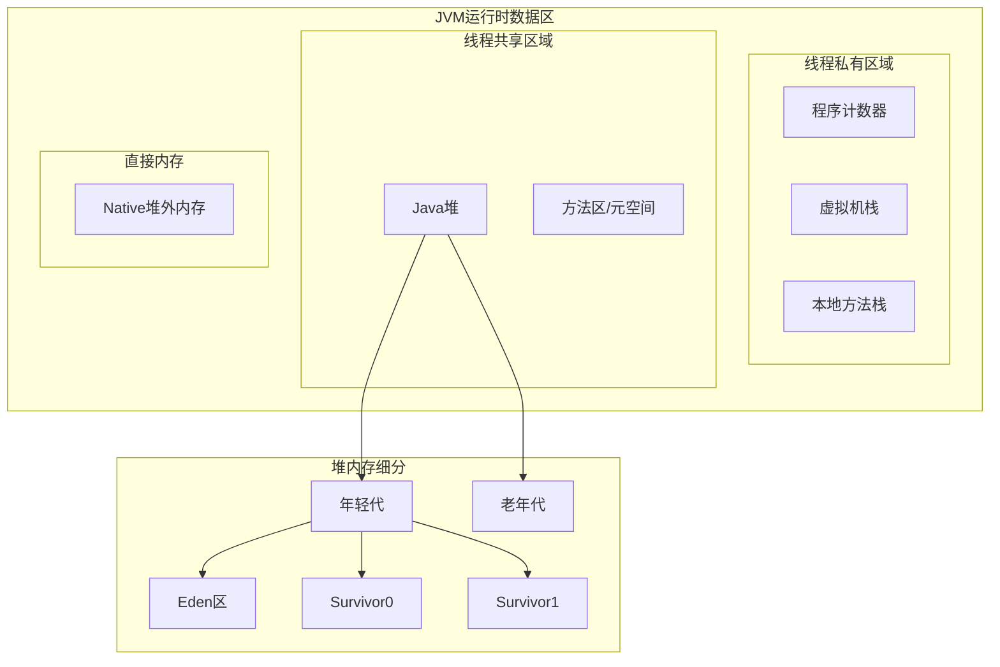
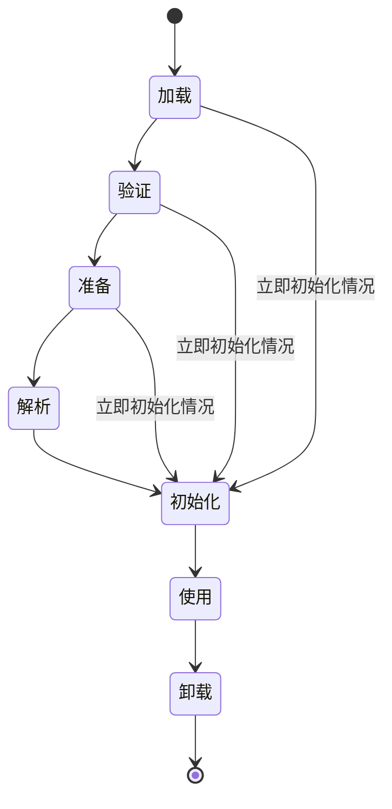
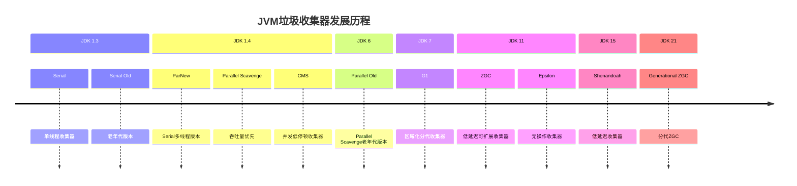
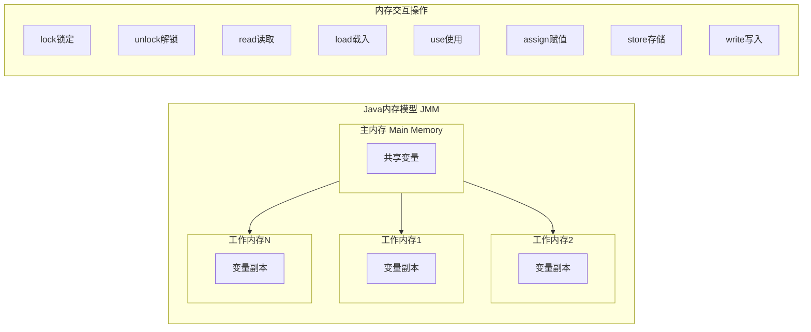

# JVM 深度解析

## 概述

Java 虚拟机（Java Virtual Machine，JVM）是 Java 平台的核心组件，它提供了 Java 程序的运行环境，实现了"一次编写，到处运行"（Write Once, Run Anywhere）的跨平台特性。

## 学习路径

本模块按照从基础到深入的顺序，系统地介绍 JVM 的核心知识，共分为五个部分：



## 知识体系结构



## 内容导航

### 第一部分：走近Java

| 章节 | 内容概述 |
|------|----------|
| [第1章 走近Java](./chapter-01-intro) | Java技术体系、发展史、未来展望、编译JDK实战 |

### 第二部分：自动内存管理机制

| 章节 | 内容概述 |
|------|----------|
| [第2章 Java内存区域与内存溢出异常](./chapter-02-memory) | 运行时数据区域详解、OutOfMemoryError异常实战 |
| [第3章 垃圾收集器与内存分配策略](./chapter-03-gc) | 垃圾回收算法、垃圾收集器对比、内存分配策略 |
| [第4章 虚拟机性能监控与故障处理工具](./chapter-04-tools) | JDK命令行工具(jps/jstat/jmap等)、可视化工具(JConsole/VisualVM) |
| [第5章 调优案例分析与实战](./chapter-05-tuning) | 调优案例分析、Eclipse运行速度调优实战 |

### 第三部分：虚拟机执行子系统

| 章节 | 内容概述 |
|------|----------|
| [第6章 类文件结构](./chapter-06-classfile) | Class文件结构、魔数、常量池、字段表、方法表、属性表 |
| [第7章 虚拟机类加载机制](./chapter-07-classloading) | 类加载时机、类加载过程、类加载器、双亲委派模型 |
| [第8章 虚拟机字节码执行引擎](./chapter-08-execution) | 运行时栈帧结构、方法调用、解释执行引擎 |
| [第9章 类加载及执行子系统的案例与实战](./chapter-09-cases) | Tomcat/OSGi类加载器架构、动态代理、远程执行功能实战 |

### 第四部分：程序编译与代码优化

| 章节 | 内容概述 |
|------|----------|
| [第10章 早期（编译期）优化](./chapter-10-compile-time) | Javac编译器、Java语法糖、注解处理器实战 |
| [第11章 晚期（运行期）优化](./chapter-11-runtime) | 即时编译器、编译优化技术、逃逸分析 |

### 第五部分：高效并发

| 章节 | 内容概述 |
|------|----------|
| [第12章 Java内存模型与线程](./chapter-12-jmm) | Java内存模型、volatile、线程实现与调度 |
| [第13章 线程安全与锁优化](./chapter-13-thread-safety) | 线程安全实现、锁优化技术(自旋锁/轻量级锁/偏向锁) |

## 核心知识点速览

### 1. JVM 整体架构



### 2. 运行时数据区



### 3. 类加载生命周期



### 4. 垃圾收集器演进



### 5. Java内存模型



## 快速开始

### 查看 JVM 版本

```bash
java -version
```

### 查看 JVM 参数

```bash
java -XX:+PrintFlagsFinal -version
```

### 常用监控命令

```bash
# 查看 JVM 进程
jps -l

# 查看堆内存使用情况
jmap -heap <pid>

# 查看 GC 情况
jstat -gc <pid> 1000

# 生成堆转储文件
jmap -dump:format=b,file=heap.hprof <pid>
```

## 推荐学习资源

- [官方 JVM 规范](https://docs.oracle.com/javase/specs/jvms/se17/html/)
- [深入理解 Java 虚拟机（周志明）](https://book.douban.com/subject/34907497/)
- [Java Performance: The Definitive Guide](https://www.oreilly.com/library/view/java-performance/9781449363512/)
