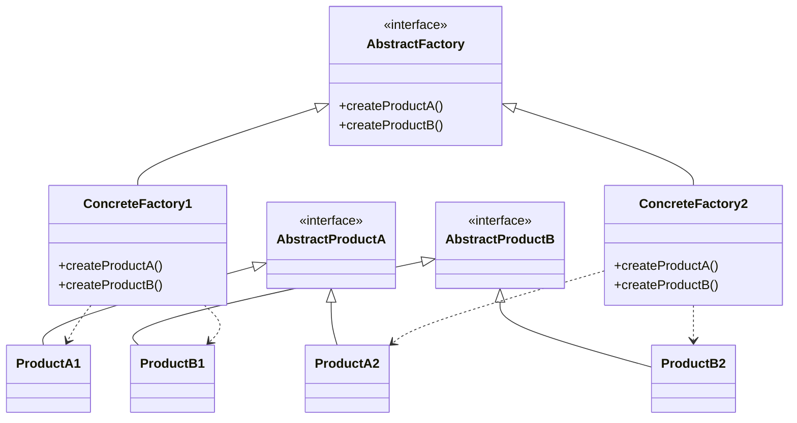

# 抽象工厂模式 (Abstract Factory Pattern)

> 提供一个创建一系列相关或相互依赖对象的接口，而无需指定它们具体的类

***

## 一、模式概述

### 1.1 定义

抽象工厂模式（Abstract Factory Pattern）是一种创建型设计模式，它提供了一个创建一系列相关或相互依赖对象的接口，而无需指定它们具体的类。

### 1.2 适用场景

- 系统需要独立于它的产品的创建、组合和表示时
- 系统需要由多个产品系列中的一个来配置时
- 需要强调一系列相关产品的接口，以便联合使用它们时
- 提供一个产品类库，而只想显示它们的接口而不是实现时

### 1.3 优缺点

| 优点 | 缺点 |
|------|------|
| 分离了具体的类 | 难以支持新种类的产品 |
| 使得易于交换产品系列 | 增加了系统的复杂度 |
| 有利于产品的一致性 | 需要额外的工厂类 |

***

## 二、实现结构

```
抽象工厂模式包含以下角色：
1. AbstractFactory（抽象工厂）：声明创建抽象产品对象的操作接口
2. ConcreteFactory（具体工厂）：实现创建具体产品对象的操作
3. AbstractProduct（抽象产品）：为一类产品对象声明接口
4. ConcreteProduct（具体产品）：定义具体工厂创建的具体产品对象
5. Client（客户端）：使用抽象工厂和抽象产品的类
```

***

## 三、类图



***

## 四、相关文档

- [代码指南](./02-abstract-factory-code-guide.md)
