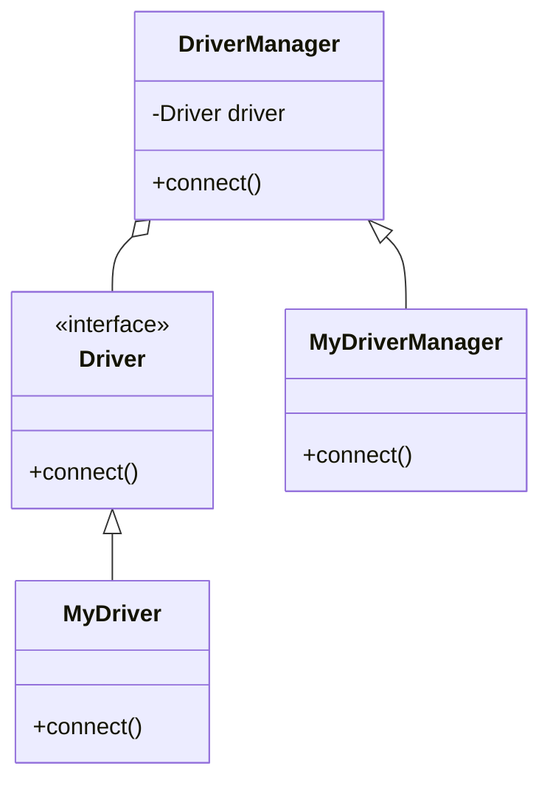

# 桥接模式 (Bridge Pattern)

> 将抽象部分与实现部分分离，使它们都可以独立地变化

***

## 一、模式概述

### 1.1 定义

桥接模式（Bridge Pattern）是一种结构型设计模式，它将抽象部分与实现部分分离，使它们都可以独立地变化。

### 1.2 适用场景

- 不希望在抽象和实现部分之间有一个固定的绑定关系
- 类的抽象以及它的实现都应该可以通过生成子类的方法加以扩充
- 对一个抽象的实现部分的修改应对客户不产生影响

### 1.3 优缺点

| 优点 | 缺点 |
|------|------|
| 分离抽象和实现 | 增加了系统的复杂度 |
| 提高了可扩展性 | 需要正确识别抽象和实现 |
| 符合开闭原则 | 增加了代码量 |

***

## 二、实现结构

```
桥接模式包含以下角色：
1. Abstraction（抽象化）：定义抽象类的接口，维护一个指向Implementor类型对象的指针
2. RefinedAbstraction（扩展抽象化）：扩展Abstraction类
3. Implementor（实现化）：定义实现类的接口
4. ConcreteImplementor（具体实现化）：实现Implementor接口
```

***

## 三、类图



***

## 四、相关文档

- [代码指南](./02-bridge-code-guide.md)
