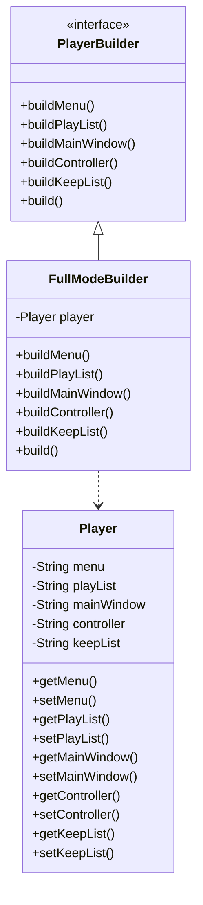

# 建造者模式 (Builder Pattern)

> 将一个复杂对象的构建与它的表示分离，使得同样的构建过程可以创建不同的表示

***

## 一、模式概述

### 1.1 定义

建造者模式（Builder Pattern）是一种创建型设计模式，它允许你分步骤创建复杂对象。该模式让你能够使用相同的创建代码生成不同类型和形式的对象。

### 1.2 适用场景

- 需要创建的对象具有复杂的内部结构
- 需要创建的对象内部属性相互依赖
- 对象的创建过程独立于组成部件
- 需要控制对象的创建过程

### 1.3 优缺点

| 优点 | 缺点 |
|------|------|
| 可以分步骤创建对象 | 增加了系统的复杂度 |
| 可以创建不同形式的对象 | 需要额外的建造者类 |
| 代码复用性好 | 产品发生变化时，建造者也需要修改 |
| 符合单一职责原则 | 增加了代码量 |

***

## 二、实现方式

### 2.1 传统建造者模式

```java
// 产品类
public class Player {
    private String menu;      // 菜单
    private String playList;  // 播放列表
    private String mainWindow; // 主窗口
    private String controller; // 控制条
    private String keepList;   // 收藏列表

    // 构造函数和getter/setter
    // ...
}

// 建造者接口
public interface PlayerBuilder {
    PlayerBuilder buildMenu(String menu);
    PlayerBuilder buildPlayList(String playList);
    PlayerBuilder buildMainWindow(String mainWindow);
    PlayerBuilder buildController(String controller);
    PlayerBuilder buildKeepList(String keepList);
    Player build();
}

// 具体建造者
public class FullModeBuilder implements PlayerBuilder {
    private Player player = new Player();

    @Override
    public PlayerBuilder buildMenu(String menu) {
        player.setMenu(menu);
        return this;
    }

    @Override
    public PlayerBuilder buildPlayList(String playList) {
        player.setPlayList(playList);
        return this;
    }

    @Override
    public PlayerBuilder buildMainWindow(String mainWindow) {
        player.setMainWindow(mainWindow);
        return this;
    }

    @Override
    public PlayerBuilder buildController(String controller) {
        player.setController(controller);
        return this;
    }

    @Override
    public PlayerBuilder buildKeepList(String keepList) {
        player.setKeepList(keepList);
        return this;
    }

    @Override
    public Player build() {
        return player;
    }
}
```

### 2.2 链式调用建造者

```java
public class Player {
    private String menu;
    private String playList;
    private String mainWindow;
    private String controller;
    private String keepList;

    private Player(Builder builder) {
        this.menu = builder.menu;
        this.playList = builder.playList;
        this.mainWindow = builder.mainWindow;
        this.controller = builder.controller;
        this.keepList = builder.keepList;
    }

    // 静态内部类建造者
    public static class Builder {
        private String menu;
        private String playList;
        private String mainWindow;
        private String controller;
        private String keepList;

        public Builder menu(String menu) {
            this.menu = menu;
            return this;
        }

        public Builder playList(String playList) {
            this.playList = playList;
            return this;
        }

        public Builder mainWindow(String mainWindow) {
            this.mainWindow = mainWindow;
            return this;
        }

        public Builder controller(String controller) {
            this.controller = controller;
            return this;
        }

        public Builder keepList(String keepList) {
            this.keepList = keepList;
            return this;
        }

        public Player build() {
            return new Player(this);
        }
    }
}
```

***

## 三、类图



***

## 四、相关文档

- [代码指南](./02-builder-code-guide.md)
