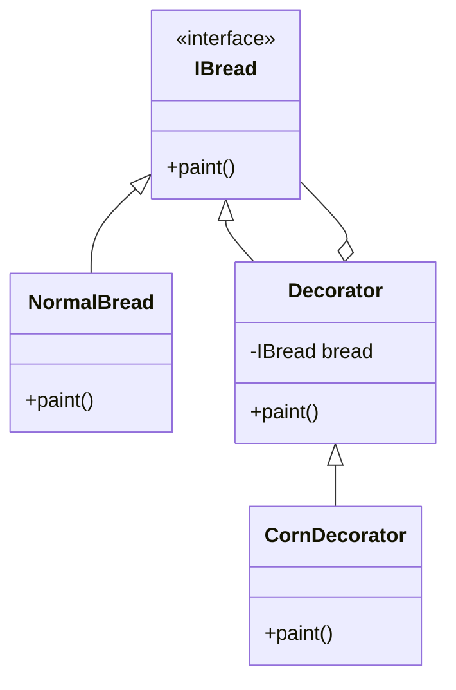

# 装饰器模式 (Decorator Pattern)

> 动态地给一个对象添加一些额外的职责

***

## 一、模式概述

### 1.1 定义

装饰器模式（Decorator Pattern）是一种结构型设计模式，它允许你通过将对象放入包含行为的特殊包装对象中来为原对象绑定新的行为。

### 1.2 适用场景

- 在不影响其他对象的情况下，以动态、透明的方式给单个对象添加职责
- 需要动态地给一个对象增加功能，这些功能可以再动态地撤销
- 当不能采用继承的方式对系统进行扩充或者采用继承不利于系统扩展和维护时

### 1.3 优缺点

| 优点 | 缺点 |
|------|------|
| 比继承更灵活 | 产生很多小对象 |
| 可以动态添加职责 | 排错困难 |
| 符合开闭原则 | 增加系统复杂度 |

***

## 二、实现结构

```
装饰器模式包含以下角色：
1. Component（抽象组件）：定义一个对象接口，可以给这些对象动态地添加职责
2. ConcreteComponent（具体组件）：定义一个对象，可以给这个对象添加一些职责
3. Decorator（抽象装饰类）：维持一个指向Component对象的引用，并定义一个与Component接口一致的接口
4. ConcreteDecorator（具体装饰类）：具体的装饰对象，给Component添加职责
```

***

## 三、类图



***

## 四、相关文档

- [代码指南](./02-decorator-code-guide.md)
