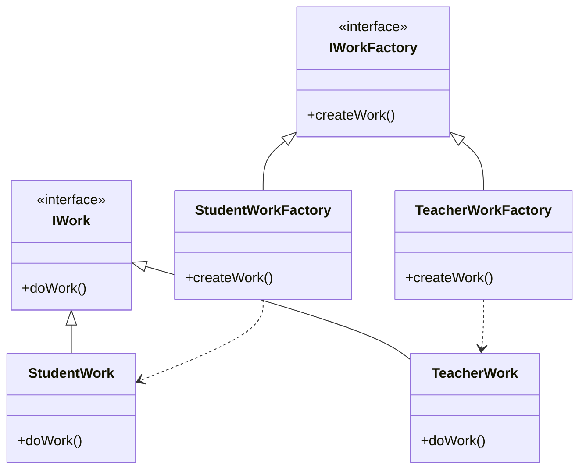

# 工厂模式 (Factory Pattern)

> 定义一个创建对象的接口，让子类决定实例化哪个类

***

## 一、模式概述

### 1.1 定义

工厂模式（Factory Pattern）是一种创建型设计模式，它定义了一个创建对象的接口，但由子类决定要实例化的类是哪一个。工厂方法让类的实例化推迟到子类。

### 1.2 适用场景

- 当一个类不知道它所必须创建的对象的类时
- 当一个类希望由它的子类来指定它所创建的对象时
- 当类将创建对象的职责委托给多个帮助子类中的某一个，并且你希望将哪一个帮助子类是代理者这一信息局部化时

### 1.3 优缺点

| 优点 | 缺点 |
|------|------|
| 解耦对象的创建和使用 | 增加了系统的复杂度 |
| 易于扩展，符合开闭原则 | 需要额外的工厂类 |
| 符合单一职责原则 | 增加了代码量 |

***

## 二、实现方式

### 2.1 简单工厂模式

```java
public class WorkManager {
    public static IWork getWork(String name) {
        if (name.equals("s")) {
            return new StudentWork();
        } else {
            return new TeacherWork();
        }
    }
}
```

**特点**：
- 一个工厂类负责创建所有产品
- 通过参数决定创建哪种产品
- 不符合开闭原则，新增产品需要修改工厂类

### 2.2 工厂方法模式

```java
// 产品接口
public interface IWork {
    void doWork();
}

// 具体产品
public class StudentWork implements IWork {
    @Override
    public void doWork() {
        System.out.println("学生做作业");
    }
}

public class TeacherWork implements IWork {
    @Override
    public void doWork() {
        System.out.println("老师批改作业");
    }
}

// 工厂接口
public interface IWorkFactory {
    IWork createWork();
}

// 具体工厂
public class StudentWorkFactory implements IWorkFactory {
    @Override
    public IWork createWork() {
        return new StudentWork();
    }
}

public class TeacherWorkFactory implements IWorkFactory {
    @Override
    public IWork createWork() {
        return new TeacherWork();
    }
}
```

**特点**：
- 每个产品对应一个工厂
- 符合开闭原则，新增产品只需新增工厂
- 增加了类的数量

***

## 三、类图



***

## 四、相关文档

- [代码指南](./02-factory-code-guide.md)
