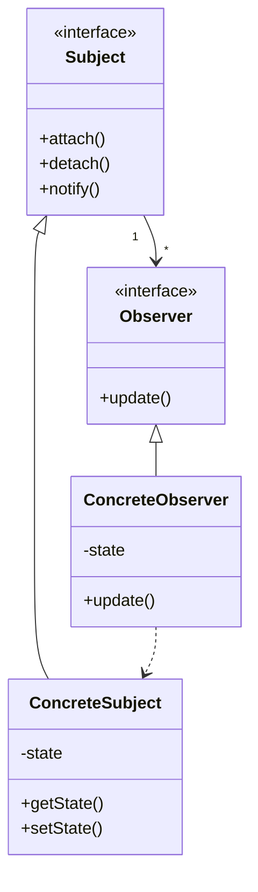

# 观察者模式 (Observer Pattern)

> 定义对象间的一对多依赖关系，当一个对象状态发生改变时，所有依赖于它的对象都得到通知并被自动更新

***

## 一、模式概述

### 1.1 定义

观察者模式（Observer Pattern）是一种行为型设计模式，它定义了对象之间的一对多依赖关系，当一个对象状态发生改变时，所有依赖于它的对象都得到通知并被自动更新。

### 1.2 适用场景

- 当一个对象的改变需要同时改变其他对象时
- 当一个对象必须通知其他对象，而它又不能假定其他对象是谁时
- 当一个抽象模型有两个方面，其中一个方面依赖于另一个方面时

### 1.3 优缺点

| 优点 | 缺点 |
|------|------|
| 松耦合 | 可能导致循环依赖 |
| 支持广播通信 | 通知顺序不确定 |
| 符合开闭原则 | 观察者过多时性能下降 |

***

## 二、实现结构

```
观察者模式包含以下角色：
1. Subject（主题）：知道它的观察者，提供注册和删除观察者的接口
2. Observer（观察者）：为那些在目标发生改变时需获得通知的对象定义一个更新接口
3. ConcreteSubject（具体主题）：将有关状态存入各ConcreteObserver对象
4. ConcreteObserver（具体观察者）：维护一个指向ConcreteSubject对象的引用，存储有关状态
```

***

## 三、类图



***

## 四、相关文档

- [代码指南](./02-observer-code-guide.md)
