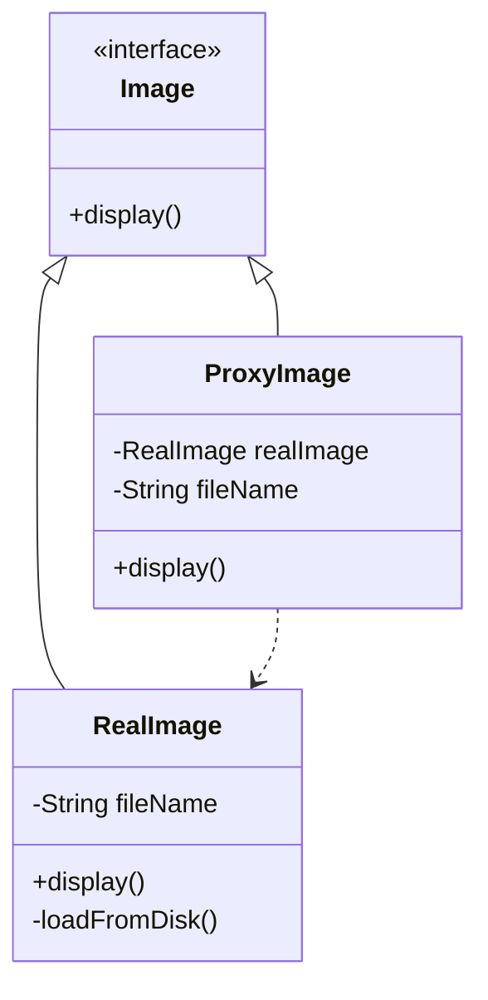

# 代理模式 (Proxy Pattern)

> 为其他对象提供一种代理以控制对这个对象的访问

***

## 一、模式概述

### 1.1 定义

代理模式（Proxy Pattern）是一种结构型设计模式，它为其他对象提供一种代理以控制对这个对象的访问。

### 1.2 适用场景

- 远程代理：为远程对象提供本地代表
- 虚拟代理：延迟创建开销大的对象
- 保护代理：控制对原始对象的访问权限
- 智能引用：在访问对象时执行额外操作

### 1.3 优缺点

| 优点 | 缺点 |
|------|------|
| 职责清晰 | 增加了系统的复杂度 |
| 高扩展性 | 增加了代理类 |
| 智能化 | 请求处理速度变慢 |

***

## 二、实现方式

### 2.1 静态代理

```java
// 接口
public interface Image {
    void display();
}

// 真实对象
public class RealImage implements Image {
    private String fileName;

    public RealImage(String fileName) {
        this.fileName = fileName;
        loadFromDisk();
    }

    private void loadFromDisk() {
        System.out.println("加载图片: " + fileName);
    }

    @Override
    public void display() {
        System.out.println("显示图片: " + fileName);
    }
}

// 代理对象
public class ProxyImage implements Image {
    private RealImage realImage;
    private String fileName;

    public ProxyImage(String fileName) {
        this.fileName = fileName;
    }

    @Override
    public void display() {
        if (realImage == null) {
            realImage = new RealImage(fileName);
        }
        realImage.display();
    }
}
```

### 2.2 动态代理（JDK）

```java
import java.lang.reflect.InvocationHandler;
import java.lang.reflect.Method;
import java.lang.reflect.Proxy;

public class DynamicProxy implements InvocationHandler {
    private Object target;

    public Object bind(Object target) {
        this.target = target;
        return Proxy.newProxyInstance(
            target.getClass().getClassLoader(),
            target.getClass().getInterfaces(),
            this
        );
    }

    @Override
    public Object invoke(Object proxy, Method method, Object[] args) throws Throwable {
        System.out.println("方法调用前");
        Object result = method.invoke(target, args);
        System.out.println("方法调用后");
        return result;
    }
}
```

***

## 三、类图



***

## 四、相关文档

- [代码指南](./02-proxy-code-guide.md)
