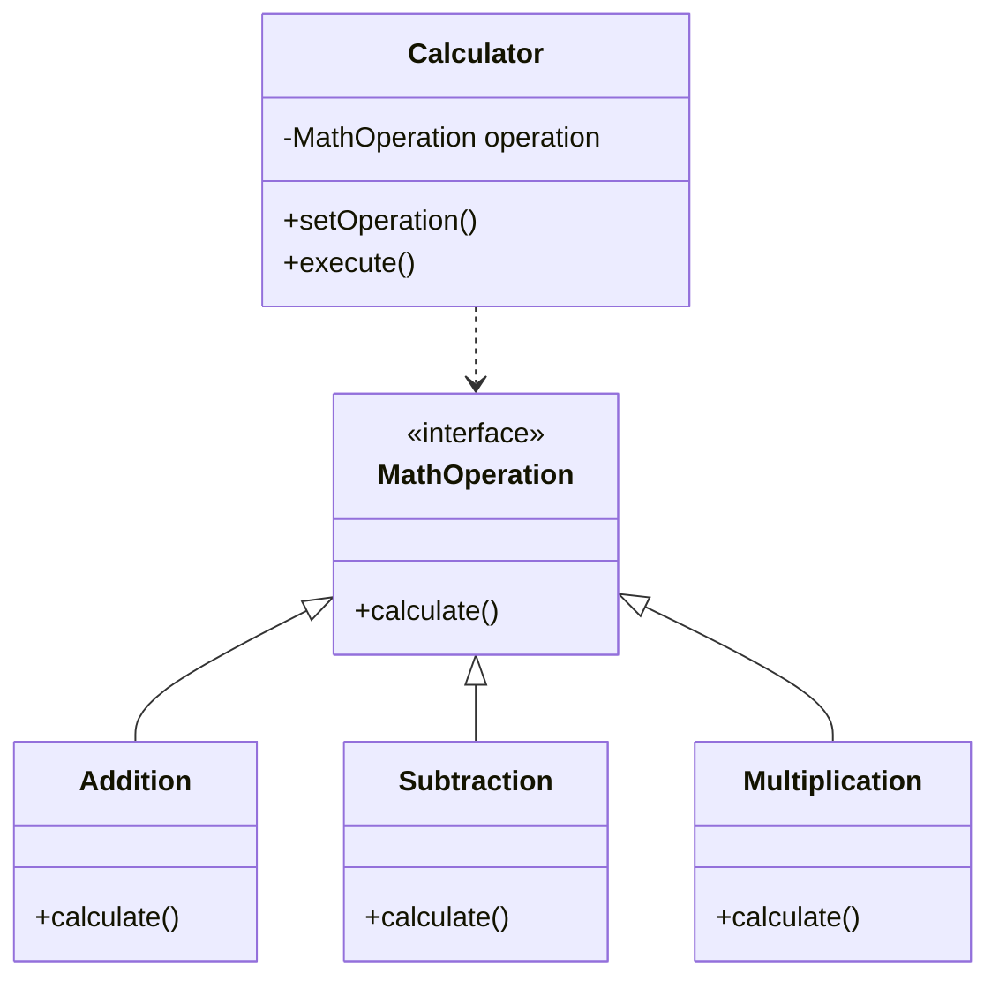

# 策略模式 (Strategy Pattern)

> 定义一系列算法，把它们一个个封装起来，并且使它们可相互替换

***

## 一、模式概述

### 1.1 定义

策略模式（Strategy Pattern）是一种行为型设计模式，它定义了一系列算法，并将每个算法封装起来，使它们可以相互替换。策略模式让算法的变化独立于使用算法的客户。

### 1.2 适用场景

- 需要在不同时间应用不同的业务规则或算法
- 需要隐藏复杂的、与算法相关的数据结构
- 一个类定义了多种行为，并且这些行为以多个条件语句的形式出现

### 1.3 优缺点

| 优点 | 缺点 |
|------|------|
| 算法可以自由切换 | 策略类数量增多 |
| 避免使用多重条件判断 | 所有策略类都需要对外暴露 |
| 扩展性良好 | 增加了系统的复杂度 |

***

## 二、实现结构

```
策略模式包含以下角色：
1. Strategy（策略）：定义所有支持的算法的公共接口
2. ConcreteStrategy（具体策略）：封装了具体的算法或行为
3. Context（上下文）：用一个ConcreteStrategy来配置，维护一个对Strategy对象的引用
```

***

## 三、类图



***

## 四、相关文档

- [代码指南](./02-strategy-code-guide.md)
