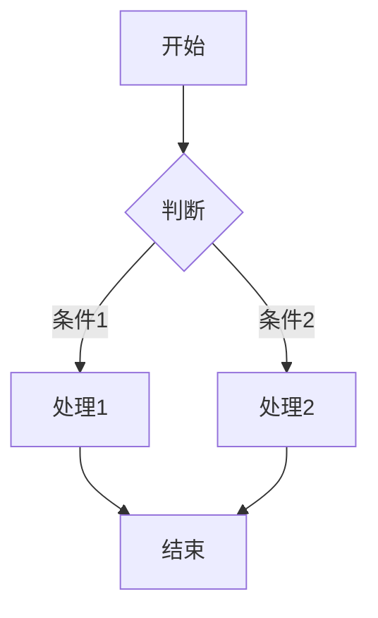
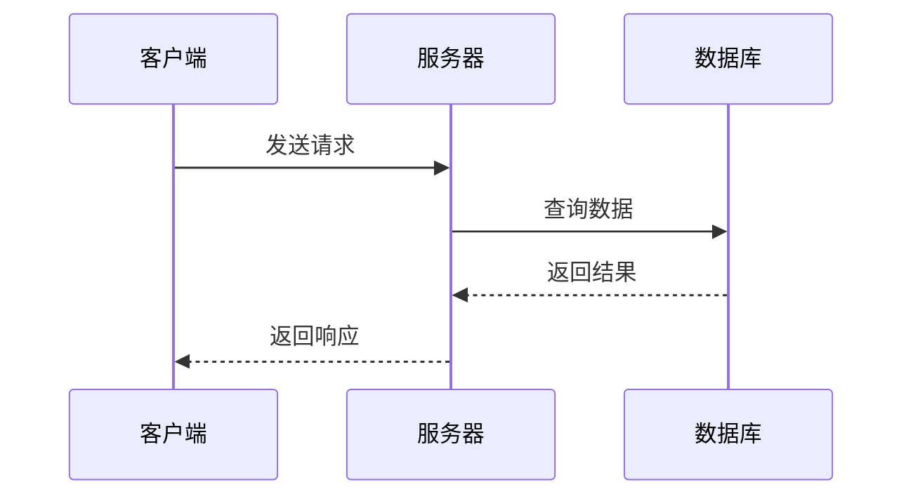
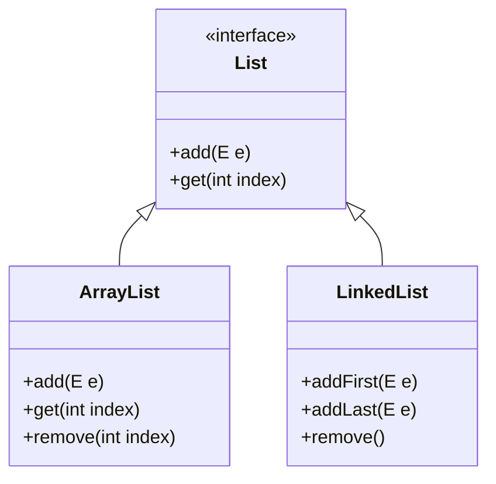
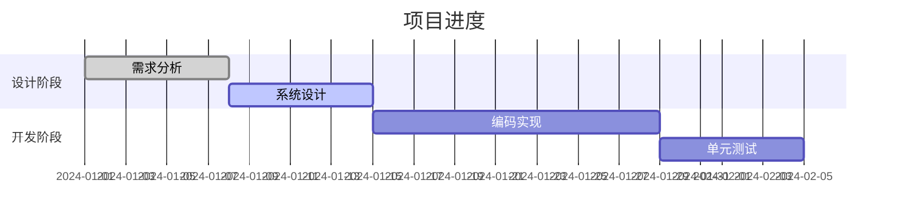
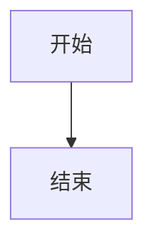

# 流程图示例

本文档展示如何在 VitePress 中使用 Mermaid 流程图。

## 流程图示例



## 时序图示例



## 类图示例



## 甘特图示例



## 使用方法

在 Markdown 中使用以下语法：

````markdown

````

支持的图表类型：
- `graph` - 流程图
- `sequenceDiagram` - 时序图
- `classDiagram` - 类图
- `gantt` - 甘特图
- `pie` - 饼图
- `flowchart` - 流程图（新版）
