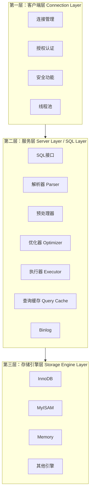

# 第1章 MySQL架构与历史 - 面试题总结

> 基于MySQL逻辑架构、连接管理、并发控制等核心知识点的面试题汇总

---

## 一、基础架构类

### 1. 说说MySQL的整体架构？

**答案**：

MySQL的逻辑架构主要分为三层：



**各层职责**：

| 层级 | 主要职责 | 核心组件 |
|------|---------|---------|
| **客户端层** | 连接管理、身份认证、安全 | 连接管理器、线程管理器、认证模块 |
| **服务层** | SQL解析、优化、执行、权限检查 | 解析器、优化器、执行器、查询缓存 |
| **存储引擎层** | 数据存储和提取 | InnoDB、MyISAM、Memory等 |

---

### 2. 一条SQL语句在MySQL中是如何执行的？

**答案**：

以 `SELECT * FROM users WHERE id = 1` 为例：

```
┌─────────────────────────────────────────────────────────────┐
│  1. 连接器（Connector）                                       │
│     - TCP握手、身份认证、权限验证                               │
│     - 建立连接，分配线程                                        │
├─────────────────────────────────────────────────────────────┤
│  2. 查询缓存（Query Cache）【MySQL 8.0已移除】                  │
│     - 检查SQL是否命中缓存                                       │
│     - 命中则直接返回结果                                        │
├─────────────────────────────────────────────────────────────┤
│  3. 解析器（Parser）                                          │
│     - 词法分析：将SQL拆分为Token                                 │
│     - 语法分析：构建解析树（Parse Tree）                         │
├─────────────────────────────────────────────────────────────┤
│  4. 预处理器（Preprocessor）                                   │
│     - 语义检查：表、列是否存在                                   │
│     - 权限验证：用户是否有操作权限                                │
├─────────────────────────────────────────────────────────────┤
│  5. 优化器（Optimizer）                                       │
│     - 生成多种执行方案                                          │
│     - 基于成本模型选择最优方案                                    │
│     - 输出执行计划（Execution Plan）                            │
├─────────────────────────────────────────────────────────────┤
│  6. 执行器（Executor）                                        │
│     - 调用存储引擎API执行查询                                    │
│     - 过滤、排序、聚合等处理                                     │
├─────────────────────────────────────────────────────────────┤
│  7. 存储引擎（Storage Engine）                                 │
│     - InnoDB：从Buffer Pool或磁盘读取数据                        │
│     - 返回数据给执行器                                          │
├─────────────────────────────────────────────────────────────┤
│  8. 返回结果                                                  │
│     - 执行器将结果返回给客户端                                   │
└─────────────────────────────────────────────────────────────┘
```

---

### 3. MySQL 8.0为什么移除了查询缓存？

**答案**：

**查询缓存的问题**：

| 问题 | 说明 |
|------|------|
| **命中率低** | 表有任何更新，相关缓存全部失效 |
| **并发瓶颈** | 失效操作需要全局锁保护，高并发下性能差 |
| **内存碎片** | 变长Block机制导致内存碎片严重 |
| **维护成本高** | 每次查询前需检查缓存，增加开销 |

**替代方案**：
- 应用层缓存（Redis、Caffeine）
- 数据库连接池
- 更高效的查询优化器

---

## 二、连接管理类

### 4. MySQL的连接方式有哪些？长连接和短连接有什么区别？

**答案**：

**连接方式**：

| 连接类型 | 说明 | 适用场景 |
|---------|------|---------|
| **TCP/IP** | 通过网络连接，最常用 | 远程连接、应用连接 |
| **Unix Socket** | 本地套接字，性能更好 | 本地连接 |
| **Named Pipe** | Windows命名管道 | Windows环境 |
| **Shared Memory** | 共享内存，速度最快 | 同机多进程 |

**长连接 vs 短连接**：

| 特性 | 长连接 | 短连接 |
|------|--------|--------|
| **连接保持** | 执行完SQL后保持连接 | 执行完立即关闭 |
| **性能** | 减少连接开销 | 频繁创建/关闭连接 |
| **资源占用** | 占用连接数 | 占用少 |
| **内存问题** | 可能导致OOM | 无内存累积问题 |

**长连接OOM问题解决方案**：
```sql
-- MySQL 5.7+ 重置连接状态
mysql_reset_connection;

-- 或定期断开重连
-- 设置wait_timeout控制空闲连接超时
SET GLOBAL wait_timeout = 28800;  -- 8小时
```

---

### 5. MySQL连接池的作用是什么？

**答案**：

**连接池的作用**：

1. **减少连接开销**：避免频繁创建/销毁连接
2. **提高响应速度**：复用已有连接
3. **资源管理**：控制最大连接数
4. **连接监控**：检测失效连接

**常用连接池**：

| 连接池 | 语言 | 特点 |
|--------|------|------|
| **HikariCP** | Java | 性能最好，轻量级 |
| **Druid** | Java | 功能丰富，带监控 |
| **pymysql连接池** | Python | Python常用 |
| **go-sql-driver** | Go | Go标准库 |

**连接池关键参数**：
```properties
# 最小空闲连接数
minimumIdle=10

# 最大连接数
maximumPoolSize=50

# 连接超时时间
connectionTimeout=30000

# 空闲连接超时
idleTimeout=600000
```

---

### 6. 如何查看MySQL当前连接状态？

**答案**：

```sql
-- 查看当前连接
SHOW PROCESSLIST;

-- 查看连接统计
SHOW STATUS LIKE 'Threads_%';
SHOW STATUS LIKE 'Connections';
SHOW STATUS LIKE 'Max_used_connections';

-- 查看连接变量
SHOW VARIABLES LIKE 'max_connections';
SHOW VARIABLES LIKE 'wait_timeout';
SHOW VARIABLES LIKE 'interactive_timeout';
```

**常见连接状态**：

| 状态 | 说明 |
|------|------|
| **Sleep** | 空闲，等待客户端发送请求 |
| **Query** | 正在执行查询 |
| **Locked** | 等待表锁 |
| **Analyzing** | 分析统计信息 |
| **Copying to tmp table** | 复制数据到临时表 |
| **Sending data** | 发送结果给客户端 |

---

## 三、解析与优化类

### 7. 解析器的作用是什么？词法分析和语法分析有什么区别？

**答案**：

**解析器的作用**：
1. **词法分析**：将SQL字符串拆分为Token
2. **语法分析**：检查SQL语法，构建解析树

**词法分析 vs 语法分析**：

| 阶段 | 输入 | 输出 | 检查内容 |
|------|------|------|---------|
| **词法分析** | SQL字符串 | Token列表 | 关键字、标识符、操作符 |
| **语法分析** | Token列表 | 解析树 | SQL语法规则 |

**示例**：
```sql
SELECT name FROM users WHERE id = 1;
```

**词法分析结果**：
```
[SELECT, *, FROM, users, WHERE, id, =, 1, ;]
```

**语法分析结果（解析树）**：
```
        SELECT
       /      \
     *        FROM
              /   \
          users   WHERE
                    |
                   =
                  / \
                id   1
```

---

### 8. 优化器是如何选择执行计划的？

**答案**：

**优化器工作流程**：

1. **生成候选方案**：根据索引、统计信息生成多种执行方案
2. **成本估算**：计算每种方案的代价（I/O + CPU）
3. **选择最优方案**：选择成本最低的方案

**成本模型**：

| 成本类型 | 说明 | 影响因素 |
|---------|------|---------|
| **I/O成本** | 读取数据页的代价 | 数据量、索引覆盖度 |
| **CPU成本** | 处理数据的代价 | 计算复杂度、排序 |
| **内存成本** | 使用内存的代价 | 临时表、排序缓冲区 |

**优化策略**：

| 策略 | 说明 |
|------|------|
| **索引选择** | 选择最优索引或全表扫描 |
| **JOIN顺序** | 小表驱动大表 |
| **JOIN算法** | Nested Loop、Hash Join、Sort Merge |
| **查询重写** | 子查询转JOIN、条件简化 |

**查看执行计划**：
```sql
EXPLAIN SELECT * FROM users WHERE id = 1;

-- 查看成本
SHOW STATUS LIKE 'Last_query_cost';
```

---

### 9. 什么情况下优化器会选择全表扫描而不是索引？

**答案**：

**选择全表扫描的场景**：

| 场景 | 说明 |
|------|------|
| **数据量小** | 表数据很少，全表扫描更快 |
| **索引选择性差** | 索引列重复度高（如性别字段） |
| **查询大量数据** | 需要返回表中大部分数据 |
| **索引失效** | 使用了函数、类型转换等 |
| **统计信息不准** | 优化器误判索引效果 |

**示例**：
```sql
-- 索引选择性差的例子
-- 假设gender列只有'M'和'F'两个值
SELECT * FROM users WHERE gender = 'M';  -- 可能走全表扫描

-- 查询大量数据
SELECT * FROM orders WHERE create_time > '2020-01-01';  -- 可能走全表扫描
```

---

## 四、存储引擎类

### 10. MySQL有哪些存储引擎？各有什么特点？

**答案**：

**常见存储引擎对比**：

| 特性 | InnoDB | MyISAM | Memory |
|------|--------|--------|--------|
| **事务支持** | ✅ 支持 | ❌ 不支持 | ❌ 不支持 |
| **行级锁** | ✅ 支持 | ❌ 表级锁 | ❌ 表级锁 |
| **外键** | ✅ 支持 | ❌ 不支持 | ❌ 不支持 |
| **崩溃恢复** | ✅ 支持 | ❌ 不支持 | ❌ 不支持 |
| **全文索引** | ✅ 5.6+支持 | ✅ 支持 | ❌ 不支持 |
| **适用场景** | 事务处理 | 读多写少 | 临时数据 |

**其他存储引擎**：
- **Archive**：归档存储，高压缩比
- **CSV**：CSV文件存储
- **Blackhole**：写入即丢弃，用于复制
- **Federated**：访问远程MySQL服务器

---

### 11. 为什么InnoDB成为MySQL默认存储引擎？

**答案**：

**InnoDB的优势**：

1. **事务支持**：ACID特性，保证数据一致性
2. **行级锁**：高并发场景性能好
3. **MVCC**：多版本并发控制，读写不阻塞
4. **崩溃恢复**：Redo Log保证数据不丢失
5. **外键支持**：保证数据完整性

**MyISAM的缺陷**：
- 不支持事务
- 表级锁，并发性能差
- 崩溃后数据易损坏

---

### 12. 如何选择合适的存储引擎？

**答案**：

**选择策略**：

| 场景 | 推荐引擎 | 原因 |
|------|---------|------|
| **OLTP业务** | InnoDB | 事务、行级锁、高并发 |
| **读多写少** | MyISAM | 表级锁开销小，查询快 |
| **临时数据** | Memory | 内存操作，速度极快 |
| **日志归档** | Archive | 高压缩比，节省空间 |
| **数据仓库** | Column Store | 列式存储，分析性能好 |

**现代建议**：
- MySQL 5.5+ 默认使用InnoDB
- 除非特殊需求，否则优先选择InnoDB
- MySQL 8.0中MyISAM已逐渐被淘汰

---

## 五、并发控制类

### 13. MySQL的锁有哪些类型？

**答案**：

**锁的分类**：

```
MySQL锁
├── 按粒度分
│   ├── 表级锁（Table Lock）
│   ├── 页级锁（Page Lock）
│   └── 行级锁（Row Lock）
│
├── 按功能分
│   ├── 共享锁（S锁 / 读锁）
│   └── 排他锁（X锁 / 写锁）
│
└── InnoDB行级锁
    ├── 记录锁（Record Lock）
    ├── 间隙锁（Gap Lock）
    └── 临键锁（Next-Key Lock）
```

**锁的兼容性**：

|  | S锁 | X锁 |
|--|-----|-----|
| **S锁** | 兼容 | 冲突 |
| **X锁** | 冲突 | 冲突 |

---

### 14. 什么是MVCC？InnoDB如何实现MVCC？

**答案**：

**MVCC（多版本并发控制）**：
- 通过保存数据的历史版本实现并发控制
- 读操作不加锁，提高并发性能
- 写操作创建新版本，不影响读操作

**InnoDB实现机制**：

1. **隐藏列**：
   - `DB_TRX_ID`：最后修改事务ID
   - `DB_ROLL_PTR`：回滚指针

2. **Undo Log**：保存数据历史版本

3. **Read View**：决定事务可见的数据版本

**MVCC与隔离级别**：

| 隔离级别 | MVCC行为 |
|---------|---------|
| READ UNCOMMITTED | 不生成Read View，直接读最新 |
| READ COMMITTED | 每次查询生成新Read View |
| REPEATABLE READ | 事务开始时生成Read View |
| SERIALIZABLE | 不使用MVCC，全部加锁 |

---

### 15. 什么是死锁？如何排查和解决死锁？

**答案**：

**死锁产生条件**：
1. 互斥条件
2. 请求与保持条件
3. 不剥夺条件
4. 循环等待条件

**死锁示例**：
```sql
-- 事务A
BEGIN;
UPDATE accounts SET balance = balance - 100 WHERE id = 1;  -- 锁id=1
UPDATE accounts SET balance = balance + 100 WHERE id = 2;  -- 等待id=2

-- 事务B
BEGIN;
UPDATE accounts SET balance = balance - 100 WHERE id = 2;  -- 锁id=2
UPDATE accounts SET balance = balance + 100 WHERE id = 1;  -- 等待id=1（死锁）
```

**排查死锁**：
```sql
-- 查看死锁日志
SHOW ENGINE INNODB STATUS;

-- 开启死锁监控
SET GLOBAL innodb_print_all_deadlocks = ON;

-- 查看最近死锁
SELECT * FROM information_schema.INNODB_TRX;
SELECT * FROM information_schema.INNODB_LOCKS;
SELECT * FROM information_schema.INNODB_LOCK_WAITS;
```

**解决死锁**：
1. **按固定顺序访问资源**
2. **减少事务大小**
3. **使用合适的索引**（减少锁范围）
4. **设置超时**：`innodb_lock_wait_timeout`

---

## 六、性能优化类

### 16. 如何优化MySQL的连接性能？

**答案**：

**连接优化策略**：

| 优化点 | 具体措施 |
|--------|---------|
| **使用连接池** | HikariCP、Druid等 |
| **控制连接数** | 设置合理的max_connections |
| **及时释放连接** | 设置wait_timeout |
| **避免长事务** | 减少连接占用时间 |
| **使用线程池** | 启用thread_handling=pool-of-threads |

**关键参数**：
```ini
[mysqld]
# 最大连接数
max_connections = 500

# 空闲连接超时
wait_timeout = 28800
interactive_timeout = 28800

# 连接错误限制
max_connect_errors = 100

# 线程缓存
thread_cache_size = 100
```

---

### 17. 如何查看和优化慢查询？

**答案**：

**开启慢查询日志**：
```ini
[mysqld]
slow_query_log = ON
slow_query_log_file = /var/log/mysql/slow.log
long_query_time = 2  # 超过2秒的查询
log_queries_not_using_indexes = ON
```

**分析慢查询**：
```sql
-- 查看慢查询日志
SELECT * FROM mysql.slow_log;

-- 使用mysqldumpslow分析
mysqldumpslow -s t /var/log/mysql/slow.log

-- 使用pt-query-digest分析
pt-query-digest /var/log/mysql/slow.log
```

**优化策略**：
1. 添加合适的索引
2. 优化SQL语句
3. 优化表结构
4. 调整配置参数

---

## 七、综合场景类

### 18. 线上MySQL连接数突然暴涨，如何处理？

**答案**：

**排查步骤**：

1. **查看当前连接**：
```sql
SHOW PROCESSLIST;
SELECT * FROM information_schema.PROCESSLIST;
```

2. **分析连接来源**：
```sql
-- 按用户统计连接
SELECT USER, COUNT(*) FROM information_schema.PROCESSLIST 
GROUP BY USER;

-- 按状态统计
SELECT COMMAND, COUNT(*) FROM information_schema.PROCESSLIST 
GROUP BY COMMAND;
```

3. **常见原因及处理**：

| 原因 | 现象 | 处理方案 |
|------|------|---------|
| **慢查询** | 大量Query状态 | 优化SQL，添加索引 |
| **连接泄漏** | 大量Sleep状态 | 检查应用代码，及时关闭连接 |
| **缓存失效** | 大量Sending data | 增加缓存，优化查询 |
| **锁等待** | 大量Locked状态 | 优化事务，减少锁竞争 |

4. **紧急处理**：
```sql
-- 杀掉慢查询
KILL query_id;

-- 临时增加连接数
SET GLOBAL max_connections = 1000;
```

---

### 19. MySQL主从复制延迟大，可能是什么原因？

**答案**：

**延迟原因分析**：

| 原因 | 说明 | 解决方案 |
|------|------|---------|
| **主库写入压力大** | 主库TPS过高 | 分库分表，降低单库压力 |
| **从库性能差** | 从库硬件配置低 | 升级从库硬件 |
| **大事务** | 单个事务修改大量数据 | 拆分大事务 |
| **锁竞争** | 从库有查询导致锁等待 | 读写分离，从库只读 |
| **网络延迟** | 主从网络不稳定 | 优化网络，就近部署 |
| **单线程复制** | 5.6之前版本限制 | 升级到5.7+，启用并行复制 |

**查看复制延迟**：
```sql
-- 从库执行
SHOW SLAVE STATUS\G

-- 关注字段
Seconds_Behind_Master  -- 延迟秒数
```

---

### 20. 如何设计一个高可用的MySQL架构？

**答案**：

**高可用架构方案**：

```
┌─────────────────────────────────────────┐
│           负载均衡层（LVS/HAProxy）        │
│              VIP: 192.168.1.100          │
└─────────────────────────────────────────┘
                   │
    ┌──────────────┼──────────────┐
    ↓              ↓              ↓
┌────────┐    ┌────────┐    ┌────────┐
│  Master │───→│ Slave1 │    │ Slave2 │
│  主库   │    │  从库  │    │  从库  │
└────────┘    └────────┘    └────────┘
     │
     ↓
┌────────────┐
│  半同步复制  │
│  备份服务器  │
└────────────┘
```

**高可用组件**：

| 组件 | 功能 | 常用方案 |
|------|------|---------|
| **负载均衡** | 流量分发 | LVS、HAProxy、F5 |
| **故障检测** | 检测主库状态 | MHA、Orchestrator、MGR |
| **自动切换** | 主库故障自动切换 | MHA、Keepalived |
| **数据备份** | 数据安全 | XtraBackup、mysqldump |

**MGR（MySQL Group Replication）**：
- 官方高可用方案
- 支持多主复制
- 自动故障检测和切换
- 数据强一致性

---

## 面试技巧总结

### 回答结构建议

1. **概念定义**：先给出清晰的定义
2. **原理讲解**：解释底层实现机制
3. **对比分析**：与其他技术对比
4. **使用场景**：说明适用场景
5. **实践经验**：结合实际案例

### 高频考点组合

**组合1：架构 + 执行流程 + 优化器**
- 必考组合，建议连贯掌握

**组合2：存储引擎 + 锁 + MVCC**
- 并发核心，深入理解InnoDB

**组合3：连接管理 + 性能优化 + 高可用**
- 运维必备，结合实际场景

---

*文档整理时间：2026-03-30*  
*参考资料：《高性能MySQL》、MySQL官方文档、互联网面试题汇总*
