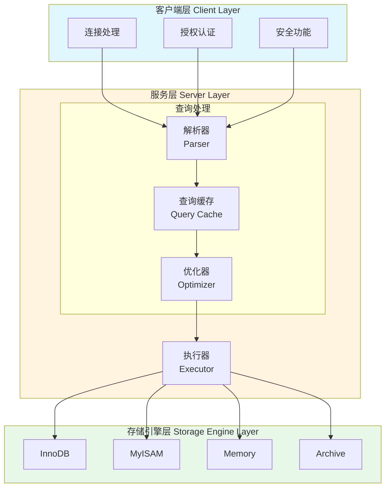

# 1.1 MySQL 逻辑架构

## 概述

MySQL 服务器采用了分层架构设计，将不同的功能模块清晰地分离，使得系统具有良好的可扩展性和可维护性。理解 MySQL 的逻辑架构对于数据库优化和问题排查至关重要。

## MySQL 逻辑架构图



## 三层架构详解

### 第一层：客户端层（Client Layer）

客户端层负责处理与客户端的连接、授权认证、安全等功能。

**主要职责**：
- 处理客户端连接请求
- 验证用户身份和权限
- 维护连接状态
- 处理安全相关的功能（SSL 加密等）

**特点**：
- 每个客户端连接都会在服务器进程中拥有一个线程
- 服务器会负责缓存线程，不需要为每个新建连接创建或销毁线程
- 连接处理是 MySQL 架构中最上层的功能

---

## 1.1.1 连接管理与安全性

### 连接管理

#### 连接建立过程

```
客户端请求连接
      ↓
服务器监听端口（默认3306）
      ↓
创建新线程处理连接
      ↓
进行身份验证
      ↓
验证通过，建立连接
```

#### 连接处理方式

| 特性 | 说明 |
|------|------|
| **线程模型** | 每个连接一个线程（One-Thread-Per-Connection） |
| **线程缓存** | 服务器缓存线程，避免频繁创建销毁 |
| **最大连接数** | 由 `max_connections` 参数控制 |
| **连接超时** | 空闲连接超时由 `wait_timeout` 控制 |

#### 连接状态

使用 `SHOW PROCESSLIST` 可以查看当前连接状态：

```sql
SHOW PROCESSLIST;
```

常见状态：
- **Sleep**：线程正在等待客户端发送新请求
- **Query**：线程正在执行查询或正在发送结果给客户端
- **Locked**：线程正在等待表锁释放
- **Analyzing and statistics**：线程正在收集存储引擎的统计信息
- **Copying to tmp table**：线程正在处理查询，将结果复制到临时表

### 安全性

#### 认证机制

**身份验证流程**：
1. 客户端发送连接请求，包含用户名和来源主机
2. 服务器查询 `mysql.user` 表验证用户
3. 使用密码插件进行密码验证
4. 验证通过，建立连接；验证失败，返回错误

#### 权限系统

MySQL 的权限系统基于 **用户 + 主机** 的组合：

```sql
-- 创建用户
CREATE USER 'username'@'host' IDENTIFIED BY 'password';

-- 授权
GRANT SELECT, INSERT ON database.table TO 'username'@'host';
```

**权限层级**：

| 层级 | 说明 | 示例 |
|------|------|------|
| **全局权限** | 影响整个 MySQL 服务器 | `GRANT ALL ON *.*` |
| **数据库权限** | 影响特定数据库 | `GRANT SELECT ON db.*` |
| **表权限** | 影响特定表 | `GRANT INSERT ON db.table` |
| **列权限** | 影响特定列 | `GRANT SELECT(col) ON db.table` |
| **存储程序权限** | 影响存储过程和函数 | `GRANT EXECUTE ON PROCEDURE` |

#### SSL 加密连接

```sql
-- 查看是否支持 SSL
SHOW VARIABLES LIKE 'have_ssl';

-- 强制使用 SSL 连接
REQUIRE SSL;
```

---

## 1.1.2 优化与执行

### 查询执行流程

```
┌──────────┐    ┌──────────┐    ┌──────────┐    ┌──────────┐
│  查询请求  │ → │  查询缓存  │ → │  解析器   │ → │  预处理器  │
└──────────┘    └──────────┘    └──────────┘    └──────────┘
                                                  ↓
┌──────────┐    ┌──────────┐    ┌──────────┐    ┌──────────┐
│  返回结果  │ ← │  执行引擎  │ ← │  执行计划  │ ← │  优化器   │
└──────────┘    └──────────┘    └──────────┘    └──────────┘
```

### 查询缓存（Query Cache）

> ⚠️ **注意**：MySQL 5.7 中查询缓存已被标记为废弃，MySQL 8.0 中已完全移除。

#### 工作原理

```
查询请求
    ↓
解析 SQL
    ↓
生成 Hash 值（基于 SQL 文本）
    ↓
查询缓存中查找
    ↓
命中 → 直接返回结果
未命中 → 执行查询 → 缓存结果 → 返回结果
```

#### 缓存失效

查询缓存的失效策略较为简单直接：
- **表数据变更**：任何对表的 INSERT、UPDATE、DELETE 操作都会使该表相关的所有缓存失效
- **内存不足**：LRU 算法淘汰旧缓存

#### 适用场景与局限性

| 适用场景 | 不适用场景 |
|---------|-----------|
| 读多写少的应用 | 写操作频繁的应用 |
| 静态数据查询 | 频繁更新的表 |
| 重复查询多的场景 | 查询结果集很大的场景 |

### 解析器（Parser）

#### 词法分析

将 SQL 字符串分解为一个个的 Token：

```sql
SELECT * FROM users WHERE id = 1;
```

分解为：
- `SELECT`（关键字）
- `*`（通配符）
- `FROM`（关键字）
- `users`（标识符）
- `WHERE`（关键字）
- `id`（标识符）
- `=`（操作符）
- `1`（数值）

#### 语法分析

根据 MySQL 语法规则，将 Token 构建成 **解析树（Parse Tree）**：

```
        SELECT
       /      \
     *        FROM
              /   \
          users   WHERE
                    |
                   =
                  / \
                id   1
```

### 预处理器（Preprocessor）

预处理器对解析树进行进一步处理：

1. **语义检查**：检查表、列是否存在
2. **权限验证**：检查用户是否有操作权限
3. **名称解析**：将别名、通配符等转换为实际名称
4. **类型检查**：检查数据类型是否匹配

### 优化器（Optimizer）

优化器是 MySQL 最核心的组件之一，负责将解析树转换为执行计划。

#### 优化类型

**1. 静态优化（编译时优化）**
- 简单的代数变换
- 常量折叠
- 条件简化

**2. 动态优化（运行时优化）**
- 基于统计信息的优化
- 成本估算
- 执行计划选择

#### 主要优化策略

| 优化策略 | 说明 | 示例 |
|---------|------|------|
| **重写查询** | 将复杂查询转换为等价的高效查询 | 子查询转换为 JOIN |
| **选择索引** | 选择最优的索引进行查询 | 使用成本模型评估 |
| **决定表连接顺序** | 多表 JOIN 时选择最优连接顺序 | 小表驱动大表 |
| **优化排序** | 利用索引避免文件排序 | 使用覆盖索引 |
| **优化 COUNT/MIN/MAX** | 利用索引优化聚合函数 | 索引覆盖 MIN/MAX |

#### 成本模型

优化器使用成本模型来评估不同执行计划的代价：

```sql
-- 查看查询成本
SHOW STATUS LIKE 'Last_query_cost';
```

成本计算考虑因素：
- **I/O 成本**：读取数据页的代价
- **CPU 成本**：处理数据的代价
- **内存成本**：使用内存的代价

### 执行器（Executor）

执行器负责按照优化器生成的执行计划执行查询。

#### 执行过程

```
1. 调用存储引擎 API 打开表
2. 根据执行计划获取数据
3. 进行过滤、排序、聚合等操作
4. 返回结果给客户端
```

#### 与存储引擎的交互

执行器通过 **存储引擎 API** 与存储引擎交互：

```
执行器
  ↓ 调用 handler::read_first()
存储引擎
  ↓ 读取数据
磁盘/内存
```

---

## 架构设计优势

### 1. 插件式存储引擎

```
服务层（统一接口）
      ↓
┌─────────┬─────────┬─────────┐
│ InnoDB  │ MyISAM  │ Memory  │
└─────────┴─────────┴─────────┘
```

- 存储引擎可插拔，不影响上层服务
- 可以根据业务场景选择最适合的存储引擎

### 2. 清晰的职责分离

| 层级 | 职责 | 优势 |
|------|------|------|
| 客户端层 | 连接管理、安全 | 统一入口，易于管理 |
| 服务层 | 查询处理、优化 | 与存储引擎解耦 |
| 存储引擎层 | 数据存储、读取 | 可替换、可扩展 |

### 3. 灵活性和可扩展性

- 可以在服务层添加新功能（如查询缓存、分区表）
- 可以开发自定义存储引擎
- 不影响其他组件的正常工作

---

## 总结

MySQL 的逻辑架构采用经典的三层设计：

1. **客户端层**：负责连接管理和安全认证
2. **服务层**：负责查询解析、优化和执行
3. **存储引擎层**：负责数据的存储和读取

这种架构设计使得 MySQL 具有良好的：
- **可维护性**：各层职责清晰
- **可扩展性**：支持插件式存储引擎
- **灵活性**：可以根据需求选择不同的存储引擎

理解这一架构对于后续学习查询优化、存储引擎原理以及性能调优都具有重要的基础作用。
