# 并发控制示例代码详细设计文档

## 一、设计概述

### 1.1 设计目标

本文档基于 MySQL 并发控制理论，设计一套完整的示例代码，演示以下核心概念：

1. **锁机制**：共享锁、排他锁、行锁、表锁、间隙锁
2. **事务隔离级别**：读未提交、读已提交、可重复读、串行化
3. **并发问题**：脏读、不可重复读、幻读
4. **MVCC**：多版本并发控制原理
5. **死锁**：死锁产生原因及解决方案

### 1.2 业务场景设计

为避免与已有业务（用户、商品、订单）重复，设计以下新场景：

| 场景 | 说明 | 演示的并发概念 |
|------|------|---------------|
| **库存扣减** | 高并发下商品库存扣减 | 行锁、乐观锁、悲观锁 |
| **账户转账** | 银行账户转账操作 | 事务、死锁检测 |
| **优惠券秒杀** | 限时抢购优惠券 | 乐观锁、行锁、MVCC |
| **库存盘点** | 读取库存进行盘点 | 共享锁、幻读问题 |
| **并发充值** | 账户余额并发充值 | 不可重复读、丢失更新 |

### 1.3 技术选型

- **框架**：Spring Boot 2.7.x
- **ORM**：MyBatis
- **数据库**：MySQL 8.0（InnoDB引擎）
- **连接池**：HikariCP
- **测试**：JUnit 5 + Spring Boot Test
- **测试数据库**：使用 `linsir-abc-mysql` 数据库（与主应用共用）

---

## 二、详细场景设计

### 2.1 场景一：账户转账（悲观锁实现）

#### 2.1.1 场景描述
演示两个账户之间的资金转账操作，使用悲观锁（SELECT FOR UPDATE）确保转账过程的数据一致性。

#### 2.1.2 业务流程图

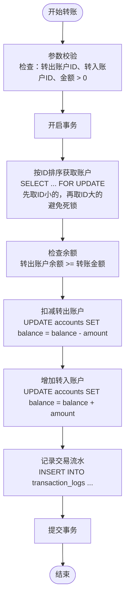

#### 2.1.3 死锁避免策略

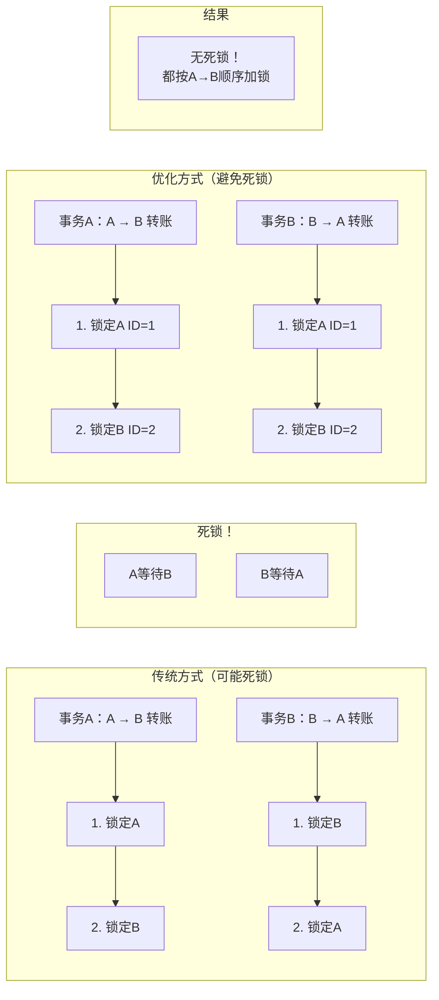

### 2.2 场景二：账户转账（乐观锁实现）

#### 2.2.1 场景描述
使用版本号机制实现乐观锁，适用于读多写少的场景，减少锁等待时间。

#### 2.2.2 业务流程图

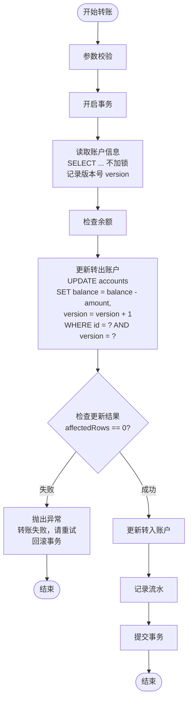

#### 2.2.3 乐观锁 vs 悲观锁对比

| 特性 | 乐观锁 | 悲观锁 |
|------|--------|--------|
| 实现机制 | 版本号/时间戳 | SELECT FOR UPDATE |
| 加锁时机 | 更新时检查 | 读取时加锁 |
| 适用场景 | 读多写少 | 写多读少 |
| 冲突处理 | 重试/报错 | 阻塞等待 |
| 性能特点 | 无锁开销，可能重试 | 有锁开销，无重试 |
| 死锁风险 | 无 | 有（需按序加锁） |

### 2.3 场景三：库存扣减（悲观锁）

#### 2.3.1 场景描述
演示电商秒杀场景下的库存扣减，使用悲观锁确保不超卖。

#### 2.3.2 业务流程图

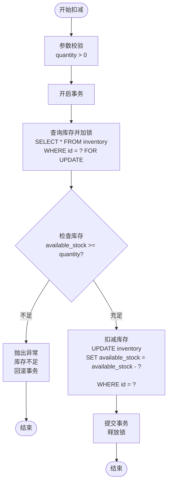

#### 2.3.3 并发控制效果

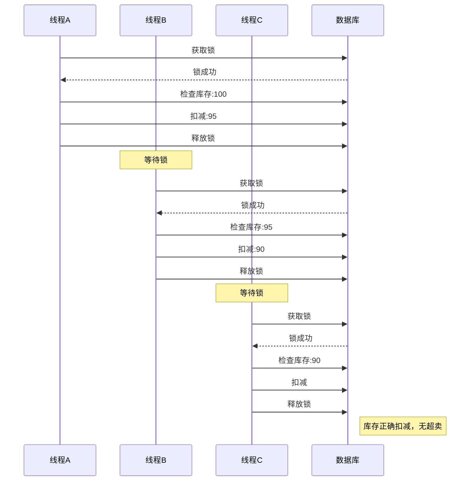

### 2.4 场景四：库存扣减（乐观锁）

#### 2.4.1 场景描述
使用版本号实现乐观锁库存扣减，适用于高并发读场景。

#### 2.4.2 业务流程图

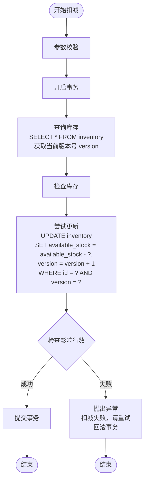

### 2.5 场景五：优惠券秒杀

#### 2.5.1 场景描述
演示高并发下优惠券领取场景，使用悲观锁/乐观锁控制并发。

#### 2.5.2 业务流程图

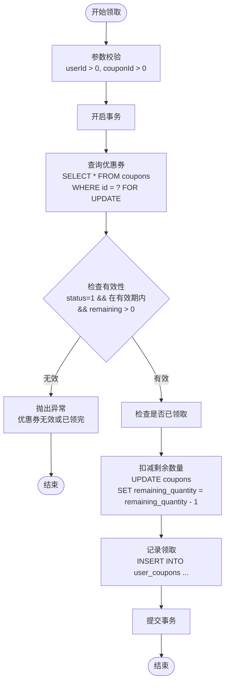

#### 2.5.3 超卖防护机制

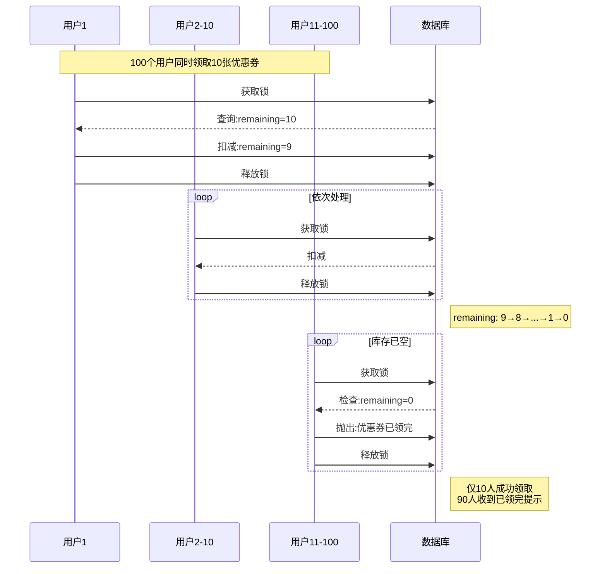

### 2.6 场景六：资金冻结与解冻

#### 2.6.1 场景描述
演示预占资金场景，如下单时冻结账户余额，支付完成后扣减或取消订单时解冻。

#### 2.6.2 业务流程图

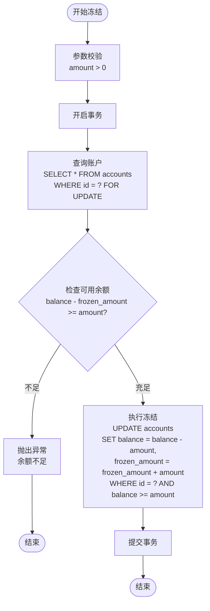

#### 2.6.3 冻结-扣减-解冻完整流程

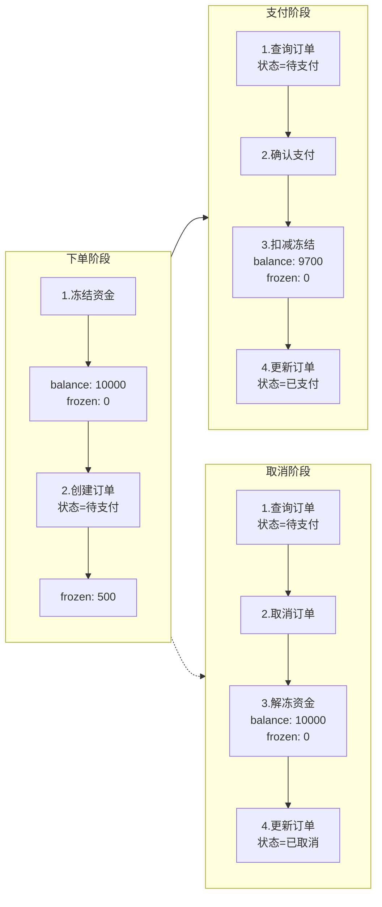

### 2.7 场景七：事务隔离级别测试

#### 2.7.1 场景描述
演示不同事务隔离级别下的并发问题：脏读、不可重复读、幻读。

#### 2.7.2 隔离级别对比

| 隔离级别 | 脏读 | 不可重复读 | 幻读 |
|----------|------|------------|------|
| READ UNCOMMITTED | ✓ | ✓ | ✓ |
| READ COMMITTED | ✗ | ✓ | ✓ |
| REPEATABLE READ | ✗ | ✗ | ✓(MySQL) |
| SERIALIZABLE | ✗ | ✗ | ✗ |

✓ = 可能发生    ✗ = 不会发生

#### 2.7.3 脏读演示流程

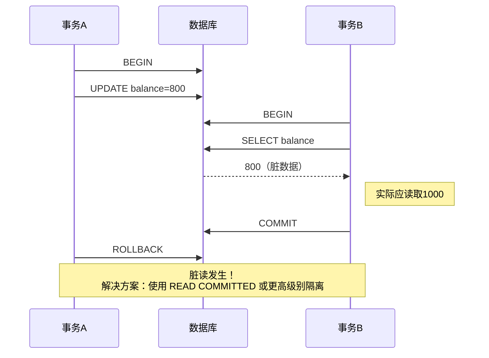

#### 2.7.4 不可重复读演示流程

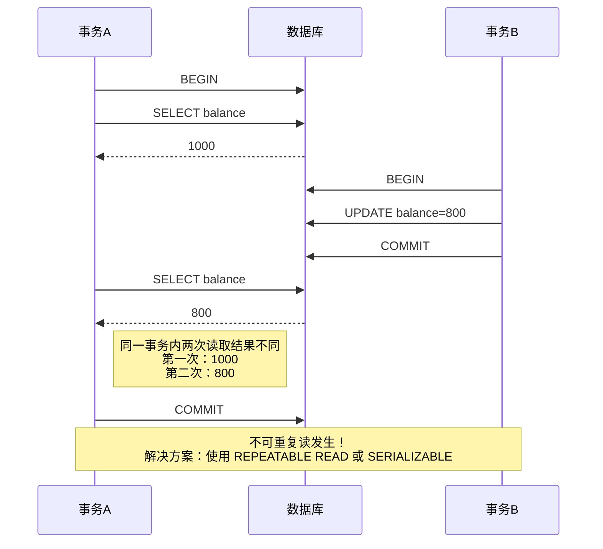

#### 2.7.5 幻读演示流程

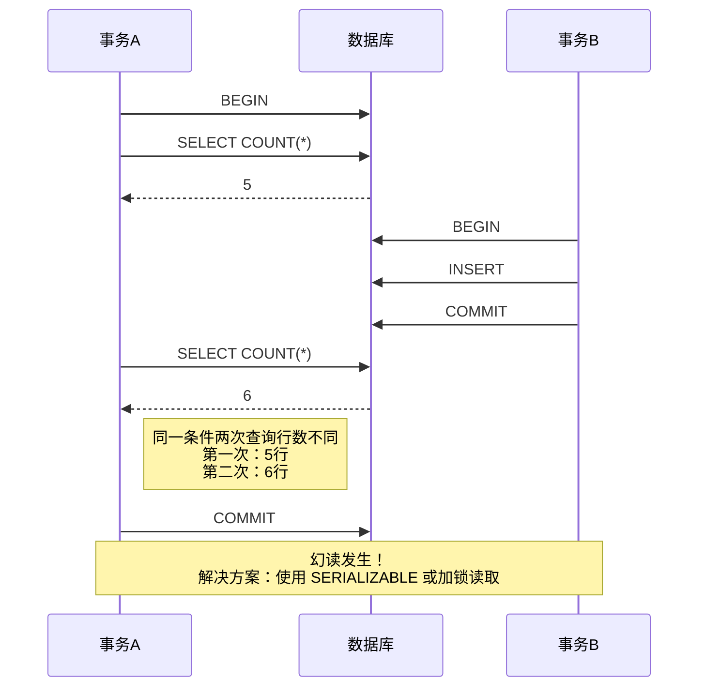

### 2.8 场景八：死锁检测与避免

#### 2.8.1 死锁产生条件

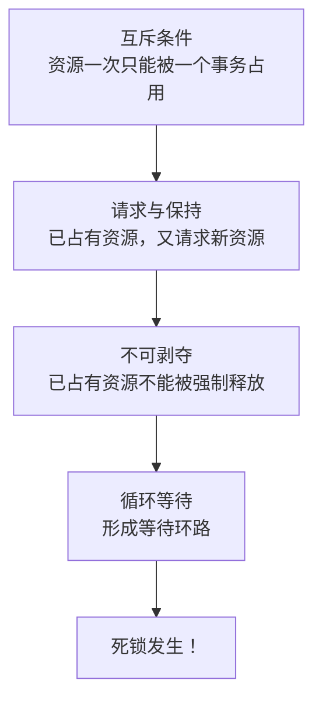

#### 2.8.2 死锁示例

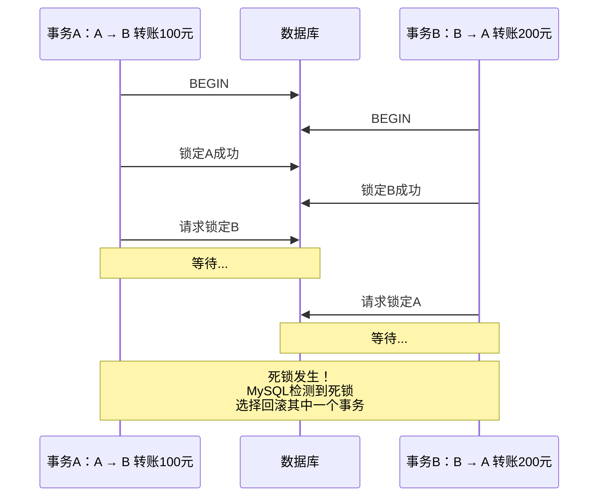

#### 2.8.3 死锁避免策略

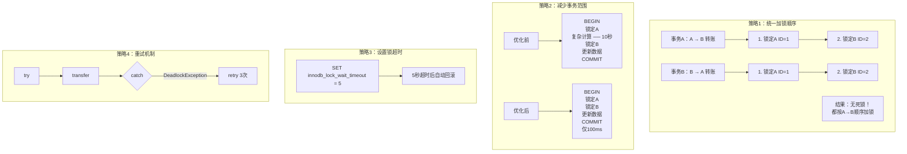

---

## 三、数据库设计

### 3.1 数据表结构

#### 3.1.1 账户表 (accounts)

```sql
-- ========================================================
-- 账户表 - 用于演示转账、充值等并发场景
-- ========================================================
CREATE TABLE IF NOT EXISTS accounts (
    id BIGINT UNSIGNED AUTO_INCREMENT PRIMARY KEY COMMENT '账户ID',
    account_no VARCHAR(32) NOT NULL UNIQUE COMMENT '账户编号',
    account_name VARCHAR(100) NOT NULL COMMENT '账户名称',
    balance DECIMAL(19, 4) NOT NULL DEFAULT 0.0000 COMMENT '账户余额',
    frozen_amount DECIMAL(19, 4) NOT NULL DEFAULT 0.0000 COMMENT '冻结金额',
    version INT UNSIGNED NOT NULL DEFAULT 0 COMMENT '乐观锁版本号',
    status TINYINT DEFAULT 1 COMMENT '状态：0-冻结，1-正常',
    created_at TIMESTAMP DEFAULT CURRENT_TIMESTAMP COMMENT '创建时间',
    updated_at TIMESTAMP DEFAULT CURRENT_TIMESTAMP ON UPDATE CURRENT_TIMESTAMP COMMENT '更新时间',

    -- 索引
    INDEX idx_account_no (account_no),
    INDEX idx_status (status)

) ENGINE=InnoDB DEFAULT CHARSET=utf8mb4 COMMENT='账户表';
```

**设计说明**：
- `version` 字段用于乐观锁实现
- `frozen_amount` 用于演示资金冻结场景
- 余额使用 DECIMAL(19,4) 确保精度

#### 3.1.2 库存表 (inventory)

```sql
-- ========================================================
-- 库存表 - 用于演示库存扣减、秒杀等并发场景
-- ========================================================
CREATE TABLE IF NOT EXISTS inventory (
    id BIGINT UNSIGNED AUTO_INCREMENT PRIMARY KEY COMMENT '库存ID',
    product_id BIGINT UNSIGNED NOT NULL COMMENT '商品ID',
    warehouse_id INT UNSIGNED NOT NULL DEFAULT 1 COMMENT '仓库ID',
    available_stock INT UNSIGNED NOT NULL DEFAULT 0 COMMENT '可用库存',
    locked_stock INT UNSIGNED NOT NULL DEFAULT 0 COMMENT '锁定库存',
    version INT UNSIGNED NOT NULL DEFAULT 0 COMMENT '乐观锁版本号',
    last_check_time TIMESTAMP NULL COMMENT '最后盘点时间',
    created_at TIMESTAMP DEFAULT CURRENT_TIMESTAMP COMMENT '创建时间',
    updated_at TIMESTAMP DEFAULT CURRENT_TIMESTAMP ON UPDATE CURRENT_TIMESTAMP COMMENT '更新时间',

    -- 索引
    UNIQUE KEY uk_product_warehouse (product_id, warehouse_id),
    INDEX idx_product_id (product_id)

) ENGINE=InnoDB DEFAULT CHARSET=utf8mb4 COMMENT='库存表';
```

**设计说明**：
- `available_stock` 和 `locked_stock` 分离，支持预占库存模式
- `version` 字段用于乐观锁
- 联合唯一索引防止同一商品在同一仓库重复创建

#### 3.1.3 优惠券表 (coupons)

```sql
-- ========================================================
-- 优惠券表 - 用于演示秒杀、并发领取场景
-- ========================================================
CREATE TABLE IF NOT EXISTS coupons (
    id BIGINT UNSIGNED AUTO_INCREMENT PRIMARY KEY COMMENT '优惠券ID',
    coupon_code VARCHAR(32) NOT NULL UNIQUE COMMENT '优惠券编码',
    coupon_name VARCHAR(128) NOT NULL COMMENT '优惠券名称',
    total_quantity INT UNSIGNED NOT NULL COMMENT '总数量',
    remaining_quantity INT UNSIGNED NOT NULL COMMENT '剩余数量',
    discount_amount DECIMAL(19, 4) COMMENT '优惠金额',
    discount_percent DECIMAL(3, 2) COMMENT '折扣百分比',
    min_order_amount DECIMAL(19, 4) DEFAULT 0.0000 COMMENT '最低使用金额',
    valid_start_time TIMESTAMP NOT NULL COMMENT '有效期开始',
    valid_end_time TIMESTAMP NOT NULL COMMENT '有效期结束',
    status TINYINT DEFAULT 1 COMMENT '状态：0-未开始，1-进行中，2-已结束',
    version INT UNSIGNED NOT NULL DEFAULT 0 COMMENT '乐观锁版本号',
    created_at TIMESTAMP DEFAULT CURRENT_TIMESTAMP COMMENT '创建时间',
    updated_at TIMESTAMP DEFAULT CURRENT_TIMESTAMP ON UPDATE CURRENT_TIMESTAMP COMMENT '更新时间',

    -- 索引
    INDEX idx_coupon_code (coupon_code),
    INDEX idx_status (status),
    INDEX idx_valid_time (valid_start_time, valid_end_time)

) ENGINE=InnoDB DEFAULT CHARSET=utf8mb4 COMMENT='优惠券表';
```

**设计说明**：
- `total_quantity` 和 `remaining_quantity` 用于控制发放数量
- `version` 字段用于乐观锁控制并发领取
- 时间字段用于控制优惠券有效期

#### 3.1.4 用户优惠券表 (user_coupons)

```sql
-- ========================================================
-- 用户优惠券表 - 记录用户领取的优惠券
-- ========================================================
CREATE TABLE IF NOT EXISTS user_coupons (
    id BIGINT UNSIGNED AUTO_INCREMENT PRIMARY KEY COMMENT 'ID',
    user_id BIGINT UNSIGNED NOT NULL COMMENT '用户ID',
    coupon_id BIGINT UNSIGNED NOT NULL COMMENT '优惠券ID',
    status TINYINT DEFAULT 0 COMMENT '状态：0-未使用，1-已使用，2-已过期',
    use_time TIMESTAMP NULL COMMENT '使用时间',
    order_id BIGINT UNSIGNED COMMENT '使用订单ID',
    grab_time TIMESTAMP DEFAULT CURRENT_TIMESTAMP COMMENT '领取时间',
    created_at TIMESTAMP DEFAULT CURRENT_TIMESTAMP COMMENT '创建时间',

    -- 索引
    INDEX idx_user_id (user_id),
    INDEX idx_coupon_id (coupon_id),
    INDEX idx_status (status),

    -- 唯一约束：一个用户只能领取一张同类型优惠券
    UNIQUE KEY uk_user_coupon (user_id, coupon_id)

) ENGINE=InnoDB DEFAULT CHARSET=utf8mb4 COMMENT='用户优惠券表';
```

**设计说明**：
- 唯一约束防止重复领取
- 状态字段跟踪优惠券使用状态

#### 3.1.5 交易流水表 (transaction_logs)

```sql
-- ========================================================
-- 交易流水表 - 记录所有资金变动
-- ========================================================
CREATE TABLE IF NOT EXISTS transaction_logs (
    id BIGINT UNSIGNED AUTO_INCREMENT PRIMARY KEY COMMENT '流水ID',
    transaction_no VARCHAR(32) NOT NULL UNIQUE COMMENT '交易流水号',
    account_id BIGINT UNSIGNED NOT NULL COMMENT '账户ID',
    transaction_type TINYINT NOT NULL COMMENT '交易类型：1-充值，2-提现，3-转账入，4-转账出，5-冻结，6-解冻',
    amount DECIMAL(19, 4) NOT NULL COMMENT '交易金额',
    balance_before DECIMAL(19, 4) NOT NULL COMMENT '交易前余额',
    balance_after DECIMAL(19, 4) NOT NULL COMMENT '交易后余额',
    related_account_id BIGINT UNSIGNED COMMENT '对方账户ID（转账时使用）',
    remark VARCHAR(256) COMMENT '备注',
    created_at TIMESTAMP DEFAULT CURRENT_TIMESTAMP COMMENT '创建时间',

    -- 索引
    INDEX idx_transaction_no (transaction_no),
    INDEX idx_account_id (account_id),
    INDEX idx_transaction_type (transaction_type),
    INDEX idx_created_at (created_at)

) ENGINE=InnoDB DEFAULT CHARSET=utf8mb4 COMMENT='交易流水表';
```

**设计说明**：
- 记录完整的资金变动历史
- 支持审计和追溯
- 转账场景记录对方账户

### 3.2 数据库脚本文件规划

```
db/chapter01/concurrency/
├── init/
│   └── 01-create-concurrency-tables.sql    -- 创建并发控制相关表
├── data/
│   ├── 01-init-accounts.sql                -- 初始化账户数据
│   ├── 02-init-inventory.sql               -- 初始化库存数据
│   └── 03-init-coupons.sql                 -- 初始化优惠券数据
└── test/
    ├── 01-test-lock-scenarios.sql          -- 锁测试场景脚本
    └── 02-test-isolation-levels.sql        -- 隔离级别测试脚本
```

---

## 四、代码设计

### 4.1 包结构

```
com.linsir.abc.mysql.chapter01.concurrency
├── entity/                    -- 实体类
│   ├── Account.java          -- 账户实体
│   ├── Inventory.java        -- 库存实体
│   ├── Coupon.java           -- 优惠券实体
│   ├── UserCoupon.java       -- 用户优惠券实体
│   └── TransactionLog.java   -- 交易流水实体
├── mapper/                    -- MyBatis Mapper接口
│   ├── AccountMapper.java
│   ├── InventoryMapper.java
│   ├── CouponMapper.java
│   ├── UserCouponMapper.java
│   └── TransactionLogMapper.java
├── service/                   -- 业务逻辑层
│   ├── AccountService.java              -- 账户服务接口
│   ├── AccountServiceImpl.java          -- 账户服务实现
│   ├── InventoryService.java            -- 库存服务接口
│   ├── InventoryServiceImpl.java        -- 库存服务实现
│   ├── CouponService.java               -- 优惠券服务接口
│   ├── CouponServiceImpl.java           -- 优惠券服务实现
│   └── lock/                            -- 锁演示服务
│       ├── PessimisticLockService.java  -- 悲观锁演示
│       └── OptimisticLockService.java   -- 乐观锁演示
├── controller/                -- 控制器层
│   └── ConcurrencyController.java       -- 并发控制演示接口
└── test/                      -- 测试类
    ├── LockTest.java                      -- 锁机制测试
    ├── IsolationLevelTest.java            -- 隔离级别测试
    ├── DeadlockTest.java                  -- 死锁测试
    └── ConcurrentScenarioTest.java        -- 并发场景测试
```

### 4.2 核心Service方法

#### 4.2.1 账户转账（悲观锁）

```java
@Override
@Transactional(rollbackFor = Exception.class)
public boolean transferWithPessimisticLock(Long fromAccountId, Long toAccountId, BigDecimal amount) {
    // 1. 参数校验
    if (amount == null || amount.compareTo(BigDecimal.ZERO) <= 0) {
        throw new IllegalArgumentException("转账金额必须大于0");
    }
    
    // 2. 按ID排序加锁，避免死锁
    Long firstId = Math.min(fromAccountId, toAccountId);
    Long secondId = Math.max(fromAccountId, toAccountId);
    
    Account firstAccount = accountMapper.selectByIdForUpdate(firstId);
    Account secondAccount = accountMapper.selectByIdForUpdate(secondId);
    
    // 3. 确定转出和转入账户
    Account fromAccount = fromAccountId.equals(firstId) ? firstAccount : secondAccount;
    Account toAccount = toAccountId.equals(firstId) ? firstAccount : secondAccount;
    
    // 4. 检查余额
    if (fromAccount.getBalance().compareTo(amount) < 0) {
        throw new RuntimeException("余额不足");
    }
    
    // 5. 执行转账
    accountMapper.updateBalance(fromAccountId, amount.negate());
    accountMapper.updateBalance(toAccountId, amount);
    
    // 6. 记录流水
    String transactionNo = generateTransactionNo();
    transactionLogMapper.insert(TransactionLog.builder()
        .transactionNo(transactionNo)
        .accountId(fromAccountId)
        .transactionType((byte) 4) // 转账出
        .amount(amount.negate())
        .balanceBefore(fromAccount.getBalance())
        .balanceAfter(fromAccount.getBalance().subtract(amount))
        .relatedAccountId(toAccountId)
        .remark("转账给账户" + toAccount.getAccountNo())
        .build());
    
    return true;
}
```

#### 4.2.2 账户转账（乐观锁）

```java
@Override
@Transactional(rollbackFor = Exception.class)
public boolean transferWithOptimisticLock(Long fromAccountId, Long toAccountId, BigDecimal amount) {
    // 1. 参数校验
    if (amount == null || amount.compareTo(BigDecimal.ZERO) <= 0) {
        throw new IllegalArgumentException("转账金额必须大于0");
    }
    
    // 2. 读取账户信息（无锁）
    Account fromAccount = accountMapper.selectById(fromAccountId);
    Account toAccount = accountMapper.selectById(toAccountId);
    
    // 3. 检查余额
    if (fromAccount.getBalance().compareTo(amount) < 0) {
        throw new RuntimeException("余额不足");
    }
    
    // 4. 乐观锁更新转出账户
    int affected = accountMapper.updateBalanceWithVersion(
        fromAccountId, 
        amount.negate(), 
        fromAccount.getVersion()
    );
    if (affected == 0) {
        throw new RuntimeException("转账失败，转出账户数据已变更，请重试");
    }
    
    // 5. 乐观锁更新转入账户
    affected = accountMapper.updateBalanceWithVersion(
        toAccountId, 
        amount, 
        toAccount.getVersion()
    );
    if (affected == 0) {
        throw new RuntimeException("转账失败，转入账户数据已变更，请重试");
    }
    
    return true;
}
```

#### 4.2.3 库存扣减（悲观锁）

```java
@Override
@Transactional(rollbackFor = Exception.class)
public boolean deductStockWithPessimisticLock(Long inventoryId, Integer quantity) {
    // 1. 参数校验
    if (quantity == null || quantity <= 0) {
        throw new IllegalArgumentException("扣减数量必须大于0");
    }
    
    // 2. 加锁并读取库存
    Inventory inventory = inventoryMapper.selectByIdForUpdate(inventoryId);
    if (inventory == null) {
        throw new RuntimeException("库存记录不存在");
    }
    
    // 3. 检查库存
    if (!inventory.hasEnoughStock(quantity)) {
        throw new RuntimeException("库存不足");
    }
    
    // 4. 扣减库存
    int affected = inventoryMapper.deductStock(inventoryId, quantity);
    if (affected == 0) {
        throw new RuntimeException("扣减库存失败");
    }
    
    return true;
}
```

#### 4.2.4 领取优惠券（悲观锁）

```java
@Override
@Transactional(rollbackFor = Exception.class)
public boolean grabCouponWithPessimisticLock(Long userId, Long couponId) {
    // 1. 检查是否已领取
    if (userCouponMapper.selectByUserAndCoupon(userId, couponId) != null) {
        throw new RuntimeException("您已领取过该优惠券");
    }
    
    // 2. 查询优惠券并加锁
    Coupon coupon = couponMapper.selectByIdForUpdate(couponId);
    if (coupon == null) {
        throw new RuntimeException("优惠券不存在");
    }
    
    // 3. 检查有效性
    if (!coupon.canGrab()) {
        throw new RuntimeException("优惠券已领完或已过期");
    }
    
    // 4. 扣减剩余数量
    int affected = couponMapper.deductRemainingQuantity(couponId);
    if (affected == 0) {
        throw new RuntimeException("优惠券已被领完");
    }
    
    // 5. 记录领取
    UserCoupon userCoupon = UserCoupon.builder()
        .userId(userId)
        .couponId(couponId)
        .status((byte) 0)
        .build();
    userCouponMapper.insert(userCoupon);
    
    return true;
}
```

---

## 五、测试设计

### 5.1 测试类结构

```
com.linsir.abc.mysql.chapter01.concurrency
├── LockTest.java                    -- 锁机制测试（9个测试用例）
├── IsolationLevelTest.java          -- 隔离级别测试（9个测试用例）
├── DeadlockTest.java                -- 死锁测试（4个测试用例）
└── ConcurrentScenarioTest.java      -- 并发场景测试（7个测试用例）
```

### 5.2 测试环境配置

```yaml
# application-test.yml
spring:
  datasource:
    url: jdbc:mysql://localhost:3306/linsir-abc-mysql?useUnicode=true&characterEncoding=utf-8&useSSL=false&serverTimezone=Asia/Shanghai&allowPublicKeyRetrieval=true
    driver-class-name: com.mysql.cj.jdbc.Driver
    username: root
    password: root
```

**说明**：测试使用MySQL数据库（非H2），以支持 `SELECT ... FOR UPDATE` 等MySQL特定语法。

### 5.3 测试用例汇总

| 测试类 | 测试方法 | 测试目的 |
|--------|----------|----------|
| LockTest | testTransferWithPessimisticLock_SingleThread | 悲观锁转账单线程测试 |
| LockTest | testTransferWithOptimisticLock_SingleThread | 乐观锁转账单线程测试 |
| LockTest | testDeductStockWithPessimisticLock_Serial | 悲观锁库存扣减串行测试 |
| LockTest | testDeductStockWithOptimisticLock_Concurrent | 乐观锁库存扣减并发测试 |
| LockTest | testGrabCouponWithPessimisticLock_Serial | 悲观锁优惠券领取串行测试 |
| LockTest | testGrabCouponWithOptimisticLock_Concurrent | 乐观锁优惠券领取并发测试 |
| DeadlockTest | testTransferDeadlockAvoidance | 转账死锁避免测试 |
| DeadlockTest | testOptimisticLockNoDeadlock | 乐观锁无死锁测试 |
| DeadlockTest | testFreezeAndTransferConcurrent | 冻结与转账并发测试 |
| DeadlockTest | testMultiAccountCircularTransfer | 多账户循环转账测试 |
| IsolationLevelTest | testReadUncommitted | 读未提交隔离级别测试 |
| IsolationLevelTest | testReadCommitted | 读已提交隔离级别测试 |
| IsolationLevelTest | testRepeatableRead | 可重复读隔离级别测试 |
| IsolationLevelTest | testSerializable | 串行化隔离级别测试 |
| ConcurrentScenarioTest | testSeckillScenario_PessimisticLock | 秒杀场景悲观锁测试 |
| ConcurrentScenarioTest | testSeckillScenario_OptimisticLock | 秒杀场景乐观锁测试 |
| ConcurrentScenarioTest | testCouponGrabScenario_PessimisticLock | 红包雨场景测试 |
| ConcurrentScenarioTest | testTransferPeakScenario | 转账高峰场景测试 |
| ConcurrentScenarioTest | testMixedScenario | 混合场景测试 |
| ConcurrentScenarioTest | testStockPreoccupationScenario | 预占库存场景测试 |
| ConcurrentScenarioTest | testFundFreezeScenario | 资金冻结场景测试 |

---

## 六、总结

本文档详细设计了MySQL并发控制示例代码，包括：

1. **8个业务场景**：
   - 账户转账（悲观锁/乐观锁）
   - 库存扣减（悲观锁/乐观锁）
   - 优惠券秒杀
   - 资金冻结与解冻
   - 事务隔离级别演示
   - 死锁检测与避免

2. **5个数据表**：账户表、库存表、优惠券表、用户优惠券表、交易流水表

3. **完整代码结构**：Entity、Mapper、Service、Controller、Test

4. **两种锁实现**：
   - 悲观锁：`SELECT ... FOR UPDATE`
   - 乐观锁：版本号机制

5. **29个测试用例**：覆盖所有核心功能和并发场景

6. **测试环境**：使用MySQL数据库，支持完整的锁机制演示

后续开发时，请按照本文档的代码结构和设计规范进行实现。
