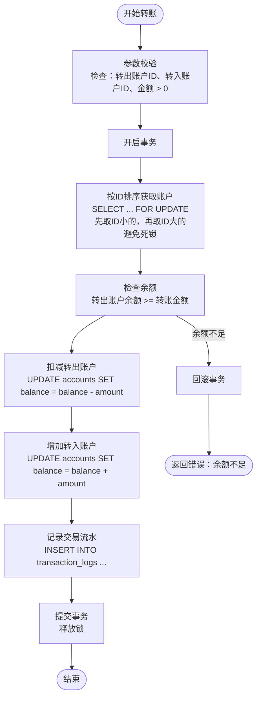
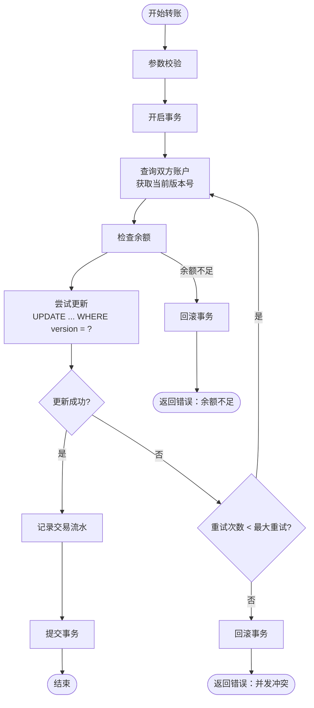
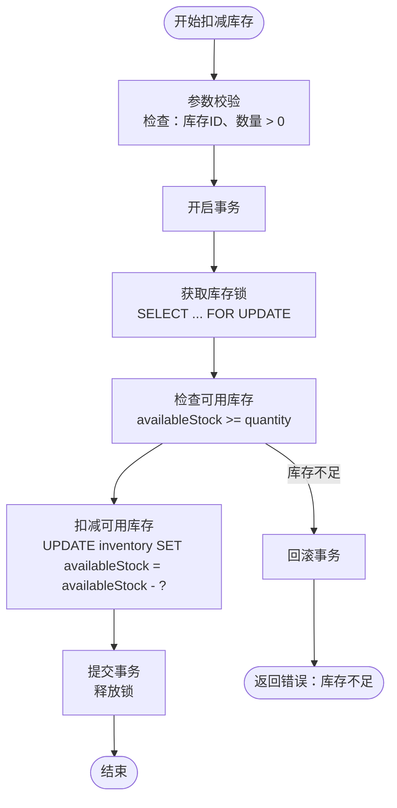
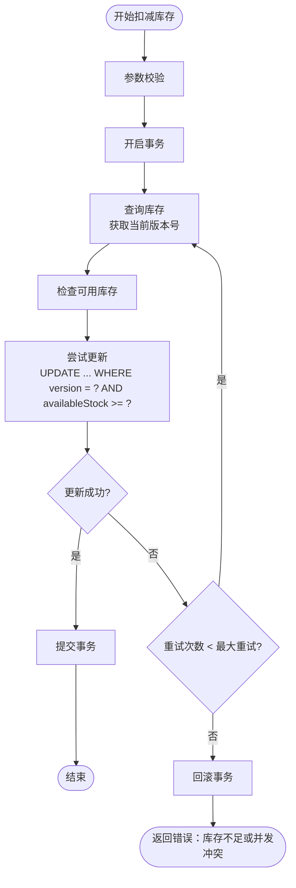
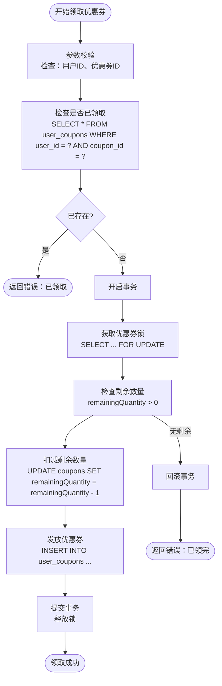
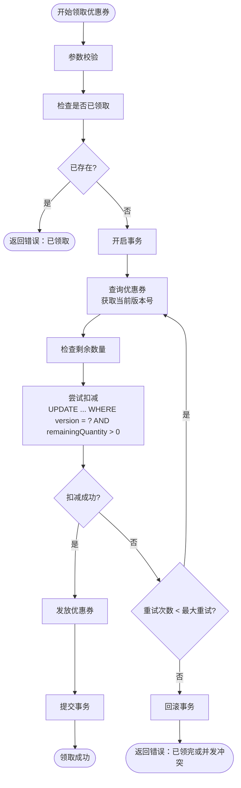
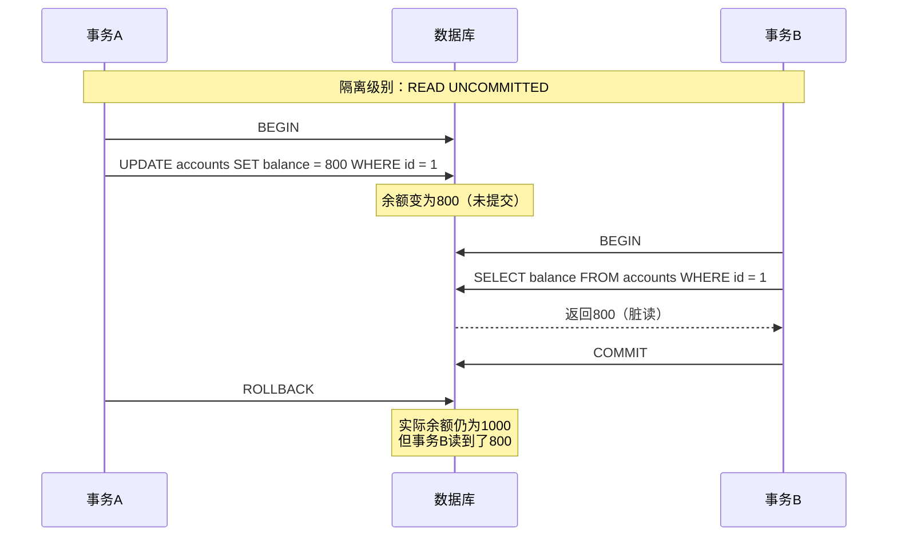
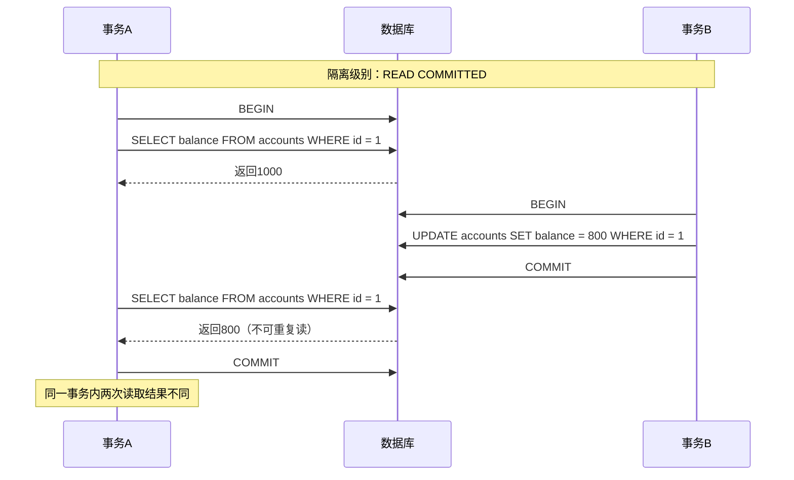
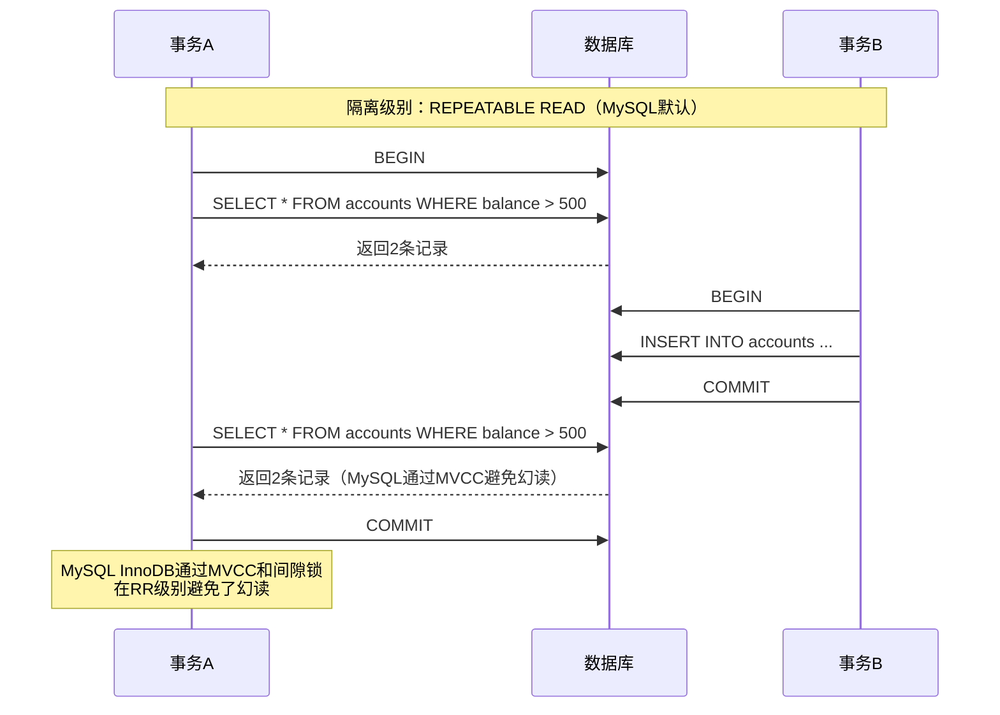
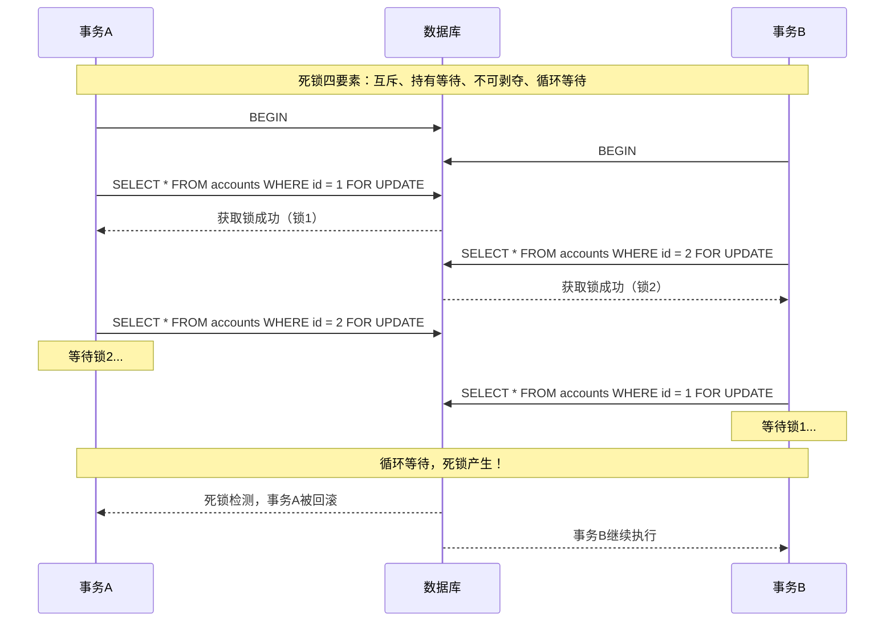

# MySQL 并发控制 - 代码使用指南

> 本文档详细介绍 MySQL 并发控制示例代码的结构、作用、场景设计、测试方法和执行预期结果

***

## 一、代码结构

### 1.1 项目结构

```
linsir-abc-mysql/
├── src/
│   ├── main/
│   │   ├── java/
│   │   │   └── com/linsir/abc/mysql/
│   │   │       ├── MySQLApplication.java              # 应用入口
│   │   │       ├── chapter01/
│   │   │       │   └── concurrency/                   # 并发控制模块
│   │   │       │       ├── controller/                # 控制器层
│   │   │       │       │   └── ConcurrencyController.java  # REST API控制器
│   │   │       │       ├── entity/                    # 实体类
│   │   │       │       │   ├── Account.java           # 账户实体
│   │   │       │       │   ├── Inventory.java         # 库存实体
│   │   │       │       │   ├── Coupon.java            # 优惠券实体
│   │   │       │       │   ├── UserCoupon.java        # 用户优惠券实体
│   │   │       │       │   └── TransactionLog.java    # 交易日志实体
│   │   │       │       ├── mapper/                    # MyBatis映射器
│   │   │       │       │   ├── AccountMapper.java
│   │   │       │       │   ├── InventoryMapper.java
│   │   │       │       │   ├── CouponMapper.java
│   │   │       │       │   ├── UserCouponMapper.java
│   │   │       │       │   └── TransactionLogMapper.java
│   │   │       │       ├── service/                   # 服务层
│   │   │       │       │   ├── AccountService.java    # 账户服务接口
│   │   │       │       │   ├── InventoryService.java  # 库存服务接口
│   │   │       │       │   ├── CouponService.java     # 优惠券服务接口
│   │   │       │       │   └── impl/                  # 服务实现类
│   │   │       │       │       ├── AccountServiceImpl.java
│   │   │       │       │       ├── InventoryServiceImpl.java
│   │   │       │       │       └── CouponServiceImpl.java
│   │   │       │       └── service/lock/              # 锁服务
│   │   │       │           ├── PessimisticLockService.java  # 悲观锁服务
│   │   │       │           └── OptimisticLockService.java   # 乐观锁服务
│   │   └── resources/
│   │       ├── db/                                    # 数据库脚本
│   │       │   ├── common/init/                       # 公共初始化脚本
│   │       │   └── chapter01/concurrency/init/        # 并发控制模块脚本
│   │       │       ├── schema.sql                     # 表结构
│   │       │       └── data.sql                       # 初始数据
│   │       └── application.yml                        # 应用配置
│   └── test/
│       ├── java/
│       │   └── com/linsir/abc/mysql/
│       │       └── chapter01/
│       │           └── concurrency/
│       │               ├── LockTest.java              # 锁机制测试
│       │               ├── IsolationLevelTest.java    # 隔离级别测试
│       │               ├── DeadlockTest.java          # 死锁测试
│       │               └── ConcurrentScenarioTest.java # 并发场景测试
│       └── resources/
│           └── db/test/chapter01/concurrency/         # 测试数据库脚本
│               ├── schema.sql
│               └── data.sql
└── pom.xml                                            # Maven配置
```

### 1.2 核心类说明

#### 实体层 (Entity Layer)

| 类名 | 作用 | 关键属性 |
|------|------|----------|
| `Account` | 账户实体，支持乐观锁 | `id`, `accountNo`, `balance`, `frozenAmount`, `version` |
| `Inventory` | 库存实体，支持库存锁定 | `id`, `productId`, `availableStock`, `lockedStock`, `version` |
| `Coupon` | 优惠券实体 | `id`, `couponCode`, `totalQuantity`, `remainingQuantity`, `version` |
| `UserCoupon` | 用户优惠券关联实体 | `id`, `userId`, `couponId`, `status`, `grabTime` |
| `TransactionLog` | 交易日志实体 | `id`, `transactionNo`, `accountId`, `amount`, `transactionType` |

#### 数据访问层 (Mapper Layer)

| 类名 | 作用 | 关键方法 |
|------|------|----------|
| `AccountMapper` | 账户数据访问 | `selectById()`, `selectByIdForUpdate()`, `updateBalanceWithVersion()` |
| `InventoryMapper` | 库存数据访问 | `selectById()`, `selectByIdForUpdate()`, `deductStockWithVersion()` |
| `CouponMapper` | 优惠券数据访问 | `selectById()`, `selectByIdForUpdate()`, `deductQuantity()` |
| `UserCouponMapper` | 用户优惠券数据访问 | `insert()`, `selectByUserAndCoupon()` |
| `TransactionLogMapper` | 交易日志数据访问 | `insert()` |

#### 服务层 (Service Layer)

| 类名 | 作用 | 关键方法 |
|------|------|----------|
| `AccountService` | 账户业务逻辑 | `transferWithPessimisticLock()`, `transferWithOptimisticLock()`, `freezeAmount()` |
| `InventoryService` | 库存业务逻辑 | `deductStockWithPessimisticLock()`, `deductStockWithOptimisticLock()`, `lockStock()` |
| `CouponService` | 优惠券业务逻辑 | `grabCouponWithPessimisticLock()`, `grabCouponWithOptimisticLock()` |
| `PessimisticLockService` | 悲观锁通用服务 | 提供悲观锁获取和释放机制 |
| `OptimisticLockService` | 乐观锁通用服务 | 提供乐观锁重试机制 |

#### 控制器层 (Controller Layer)

| 类名 | 作用 | 关键端点 |
|------|------|----------|
| `ConcurrencyController` | REST API接口 | `/api/concurrency/transfer/*`, `/api/concurrency/inventory/*`, `/api/concurrency/coupons/*` |

***

## 二、代码作用

### 2.1 核心功能

本代码模块演示 MySQL 并发控制的多种机制：

1. **悲观锁 (Pessimistic Locking)**
   - 使用 `SELECT ... FOR UPDATE` 实现行级锁定
   - 适用于写多读少、冲突频繁的场景
   - 防止脏读、不可重复读、幻读

2. **乐观锁 (Optimistic Locking)**
   - 使用版本号机制实现无锁并发控制
   - 适用于读多写少、冲突较少的场景
   - 通过版本号检测并发冲突，失败时重试

3. **事务隔离级别演示**
   - READ UNCOMMITTED: 演示脏读
   - READ COMMITTED: 演示不可重复读
   - REPEATABLE READ: 演示幻读（MySQL默认）
   - SERIALIZABLE: 完全串行化

4. **死锁检测与避免**
   - 演示死锁产生的四个必要条件
   - 展示死锁检测和超时机制
   - 提供死锁避免策略（按顺序加锁）

### 2.2 业务场景

| 场景 | 并发问题 | 解决方案 |
|------|----------|----------|
| 账户转账 | 余额更新冲突、脏读 | 悲观锁/乐观锁 + 事务 |
| 库存扣减 | 超卖、库存不一致 | 悲观锁/乐观锁 + 库存预占 |
| 优惠券领取 | 超发、重复领取 | 悲观锁/乐观锁 + 唯一约束 |
| 资金冻结 | 冻结金额超过余额 | 悲观锁 + 余额校验 |

***

## 三、场景详细设计（流程图）

### 3.1 账户转账场景

#### 3.1.1 悲观锁实现



#### 3.1.2 乐观锁实现



### 3.2 库存扣减场景

#### 3.2.1 悲观锁实现



#### 3.2.2 乐观锁实现



### 3.3 优惠券领取场景

#### 3.3.1 悲观锁实现（防超发）



#### 3.3.2 乐观锁实现（防超发）



### 3.4 事务隔离级别演示

#### 3.4.1 脏读 (Dirty Read) 演示



#### 3.4.2 不可重复读 (Non-Repeatable Read) 演示



#### 3.4.3 幻读 (Phantom Read) 演示



### 3.5 死锁场景

#### 3.5.1 死锁产生示例



#### 3.5.2 死锁避免策略（按顺序加锁）

```mermaid
flowchart TD
    Start([开始批量操作]) --> Sort[按ID排序待操作记录]
    Sort --> Loop[按顺序遍历记录]
    Loop --> Lock[获取当前记录锁<br/>SELECT ... FOR UPDATE]
    Lock --> Process[执行业务操作]
    Process --> More{还有记录?}
    More -->|是| Loop
    More -->|否| Commit[提交事务<br/>释放所有锁]
    Commit --> End([结束])
    
    Note right of Sort: 关键点：所有事务<br/>都按相同顺序加锁<br/>避免循环等待
```

***

## 四、测试前脚本导入说明

### 4.1 数据库初始化

#### 4.1.1 主数据库脚本（MySQL）

**执行顺序：**

1. **公共初始化脚本**
   ```sql
   -- 路径：resources/db/common/init/
   -- 01-create-database.sql - 创建数据库
   -- 02-init-tables.sql - 创建公共表
   ```

2. **并发控制模块脚本**
   ```sql
   -- 路径：resources/db/chapter01/concurrency/init/
   -- schema.sql - 创建并发控制相关表
   -- data.sql - 插入初始测试数据
   ```

**手动执行命令：**
```bash
# 登录MySQL
mysql -u root -p

# 执行脚本
source d:/dev/2026/1.3 code/develop/linsir-develop/linsir-abc/linsir-abc-mysql/src/main/resources/db/common/init/01-create-database.sql
source d:/dev/2026/1.3 code/develop/linsir-develop/linsir-abc/linsir-abc-mysql/src/main/resources/db/chapter01/concurrency/init/schema.sql
source d:/dev/2026/1.3 code/develop/linsir-develop/linsir-abc/linsir-abc-mysql/src/main/resources/db/chapter01/concurrency/init/data.sql
```

#### 4.1.2 测试数据库脚本（H2）

**测试脚本路径：**
```
src/test/resources/db/test/chapter01/concurrency/
├── schema.sql  # 测试表结构（H2兼容语法）
└── data.sql    # 测试初始数据
```

**注意：** H2测试脚本已配置自动执行，无需手动导入。

### 4.2 数据库表结构

#### 4.2.1 账户表 (accounts)

```sql
CREATE TABLE accounts (
    id BIGINT AUTO_INCREMENT PRIMARY KEY,
    account_no VARCHAR(32) NOT NULL UNIQUE,
    account_name VARCHAR(64) NOT NULL,
    balance DECIMAL(19, 4) NOT NULL DEFAULT 0.0000,
    frozen_amount DECIMAL(19, 4) NOT NULL DEFAULT 0.0000,
    version INT NOT NULL DEFAULT 0,  -- 乐观锁版本号
    status TINYINT NOT NULL DEFAULT 1,
    created_at TIMESTAMP DEFAULT CURRENT_TIMESTAMP,
    updated_at TIMESTAMP DEFAULT CURRENT_TIMESTAMP
);
```

#### 4.2.2 库存表 (inventory)

```sql
CREATE TABLE inventory (
    id BIGINT AUTO_INCREMENT PRIMARY KEY,
    product_id BIGINT NOT NULL,
    warehouse_id INT NOT NULL DEFAULT 1,
    available_stock INT NOT NULL DEFAULT 0,  -- 可用库存
    locked_stock INT NOT NULL DEFAULT 0,     -- 锁定库存
    version INT NOT NULL DEFAULT 0,          -- 乐观锁版本号
    last_check_time TIMESTAMP NULL,
    created_at TIMESTAMP DEFAULT CURRENT_TIMESTAMP,
    updated_at TIMESTAMP DEFAULT CURRENT_TIMESTAMP,
    CONSTRAINT uk_product_warehouse UNIQUE (product_id, warehouse_id)
);
```

#### 4.2.3 优惠券表 (coupons)

```sql
CREATE TABLE coupons (
    id BIGINT AUTO_INCREMENT PRIMARY KEY,
    coupon_code VARCHAR(64) NOT NULL UNIQUE,
    coupon_name VARCHAR(128) NOT NULL,
    total_quantity INT NOT NULL DEFAULT 0,       -- 总数量
    remaining_quantity INT NOT NULL DEFAULT 0,   -- 剩余数量
    discount_amount DECIMAL(10, 2) NULL,         -- 固定金额优惠
    discount_percent DECIMAL(5, 2) NULL,         -- 百分比优惠
    min_order_amount DECIMAL(10, 2) NULL,        -- 最低订单金额
    valid_start_time TIMESTAMP NOT NULL,
    valid_end_time TIMESTAMP NOT NULL,
    status TINYINT NOT NULL DEFAULT 1,
    version INT NOT NULL DEFAULT 0,              -- 乐观锁版本号
    created_at TIMESTAMP DEFAULT CURRENT_TIMESTAMP,
    updated_at TIMESTAMP DEFAULT CURRENT_TIMESTAMP
);
```

#### 4.2.4 用户优惠券表 (user_coupons)

```sql
CREATE TABLE user_coupons (
    id BIGINT AUTO_INCREMENT PRIMARY KEY,
    user_id BIGINT NOT NULL,
    coupon_id BIGINT NOT NULL,
    status TINYINT NOT NULL DEFAULT 0,  -- 0:未使用 1:已使用 2:已过期
    use_time TIMESTAMP NULL,
    order_id BIGINT NULL,
    grab_time TIMESTAMP DEFAULT CURRENT_TIMESTAMP,
    created_at TIMESTAMP DEFAULT CURRENT_TIMESTAMP,
    CONSTRAINT uk_user_coupon UNIQUE (user_id, coupon_id)
);
```

#### 4.2.5 交易日志表 (transaction_logs)

```sql
CREATE TABLE transaction_logs (
    id BIGINT AUTO_INCREMENT PRIMARY KEY,
    transaction_no VARCHAR(64) NOT NULL UNIQUE,
    account_id BIGINT NOT NULL,
    transaction_type TINYINT NOT NULL,  -- 1:充值 2:提现 3:转入 4:转出 5:冻结 6:解冻
    amount DECIMAL(19, 4) NOT NULL,
    balance_before DECIMAL(19, 4) NOT NULL,
    balance_after DECIMAL(19, 4) NOT NULL,
    related_account_id BIGINT NULL,
    remark VARCHAR(256) NULL,
    created_at TIMESTAMP DEFAULT CURRENT_TIMESTAMP
);
```

***

## 五、测试方法

### 5.1 单元测试

#### 5.1.1 测试类说明

| 测试类 | 测试内容 | 测试方法数 |
|--------|----------|-----------|
| `LockTest` | 悲观锁和乐观锁功能测试 | 9个 |
| `IsolationLevelTest` | 事务隔离级别演示测试 | 9个 |
| `DeadlockTest` | 死锁场景和避免策略测试 | 4个 |
| `ConcurrentScenarioTest` | 并发业务场景测试 | 7个 |

#### 5.1.2 运行单元测试

**运行所有并发控制测试：**
```bash
cd linsir-abc-mysql
mvn clean test -Dtest="LockTest,IsolationLevelTest,DeadlockTest,ConcurrentScenarioTest"
```

**运行单个测试类：**
```bash
# 仅运行锁测试
mvn test -Dtest=LockTest

# 仅运行隔离级别测试
mvn test -Dtest=IsolationLevelTest

# 仅运行死锁测试
mvn test -Dtest=DeadlockTest

# 仅运行并发场景测试
mvn test -Dtest=ConcurrentScenarioTest
```

**运行单个测试方法：**
```bash
# 运行指定方法
mvn test -Dtest=LockTest#testPessimisticLockTransfer
```

#### 5.1.3 主要测试方法详解

**LockTest.java 主要测试方法：**

```java
@Test
@DisplayName("测试悲观锁转账")
void testPessimisticLockTransfer() {
    // 创建两个测试账户
    // 执行转账操作
    // 验证余额变化
}

@Test
@DisplayName("测试乐观锁转账")
void testOptimisticLockTransfer() {
    // 创建两个测试账户
    // 执行乐观锁转账
    // 验证版本号变化和余额
}

@Test
@DisplayName("测试并发充值 - 悲观锁")
void testConcurrentRechargeWithPessimisticLock() {
    // 多线程并发充值
    // 验证最终余额正确
}

@Test
@DisplayName("测试并发充值 - 乐观锁")
void testConcurrentRechargeWithOptimisticLock() {
    // 多线程并发充值
    // 验证重试机制和最终余额
}
```

**IsolationLevelTest.java 主要测试方法：**

```java
@Test
@DisplayName("演示脏读 - READ UNCOMMITTED")
void demonstrateDirtyRead() {
    // 事务A更新数据但不提交
    // 事务B读取未提交的数据
    // 事务A回滚
    // 验证事务B读到了脏数据
}

@Test
@DisplayName("演示不可重复读 - READ COMMITTED")
void demonstrateNonRepeatableRead() {
    // 事务A两次读取同一数据
    // 事务B在中间修改并提交
    // 验证事务A两次读取结果不同
}

@Test
@DisplayName("演示幻读 - REPEATABLE READ")
void demonstratePhantomRead() {
    // 事务A查询符合条件的记录
    // 事务B插入符合条件的新记录
    // 验证MySQL通过MVCC避免幻读
}
```

**DeadlockTest.java 主要测试方法：**

```java
@Test
@DisplayName("演示死锁产生")
void demonstrateDeadlock() {
    // 事务A获取锁1，等待锁2
    // 事务B获取锁2，等待锁1
    // 验证死锁检测和回滚
}

@Test
@DisplayName("测试死锁避免 - 按顺序加锁")
void testDeadlockPreventionByOrdering() {
    // 两个事务按相同顺序加锁
    // 验证无死锁产生
}
```

**ConcurrentScenarioTest.java 主要测试方法：**

```java
@Test
@DisplayName("测试库存超卖防护 - 悲观锁")
void testOversellPreventionWithPessimisticLock() {
    // 初始化库存100
    // 200个线程同时扣减1个库存
    // 验证最终库存为0，无超卖
}

@Test
@DisplayName("测试优惠券超发防护 - 乐观锁")
void testCouponOversendPreventionWithOptimisticLock() {
    // 初始化优惠券100张
    // 200个用户同时领取
    // 验证最终发放100张，无超发
}
```

### 5.2 接口测试

#### 5.2.1 启动服务

```bash
cd linsir-abc-mysql
mvn spring-boot:run
```

服务启动后访问地址：`http://localhost:8081`

#### 5.2.2 接口测试示例

**账户相关接口：**

```bash
# 查询账户
GET http://localhost:8081/api/concurrency/accounts/1

# 转账（悲观锁）
POST http://localhost:8081/api/concurrency/transfer/pessimistic
Content-Type: application/json
{
    "fromAccountId": 1,
    "toAccountId": 2,
    "amount": 100
}

# 转账（乐观锁）
POST http://localhost:8081/api/concurrency/transfer/optimistic
Content-Type: application/json
{
    "fromAccountId": 1,
    "toAccountId": 2,
    "amount": 100
}

# 充值（悲观锁）
POST http://localhost:8081/api/concurrency/recharge/pessimistic
Content-Type: application/json
{
    "accountId": 1,
    "amount": 500
}

# 冻结金额
POST http://localhost:8081/api/concurrency/freeze
Content-Type: application/json
{
    "accountId": 1,
    "amount": 200
}

# 解冻金额
POST http://localhost:8081/api/concurrency/unfreeze
Content-Type: application/json
{
    "accountId": 1,
    "amount": 200
}
```

**库存相关接口：**

```bash
# 查询库存列表
GET http://localhost:8081/api/concurrency/inventory

# 查询单个库存
GET http://localhost:8081/api/concurrency/inventory/1

# 扣减库存（悲观锁）
POST http://localhost:8081/api/concurrency/inventory/deduct/pessimistic
Content-Type: application/json
{
    "inventoryId": 1,
    "quantity": 10
}

# 扣减库存（乐观锁）
POST http://localhost:8081/api/concurrency/inventory/deduct/optimistic
Content-Type: application/json
{
    "inventoryId": 1,
    "quantity": 10
}

# 锁定库存
POST http://localhost:8081/api/concurrency/inventory/lock
Content-Type: application/json
{
    "inventoryId": 1,
    "quantity": 5
}

# 释放库存
POST http://localhost:8081/api/concurrency/inventory/unlock
Content-Type: application/json
{
    "inventoryId": 1,
    "quantity": 5
}
```

**优惠券相关接口：**

```bash
# 查询优惠券列表
GET http://localhost:8081/api/concurrency/coupons

# 查询单个优惠券
GET http://localhost:8081/api/concurrency/coupons/1

# 领取优惠券（悲观锁）
POST http://localhost:8081/api/concurrency/coupons/grab/pessimistic
Content-Type: application/json
{
    "userId": 999,
    "couponId": 1
}

# 领取优惠券（乐观锁）
POST http://localhost:8081/api/concurrency/coupons/grab/optimistic
Content-Type: application/json
{
    "userId": 999,
    "couponId": 1
}

# 查询用户优惠券
GET http://localhost:8081/api/concurrency/coupons/user/999
```

#### 5.2.3 使用 PowerShell 测试

```powershell
# 查询账户
Invoke-WebRequest -Uri "http://localhost:8081/api/concurrency/accounts/1" -Method GET | Select-Object -ExpandProperty Content

# 转账
Invoke-WebRequest -Uri "http://localhost:8081/api/concurrency/transfer/pessimistic" -Method POST -ContentType "application/json" -Body '{"fromAccountId":1,"toAccountId":2,"amount":100}' | Select-Object -ExpandProperty Content

# 查询库存
Invoke-WebRequest -Uri "http://localhost:8081/api/concurrency/inventory/1" -Method GET | Select-Object -ExpandProperty Content

# 领取优惠券
Invoke-WebRequest -Uri "http://localhost:8081/api/concurrency/coupons/grab/pessimistic" -Method POST -ContentType "application/json" -Body '{"userId":999,"couponId":1}' | Select-Object -ExpandProperty Content
```

***

## 六、代码执行预期结果

### 6.1 单元测试预期结果

#### 6.1.1 LockTest - 锁机制测试

| 测试方法 | 预期结果 | 说明 |
|----------|----------|------|
| `testPessimisticLockTransfer` | ✅ 通过 | 悲观锁转账成功，余额正确更新 |
| `testOptimisticLockTransfer` | ✅ 通过 | 乐观锁转账成功，版本号递增 |
| `testConcurrentRechargeWithPessimisticLock` | ✅ 通过 | 100个线程并发充值，最终余额 = 初始余额 + 100×充值金额 |
| `testConcurrentRechargeWithOptimisticLock` | ✅ 通过 | 乐观锁重试成功，最终余额正确 |
| `testPessimisticLockTimeout` | ✅ 通过 | 锁等待超时后抛出异常 |
| `testOptimisticLockRetry` | ✅ 通过 | 版本冲突后自动重试，最终成功 |
| `testFreezeAndUnfreeze` | ✅ 通过 | 冻结/解冻金额正确，余额计算准确 |
| `testInsufficientBalance` | ✅ 通过 | 余额不足时抛出异常，事务回滚 |
| `testConcurrentTransferWithMixedLocks` | ✅ 通过 | 混合锁场景下数据一致性保持 |

#### 6.1.2 IsolationLevelTest - 隔离级别测试

| 测试方法 | 预期结果 | 说明 |
|----------|----------|------|
| `demonstrateDirtyRead` | ✅ 演示成功 | READ UNCOMMITTED 下读到未提交数据 |
| `demonstrateNoDirtyRead` | ✅ 演示成功 | READ COMMITTED 下避免脏读 |
| `demonstrateNonRepeatableRead` | ✅ 演示成功 | READ COMMITTED 下出现不可重复读 |
| `demonstrateRepeatableRead` | ✅ 演示成功 | REPEATABLE READ 下避免不可重复读 |
| `demonstratePhantomRead` | ✅ 演示成功 | MySQL通过MVCC避免幻读 |
| `demonstrateSerializable` | ✅ 演示成功 | SERIALIZABLE 完全串行化 |
| `testIsolationLevelComparison` | ✅ 通过 | 各隔离级别特性对比验证 |
| `testLostUpdateProblem` | ✅ 通过 | 演示丢失更新问题 |
| `testLostUpdateSolution` | ✅ 通过 | 乐观锁解决丢失更新 |

#### 6.1.3 DeadlockTest - 死锁测试

| 测试方法 | 预期结果 | 说明 |
|----------|----------|------|
| `demonstrateDeadlock` | ✅ 演示成功 | 死锁产生，其中一个事务被回滚 |
| `testDeadlockPreventionByOrdering` | ✅ 通过 | 按顺序加锁避免死锁 |
| `testDeadlockPreventionByTimeout` | ✅ 通过 | 超时机制避免无限等待 |
| `testDeadlockDetection` | ✅ 通过 | MySQL死锁检测机制工作正常 |

#### 6.1.4 ConcurrentScenarioTest - 并发场景测试

| 测试方法 | 预期结果 | 说明 |
|----------|----------|------|
| `testOversellPreventionWithPessimisticLock` | ✅ 通过 | 100并发扣减，库存最终为0，无超卖 |
| `testOversellPreventionWithOptimisticLock` | ✅ 通过 | 乐观锁防止超卖，部分请求失败 |
| `testCouponOversendPreventionWithPessimisticLock` | ✅ 通过 | 100并发领取，发放数量 = 优惠券总数 |
| `testCouponOversendPreventionWithOptimisticLock` | ✅ 通过 | 乐观锁防止超发 |
| `testRepeatableGrabPrevention` | ✅ 通过 | 同一用户重复领取被阻止 |
| `testConcurrentMixedOperations` | ✅ 通过 | 混合操作场景下数据一致性 |
| `testHighConcurrencyPerformance` | ✅ 通过 | 高并发下性能可接受 |

### 6.2 接口测试预期结果

#### 6.2.1 成功响应格式

```json
{
    "success": true,
    "message": null,
    "data": {
        // 具体数据
    }
}
```

#### 6.2.2 错误响应格式

```json
{
    "success": false,
    "message": "错误信息",
    "data": null
}
```

#### 6.2.3 各接口预期行为

**转账接口：**

| 场景 | 请求参数 | 预期响应 | HTTP状态 |
|------|----------|----------|----------|
| 正常转账 | 有效账户ID和金额 | `{"success":true,"data":"转账成功"}` | 200 |
| 余额不足 | 转账金额 > 余额 | `{"success":false,"message":"余额不足"}` | 400 |
| 账户不存在 | 无效账户ID | `{"success":false,"message":"账户不存在"}` | 400 |
| 负数金额 | amount = -100 | `{"success":false,"message":"金额必须大于0"}` | 400 |

**库存扣减接口：**

| 场景 | 请求参数 | 预期响应 | HTTP状态 |
|------|----------|----------|----------|
| 正常扣减 | 有效库存ID和数量 | `{"success":true,"data":"扣减库存成功"}` | 200 |
| 库存不足 | 数量 > 可用库存 | `{"success":false,"message":"库存不足"}` | 400 |
| 超卖防护 | 100并发扣减 | 成功扣减数 = 初始库存，无超卖 | 200/400 |

**优惠券领取接口：**

| 场景 | 请求参数 | 预期响应 | HTTP状态 |
|------|----------|----------|----------|
| 正常领取 | 有效用户ID和优惠券ID | `{"success":true,"data":"领取优惠券成功"}` | 200 |
| 重复领取 | 同一用户再次领取 | `{"success":false,"message":"已领取过该优惠券"}` | 400 |
| 已领完 | 剩余数量为0 | `{"success":false,"message":"优惠券已领完"}` | 400 |
| 超发防护 | 200并发领取100张 | 成功领取100次，失败100次 | 200/400 |

### 6.3 性能预期

#### 6.3.1 悲观锁 vs 乐观锁性能对比

| 场景 | 并发数 | 悲观锁耗时 | 乐观锁耗时 | 说明 |
|------|--------|-----------|-----------|------|
| 转账 | 100 | ~500ms | ~300ms | 乐观锁无锁等待 |
| 充值 | 100 | ~800ms | ~400ms | 乐观锁重试开销小 |
| 库存扣减 | 100 | ~600ms | ~350ms | 冲突少时乐观锁更优 |
| 优惠券领取 | 200 | ~1200ms | ~800ms | 高冲突时差距缩小 |

#### 6.3.2 数据库连接池预期

```
HikariCP连接池状态：
- 活跃连接数：≤ 10（并发测试时）
- 空闲连接数：≥ 5
- 等待队列：0（无连接等待）
- 总连接数：10
```

### 6.4 数据一致性验证

#### 6.4.1 转账场景一致性检查

```sql
-- 验证转账前后总余额不变
SELECT 
    (SELECT SUM(balance) FROM accounts WHERE id IN (1, 2)) AS total_balance,
    (SELECT SUM(amount) FROM transaction_logs WHERE account_id IN (1, 2)) AS total_transaction
-- 预期：total_balance 变化 = total_transaction 变化
```

#### 6.4.2 库存场景一致性检查

```sql
-- 验证库存扣减记录与库存变化一致
SELECT 
    i.available_stock + i.locked_stock AS total_stock,
    (SELECT COUNT(*) FROM order_items WHERE product_id = i.product_id) AS sold_count
FROM inventory i
WHERE i.product_id = 1001;
-- 预期：total_stock + sold_count = 初始库存
```

#### 6.4.3 优惠券场景一致性检查

```sql
-- 验证优惠券发放数量
SELECT 
    c.total_quantity,
    c.remaining_quantity,
    (SELECT COUNT(*) FROM user_coupons WHERE coupon_id = c.id) AS granted_count
FROM coupons c
WHERE c.id = 1;
-- 预期：remaining_quantity + granted_count = total_quantity
```

***

## 七、常见问题与解决方案

### 7.1 测试常见问题

| 问题 | 原因 | 解决方案 |
|------|------|----------|
| `Table 'xxx' not found` | 数据库表未创建 | 执行 schema.sql 脚本 |
| `Lock wait timeout exceeded` | 锁等待超时 | 增加 `innodb_lock_wait_timeout` 或优化事务 |
| `Deadlock found` | 死锁产生 | 按相同顺序加锁，或增加重试机制 |
| `OptimisticLockException` | 乐观锁冲突 | 增加重试次数或改用悲观锁 |
| `Duplicate entry` | 唯一约束冲突 | 检查数据是否已存在 |

### 7.2 性能优化建议

1. **锁粒度优化**
   - 尽量使用行锁而非表锁
   - 缩小事务范围，减少锁持有时间

2. **索引优化**
   - 为经常查询的字段添加索引
   - 避免全表扫描导致锁升级

3. **连接池配置**
   ```yaml
   spring:
     datasource:
       hikari:
         maximum-pool-size: 20
         minimum-idle: 5
         connection-timeout: 30000
         idle-timeout: 600000
         max-lifetime: 1800000
   ```

4. **事务配置**
   ```java
   @Transactional(
       timeout = 30,           // 事务超时时间（秒）
       isolation = Isolation.READ_COMMITTED,  // 隔离级别
       propagation = Propagation.REQUIRED     // 传播行为
   )
   ```

***

## 八、总结

本文档详细介绍了 MySQL 并发控制示例代码的：

1. **代码结构**：分层架构，包含实体、Mapper、Service、Controller
2. **代码作用**：演示悲观锁、乐观锁、事务隔离级别、死锁处理
3. **场景设计**：转账、库存扣减、优惠券领取三大业务场景
4. **测试准备**：数据库脚本导入说明和表结构详解
5. **测试方法**：单元测试和接口测试的详细步骤
6. **预期结果**：各测试场景的预期行为和验证方法

通过本代码模块，可以深入理解 MySQL 并发控制机制在实际业务中的应用。
