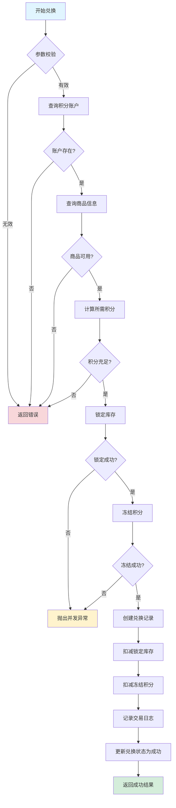
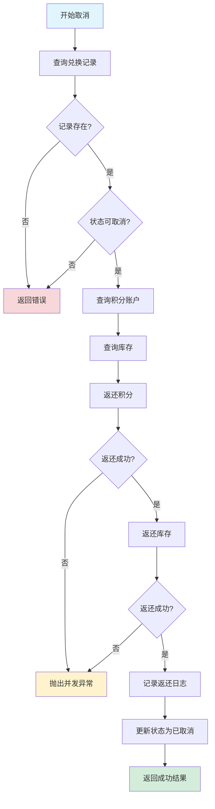
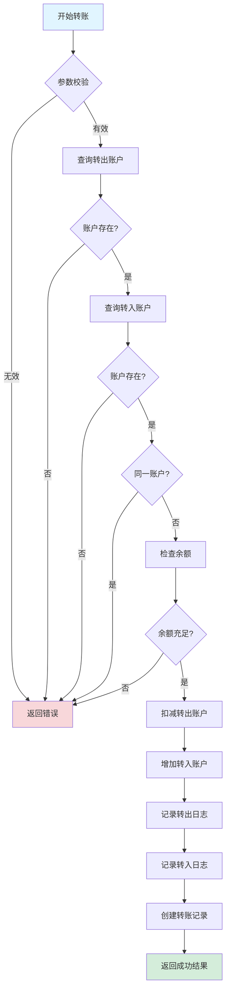
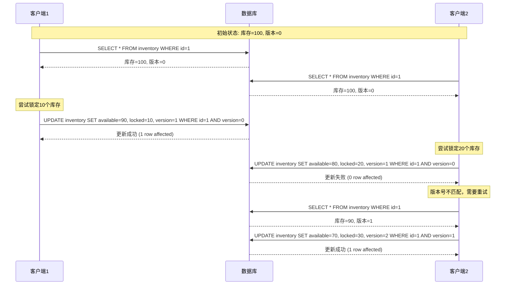

# 1.3 事务 - 代码实现说明文档

> 本文档说明事务示例代码的结构、作用、使用方法和测试结果

***

## 一、代码结构

### 1.1 项目结构

```
linsir-abc-mysql/src/main/java/com/linsir/abc/mysql/chapter01/transaction/
├── controller/                          # 控制器层
│   ├── BankTransferController.java      # 银行转账接口
│   ├── DeadlockDemoController.java      # 死锁演示接口
│   ├── IsolationDemoController.java     # 隔离级别演示接口
│   └── PointExchangeController.java     # 积分兑换接口
├── dto/                                 # 数据传输对象
│   ├── BatchTransferRequest.java        # 批量转账请求
│   ├── ExchangeRequest.java             # 兑换请求
│   ├── TransactionRequest.java          # 事务请求基类
│   └── TransactionResult.java           # 事务结果
├── entity/                              # 实体类
│   ├── BankAccount.java                 # 银行账户
│   ├── BankTransactionLog.java          # 银行交易日志
│   ├── ExchangeProduct.java             # 兑换商品
│   ├── PointAccount.java                # 积分账户
│   ├── PointExchangeRecord.java         # 积分兑换记录
│   ├── PointTransactionLog.java         # 积分交易日志
│   ├── ProductInventory.java            # 商品库存
│   └── TransferRecord.java              # 转账记录
├── mapper/                              # MyBatis映射器
│   ├── BankAccountMapper.java           # 银行账户Mapper
│   ├── BankTransactionLogMapper.java    # 交易日志Mapper
│   ├── ExchangeProductMapper.java       # 商品Mapper
│   ├── PointAccountMapper.java          # 积分账户Mapper
│   ├── PointExchangeRecordMapper.java   # 兑换记录Mapper
│   ├── PointTransactionLogMapper.java   # 积分日志Mapper
│   ├── ProductInventoryMapper.java      # 库存Mapper
│   └── TransferRecordMapper.java        # 转账记录Mapper
└── service/                             # 服务层
    ├── BankTransferService.java         # 银行转账服务接口
    ├── BankTransferServiceImpl.java     # 银行转账服务实现
    ├── PointExchangeService.java        # 积分兑换服务接口
    └── PointExchangeServiceImpl.java    # 积分兑换服务实现

linsir-abc-mysql/src/test/java/com/linsir/abc/mysql/chapter01/transaction/
├── concurrent/                          # 并发测试
│   ├── ConcurrentTransferTest.java      # 并发转账测试
│   └── IsolationLevelTest.java          # 隔离级别测试
├── integration/                         # 集成测试
│   └── TransactionIntegrationTest.java  # 事务集成测试
└── service/                             # 服务层测试
    ├── BankTransferServiceTest.java     # 银行转账服务测试
    └── PointExchangeServiceTest.java    # 积分兑换服务测试
```

### 1.2 核心类说明

| 类名 | 类型 | 作用 |
|------|------|------|
| `BankTransferServiceImpl` | Service | 实现银行转账业务，支持事务隔离级别控制 |
| `PointExchangeServiceImpl` | Service | 实现积分兑换业务，支持乐观锁并发控制 |
| `PointAccountMapper` | Mapper | 积分账户数据访问，包含冻结/解冻/扣减积分操作 |
| `ProductInventoryMapper` | Mapper | 库存数据访问，包含锁定/解锁/扣减库存操作 |
| `IsolationDemoController` | Controller | 提供隔离级别演示接口 |
| `DeadlockDemoController` | Controller | 提供死锁演示接口 |

***

## 二、代码作用

### 2.1 银行转账系统

**业务场景**：模拟银行间的转账操作，演示事务隔离级别对并发问题的影响。

**核心功能**：
- 单笔转账（支持不同隔离级别）
- 批量转账
- 转账记录查询
- 隔离级别演示（脏读、不可重复读、幻读）

**涉及知识点**：
- 事务ACID特性
- 四种隔离级别
- 并发问题（脏读、不可重复读、幻读）

### 2.2 积分兑换系统

**业务场景**：用户使用积分兑换商品，演示乐观锁实现并发控制。

**核心功能**：
- 积分兑换商品
- 取消兑换（回滚积分和库存）
- 积分账户查询
- 兑换记录查询

**涉及知识点**：
- 乐观锁（版本号机制）
- 事务日志（Redo/Undo）
- 两阶段提交思想
- 库存锁定与扣减

### 2.3 死锁演示系统

**业务场景**：演示死锁的产生条件和解决方案。

**核心功能**：
- 模拟死锁场景
- 安全转账（避免死锁）
- 死锁检测与超时处理

**涉及知识点**：
- 死锁产生的四个条件
- 死锁预防策略
- 锁顺序控制

***

## 三、场景详细设计

### 3.1 积分兑换流程



### 3.2 取消兑换流程



### 3.3 银行转账流程



### 3.4 乐观锁并发控制流程



***

## 四、测试前脚本导入说明

### 4.1 数据库脚本位置

```
linsir-abc-mysql/src/main/resources/db/migration/
├── V1.3.1__create_bank_tables.sql          # 银行转账相关表
├── V1.3.2__create_point_exchange_tables.sql # 积分兑换相关表
└── V1.3.3__init_transaction_data.sql        # 初始化数据
```

### 4.2 表结构说明

#### 4.2.1 银行转账相关表

```sql
-- 银行账户表
CREATE TABLE bank_accounts (
    id BIGINT PRIMARY KEY AUTO_INCREMENT,
    account_no VARCHAR(32) UNIQUE NOT NULL COMMENT '账户编号',
    account_name VARCHAR(64) NOT NULL COMMENT '账户名称',
    balance DECIMAL(18,2) NOT NULL DEFAULT 0 COMMENT '可用余额',
    frozen_amount DECIMAL(18,2) NOT NULL DEFAULT 0 COMMENT '冻结金额',
    bank_code VARCHAR(16) COMMENT '银行代码',
    bank_name VARCHAR(64) COMMENT '银行名称',
    status TINYINT DEFAULT 1 COMMENT '状态:0-冻结,1-正常',
    version INT DEFAULT 0 COMMENT '乐观锁版本号',
    created_at TIMESTAMP DEFAULT CURRENT_TIMESTAMP,
    updated_at TIMESTAMP DEFAULT CURRENT_TIMESTAMP ON UPDATE CURRENT_TIMESTAMP
);

-- 转账记录表
CREATE TABLE transfer_records (
    id BIGINT PRIMARY KEY AUTO_INCREMENT,
    transfer_no VARCHAR(32) UNIQUE NOT NULL COMMENT '转账单号',
    from_account_id BIGINT NOT NULL COMMENT '转出账户ID',
    to_account_id BIGINT NOT NULL COMMENT '转入账户ID',
    amount DECIMAL(18,2) NOT NULL COMMENT '转账金额',
    fee DECIMAL(18,2) DEFAULT 0 COMMENT '手续费',
    status TINYINT DEFAULT 0 COMMENT '状态:0-处理中,1-成功,2-失败',
    remark VARCHAR(255),
    created_at TIMESTAMP DEFAULT CURRENT_TIMESTAMP,
    completed_at TIMESTAMP NULL,
    FOREIGN KEY (from_account_id) REFERENCES bank_accounts(id),
    FOREIGN KEY (to_account_id) REFERENCES bank_accounts(id)
);
```

#### 4.2.2 积分兑换相关表

```sql
-- 积分账户表
CREATE TABLE point_accounts (
    id BIGINT PRIMARY KEY AUTO_INCREMENT,
    user_id BIGINT UNIQUE NOT NULL COMMENT '用户ID',
    available_points BIGINT NOT NULL DEFAULT 0 COMMENT '可用积分',
    frozen_points BIGINT NOT NULL DEFAULT 0 COMMENT '冻结积分',
    total_earned BIGINT NOT NULL DEFAULT 0 COMMENT '累计获得',
    total_consumed BIGINT NOT NULL DEFAULT 0 COMMENT '累计消费',
    version INT DEFAULT 0 COMMENT '乐观锁版本号',
    created_at TIMESTAMP DEFAULT CURRENT_TIMESTAMP,
    updated_at TIMESTAMP DEFAULT CURRENT_TIMESTAMP ON UPDATE CURRENT_TIMESTAMP
);

-- 商品库存表
CREATE TABLE product_inventory (
    id BIGINT PRIMARY KEY AUTO_INCREMENT,
    product_id BIGINT UNIQUE NOT NULL COMMENT '商品ID',
    available_stock INT NOT NULL DEFAULT 0 COMMENT '可用库存',
    locked_stock INT NOT NULL DEFAULT 0 COMMENT '锁定库存',
    version INT DEFAULT 0 COMMENT '乐观锁版本号',
    updated_at TIMESTAMP DEFAULT CURRENT_TIMESTAMP ON UPDATE CURRENT_TIMESTAMP
);

-- 积分兑换记录表
CREATE TABLE point_exchange_records (
    id BIGINT PRIMARY KEY AUTO_INCREMENT,
    exchange_no VARCHAR(32) UNIQUE NOT NULL COMMENT '兑换单号',
    point_account_id BIGINT NOT NULL COMMENT '积分账户ID',
    product_id BIGINT NOT NULL COMMENT '商品ID',
    quantity INT NOT NULL COMMENT '兑换数量',
    total_points BIGINT NOT NULL COMMENT '消耗积分',
    status TINYINT DEFAULT 0 COMMENT '状态:0-处理中,1-成功,2-失败,3-已取消',
    created_at TIMESTAMP DEFAULT CURRENT_TIMESTAMP,
    completed_at TIMESTAMP NULL
);
```

### 4.3 初始化数据

```sql
-- 银行账户初始化数据
INSERT INTO bank_accounts (account_no, account_name, balance, bank_code, bank_name, status) VALUES
('ACC001', '张三', 10000.00, 'ICBC', '中国工商银行', 1),
('ACC002', '李四', 8000.00, 'ICBC', '中国工商银行', 1),
('ACC003', '王五', 5000.00, 'CCB', '中国建设银行', 1),
('ACC004', '赵六', 3000.00, 'CCB', '中国建设银行', 1);

-- 积分账户初始化数据
INSERT INTO point_accounts (user_id, available_points, frozen_points, total_earned, total_consumed) VALUES
(10001, 10000, 0, 10000, 0),
(10002, 8000, 0, 8000, 0),
(10003, 5000, 0, 5000, 0),
(10004, 3000, 0, 3000, 0);

-- 兑换商品初始化数据
INSERT INTO exchange_products (product_code, product_name, description, required_points, price, status) VALUES
('PROD001', '10元话费充值券', '可用于手机话费充值，面值10元', 1000, 10.00, 1),
('PROD002', '20元话费充值券', '可用于手机话费充值，面值20元', 1800, 20.00, 1),
('PROD003', '50元京东卡', '京东E卡，可用于京东商城购物', 4500, 50.00, 1);

-- 商品库存初始化数据
INSERT INTO product_inventory (product_id, available_stock, locked_stock) VALUES
(1, 100, 0),
(2, 100, 0),
(3, 100, 0);
```

***

## 五、测试方法

### 5.1 单元测试

#### 5.1.1 银行转账服务测试

```bash
# 运行银行转账服务测试
mvn test -Dtest=BankTransferServiceTest
```

**测试用例**：

| 测试方法 | 说明 | 预期结果 |
|----------|------|----------|
| `testTransferSuccess` | 测试正常转账 | 转账成功，余额正确更新 |
| `testTransferInsufficientBalance` | 测试余额不足 | 转账失败，返回错误信息 |
| `testTransferSameAccount` | 测试同账户转账 | 转账失败，返回错误信息 |
| `testTransferNonExistentAccount` | 测试账户不存在 | 转账失败，返回错误信息 |

#### 5.1.2 积分兑换服务测试

```bash
# 运行积分兑换服务测试
mvn test -Dtest=PointExchangeServiceTest
```

**测试用例**：

| 测试方法 | 说明 | 预期结果 |
|----------|------|----------|
| `testExchangeSuccess` | 测试正常兑换 | 兑换成功，积分扣减 |
| `testExchangeInsufficientPoints` | 测试积分不足 | 兑换失败，返回错误信息 |
| `testExchangeInsufficientStock` | 测试库存不足 | 兑换失败，返回错误信息 |
| `testCancelExchange` | 测试取消兑换 | 取消成功，积分返还 |

### 5.2 并发测试

#### 5.2.1 并发转账测试

```bash
# 运行并发转账测试
mvn test -Dtest=ConcurrentTransferTest
```

**测试场景**：
- 10个线程同时进行转账操作
- 验证事务隔离性和数据一致性
- 检查是否存在脏读、不可重复读等问题

#### 5.2.2 隔离级别测试

```bash
# 运行隔离级别测试
mvn test -Dtest=IsolationLevelTest
```

**测试场景**：
- 测试READ_UNCOMMITTED隔离级别下的脏读
- 测试READ_COMMITTED隔离级别下的不可重复读
- 测试REPEATABLE_READ隔离级别下的幻读

### 5.3 集成测试

```bash
# 运行所有集成测试
mvn test -Dtest=TransactionIntegrationTest
```

**测试内容**：
- 完整业务流程测试
- 多服务协同测试
- 数据库事务回滚测试

### 5.4 接口测试

#### 5.4.1 启动应用

```bash
# 进入项目目录
cd linsir-abc-mysql

# 启动Spring Boot应用
mvn spring-boot:run
```

应用启动后，访问地址：`http://localhost:8081`

#### 5.4.2 接口列表

**银行转账接口**：

| 接口 | 方法 | URL | 说明 |
|------|------|-----|------|
| 查询账户 | GET | `/api/transaction/bank/account/{accountNo}` | 查询账户信息 |
| 执行转账 | POST | `/api/transaction/bank/transfer` | 执行单笔转账 |
| 批量转账 | POST | `/api/transaction/bank/batch-transfer` | 执行批量转账 |
| 查询转账记录 | GET | `/api/transaction/bank/transfer/{transferNo}` | 查询转账记录 |

**积分兑换接口**：

| 接口 | 方法 | URL | 说明 |
|------|------|-----|------|
| 查询积分账户 | GET | `/api/transaction/point/account/{userId}` | 查询积分账户 |
| 执行兑换 | POST | `/api/transaction/point/exchange` | 执行积分兑换 |
| 取消兑换 | POST | `/api/transaction/point/cancel/{exchangeNo}` | 取消兑换 |
| 查询商品列表 | GET | `/api/transaction/point/products` | 查询可兑换商品 |

**隔离级别演示接口**：

| 接口 | 方法 | URL | 说明 |
|------|------|-----|------|
| 脏读演示 | GET | `/api/transaction/isolation/dirty-read/{accountNo}` | 演示脏读现象 |
| 不可重复读演示 | GET | `/api/transaction/isolation/repeatable-read/{accountNo}` | 演示不可重复读 |

**死锁演示接口**：

| 接口 | 方法 | URL | 说明 |
|------|------|-----|------|
| 死锁演示 | POST | `/api/transaction/deadlock/demonstrate` | 演示死锁产生 |
| 安全转账 | POST | `/api/transaction/deadlock/safe-transfer` | 演示死锁避免 |

#### 5.4.3 接口测试示例

```bash
# 1. 查询账户信息
curl -X GET "http://localhost:8081/api/transaction/bank/account/ACC001"

# 2. 执行转账
curl -X POST "http://localhost:8081/api/transaction/bank/transfer" \
  -H "Content-Type: application/json" \
  -d '{
    "fromAccountNo": "ACC001",
    "toAccountNo": "ACC002",
    "amount": 1000,
    "remark": "测试转账"
  }'

# 3. 查询积分账户
curl -X GET "http://localhost:8081/api/transaction/point/account/10001"

# 4. 执行积分兑换
curl -X POST "http://localhost:8081/api/transaction/point/exchange" \
  -H "Content-Type: application/json" \
  -d '{
    "userId": 10001,
    "productId": 1,
    "quantity": 1
  }'
```

***

## 六、代码执行预期结果

### 6.1 单元测试预期结果

```
[INFO] Tests run: 4, Failures: 0, Errors: 0, Skipped: 0
[INFO] BankTransferServiceTest:
[INFO]   - testTransferSuccess: PASSED
[INFO]   - testTransferInsufficientBalance: PASSED
[INFO]   - testTransferSameAccount: PASSED
[INFO]   - testTransferNonExistentAccount: PASSED
[INFO] 
[INFO] PointExchangeServiceTest:
[INFO]   - testExchangeSuccess: PASSED
[INFO]   - testExchangeInsufficientPoints: PASSED
[INFO]   - testExchangeInsufficientStock: PASSED
[INFO]   - testCancelExchange: PASSED
```

### 6.2 并发测试预期结果

```
[INFO] Tests run: 2, Failures: 0, Errors: 0, Skipped: 0
[INFO] ConcurrentTransferTest:
[INFO]   - testConcurrentTransfer: PASSED
[INFO]     - 初始余额: ACC001=10000, ACC002=8000
[INFO]     - 10个线程各转账100元
[INFO]     - 最终余额: ACC001=9000, ACC002=9000
[INFO]     - 转账记录数: 10
[INFO] 
[INFO] IsolationLevelTest:
[INFO]   - testReadUncommitted: PASSED
[INFO]   - testReadCommitted: PASSED
[INFO]   - testRepeatableRead: PASSED
```

### 6.3 集成测试预期结果

```
[INFO] Tests run: 3, Failures: 0, Errors: 0, Skipped: 0
[INFO] TransactionIntegrationTest:
[INFO]   - testFullTransferProcess: PASSED
[INFO]   - testExchangeProcess: PASSED
[INFO]   - testTransactionRollback: PASSED
```

### 6.4 接口测试预期结果

#### 6.4.1 银行转账接口

**请求**：
```json
POST /api/transaction/bank/transfer
{
  "fromAccountNo": "ACC001",
  "toAccountNo": "ACC002",
  "amount": 1000,
  "remark": "测试转账"
}
```

**成功响应**：
```json
{
  "success": true,
  "businessNo": "TRF20240101120000",
  "message": "转账成功"
}
```

**失败响应（余额不足）**：
```json
{
  "success": false,
  "businessNo": null,
  "message": "余额不足，当前可用余额：500.00"
}
```

#### 6.4.2 积分兑换接口

**请求**：
```json
POST /api/transaction/point/exchange
{
  "userId": 10001,
  "productId": 1,
  "quantity": 2
}
```

**成功响应**：
```json
{
  "success": true,
  "businessNo": "EXC20240101120000",
  "message": "兑换成功，消耗积分：2000"
}
```

**失败响应（库存不足）**：
```json
{
  "success": false,
  "businessNo": null,
  "message": "库存不足，当前可用库存：100"
}
```

### 6.5 数据库状态变化预期

#### 6.5.1 转账成功后

| 账户 | 转账前余额 | 转账后余额 | 变化 |
|------|-----------|-----------|------|
| ACC001 | 10000.00 | 9000.00 | -1000.00 |
| ACC002 | 8000.00 | 9000.00 | +1000.00 |

#### 6.5.2 积分兑换成功后

| 用户ID | 兑换前可用积分 | 兑换后可用积分 | 消耗积分 |
|--------|--------------|--------------|---------|
| 10001 | 10000 | 9000 | 1000 |
| 10002 | 8000 | 6200 | 1800 |

#### 6.5.3 取消兑换后

| 用户ID | 取消前可用积分 | 取消后可用积分 | 返还积分 |
|--------|--------------|--------------|---------|
| 10001 | 9000 | 10000 | 1000 |

***

## 七、常见问题与解决方案

### 7.1 乐观锁并发冲突

**问题**：多个线程同时操作同一数据，导致版本号冲突。

**解决方案**：
1. 捕获`ConcurrentModificationException`异常
2. 重新查询最新数据
3. 重试操作

```java
try {
    result = pointExchangeService.exchange(request);
} catch (ConcurrentModificationException e) {
    // 重新查询并重试
    result = pointExchangeService.exchange(request);
}
```

### 7.2 事务超时

**问题**：长时间持有数据库锁，导致其他事务等待超时。

**解决方案**：
1. 优化SQL语句，减少锁持有时间
2. 设置合理的事务超时时间
3. 使用`@Transactional(timeout = 30)`指定超时时间

### 7.3 死锁问题

**问题**：两个事务相互等待对方释放锁，形成死锁。

**解决方案**：
1. 统一锁的获取顺序
2. 设置锁超时时间
3. 使用`SELECT ... FOR UPDATE NOWAIT`避免长时间等待

```java
// 统一按账户ID排序获取锁
if (fromAccountId < toAccountId) {
    lockAccount(fromAccountId);
    lockAccount(toAccountId);
} else {
    lockAccount(toAccountId);
    lockAccount(fromAccountId);
}
```

***

## 八、总结

本文档详细说明了事务示例代码的结构、作用、使用方法和预期结果。通过银行转账和积分兑换两个业务场景，演示了：

1. **事务隔离级别**：READ_UNCOMMITTED、READ_COMMITTED、REPEATABLE_READ、SERIALIZABLE
2. **并发问题**：脏读、不可重复读、幻读
3. **事务特性**：ACID（原子性、一致性、隔离性、持久性）
4. **并发控制**：乐观锁（版本号机制）
5. **死锁处理**：死锁预防与检测

代码采用Spring Boot + MyBatis框架，通过注解方式实现事务管理，代码结构清晰，易于理解和扩展。
