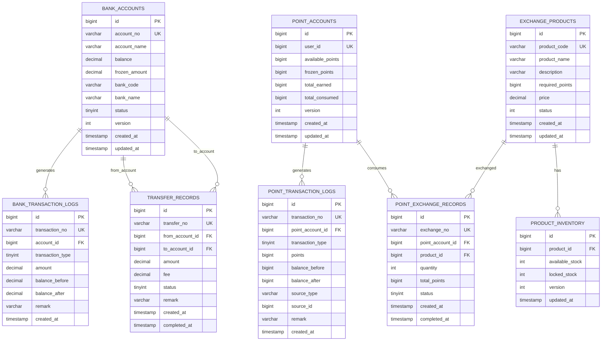

# 1.3 事务 - 示例代码详细设计文档

> 本文档基于《高性能MySQL》（第3版）第1章1.3节事务内容，设计Java示例代码

***

## 一、已有业务分析

### 1.1 已存在的业务示例

根据已有代码分析，以下业务场景已被使用：

| 章节 | 业务场景 | 涉及表 |
|------|----------|--------|
| **1.1 MySQL逻辑架构** | 用户管理、产品订单 | users, products, orders, order_items, connection_sessions |
| **1.2 并发控制** | 账户转账、库存管理、优惠券 | accounts, transaction_logs, inventory, coupons, user_coupons |

### 1.2 新增业务场景设计

基于《高性能MySQL》1.3节事务内容，设计以下**未被使用**的业务场景：

| 业务场景 | 说明 | 涉及知识点 |
|----------|------|------------|
| **银行转账系统** | 跨行转账、事务隔离级别演示 | 事务隔离级别、脏读、不可重复读、幻读 |
| **订单库存扣减** | 下单时扣减库存，演示死锁场景 | 死锁产生条件、死锁检测与预防 |
| **积分兑换系统** | 积分扣减与商品兑换 | 事务日志、Redo Log、Undo Log、两阶段提交 |

***

## 二、数据库设计

### 2.1 实体关系图



### 2.2 表结构设计

#### 2.2.1 银行账户表 (bank_accounts)

```sql
-- 银行账户表
CREATE TABLE bank_accounts (
    id BIGINT AUTO_INCREMENT PRIMARY KEY COMMENT '主键ID',
    account_no VARCHAR(32) NOT NULL UNIQUE COMMENT '账户编号',
    account_name VARCHAR(64) NOT NULL COMMENT '账户名称',
    balance DECIMAL(19, 4) NOT NULL DEFAULT 0.0000 COMMENT '账户余额',
    frozen_amount DECIMAL(19, 4) NOT NULL DEFAULT 0.0000 COMMENT '冻结金额',
    bank_code VARCHAR(16) NOT NULL COMMENT '银行代码',
    bank_name VARCHAR(64) NOT NULL COMMENT '银行名称',
    status TINYINT NOT NULL DEFAULT 1 COMMENT '状态：0-冻结，1-正常',
    version INT NOT NULL DEFAULT 0 COMMENT '乐观锁版本号',
    created_at TIMESTAMP DEFAULT CURRENT_TIMESTAMP COMMENT '创建时间',
    updated_at TIMESTAMP DEFAULT CURRENT_TIMESTAMP ON UPDATE CURRENT_TIMESTAMP COMMENT '更新时间',
    INDEX idx_bank_code (bank_code),
    INDEX idx_status (status)
) ENGINE=InnoDB DEFAULT CHARSET=utf8mb4 COMMENT='银行账户表';
```

#### 2.2.2 银行交易流水表 (bank_transaction_logs)

```sql
-- 银行交易流水表
CREATE TABLE bank_transaction_logs (
    id BIGINT AUTO_INCREMENT PRIMARY KEY COMMENT '主键ID',
    transaction_no VARCHAR(32) NOT NULL UNIQUE COMMENT '交易流水号',
    account_id BIGINT NOT NULL COMMENT '账户ID',
    transaction_type TINYINT NOT NULL COMMENT '交易类型：1-存款，2-取款，3-转账入，4-转账出，5-冻结，6-解冻',
    amount DECIMAL(19, 4) NOT NULL COMMENT '交易金额',
    balance_before DECIMAL(19, 4) NOT NULL COMMENT '交易前余额',
    balance_after DECIMAL(19, 4) NOT NULL COMMENT '交易后余额',
    related_account_id BIGINT NULL COMMENT '对方账户ID',
    remark VARCHAR(256) NULL COMMENT '备注',
    created_at TIMESTAMP DEFAULT CURRENT_TIMESTAMP COMMENT '创建时间',
    INDEX idx_account_id (account_id),
    INDEX idx_transaction_type (transaction_type),
    INDEX idx_created_at (created_at)
) ENGINE=InnoDB DEFAULT CHARSET=utf8mb4 COMMENT='银行交易流水表';
```

#### 2.2.3 转账记录表 (transfer_records)

```sql
-- 转账记录表
CREATE TABLE transfer_records (
    id BIGINT AUTO_INCREMENT PRIMARY KEY COMMENT '主键ID',
    transfer_no VARCHAR(32) NOT NULL UNIQUE COMMENT '转账单号',
    from_account_id BIGINT NOT NULL COMMENT '转出账户ID',
    to_account_id BIGINT NOT NULL COMMENT '转入账户ID',
    amount DECIMAL(19, 4) NOT NULL COMMENT '转账金额',
    fee DECIMAL(19, 4) NOT NULL DEFAULT 0.0000 COMMENT '手续费',
    status TINYINT NOT NULL DEFAULT 0 COMMENT '状态：0-处理中，1-成功，2-失败',
    remark VARCHAR(256) NULL COMMENT '备注',
    created_at TIMESTAMP DEFAULT CURRENT_TIMESTAMP COMMENT '创建时间',
    completed_at TIMESTAMP NULL COMMENT '完成时间',
    INDEX idx_from_account (from_account_id),
    INDEX idx_to_account (to_account_id),
    INDEX idx_status (status),
    INDEX idx_created_at (created_at)
) ENGINE=InnoDB DEFAULT CHARSET=utf8mb4 COMMENT='转账记录表';
```

#### 2.2.4 积分账户表 (point_accounts)

```sql
-- 积分账户表
CREATE TABLE point_accounts (
    id BIGINT AUTO_INCREMENT PRIMARY KEY COMMENT '主键ID',
    user_id BIGINT NOT NULL UNIQUE COMMENT '用户ID',
    available_points BIGINT NOT NULL DEFAULT 0 COMMENT '可用积分',
    frozen_points BIGINT NOT NULL DEFAULT 0 COMMENT '冻结积分',
    total_earned BIGINT NOT NULL DEFAULT 0 COMMENT '累计获得积分',
    total_consumed BIGINT NOT NULL DEFAULT 0 COMMENT '累计消费积分',
    version INT NOT NULL DEFAULT 0 COMMENT '乐观锁版本号',
    created_at TIMESTAMP DEFAULT CURRENT_TIMESTAMP COMMENT '创建时间',
    updated_at TIMESTAMP DEFAULT CURRENT_TIMESTAMP ON UPDATE CURRENT_TIMESTAMP COMMENT '更新时间',
    INDEX idx_user_id (user_id)
) ENGINE=InnoDB DEFAULT CHARSET=utf8mb4 COMMENT='积分账户表';
```

#### 2.2.5 积分交易流水表 (point_transaction_logs)

```sql
-- 积分交易流水表
CREATE TABLE point_transaction_logs (
    id BIGINT AUTO_INCREMENT PRIMARY KEY COMMENT '主键ID',
    transaction_no VARCHAR(32) NOT NULL UNIQUE COMMENT '交易流水号',
    point_account_id BIGINT NOT NULL COMMENT '积分账户ID',
    transaction_type TINYINT NOT NULL COMMENT '交易类型：1-获得，2-消费，3-冻结，4-解冻，5-过期',
    points BIGINT NOT NULL COMMENT '积分数量',
    balance_before BIGINT NOT NULL COMMENT '交易前积分',
    balance_after BIGINT NOT NULL COMMENT '交易后积分',
    source_type VARCHAR(32) NULL COMMENT '来源类型：ORDER-订单，EXCHANGE-兑换，ACTIVITY-活动',
    source_id BIGINT NULL COMMENT '来源ID',
    remark VARCHAR(256) NULL COMMENT '备注',
    created_at TIMESTAMP DEFAULT CURRENT_TIMESTAMP COMMENT '创建时间',
    INDEX idx_point_account_id (point_account_id),
    INDEX idx_transaction_type (transaction_type),
    INDEX idx_source (source_type, source_id)
) ENGINE=InnoDB DEFAULT CHARSET=utf8mb4 COMMENT='积分交易流水表';
```

#### 2.2.6 兑换商品表 (exchange_products)

```sql
-- 兑换商品表
CREATE TABLE exchange_products (
    id BIGINT AUTO_INCREMENT PRIMARY KEY COMMENT '主键ID',
    product_code VARCHAR(32) NOT NULL UNIQUE COMMENT '商品编码',
    product_name VARCHAR(128) NOT NULL COMMENT '商品名称',
    description VARCHAR(512) NULL COMMENT '商品描述',
    required_points BIGINT NOT NULL COMMENT '所需积分',
    price DECIMAL(10, 2) NULL COMMENT '参考价格',
    status TINYINT NOT NULL DEFAULT 1 COMMENT '状态：0-下架，1-上架',
    created_at TIMESTAMP DEFAULT CURRENT_TIMESTAMP COMMENT '创建时间',
    updated_at TIMESTAMP DEFAULT CURRENT_TIMESTAMP ON UPDATE CURRENT_TIMESTAMP COMMENT '更新时间',
    INDEX idx_status (status)
) ENGINE=InnoDB DEFAULT CHARSET=utf8mb4 COMMENT='兑换商品表';
```

#### 2.2.7 商品库存表 (product_inventory)

```sql
-- 商品库存表
CREATE TABLE product_inventory (
    id BIGINT AUTO_INCREMENT PRIMARY KEY COMMENT '主键ID',
    product_id BIGINT NOT NULL UNIQUE COMMENT '商品ID',
    available_stock INT NOT NULL DEFAULT 0 COMMENT '可用库存',
    locked_stock INT NOT NULL DEFAULT 0 COMMENT '锁定库存',
    version INT NOT NULL DEFAULT 0 COMMENT '乐观锁版本号',
    updated_at TIMESTAMP DEFAULT CURRENT_TIMESTAMP ON UPDATE CURRENT_TIMESTAMP COMMENT '更新时间',
    INDEX idx_product_id (product_id)
) ENGINE=InnoDB DEFAULT CHARSET=utf8mb4 COMMENT='商品库存表';
```

#### 2.2.8 积分兑换记录表 (point_exchange_records)

```sql
-- 积分兑换记录表
CREATE TABLE point_exchange_records (
    id BIGINT AUTO_INCREMENT PRIMARY KEY COMMENT '主键ID',
    exchange_no VARCHAR(32) NOT NULL UNIQUE COMMENT '兑换单号',
    point_account_id BIGINT NOT NULL COMMENT '积分账户ID',
    product_id BIGINT NOT NULL COMMENT '商品ID',
    quantity INT NOT NULL COMMENT '兑换数量',
    total_points BIGINT NOT NULL COMMENT '总积分',
    status TINYINT NOT NULL DEFAULT 0 COMMENT '状态：0-处理中，1-成功，2-失败，3-已取消',
    created_at TIMESTAMP DEFAULT CURRENT_TIMESTAMP COMMENT '创建时间',
    completed_at TIMESTAMP NULL COMMENT '完成时间',
    INDEX idx_point_account (point_account_id),
    INDEX idx_product_id (product_id),
    INDEX idx_status (status)
) ENGINE=InnoDB DEFAULT CHARSET=utf8mb4 COMMENT='积分兑换记录表';
```

***

## 三、Java代码设计

### 3.1 项目结构

```
linsir-abc-mysql/src/main/java/com/linsir/abc/mysql/chapter01/transaction/
├── config/
│   └── TransactionConfig.java          # 事务配置类
├── controller/                         # Controller层
│   ├── BankTransferController.java     # 银行转账接口
│   ├── PointExchangeController.java    # 积分兑换接口
│   ├── IsolationDemoController.java    # 隔离级别演示接口
│   └── DeadlockDemoController.java     # 死锁演示接口
├── dto/                                # 数据传输对象
│   ├── TransferRequest.java            # 转账请求DTO
│   ├── ExchangeRequest.java            # 兑换请求DTO
│   └── TransactionResult.java          # 事务结果DTO
├── entity/                             # 实体类
│   ├── BankAccount.java                # 银行账户实体
│   ├── BankTransactionLog.java         # 银行交易流水实体
│   ├── TransferRecord.java             # 转账记录实体
│   ├── PointAccount.java               # 积分账户实体
│   ├── PointTransactionLog.java        # 积分交易流水实体
│   ├── ExchangeProduct.java            # 兑换商品实体
│   ├── ProductInventory.java           # 商品库存实体
│   └── PointExchangeRecord.java        # 积分兑换记录实体
├── mapper/                             # MyBatis Mapper接口
│   ├── BankAccountMapper.java
│   ├── BankTransactionLogMapper.java
│   ├── TransferRecordMapper.java
│   ├── PointAccountMapper.java
│   ├── PointTransactionLogMapper.java
│   ├── ExchangeProductMapper.java
│   ├── ProductInventoryMapper.java
│   └── PointExchangeRecordMapper.java
└── service/                            # 服务层
    ├── BankTransferService.java        # 银行转账服务接口
    ├── BankTransferServiceImpl.java    # 银行转账服务实现
    ├── PointExchangeService.java       # 积分兑换服务接口
    ├── PointExchangeServiceImpl.java   # 积分兑换服务实现
    ├── IsolationDemoService.java       # 隔离级别演示服务
    └── DeadlockDemoService.java        # 死锁演示服务

linsir-abc-mysql/src/test/java/com/linsir/abc/mysql/chapter01/transaction/
├── concurrent/                         # 并发测试
│   ├── ConcurrentTransferTest.java     # 并发转账测试
│   └── IsolationLevelTest.java         # 隔离级别测试
├── integration/                        # 集成测试
│   └── TransactionIntegrationTest.java # 事务集成测试
└── service/                            # 服务层单元测试
    ├── BankTransferServiceTest.java    # 转账服务测试
    └── PointExchangeServiceTest.java   # 积分兑换服务测试

linsir-abc-mysql/src/main/resources/db/chapter01/transaction/     # 生产环境数据库脚本
├── schema.sql                          # 表结构脚本
└── data.sql                            # 初始数据脚本

linsir-abc-mysql/src/test/resources/db/test/chapter01/transaction/  # 测试环境数据库脚本
├── schema.sql                          # H2测试表结构脚本
└── data.sql                            # H2测试数据脚本
```

### 3.2 实体类设计

#### 3.2.1 BankAccount.java

```java
package com.linsir.abc.mysql.chapter01.transaction.entity;

import lombok.Data;
import java.math.BigDecimal;
import java.time.LocalDateTime;

/**
 * 银行账户实体类
 * 用于演示事务隔离级别和并发控制
 */
@Data
public class BankAccount {
    
    /** 主键ID */
    private Long id;
    
    /** 账户编号 */
    private String accountNo;
    
    /** 账户名称 */
    private String accountName;
    
    /** 账户余额 */
    private BigDecimal balance;
    
    /** 冻结金额 */
    private BigDecimal frozenAmount;
    
    /** 银行代码 */
    private String bankCode;
    
    /** 银行名称 */
    private String bankName;
    
    /** 状态：0-冻结，1-正常 */
    private Integer status;
    
    /** 乐观锁版本号 */
    private Integer version;
    
    /** 创建时间 */
    private LocalDateTime createdAt;
    
    /** 更新时间 */
    private LocalDateTime updatedAt;
    
    /**
     * 获取可用余额
     */
    public BigDecimal getAvailableBalance() {
        return balance.subtract(frozenAmount);
    }
}
```

#### 3.2.2 TransferRecord.java

```java
package com.linsir.abc.mysql.chapter01.transaction.entity;

import lombok.Data;
import java.math.BigDecimal;
import java.time.LocalDateTime;

/**
 * 转账记录实体类
 * 用于演示事务的原子性和一致性
 */
@Data
public class TransferRecord {
    
    /** 主键ID */
    private Long id;
    
    /** 转账单号 */
    private String transferNo;
    
    /** 转出账户ID */
    private Long fromAccountId;
    
    /** 转入账户ID */
    private Long toAccountId;
    
    /** 转账金额 */
    private BigDecimal amount;
    
    /** 手续费 */
    private BigDecimal fee;
    
    /** 状态：0-处理中，1-成功，2-失败 */
    private Integer status;
    
    /** 备注 */
    private String remark;
    
    /** 创建时间 */
    private LocalDateTime createdAt;
    
    /** 完成时间 */
    private LocalDateTime completedAt;
    
    // 状态常量
    public static final int STATUS_PROCESSING = 0;
    public static final int STATUS_SUCCESS = 1;
    public static final int STATUS_FAILED = 2;
}
```

#### 3.2.3 PointAccount.java

```java
package com.linsir.abc.mysql.chapter01.transaction.entity;

import lombok.Data;
import java.time.LocalDateTime;

/**
 * 积分账户实体类
 * 用于演示事务日志和持久性
 */
@Data
public class PointAccount {
    
    /** 主键ID */
    private Long id;
    
    /** 用户ID */
    private Long userId;
    
    /** 可用积分 */
    private Long availablePoints;
    
    /** 冻结积分 */
    private Long frozenPoints;
    
    /** 累计获得积分 */
    private Long totalEarned;
    
    /** 累计消费积分 */
    private Long totalConsumed;
    
    /** 乐观锁版本号 */
    private Integer version;
    
    /** 创建时间 */
    private LocalDateTime createdAt;
    
    /** 更新时间 */
    private LocalDateTime updatedAt;
    
    /**
     * 增加积分
     */
    public void addPoints(Long points) {
        this.availablePoints += points;
        this.totalEarned += points;
    }
    
    /**
     * 扣减积分
     */
    public void deductPoints(Long points) {
        if (this.availablePoints < points) {
            throw new IllegalStateException("积分不足");
        }
        this.availablePoints -= points;
        this.totalConsumed += points;
    }
}
```

### 3.3 Mapper接口设计

#### 3.3.1 BankAccountMapper.java

```java
package com.linsir.abc.mysql.chapter01.transaction.mapper;

import com.linsir.abc.mysql.chapter01.transaction.entity.BankAccount;
import org.apache.ibatis.annotations.*;
import java.math.BigDecimal;
import java.util.List;

/**
 * 银行账户Mapper
 */
@Mapper
public interface BankAccountMapper {
    
    /**
     * 根据ID查询账户
     */
    @Select("SELECT * FROM bank_accounts WHERE id = #{id}")
    BankAccount selectById(Long id);
    
    /**
     * 根据账户编号查询
     */
    @Select("SELECT * FROM bank_accounts WHERE account_no = #{accountNo}")
    BankAccount selectByAccountNo(String accountNo);
    
    /**
     * 查询所有账户
     */
    @Select("SELECT * FROM bank_accounts WHERE status = 1")
    List<BankAccount> selectAll();
    
    /**
     * 更新余额（乐观锁）
     */
    @Update("UPDATE bank_accounts SET " +
            "balance = balance + #{amount}, " +
            "version = version + 1, " +
            "updated_at = NOW() " +
            "WHERE id = #{id} AND version = #{version}")
    int updateBalance(@Param("id") Long id, 
                      @Param("amount") BigDecimal amount, 
                      @Param("version") Integer version);
    
    /**
     * 冻结金额
     */
    @Update("UPDATE bank_accounts SET " +
            "frozen_amount = frozen_amount + #{amount}, " +
            "version = version + 1 " +
            "WHERE id = #{id} AND version = #{version} " +
            "AND balance - frozen_amount >= #{amount}")
    int freezeAmount(@Param("id") Long id, 
                     @Param("amount") BigDecimal amount, 
                     @Param("version") Integer version);
    
    /**
     * 插入账户
     */
    @Insert("INSERT INTO bank_accounts (account_no, account_name, balance, " +
            "bank_code, bank_name, status, version) " +
            "VALUES (#{accountNo}, #{accountName}, #{balance}, " +
            "#{bankCode}, #{bankName}, #{status}, #{version})")
    @Options(useGeneratedKeys = true, keyProperty = "id")
    int insert(BankAccount account);
}
```

### 3.4 Service层设计

#### 3.4.1 BankTransferService.java

```java
package com.linsir.abc.mysql.chapter01.transaction.service;

import com.linsir.abc.mysql.chapter01.transaction.dto.TransactionResult;
import com.linsir.abc.mysql.chapter01.transaction.dto.TransferRequest;
import com.linsir.abc.mysql.chapter01.transaction.entity.BankAccount;
import com.linsir.abc.mysql.chapter01.transaction.entity.TransferRecord;

import java.math.BigDecimal;
import java.util.List;

/**
 * 银行转账服务接口
 * 用于演示事务的ACID特性
 */
public interface BankTransferService {
    
    /**
     * 执行转账
     * 演示事务的原子性：转账操作要么全部成功，要么全部失败
     * 
     * @param request 转账请求
     * @return 事务结果
     */
    TransactionResult transfer(TransferRequest request);
    
    /**
     * 跨行转账
     * 演示分布式事务场景
     * 
     * @param fromAccountNo 转出账户
     * @param toAccountNo 转入账户
     * @param amount 金额
     * @return 事务结果
     */
    TransactionResult crossBankTransfer(String fromAccountNo, String toAccountNo, BigDecimal amount);
    
    /**
     * 批量转账
     * 演示长事务的处理
     * 
     * @param requests 转账请求列表
     * @return 事务结果列表
     */
    List<TransactionResult> batchTransfer(List<TransferRequest> requests);
    
    /**
     * 查询账户余额
     * 用于演示不同隔离级别下的读取结果
     * 
     * @param accountNo 账户编号
     * @return 账户信息
     */
    BankAccount getAccount(String accountNo);
    
    /**
     * 查询转账记录
     * 
     * @param transferNo 转账单号
     * @return 转账记录
     */
    TransferRecord getTransferRecord(String transferNo);
}
```

#### 3.4.2 BankTransferServiceImpl.java

```java
package com.linsir.abc.mysql.chapter01.transaction.service;

import com.linsir.abc.mysql.chapter01.transaction.dto.TransactionResult;
import com.linsir.abc.mysql.chapter01.transaction.dto.TransferRequest;
import com.linsir.abc.mysql.chapter01.transaction.entity.BankAccount;
import com.linsir.abc.mysql.chapter01.transaction.entity.BankTransactionLog;
import com.linsir.abc.mysql.chapter01.transaction.entity.TransferRecord;
import com.linsir.abc.mysql.chapter01.transaction.mapper.BankAccountMapper;
import com.linsir.abc.mysql.chapter01.transaction.mapper.BankTransactionLogMapper;
import com.linsir.abc.mysql.chapter01.transaction.mapper.TransferRecordMapper;
import lombok.RequiredArgsConstructor;
import lombok.extern.slf4j.Slf4j;
import org.springframework.stereotype.Service;
import org.springframework.transaction.annotation.Isolation;
import org.springframework.transaction.annotation.Propagation;
import org.springframework.transaction.annotation.Transactional;

import java.math.BigDecimal;
import java.time.LocalDateTime;
import java.util.List;
import java.util.UUID;

/**
 * 银行转账服务实现
 * 
 * 事务传播行为说明：
 * - REQUIRED: 默认行为，如果当前有事务则加入，没有则创建新事务
 * - REQUIRES_NEW: 创建新事务，如果当前有事务则挂起
 * - NESTED: 嵌套事务，可以独立回滚
 */
@Slf4j
@Service
@RequiredArgsConstructor
public class BankTransferServiceImpl implements BankTransferService {
    
    private final BankAccountMapper accountMapper;
    private final BankTransactionLogMapper transactionLogMapper;
    private final TransferRecordMapper transferRecordMapper;
    
    /**
     * 执行转账
     * 
     * 事务特性演示：
     * 1. 原子性：扣减转出账户余额和增加转入账户余额作为一个原子操作
     * 2. 一致性：转账前后总金额不变
     * 3. 隔离性：使用READ_COMMITTED隔离级别，避免脏读
     * 4. 持久性：通过Redo Log保证事务提交后数据不丢失
     */
    @Override
    @Transactional(
        isolation = Isolation.READ_COMMITTED,
        propagation = Propagation.REQUIRED,
        rollbackFor = Exception.class,
        timeout = 30
    )
    public TransactionResult transfer(TransferRequest request) {
        String transferNo = generateTransferNo();
        log.info("开始转账，单号：{}，从 {} 到 {}，金额：{}", 
                transferNo, request.getFromAccountNo(), 
                request.getToAccountNo(), request.getAmount());
        
        try {
            // 1. 查询转出账户（加锁查询，防止并发问题）
            BankAccount fromAccount = accountMapper.selectByAccountNo(request.getFromAccountNo());
            if (fromAccount == null) {
                return TransactionResult.fail("转出账户不存在");
            }
            
            // 2. 检查余额
            if (fromAccount.getAvailableBalance().compareTo(request.getAmount()) < 0) {
                return TransactionResult.fail("余额不足");
            }
            
            // 3. 查询转入账户
            BankAccount toAccount = accountMapper.selectByAccountNo(request.getToAccountNo());
            if (toAccount == null) {
                return TransactionResult.fail("转入账户不存在");
            }
            
            // 4. 创建转账记录
            TransferRecord record = new TransferRecord();
            record.setTransferNo(transferNo);
            record.setFromAccountId(fromAccount.getId());
            record.setToAccountId(toAccount.getId());
            record.setAmount(request.getAmount());
            record.setFee(BigDecimal.ZERO);
            record.setStatus(TransferRecord.STATUS_PROCESSING);
            record.setCreatedAt(LocalDateTime.now());
            transferRecordMapper.insert(record);
            
            // 5. 扣减转出账户余额（使用乐观锁防止并发问题）
            int affected = accountMapper.updateBalance(
                fromAccount.getId(), 
                request.getAmount().negate(), 
                fromAccount.getVersion()
            );
            if (affected == 0) {
                throw new ConcurrentModificationException("转出账户余额已被修改，请重试");
            }
            
            // 6. 记录转出流水
            BankTransactionLog fromLog = createTransactionLog(
                fromAccount.getId(),
                (byte) 4, // 转账出
                request.getAmount().negate(),
                fromAccount.getBalance(),
                fromAccount.getBalance().subtract(request.getAmount()),
                toAccount.getId(),
                "转账给" + toAccount.getAccountName()
            );
            transactionLogMapper.insert(fromLog);
            
            // 7. 增加转入账户余额
            affected = accountMapper.updateBalance(
                toAccount.getId(), 
                request.getAmount(), 
                toAccount.getVersion()
            );
            if (affected == 0) {
                throw new ConcurrentModificationException("转入账户余额已被修改，请重试");
            }
            
            // 8. 记录转入流水
            BankTransactionLog toLog = createTransactionLog(
                toAccount.getId(),
                (byte) 3, // 转账入
                request.getAmount(),
                toAccount.getBalance(),
                toAccount.getBalance().add(request.getAmount()),
                fromAccount.getId(),
                "接收" + fromAccount.getAccountName() + "转账"
            );
            transactionLogMapper.insert(toLog);
            
            // 9. 更新转账记录状态为成功
            transferRecordMapper.updateStatus(transferNo, TransferRecord.STATUS_SUCCESS);
            
            log.info("转账成功，单号：{}", transferNo);
            return TransactionResult.success(transferNo);
            
        } catch (Exception e) {
            log.error("转账失败，单号：{}，错误：{}", transferNo, e.getMessage());
            // 更新转账记录状态为失败
            transferRecordMapper.updateStatus(transferNo, TransferRecord.STATUS_FAILED);
            throw e; // 抛出异常触发事务回滚
        }
    }
    
    /**
     * 跨行转账
     * 模拟分布式事务场景
     */
    @Override
    @Transactional(isolation = Isolation.READ_COMMITTED)
    public TransactionResult crossBankTransfer(String fromAccountNo, String toAccountNo, BigDecimal amount) {
        // 实际场景中可能需要调用其他银行的接口
        // 这里演示本地事务的处理
        TransferRequest request = new TransferRequest();
        request.setFromAccountNo(fromAccountNo);
        request.setToAccountNo(toAccountNo);
        request.setAmount(amount);
        request.setRemark("跨行转账");
        
        return transfer(request);
    }
    
    /**
     * 批量转账
     * 注意：长事务的风险
     */
    @Override
    @Transactional(isolation = Isolation.READ_COMMITTED, timeout = 300)
    public List<TransactionResult> batchTransfer(List<TransferRequest> requests) {
        // 建议：将批量操作拆分为多个小事务
        // 或者使用批量插入等优化手段
        return requests.stream()
            .map(this::transfer)
            .toList();
    }
    
    @Override
    public BankAccount getAccount(String accountNo) {
        return accountMapper.selectByAccountNo(accountNo);
    }
    
    @Override
    public TransferRecord getTransferRecord(String transferNo) {
        return transferRecordMapper.selectByTransferNo(transferNo);
    }
    
    private String generateTransferNo() {
        return "TRF" + UUID.randomUUID().toString().replace("-", "").substring(0, 20).toUpperCase();
    }
    
    private BankTransactionLog createTransactionLog(Long accountId, Byte type, 
                                                     BigDecimal amount, BigDecimal before, 
                                                     BigDecimal after, Long relatedId, String remark) {
        BankTransactionLog log = new BankTransactionLog();
        log.setTransactionNo("TXN" + UUID.randomUUID().toString().replace("-", "").substring(0, 20).toUpperCase());
        log.setAccountId(accountId);
        log.setTransactionType(type);
        log.setAmount(amount);
        log.setBalanceBefore(before);
        log.setBalanceAfter(after);
        log.setRelatedAccountId(relatedId);
        log.setRemark(remark);
        log.setCreatedAt(LocalDateTime.now());
        return log;
    }
}
```

### 3.5 隔离级别演示服务

#### 3.5.1 IsolationDemoService.java

```java
package com.linsir.abc.mysql.chapter01.transaction.isolation;

import com.linsir.abc.mysql.chapter01.transaction.entity.BankAccount;
import com.linsir.abc.mysql.chapter01.transaction.mapper.BankAccountMapper;
import lombok.RequiredArgsConstructor;
import lombok.extern.slf4j.Slf4j;
import org.springframework.stereotype.Service;
import org.springframework.transaction.annotation.Isolation;
import org.springframework.transaction.annotation.Transactional;

import java.math.BigDecimal;
import java.util.List;

/**
 * 事务隔离级别演示服务
 * 
 * 用于演示不同隔离级别下的并发问题：
 * 1. 脏读（Dirty Read）
 * 2. 不可重复读（Non-repeatable Read）
 * 3. 幻读（Phantom Read）
 */
@Slf4j
@Service
@RequiredArgsConstructor
public class IsolationDemoService {
    
    private final BankAccountMapper accountMapper;
    
    /**
     * 演示脏读问题
     * READ_UNCOMMITTED 隔离级别下可能出现
     * 
     * 场景：事务A修改了数据但未提交，事务B读取到了未提交的数据
     */
    @Transactional(isolation = Isolation.READ_UNCOMMITTED)
    public BankAccount demonstrateDirtyRead(Long accountId) {
        // 在READ_UNCOMMITTED级别下，可能读取到其他事务未提交的数据
        return accountMapper.selectById(accountId);
    }
    
    /**
     * 演示不可重复读问题
     * READ_COMMITTED 隔离级别下可能出现
     * 
     * 场景：同一事务内两次读取同一数据，结果不一致
     */
    @Transactional(isolation = Isolation.READ_COMMITTED)
    public void demonstrateNonRepeatableRead(Long accountId) {
        // 第一次读取
        BankAccount account1 = accountMapper.selectById(accountId);
        log.info("第一次读取余额：{}", account1.getBalance());
        
        // 模拟其他事务修改数据并提交
        try {
            Thread.sleep(1000);
        } catch (InterruptedException e) {
            Thread.currentThread().interrupt();
        }
        
        // 第二次读取（READ_COMMITTED下可能读到不同的值）
        BankAccount account2 = accountMapper.selectById(accountId);
        log.info("第二次读取余额：{}", account2.getBalance());
        
        if (!account1.getBalance().equals(account2.getBalance())) {
            log.warn("发生不可重复读！第一次：{}，第二次：{}", 
                    account1.getBalance(), account2.getBalance());
        }
    }
    
    /**
     * 演示可重复读
     * REPEATABLE_READ 隔离级别（MySQL默认）
     * 
     * 场景：同一事务内多次读取同一数据，结果一致
     */
    @Transactional(isolation = Isolation.REPEATABLE_READ)
    public void demonstrateRepeatableRead(Long accountId) {
        // 第一次读取
        BankAccount account1 = accountMapper.selectById(accountId);
        log.info("第一次读取余额：{}", account1.getBalance());
        
        // 模拟其他事务修改数据并提交
        try {
            Thread.sleep(1000);
        } catch (InterruptedException e) {
            Thread.currentThread().interrupt();
        }
        
        // 第二次读取（REPEATABLE_READ下应该读到相同的值）
        BankAccount account2 = accountMapper.selectById(accountId);
        log.info("第二次读取余额：{}", account2.getBalance());
        
        if (account1.getBalance().equals(account2.getBalance())) {
            log.info("可重复读保证成功，两次读取结果一致");
        }
    }
    
    /**
     * 演示幻读问题
     * 
     * 场景：同一事务内两次查询同一范围的数据，结果集行数不一致
     * 
     * 注意：MySQL InnoDB的REPEATABLE_READ通过Next-Key Lock在很大程度上避免了幻读
     */
    @Transactional(isolation = Isolation.REPEATABLE_READ)
    public void demonstratePhantomRead(String bankCode) {
        // 第一次查询
        List<BankAccount> accounts1 = accountMapper.selectByBankCode(bankCode);
        log.info("第一次查询结果数：{}", accounts1.size());
        
        // 模拟其他事务插入新数据
        try {
            Thread.sleep(1000);
        } catch (InterruptedException e) {
            Thread.currentThread().interrupt();
        }
        
        // 第二次查询
        List<BankAccount> accounts2 = accountMapper.selectByBankCode(bankCode);
        log.info("第二次查询结果数：{}", accounts2.size());
        
        if (accounts1.size() != accounts2.size()) {
            log.warn("发生幻读！第一次：{}条，第二次：{}条", 
                    accounts1.size(), accounts2.size());
        } else {
            log.info("未发生幻读，两次查询结果数一致");
        }
    }
    
    /**
     * 演示串行化隔离级别
     * SERIALIZABLE 最高隔离级别
     * 
     * 所有操作串行执行，完全避免并发问题，但性能最差
     */
    @Transactional(isolation = Isolation.SERIALIZABLE)
    public BigDecimal demonstrateSerializable(Long accountId) {
        // 在SERIALIZABLE级别下，所有查询都会加锁
        BankAccount account = accountMapper.selectById(accountId);
        return account.getBalance();
    }
}
```

### 3.6 死锁演示服务

#### 3.6.1 DeadlockDemoService.java

```java
package com.linsir.abc.mysql.chapter01.transaction.deadlock;

import com.linsir.abc.mysql.chapter01.transaction.mapper.BankAccountMapper;
import lombok.RequiredArgsConstructor;
import lombok.extern.slf4j.Slf4j;
import org.springframework.stereotype.Service;
import org.springframework.transaction.annotation.Transactional;

import java.math.BigDecimal;
import java.util.concurrent.CountDownLatch;
import java.util.concurrent.TimeUnit;

/**
 * 死锁演示服务
 * 
 * 用于演示死锁的产生条件和解决方案
 */
@Slf4j
@Service
@RequiredArgsConstructor
public class DeadlockDemoService {
    
    private final BankAccountMapper accountMapper;
    
    /**
     * 演示死锁的产生
     * 
     * 场景：
     * 事务A：先锁定账户1，再请求锁定账户2
     * 事务B：先锁定账户2，再请求锁定账户1
     * 结果：形成循环等待，产生死锁
     */
    public void demonstrateDeadlock(Long accountId1, Long accountId2) throws InterruptedException {
        CountDownLatch latch = new CountDownLatch(2);
        
        // 事务A：按 1->2 的顺序加锁
        Thread threadA = new Thread(() -> {
            try {
                transferAtoB(accountId1, accountId2, new BigDecimal("100"));
            } finally {
                latch.countDown();
            }
        }, "Transaction-A");
        
        // 事务B：按 2->1 的顺序加锁（与A相反）
        Thread threadB = new Thread(() -> {
            try {
                transferBtoA(accountId2, accountId1, new BigDecimal("100"));
            } finally {
                latch.countDown();
            }
        }, "Transaction-B");
        
        threadA.start();
        threadB.start();
        
        // 等待两个线程完成
        latch.await(10, TimeUnit.SECONDS);
    }
    
    /**
     * 事务A：账户1 -> 账户2
     */
    @Transactional
    public void transferAtoB(Long fromId, Long toId, BigDecimal amount) {
        log.info("[{}] 开始转账 {} -> {}", Thread.currentThread().getName(), fromId, toId);
        
        // 先锁定账户1
        log.info("[{}] 尝试锁定账户 {}", Thread.currentThread().getName(), fromId);
        accountMapper.selectByIdForUpdate(fromId);
        log.info("[{}] 已锁定账户 {}", Thread.currentThread().getName(), fromId);
        
        // 模拟业务处理
        sleep(500);
        
        // 再锁定账户2
        log.info("[{}] 尝试锁定账户 {}", Thread.currentThread().getName(), toId);
        accountMapper.selectByIdForUpdate(toId);
        log.info("[{}] 已锁定账户 {}", Thread.currentThread().getName(), toId);
        
        // 执行转账...
        log.info("[{}] 转账完成", Thread.currentThread().getName());
    }
    
    /**
     * 事务B：账户2 -> 账户1
     */
    @Transactional
    public void transferBtoA(Long fromId, Long toId, BigDecimal amount) {
        log.info("[{}] 开始转账 {} -> {}", Thread.currentThread().getName(), fromId, toId);
        
        // 先锁定账户2
        log.info("[{}] 尝试锁定账户 {}", Thread.currentThread().getName(), fromId);
        accountMapper.selectByIdForUpdate(fromId);
        log.info("[{}] 已锁定账户 {}", Thread.currentThread().getName(), fromId);
        
        // 模拟业务处理
        sleep(500);
        
        // 再锁定账户1
        log.info("[{}] 尝试锁定账户 {}", Thread.currentThread().getName(), toId);
        accountMapper.selectByIdForUpdate(toId);
        log.info("[{}] 已锁定账户 {}", Thread.currentThread().getName(), toId);
        
        // 执行转账...
        log.info("[{}] 转账完成", Thread.currentThread().getName());
    }
    
    /**
     * 演示死锁解决方案：固定加锁顺序
     * 
     * 所有事务都按相同的顺序（如ID从小到大）加锁，避免循环等待
     */
    @Transactional
    public void safeTransfer(Long accountId1, Long accountId2, BigDecimal amount) {
        // 固定按ID从小到大加锁
        Long firstId = Math.min(accountId1, accountId2);
        Long secondId = Math.max(accountId1, accountId2);
        
        log.info("[{}] 按固定顺序加锁：{} -> {}", 
                Thread.currentThread().getName(), firstId, secondId);
        
        // 先锁定ID较小的账户
        accountMapper.selectByIdForUpdate(firstId);
        // 再锁定ID较大的账户
        accountMapper.selectByIdForUpdate(secondId);
        
        // 执行转账...
        log.info("[{}] 安全转账完成", Thread.currentThread().getName());
    }
    
    /**
     * 演示死锁解决方案：设置超时时间
     */
    @Transactional(timeout = 5) // 5秒超时
    public void transferWithTimeout(Long fromId, Long toId, BigDecimal amount) {
        try {
            // 尝试获取锁，超时后会自动回滚
            accountMapper.selectByIdForUpdate(fromId);
            accountMapper.selectByIdForUpdate(toId);
            // 执行转账...
        } catch (Exception e) {
            log.error("转账超时或被中断：{}", e.getMessage());
            throw e;
        }
    }
    
    private void sleep(long millis) {
        try {
            Thread.sleep(millis);
        } catch (InterruptedException e) {
            Thread.currentThread().interrupt();
        }
    }
}
```

### 3.7 DTO设计

#### 3.7.1 TransferRequest.java

```java
package com.linsir.abc.mysql.chapter01.transaction.dto;

import lombok.Data;
import javax.validation.constraints.DecimalMin;
import javax.validation.constraints.NotBlank;
import javax.validation.constraints.NotNull;
import java.math.BigDecimal;

/**
 * 转账请求DTO
 */
@Data
public class TransferRequest {
    
    /** 转出账户编号 */
    @NotBlank(message = "转出账户不能为空")
    private String fromAccountNo;
    
    /** 转入账户编号 */
    @NotBlank(message = "转入账户不能为空")
    private String toAccountNo;
    
    /** 转账金额 */
    @NotNull(message = "转账金额不能为空")
    @DecimalMin(value = "0.01", message = "转账金额必须大于0")
    private BigDecimal amount;
    
    /** 备注 */
    private String remark;
}
```

#### 3.7.2 TransactionResult.java

```java
package com.linsir.abc.mysql.chapter01.transaction.dto;

import lombok.AllArgsConstructor;
import lombok.Data;
import lombok.NoArgsConstructor;

/**
 * 事务结果DTO
 */
@Data
@NoArgsConstructor
@AllArgsConstructor
public class TransactionResult {
    
    /** 是否成功 */
    private boolean success;
    
    /** 业务单号 */
    private String businessNo;
    
    /** 结果消息 */
    private String message;
    
    public static TransactionResult success(String businessNo) {
        return new TransactionResult(true, businessNo, "操作成功");
    }
    
    public static TransactionResult fail(String message) {
        return new TransactionResult(false, null, message);
    }
    
    public static TransactionResult fail(String businessNo, String message) {
        return new TransactionResult(false, businessNo, message);
    }
}
```

***

## 四、数据库脚本

### 4.1 数据库脚本

#### 4.1.1 生产环境脚本 (MySQL)

**文件路径：** `linsir-abc-mysql/src/main/resources/db/chapter01/transaction/schema.sql`

```sql
-- ============================================================
-- 第一章 1.3 事务 - 生产数据库表结构初始化脚本
-- 用于MySQL数据库
-- ============================================================

-- 删除已存在的表（如果存在）
DROP TABLE IF EXISTS point_exchange_records;
DROP TABLE IF EXISTS product_inventory;
DROP TABLE IF EXISTS exchange_products;
DROP TABLE IF EXISTS point_transaction_logs;
DROP TABLE IF EXISTS point_accounts;
DROP TABLE IF EXISTS transfer_records;
DROP TABLE IF EXISTS bank_transaction_logs;
DROP TABLE IF EXISTS bank_accounts;

-- ============================================================
-- 1. 银行账户相关表
-- ============================================================

-- 银行账户表
CREATE TABLE bank_accounts (
    id BIGINT AUTO_INCREMENT PRIMARY KEY COMMENT '主键ID',
    account_no VARCHAR(32) NOT NULL UNIQUE COMMENT '账户编号',
    account_name VARCHAR(64) NOT NULL COMMENT '账户名称',
    balance DECIMAL(19, 4) NOT NULL DEFAULT 0.0000 COMMENT '账户余额',
    frozen_amount DECIMAL(19, 4) NOT NULL DEFAULT 0.0000 COMMENT '冻结金额',
    bank_code VARCHAR(16) NOT NULL COMMENT '银行代码',
    bank_name VARCHAR(64) NOT NULL COMMENT '银行名称',
    status TINYINT NOT NULL DEFAULT 1 COMMENT '状态：0-冻结，1-正常',
    version INT NOT NULL DEFAULT 0 COMMENT '乐观锁版本号',
    created_at TIMESTAMP DEFAULT CURRENT_TIMESTAMP COMMENT '创建时间',
    updated_at TIMESTAMP DEFAULT CURRENT_TIMESTAMP ON UPDATE CURRENT_TIMESTAMP COMMENT '更新时间',
    INDEX idx_bank_code (bank_code),
    INDEX idx_status (status)
) ENGINE=InnoDB DEFAULT CHARSET=utf8mb4 COMMENT='银行账户表';

-- 银行交易流水表
CREATE TABLE bank_transaction_logs (
    id BIGINT AUTO_INCREMENT PRIMARY KEY COMMENT '主键ID',
    transaction_no VARCHAR(32) NOT NULL UNIQUE COMMENT '交易流水号',
    account_id BIGINT NOT NULL COMMENT '账户ID',
    transaction_type TINYINT NOT NULL COMMENT '交易类型：1-存款，2-取款，3-转账入，4-转账出，5-冻结，6-解冻',
    amount DECIMAL(19, 4) NOT NULL COMMENT '交易金额',
    balance_before DECIMAL(19, 4) NOT NULL COMMENT '交易前余额',
    balance_after DECIMAL(19, 4) NOT NULL COMMENT '交易后余额',
    related_account_id BIGINT NULL COMMENT '对方账户ID',
    remark VARCHAR(256) NULL COMMENT '备注',
    created_at TIMESTAMP DEFAULT CURRENT_TIMESTAMP COMMENT '创建时间',
    INDEX idx_account_id (account_id),
    INDEX idx_transaction_type (transaction_type),
    INDEX idx_created_at (created_at)
) ENGINE=InnoDB DEFAULT CHARSET=utf8mb4 COMMENT='银行交易流水表';

-- 转账记录表
CREATE TABLE transfer_records (
    id BIGINT AUTO_INCREMENT PRIMARY KEY COMMENT '主键ID',
    transfer_no VARCHAR(32) NOT NULL UNIQUE COMMENT '转账单号',
    from_account_id BIGINT NOT NULL COMMENT '转出账户ID',
    to_account_id BIGINT NOT NULL COMMENT '转入账户ID',
    amount DECIMAL(19, 4) NOT NULL COMMENT '转账金额',
    fee DECIMAL(19, 4) NOT NULL DEFAULT 0.0000 COMMENT '手续费',
    status TINYINT NOT NULL DEFAULT 0 COMMENT '状态：0-处理中，1-成功，2-失败',
    remark VARCHAR(256) NULL COMMENT '备注',
    created_at TIMESTAMP DEFAULT CURRENT_TIMESTAMP COMMENT '创建时间',
    completed_at TIMESTAMP NULL COMMENT '完成时间',
    INDEX idx_from_account (from_account_id),
    INDEX idx_to_account (to_account_id),
    INDEX idx_status (status),
    INDEX idx_created_at (created_at)
) ENGINE=InnoDB DEFAULT CHARSET=utf8mb4 COMMENT='转账记录表';

-- ============================================================
-- 2. 积分兑换相关表
-- ============================================================

-- 积分账户表
CREATE TABLE point_accounts (
    id BIGINT AUTO_INCREMENT PRIMARY KEY COMMENT '主键ID',
    user_id BIGINT NOT NULL UNIQUE COMMENT '用户ID',
    available_points BIGINT NOT NULL DEFAULT 0 COMMENT '可用积分',
    frozen_points BIGINT NOT NULL DEFAULT 0 COMMENT '冻结积分',
    total_earned BIGINT NOT NULL DEFAULT 0 COMMENT '累计获得积分',
    total_consumed BIGINT NOT NULL DEFAULT 0 COMMENT '累计消费积分',
    version INT NOT NULL DEFAULT 0 COMMENT '乐观锁版本号',
    created_at TIMESTAMP DEFAULT CURRENT_TIMESTAMP COMMENT '创建时间',
    updated_at TIMESTAMP DEFAULT CURRENT_TIMESTAMP ON UPDATE CURRENT_TIMESTAMP COMMENT '更新时间',
    INDEX idx_user_id (user_id)
) ENGINE=InnoDB DEFAULT CHARSET=utf8mb4 COMMENT='积分账户表';

-- 积分交易流水表
CREATE TABLE point_transaction_logs (
    id BIGINT AUTO_INCREMENT PRIMARY KEY COMMENT '主键ID',
    transaction_no VARCHAR(32) NOT NULL UNIQUE COMMENT '交易流水号',
    point_account_id BIGINT NOT NULL COMMENT '积分账户ID',
    transaction_type TINYINT NOT NULL COMMENT '交易类型：1-获得，2-消费，3-冻结，4-解冻，5-过期',
    points BIGINT NOT NULL COMMENT '积分数量',
    balance_before BIGINT NOT NULL COMMENT '交易前积分',
    balance_after BIGINT NOT NULL COMMENT '交易后积分',
    source_type VARCHAR(32) NULL COMMENT '来源类型：ORDER-订单，EXCHANGE-兑换，ACTIVITY-活动',
    source_id BIGINT NULL COMMENT '来源ID',
    remark VARCHAR(256) NULL COMMENT '备注',
    created_at TIMESTAMP DEFAULT CURRENT_TIMESTAMP COMMENT '创建时间',
    INDEX idx_point_account_id (point_account_id),
    INDEX idx_transaction_type (transaction_type),
    INDEX idx_source (source_type, source_id)
) ENGINE=InnoDB DEFAULT CHARSET=utf8mb4 COMMENT='积分交易流水表';

-- 兑换商品表
CREATE TABLE exchange_products (
    id BIGINT AUTO_INCREMENT PRIMARY KEY COMMENT '主键ID',
    product_code VARCHAR(32) NOT NULL UNIQUE COMMENT '商品编码',
    product_name VARCHAR(128) NOT NULL COMMENT '商品名称',
    description VARCHAR(512) NULL COMMENT '商品描述',
    required_points BIGINT NOT NULL COMMENT '所需积分',
    price DECIMAL(10, 2) NULL COMMENT '参考价格',
    status TINYINT NOT NULL DEFAULT 1 COMMENT '状态：0-下架，1-上架',
    created_at TIMESTAMP DEFAULT CURRENT_TIMESTAMP COMMENT '创建时间',
    updated_at TIMESTAMP DEFAULT CURRENT_TIMESTAMP ON UPDATE CURRENT_TIMESTAMP COMMENT '更新时间',
    INDEX idx_status (status)
) ENGINE=InnoDB DEFAULT CHARSET=utf8mb4 COMMENT='兑换商品表';

-- 商品库存表
CREATE TABLE product_inventory (
    id BIGINT AUTO_INCREMENT PRIMARY KEY COMMENT '主键ID',
    product_id BIGINT NOT NULL UNIQUE COMMENT '商品ID',
    available_stock INT NOT NULL DEFAULT 0 COMMENT '可用库存',
    locked_stock INT NOT NULL DEFAULT 0 COMMENT '锁定库存',
    version INT NOT NULL DEFAULT 0 COMMENT '乐观锁版本号',
    updated_at TIMESTAMP DEFAULT CURRENT_TIMESTAMP ON UPDATE CURRENT_TIMESTAMP COMMENT '更新时间',
    INDEX idx_product_id (product_id)
) ENGINE=InnoDB DEFAULT CHARSET=utf8mb4 COMMENT='商品库存表';

-- 积分兑换记录表
CREATE TABLE point_exchange_records (
    id BIGINT AUTO_INCREMENT PRIMARY KEY COMMENT '主键ID',
    exchange_no VARCHAR(32) NOT NULL UNIQUE COMMENT '兑换单号',
    point_account_id BIGINT NOT NULL COMMENT '积分账户ID',
    product_id BIGINT NOT NULL COMMENT '商品ID',
    quantity INT NOT NULL COMMENT '兑换数量',
    total_points BIGINT NOT NULL COMMENT '总积分',
    status TINYINT NOT NULL DEFAULT 0 COMMENT '状态：0-处理中，1-成功，2-失败，3-已取消',
    created_at TIMESTAMP DEFAULT CURRENT_TIMESTAMP COMMENT '创建时间',
    completed_at TIMESTAMP NULL COMMENT '完成时间',
    INDEX idx_point_account (point_account_id),
    INDEX idx_product_id (product_id),
    INDEX idx_status (status)
) ENGINE=InnoDB DEFAULT CHARSET=utf8mb4 COMMENT='积分兑换记录表';
```

**文件路径：** `linsir-abc-mysql/src/main/resources/db/chapter01/transaction/data.sql`

```sql
-- ============================================================
-- 第一章 1.3 事务 - 生产数据库数据初始化脚本
-- 用于MySQL数据库
-- ============================================================

-- ============================================================
-- 1. 银行账户数据
-- ============================================================
INSERT INTO bank_accounts (account_no, account_name, balance, frozen_amount, bank_code, bank_name, status, version) VALUES
('ACC001', '张三-工行', 10000.0000, 0.0000, 'ICBC', '中国工商银行', 1, 0),
('ACC002', '李四-工行', 10000.0000, 0.0000, 'ICBC', '中国工商银行', 1, 0),
('ACC003', '王五-建行', 5000.0000, 0.0000, 'CCB', '中国建设银行', 1, 0),
('ACC004', '赵六-建行', 5000.0000, 0.0000, 'CCB', '中国建设银行', 1, 0),
('ACC005', '冻结账户-工行', 10000.0000, 0.0000, 'ICBC', '中国工商银行', 0, 0);

-- ============================================================
-- 2. 银行交易流水数据
-- ============================================================
INSERT INTO bank_transaction_logs (transaction_no, account_id, transaction_type, amount, balance_before, balance_after, related_account_id, remark) VALUES
('TXN202401010001', 1, 1, 10000.0000, 0.0000, 10000.0000, NULL, '初始存款');

-- ============================================================
-- 3. 积分账户数据
-- ============================================================
INSERT INTO point_accounts (user_id, available_points, frozen_points, total_earned, total_consumed, version) VALUES
(10001, 10000, 0, 10000, 0, 0),
(10002, 5000, 0, 5000, 0, 0),
(10003, 1000, 0, 1000, 0, 0),
(10004, 0, 0, 0, 0, 0);

-- ============================================================
-- 4. 积分交易流水数据
-- ============================================================
INSERT INTO point_transaction_logs (transaction_no, point_account_id, transaction_type, points, balance_before, balance_after, source_type, source_id, remark) VALUES
('PTXN202401010001', 1, 1, 10000, 0, 10000, 'REGISTER', 10001, '注册赠送积分');

-- ============================================================
-- 5. 兑换商品数据
-- ============================================================
INSERT INTO exchange_products (product_code, product_name, description, required_points, price, status) VALUES
('PROD001', '10元话费券', '可用于充值手机话费', 1000, 10.00, 1),
('PROD002', '50元京东卡', '京东购物卡', 5000, 50.00, 1),
('PROD003', '100元天猫卡', '天猫购物卡', 10000, 100.00, 1),
('PROD004', '限量商品', '限量兑换商品', 500, 5.00, 1),
('PROD005', '已下架商品', '已下架', 1000, 10.00, 0);

-- ============================================================
-- 6. 商品库存数据
-- ============================================================
INSERT INTO product_inventory (product_id, available_stock, locked_stock, version) VALUES
(1, 100, 0, 0),
(2, 50, 0, 0),
(3, 20, 0, 0),
(4, 5, 0, 0),
(5, 0, 0, 0);
```

#### 4.1.2 测试环境脚本 (H2)

**文件路径：** `linsir-abc-mysql/src/test/resources/db/test/chapter01/transaction/schema.sql`

```sql
-- ============================================================
-- 第一章 1.3 事务 - 测试数据库表结构初始化脚本
-- 用于H2内存数据库测试
-- ============================================================

-- 删除已存在的表（如果存在）
DROP TABLE IF EXISTS point_exchange_records;
DROP TABLE IF EXISTS product_inventory;
DROP TABLE IF EXISTS exchange_products;
DROP TABLE IF EXISTS point_transaction_logs;
DROP TABLE IF EXISTS point_accounts;
DROP TABLE IF EXISTS transfer_records;
DROP TABLE IF EXISTS bank_transaction_logs;
DROP TABLE IF EXISTS bank_accounts;

-- ============================================================
-- 1. 银行账户相关表
-- ============================================================

-- 银行账户表
CREATE TABLE bank_accounts (
    id BIGINT AUTO_INCREMENT PRIMARY KEY,
    account_no VARCHAR(32) NOT NULL UNIQUE,
    account_name VARCHAR(64) NOT NULL,
    balance DECIMAL(19, 4) NOT NULL DEFAULT 0.0000,
    frozen_amount DECIMAL(19, 4) NOT NULL DEFAULT 0.0000,
    bank_code VARCHAR(16) NOT NULL,
    bank_name VARCHAR(64) NOT NULL,
    status TINYINT NOT NULL DEFAULT 1,
    version INT NOT NULL DEFAULT 0,
    created_at TIMESTAMP DEFAULT CURRENT_TIMESTAMP,
    updated_at TIMESTAMP DEFAULT CURRENT_TIMESTAMP
);

-- 银行交易流水表
CREATE TABLE bank_transaction_logs (
    id BIGINT AUTO_INCREMENT PRIMARY KEY,
    transaction_no VARCHAR(32) NOT NULL UNIQUE,
    account_id BIGINT NOT NULL,
    transaction_type TINYINT NOT NULL,
    amount DECIMAL(19, 4) NOT NULL,
    balance_before DECIMAL(19, 4) NOT NULL,
    balance_after DECIMAL(19, 4) NOT NULL,
    related_account_id BIGINT NULL,
    remark VARCHAR(256) NULL,
    created_at TIMESTAMP DEFAULT CURRENT_TIMESTAMP
);

-- 转账记录表
CREATE TABLE transfer_records (
    id BIGINT AUTO_INCREMENT PRIMARY KEY,
    transfer_no VARCHAR(32) NOT NULL UNIQUE,
    from_account_id BIGINT NOT NULL,
    to_account_id BIGINT NOT NULL,
    amount DECIMAL(19, 4) NOT NULL,
    fee DECIMAL(19, 4) NOT NULL DEFAULT 0.0000,
    status TINYINT NOT NULL DEFAULT 0,
    remark VARCHAR(256) NULL,
    created_at TIMESTAMP DEFAULT CURRENT_TIMESTAMP,
    completed_at TIMESTAMP NULL
);

-- ============================================================
-- 2. 积分兑换相关表
-- ============================================================

-- 积分账户表
CREATE TABLE point_accounts (
    id BIGINT AUTO_INCREMENT PRIMARY KEY,
    user_id BIGINT NOT NULL UNIQUE,
    available_points BIGINT NOT NULL DEFAULT 0,
    frozen_points BIGINT NOT NULL DEFAULT 0,
    total_earned BIGINT NOT NULL DEFAULT 0,
    total_consumed BIGINT NOT NULL DEFAULT 0,
    version INT NOT NULL DEFAULT 0,
    created_at TIMESTAMP DEFAULT CURRENT_TIMESTAMP,
    updated_at TIMESTAMP DEFAULT CURRENT_TIMESTAMP
);

-- 积分交易流水表
CREATE TABLE point_transaction_logs (
    id BIGINT AUTO_INCREMENT PRIMARY KEY,
    transaction_no VARCHAR(32) NOT NULL UNIQUE,
    point_account_id BIGINT NOT NULL,
    transaction_type TINYINT NOT NULL,
    points BIGINT NOT NULL,
    balance_before BIGINT NOT NULL,
    balance_after BIGINT NOT NULL,
    source_type VARCHAR(32) NULL,
    source_id BIGINT NULL,
    remark VARCHAR(256) NULL,
    created_at TIMESTAMP DEFAULT CURRENT_TIMESTAMP
);

-- 兑换商品表
CREATE TABLE exchange_products (
    id BIGINT AUTO_INCREMENT PRIMARY KEY,
    product_code VARCHAR(32) NOT NULL UNIQUE,
    product_name VARCHAR(128) NOT NULL,
    description VARCHAR(512) NULL,
    required_points BIGINT NOT NULL,
    price DECIMAL(10, 2) NULL,
    status TINYINT NOT NULL DEFAULT 1,
    created_at TIMESTAMP DEFAULT CURRENT_TIMESTAMP,
    updated_at TIMESTAMP DEFAULT CURRENT_TIMESTAMP
);

-- 商品库存表
CREATE TABLE product_inventory (
    id BIGINT AUTO_INCREMENT PRIMARY KEY,
    product_id BIGINT NOT NULL UNIQUE,
    available_stock INT NOT NULL DEFAULT 0,
    locked_stock INT NOT NULL DEFAULT 0,
    version INT NOT NULL DEFAULT 0,
    updated_at TIMESTAMP DEFAULT CURRENT_TIMESTAMP
);

-- 积分兑换记录表
CREATE TABLE point_exchange_records (
    id BIGINT AUTO_INCREMENT PRIMARY KEY,
    exchange_no VARCHAR(32) NOT NULL UNIQUE,
    point_account_id BIGINT NOT NULL,
    product_id BIGINT NOT NULL,
    quantity INT NOT NULL,
    total_points BIGINT NOT NULL,
    status TINYINT NOT NULL DEFAULT 0,
    created_at TIMESTAMP DEFAULT CURRENT_TIMESTAMP,
    completed_at TIMESTAMP NULL
);
```

### 4.2 测试数据脚本 (H2)

**文件路径：** `linsir-abc-mysql/src/test/resources/db/test/chapter01/transaction/data.sql`

```sql
-- ============================================================
-- 第一章 1.3 事务 - 测试数据库数据初始化脚本
-- 用于H2内存数据库测试
-- ============================================================

-- ============================================================
-- 1. 银行账户数据
-- ============================================================
INSERT INTO bank_accounts (account_no, account_name, balance, bank_code, bank_name, status, version) VALUES
('BK001', '张三-工行', 10000.0000, 'ICBC', '中国工商银行', 1, 0),
('BK002', '李四-工行', 10000.0000, 'ICBC', '中国工商银行', 1, 0),
('BK003', '王五-建行', 5000.0000, 'CCB', '中国建设银行', 1, 0),
('BK004', '赵六-建行', 5000.0000, 'CCB', '中国建设银行', 1, 0),
('BK005', '冻结账户-工行', 10000.0000, 'ICBC', '中国工商银行', 0, 0);

-- ============================================================
-- 2. 银行交易流水数据
-- ============================================================
INSERT INTO bank_transaction_logs (transaction_no, account_id, transaction_type, amount, balance_before, balance_after, remark) VALUES
('BTXN001', 1, 1, 10000.0000, 0.0000, 10000.0000, '初始存款');

-- ============================================================
-- 3. 积分账户数据
-- ============================================================
INSERT INTO point_accounts (user_id, available_points, frozen_points, total_earned, total_consumed, version) VALUES
(1, 10000, 0, 10000, 0, 0),
(2, 5000, 0, 5000, 0, 0),
(3, 1000, 0, 1000, 0, 0),
(4, 0, 0, 0, 0, 0);

-- ============================================================
-- 4. 积分交易流水数据
-- ============================================================
INSERT INTO point_transaction_logs (transaction_no, point_account_id, transaction_type, points, balance_before, balance_after, source_type, remark) VALUES
('PTXN001', 1, 1, 10000, 0, 10000, 'REGISTER', '注册赠送积分');

-- ============================================================
-- 5. 兑换商品数据
-- ============================================================
INSERT INTO exchange_products (product_code, product_name, description, required_points, price, status) VALUES
('PROD001', '10元话费券', '可用于充值手机话费', 1000, 10.00, 1),
('PROD002', '50元京东卡', '京东购物卡', 5000, 50.00, 1),
('PROD003', '100元天猫卡', '天猫购物卡', 10000, 100.00, 1),
('PROD004', '限量商品', '限量兑换商品', 500, 5.00, 1),
('PROD005', '已下架商品', '已下架', 1000, 10.00, 0);

-- ============================================================
-- 6. 商品库存数据
-- ============================================================
INSERT INTO product_inventory (product_id, available_stock, locked_stock, version) VALUES
(1, 1000, 0, 0),
(2, 500, 0, 0),
(3, 200, 0, 0),
(4, 10, 0, 0);
```

***

## 五、数据设计说明

### 5.1 业务场景与事务特性对应关系

| 业务场景 | 演示的事务特性 | 涉及的数据库表 |
|----------|----------------|----------------|
| **银行转账** | 原子性、一致性 | bank_accounts, transfer_records, bank_transaction_logs |
| **隔离级别测试** | 隔离性 | bank_accounts |
| **死锁演示** | 并发控制 | bank_accounts |
| **积分兑换** | 持久性、事务日志 | point_accounts, exchange_products, point_exchange_records |

### 5.2 关键设计决策

#### 5.2.1 乐观锁 vs 悲观锁

| 场景 | 选择 | 原因 |
|------|------|------|
| 账户余额更新 | 乐观锁 | 读多写少，冲突概率低 |
| 库存扣减 | 乐观锁 | 避免长时间锁定资源 |
| 死锁演示 | 悲观锁（SELECT FOR UPDATE） | 需要显式控制锁顺序 |

#### 5.2.2 事务隔离级别选择

| 业务场景 | 推荐隔离级别 | 原因 |
|----------|--------------|------|
| 普通转账 | READ_COMMITTED | 平衡一致性和性能 |
| 对账查询 | REPEATABLE_READ | 保证多次读取结果一致 |
| 统计报表 | SERIALIZABLE | 对准确性要求极高 |

### 5.3 索引设计

```sql
-- 高频查询索引
CREATE INDEX idx_account_no ON bank_accounts(account_no);
CREATE INDEX idx_bank_code ON bank_accounts(bank_code);
CREATE INDEX idx_transfer_status ON transfer_records(status);
CREATE INDEX idx_point_account ON point_transaction_logs(point_account_id);
```

***

## 四、Controller接口设计

### 4.1 银行转账Controller

#### 4.1.1 BankTransferController.java

```java
package com.linsir.abc.mysql.chapter01.transaction.controller;

import com.linsir.abc.mysql.chapter01.transaction.dto.TransactionResult;
import com.linsir.abc.mysql.chapter01.transaction.dto.TransferRequest;
import com.linsir.abc.mysql.chapter01.transaction.entity.BankAccount;
import com.linsir.abc.mysql.chapter01.transaction.entity.TransferRecord;
import com.linsir.abc.mysql.chapter01.transaction.service.BankTransferService;
import lombok.RequiredArgsConstructor;
import org.springframework.http.ResponseEntity;
import org.springframework.web.bind.annotation.*;

import javax.validation.Valid;
import java.math.BigDecimal;
import java.util.List;

/**
 * 银行转账Controller
 *
 * <p>提供转账相关的RESTful API接口</p>
 *
 * @author linsir
 * @since 1.0.0
 */
@RestController
@RequestMapping("/api/transaction/bank")
@RequiredArgsConstructor
public class BankTransferController {

    private final BankTransferService bankTransferService;

    /**
     * 执行转账
     *
     * <p>POST /api/transaction/bank/transfer</p>
     *
     * @param request 转账请求
     * @return 转账结果
     */
    @PostMapping("/transfer")
    public ResponseEntity<TransactionResult> transfer(@Valid @RequestBody TransferRequest request) {
        TransactionResult result = bankTransferService.transfer(request);
        if (result.isSuccess()) {
            return ResponseEntity.ok(result);
        } else {
            return ResponseEntity.badRequest().body(result);
        }
    }

    /**
     * 跨行转账
     *
     * <p>POST /api/transaction/bank/cross-transfer</p>
     *
     * @param fromAccountNo 转出账户
     * @param toAccountNo   转入账户
     * @param amount        金额
     * @return 转账结果
     */
    @PostMapping("/cross-transfer")
    public ResponseEntity<TransactionResult> crossBankTransfer(
            @RequestParam String fromAccountNo,
            @RequestParam String toAccountNo,
            @RequestParam BigDecimal amount) {
        TransactionResult result = bankTransferService.crossBankTransfer(fromAccountNo, toAccountNo, amount);
        if (result.isSuccess()) {
            return ResponseEntity.ok(result);
        } else {
            return ResponseEntity.badRequest().body(result);
        }
    }

    /**
     * 批量转账
     *
     * <p>POST /api/transaction/bank/batch-transfer</p>
     *
     * @param requests 转账请求列表
     * @return 转账结果列表
     */
    @PostMapping("/batch-transfer")
    public ResponseEntity<List<TransactionResult>> batchTransfer(@Valid @RequestBody List<TransferRequest> requests) {
        List<TransactionResult> results = bankTransferService.batchTransfer(requests);
        return ResponseEntity.ok(results);
    }

    /**
     * 查询账户信息
     *
     * <p>GET /api/transaction/bank/account/{accountNo}</p>
     *
     * @param accountNo 账户编号
     * @return 账户信息
     */
    @GetMapping("/account/{accountNo}")
    public ResponseEntity<BankAccount> getAccount(@PathVariable String accountNo) {
        BankAccount account = bankTransferService.getAccount(accountNo);
        if (account != null) {
            return ResponseEntity.ok(account);
        } else {
            return ResponseEntity.notFound().build();
        }
    }

    /**
     * 查询转账记录
     *
     * <p>GET /api/transaction/bank/transfer/{transferNo}</p>
     *
     * @param transferNo 转账单号
     * @return 转账记录
     */
    @GetMapping("/transfer/{transferNo}")
    public ResponseEntity<TransferRecord> getTransferRecord(@PathVariable String transferNo) {
        TransferRecord record = bankTransferService.getTransferRecord(transferNo);
        if (record != null) {
            return ResponseEntity.ok(record);
        } else {
            return ResponseEntity.notFound().build();
        }
    }

    /**
     * 查询账户的转账记录
     *
     * <p>GET /api/transaction/bank/account/{accountNo}/transfers</p>
     *
     * @param accountNo 账户编号
     * @return 转账记录列表
     */
    @GetMapping("/account/{accountNo}/transfers")
    public ResponseEntity<List<TransferRecord>> getTransferRecordsByAccount(@PathVariable String accountNo) {
        List<TransferRecord> records = bankTransferService.getTransferRecordsByAccount(accountNo);
        return ResponseEntity.ok(records);
    }
}
```

### 4.2 积分兑换Controller

#### 4.2.1 PointExchangeController.java

```java
package com.linsir.abc.mysql.chapter01.transaction.controller;

import com.linsir.abc.mysql.chapter01.transaction.dto.ExchangeRequest;
import com.linsir.abc.mysql.chapter01.transaction.dto.TransactionResult;
import com.linsir.abc.mysql.chapter01.transaction.entity.ExchangeProduct;
import com.linsir.abc.mysql.chapter01.transaction.entity.PointAccount;
import com.linsir.abc.mysql.chapter01.transaction.entity.PointExchangeRecord;
import com.linsir.abc.mysql.chapter01.transaction.service.PointExchangeService;
import lombok.RequiredArgsConstructor;
import org.springframework.http.ResponseEntity;
import org.springframework.web.bind.annotation.*;

import javax.validation.Valid;
import java.util.List;

/**
 * 积分兑换Controller
 *
 * <p>提供积分兑换相关的RESTful API接口</p>
 *
 * @author linsir
 * @since 1.0.0
 */
@RestController
@RequestMapping("/api/transaction/point")
@RequiredArgsConstructor
public class PointExchangeController {

    private final PointExchangeService pointExchangeService;

    /**
     * 执行积分兑换
     *
     * <p>POST /api/transaction/point/exchange</p>
     *
     * @param request 兑换请求
     * @return 兑换结果
     */
    @PostMapping("/exchange")
    public ResponseEntity<TransactionResult> exchange(@Valid @RequestBody ExchangeRequest request) {
        TransactionResult result = pointExchangeService.exchange(request);
        if (result.isSuccess()) {
            return ResponseEntity.ok(result);
        } else {
            return ResponseEntity.badRequest().body(result);
        }
    }

    /**
     * 取消兑换
     *
     * <p>POST /api/transaction/point/cancel/{exchangeNo}</p>
     *
     * @param exchangeNo 兑换单号
     * @return 取消结果
     */
    @PostMapping("/cancel/{exchangeNo}")
    public ResponseEntity<TransactionResult> cancelExchange(@PathVariable String exchangeNo) {
        TransactionResult result = pointExchangeService.cancelExchange(exchangeNo);
        if (result.isSuccess()) {
            return ResponseEntity.ok(result);
        } else {
            return ResponseEntity.badRequest().body(result);
        }
    }

    /**
     * 查询积分账户
     *
     * <p>GET /api/transaction/point/account/{userId}</p>
     *
     * @param userId 用户ID
     * @return 积分账户
     */
    @GetMapping("/account/{userId}")
    public ResponseEntity<PointAccount> getPointAccount(@PathVariable Long userId) {
        PointAccount account = pointExchangeService.getPointAccount(userId);
        if (account != null) {
            return ResponseEntity.ok(account);
        } else {
            return ResponseEntity.notFound().build();
        }
    }

    /**
     * 查询商品详情
     *
     * <p>GET /api/transaction/point/product/{productId}</p>
     *
     * @param productId 商品ID
     * @return 商品信息
     */
    @GetMapping("/product/{productId}")
    public ResponseEntity<ExchangeProduct> getProduct(@PathVariable Long productId) {
        ExchangeProduct product = pointExchangeService.getProduct(productId);
        if (product != null) {
            return ResponseEntity.ok(product);
        } else {
            return ResponseEntity.notFound().build();
        }
    }

    /**
     * 查询所有上架商品
     *
     * <p>GET /api/transaction/point/products</p>
     *
     * @return 商品列表
     */
    @GetMapping("/products")
    public ResponseEntity<List<ExchangeProduct>> getAllOnlineProducts() {
        List<ExchangeProduct> products = pointExchangeService.getAllOnlineProducts();
        return ResponseEntity.ok(products);
    }

    /**
     * 查询用户的兑换记录
     *
     * <p>GET /api/transaction/point/exchanges/{userId}</p>
     *
     * @param userId 用户ID
     * @return 兑换记录列表
     */
    @GetMapping("/exchanges/{userId}")
    public ResponseEntity<List<PointExchangeRecord>> getExchangeRecordsByUser(@PathVariable Long userId) {
        List<PointExchangeRecord> records = pointExchangeService.getExchangeRecordsByUser(userId);
        return ResponseEntity.ok(records);
    }

    /**
     * 查询兑换记录详情
     *
     * <p>GET /api/transaction/point/exchange/{exchangeNo}</p>
     *
     * @param exchangeNo 兑换单号
     * @return 兑换记录
     */
    @GetMapping("/exchange/{exchangeNo}")
    public ResponseEntity<PointExchangeRecord> getExchangeRecord(@PathVariable String exchangeNo) {
        PointExchangeRecord record = pointExchangeService.getExchangeRecord(exchangeNo);
        if (record != null) {
            return ResponseEntity.ok(record);
        } else {
            return ResponseEntity.notFound().build();
        }
    }
}
```

### 4.3 隔离级别演示Controller

#### 4.3.1 IsolationDemoController.java

```java
package com.linsir.abc.mysql.chapter01.transaction.controller;

import com.linsir.abc.mysql.chapter01.transaction.entity.BankAccount;
import com.linsir.abc.mysql.chapter01.transaction.service.IsolationDemoService;
import lombok.RequiredArgsConstructor;
import lombok.extern.slf4j.Slf4j;
import org.springframework.http.ResponseEntity;
import org.springframework.web.bind.annotation.*;

import java.math.BigDecimal;
import java.util.HashMap;
import java.util.Map;

/**
 * 隔离级别演示Controller
 *
 * <p>用于演示不同事务隔离级别下的并发问题</p>
 *
 * @author linsir
 * @since 1.0.0
 */
@Slf4j
@RestController
@RequestMapping("/api/transaction/isolation")
@RequiredArgsConstructor
public class IsolationDemoController {

    private final IsolationDemoService isolationDemoService;

    /**
     * 演示脏读
     *
     * <p>GET /api/transaction/isolation/dirty-read/{accountNo}</p>
     *
     * @param accountNo 账户编号
     * @return 读取结果
     */
    @GetMapping("/dirty-read/{accountNo}")
    public ResponseEntity<Map<String, Object>> demonstrateDirtyRead(@PathVariable String accountNo) {
        BigDecimal balance = isolationDemoService.demonstrateDirtyRead(accountNo);
        Map<String, Object> result = new HashMap<>();
        result.put("isolation", "READ_UNCOMMITTED");
        result.put("accountNo", accountNo);
        result.put("balance", balance);
        result.put("description", "在READ_UNCOMMITTED级别下，可能读取到其他事务未提交的数据（脏读）");
        return ResponseEntity.ok(result);
    }

    /**
     * 演示不可重复读
     *
     * <p>GET /api/transaction/isolation/non-repeatable-read/{accountNo}</p>
     *
     * @param accountNo 账户编号
     * @return 两次读取结果
     */
    @GetMapping("/non-repeatable-read/{accountNo}")
    public ResponseEntity<Map<String, Object>> demonstrateNonRepeatableRead(@PathVariable String accountNo) {
        try {
            BigDecimal[] balances = isolationDemoService.demonstrateNonRepeatableRead(accountNo);
            Map<String, Object> result = new HashMap<>();
            result.put("isolation", "READ_COMMITTED");
            result.put("accountNo", accountNo);
            result.put("firstRead", balances[0]);
            result.put("secondRead", balances[1]);
            result.put("isConsistent", balances[0].equals(balances[1]));
            result.put("description", "在READ_COMMITTED级别下，同一事务内两次读取可能不一致（不可重复读）");
            return ResponseEntity.ok(result);
        } catch (InterruptedException e) {
            Thread.currentThread().interrupt();
            return ResponseEntity.internalServerError().build();
        }
    }

    /**
     * 演示可重复读
     *
     * <p>GET /api/transaction/isolation/repeatable-read/{accountNo}</p>
     *
     * @param accountNo 账户编号
     * @return 两次读取结果
     */
    @GetMapping("/repeatable-read/{accountNo}")
    public ResponseEntity<Map<String, Object>> demonstrateRepeatableRead(@PathVariable String accountNo) {
        try {
            BigDecimal[] balances = isolationDemoService.demonstrateRepeatableRead(accountNo);
            Map<String, Object> result = new HashMap<>();
            result.put("isolation", "REPEATABLE_READ");
            result.put("accountNo", accountNo);
            result.put("firstRead", balances[0]);
            result.put("secondRead", balances[1]);
            result.put("isConsistent", balances[0].equals(balances[1]));
            result.put("description", "在REPEATABLE_READ级别下，同一事务内多次读取结果一致");
            return ResponseEntity.ok(result);
        } catch (InterruptedException e) {
            Thread.currentThread().interrupt();
            return ResponseEntity.internalServerError().build();
        }
    }

    /**
     * 演示幻读
     *
     * <p>GET /api/transaction/isolation/phantom-read</p>
     *
     * @return 两次查询结果
     */
    @GetMapping("/phantom-read")
    public ResponseEntity<Map<String, Object>> demonstratePhantomRead() {
        try {
            int[] counts = isolationDemoService.demonstratePhantomRead();
            Map<String, Object> result = new HashMap<>();
            result.put("isolation", "REPEATABLE_READ");
            result.put("firstQueryCount", counts[0]);
            result.put("secondQueryCount", counts[1]);
            result.put("isConsistent", counts[0] == counts[1]);
            result.put("description", "在MySQL的REPEATABLE_READ级别下，通过Next-Key Lock避免幻读");
            return ResponseEntity.ok(result);
        } catch (InterruptedException e) {
            Thread.currentThread().interrupt();
            return ResponseEntity.internalServerError().build();
        }
    }

    /**
     * 演示串行化
     *
     * <p>GET /api/transaction/isolation/serializable/{accountNo}</p>
     *
     * @param accountNo 账户编号
     * @return 账户信息
     */
    @GetMapping("/serializable/{accountNo}")
    public ResponseEntity<Map<String, Object>> demonstrateSerializable(@PathVariable String accountNo) {
        BankAccount account = isolationDemoService.demonstrateSerializable(accountNo);
        Map<String, Object> result = new HashMap<>();
        result.put("isolation", "SERIALIZABLE");
        result.put("accountNo", accountNo);
        result.put("balance", account != null ? account.getBalance() : null);
        result.put("description", "在SERIALIZABLE级别下，所有操作串行执行，完全避免并发问题");
        return ResponseEntity.ok(result);
    }

    /**
     * 模拟并发修改
     *
     * <p>POST /api/transaction/isolation/concurrent-update</p>
     *
     * @param accountNo 账户编号
     * @param amount    修改金额
     * @return 操作结果
     */
    @PostMapping("/concurrent-update")
    public ResponseEntity<String> simulateConcurrentUpdate(
            @RequestParam String accountNo,
            @RequestParam BigDecimal amount) {
        isolationDemoService.simulateConcurrentUpdate(accountNo, amount);
        return ResponseEntity.ok("并发修改任务已提交");
    }
}
```

### 4.4 死锁演示Controller

#### 4.4.1 DeadlockDemoController.java

```java
package com.linsir.abc.mysql.chapter01.transaction.controller;

import com.linsir.abc.mysql.chapter01.transaction.service.DeadlockDemoService;
import lombok.RequiredArgsConstructor;
import lombok.extern.slf4j.Slf4j;
import org.springframework.http.ResponseEntity;
import org.springframework.web.bind.annotation.*;

import java.math.BigDecimal;
import java.util.HashMap;
import java.util.Map;

/**
 * 死锁演示Controller
 *
 * <p>用于演示死锁的产生和解决方案</p>
 *
 * @author linsir
 * @since 1.0.0
 */
@Slf4j
@RestController
@RequestMapping("/api/transaction/deadlock")
@RequiredArgsConstructor
public class DeadlockDemoController {

    private final DeadlockDemoService deadlockDemoService;

    /**
     * 演示死锁
     *
     * <p>POST /api/transaction/deadlock/demonstrate</p>
     *
     * @param accountNo1 账户1编号
     * @param accountNo2 账户2编号
     * @return 演示结果
     */
    @PostMapping("/demonstrate")
    public ResponseEntity<Map<String, Object>> demonstrateDeadlock(
            @RequestParam String accountNo1,
            @RequestParam String accountNo2) {
        Map<String, Object> result = new HashMap<>();
        try {
            deadlockDemoService.demonstrateDeadlock(accountNo1, accountNo2);
            result.put("success", true);
            result.put("message", "死锁演示完成，请查看日志");
            result.put("description", "事务A锁定账户1后请求账户2，事务B锁定账户2后请求账户1，形成循环等待");
            return ResponseEntity.ok(result);
        } catch (Exception e) {
            result.put("success", false);
            result.put("message", "死锁演示异常：" + e.getMessage());
            return ResponseEntity.internalServerError().body(result);
        }
    }

    /**
     * 安全转账（避免死锁）
     *
     * <p>POST /api/transaction/deadlock/safe-transfer</p>
     *
     * @param fromAccountNo 转出账户
     * @param toAccountNo   转入账户
     * @param amount        金额
     * @return 转账结果
     */
    @PostMapping("/safe-transfer")
    public ResponseEntity<Map<String, Object>> safeTransfer(
            @RequestParam String fromAccountNo,
            @RequestParam String toAccountNo,
            @RequestParam BigDecimal amount) {
        Map<String, Object> result = new HashMap<>();
        try {
            deadlockDemoService.safeTransfer(fromAccountNo, toAccountNo, amount);
            result.put("success", true);
            result.put("message", "安全转账成功");
            result.put("description", "按固定顺序获取锁，避免死锁");
            return ResponseEntity.ok(result);
        } catch (Exception e) {
            result.put("success", false);
            result.put("message", "转账失败：" + e.getMessage());
            return ResponseEntity.badRequest().body(result);
        }
    }

    /**
     * 乐观锁转账（避免死锁）
     *
     * <p>POST /api/transaction/deadlock/optimistic-transfer</p>
     *
     * @param fromAccountNo 转出账户
     * @param toAccountNo   转入账户
     * @param amount        金额
     * @return 转账结果
     */
    @PostMapping("/optimistic-transfer")
    public ResponseEntity<Map<String, Object>> optimisticTransfer(
            @RequestParam String fromAccountNo,
            @RequestParam String toAccountNo,
            @RequestParam BigDecimal amount) {
        boolean success = deadlockDemoService.optimisticTransfer(fromAccountNo, toAccountNo, amount);
        Map<String, Object> result = new HashMap<>();
        result.put("success", success);
        result.put("message", success ? "乐观锁转账成功" : "乐观锁转账失败");
        result.put("description", "使用乐观锁（版本号）避免显式锁定，从而避免死锁");
        return ResponseEntity.ok(result);
    }
}
```

***

## 五、测试代码设计

### 5.1 单元测试

#### 5.1.1 BankTransferServiceTest.java

```java
package com.linsir.abc.mysql.chapter01.transaction.service;

import com.linsir.abc.mysql.chapter01.transaction.dto.TransactionResult;
import com.linsir.abc.mysql.chapter01.transaction.dto.TransferRequest;
import com.linsir.abc.mysql.chapter01.transaction.entity.BankAccount;
import com.linsir.abc.mysql.chapter01.transaction.entity.TransferRecord;
import org.junit.jupiter.api.Test;
import org.springframework.beans.factory.annotation.Autowired;
import org.springframework.boot.test.context.SpringBootTest;
import org.springframework.transaction.annotation.Transactional;

import java.math.BigDecimal;
import java.util.List;

import static org.junit.jupiter.api.Assertions.*;

/**
 * 银行转账服务单元测试
 */
@SpringBootTest
@Transactional
class BankTransferServiceTest {

    @Autowired
    private BankTransferService bankTransferService;

    /**
     * 测试正常转账
     */
    @Test
    void testTransferSuccess() {
        // 准备测试数据
        TransferRequest request = new TransferRequest();
        request.setFromAccountNo("ACC001");
        request.setToAccountNo("ACC002");
        request.setAmount(new BigDecimal("100.00"));
        request.setRemark("单元测试转账");

        // 执行转账前查询余额
        BankAccount fromAccountBefore = bankTransferService.getAccount("ACC001");
        BigDecimal fromBalanceBefore = fromAccountBefore.getBalance();

        // 执行转账
        TransactionResult result = bankTransferService.transfer(request);

        // 验证结果
        assertTrue(result.isSuccess(), "转账应该成功");
        assertNotNull(result.getBusinessNo(), "应该生成转账单号");

        // 验证余额变化
        BankAccount fromAccountAfter = bankTransferService.getAccount("ACC001");
        assertEquals(fromBalanceBefore.subtract(new BigDecimal("100.00")), 
                fromAccountAfter.getBalance(), "转出账户余额应该减少");

        // 验证转账记录
        TransferRecord record = bankTransferService.getTransferRecord(result.getBusinessNo());
        assertNotNull(record, "应该存在转账记录");
        assertEquals(TransferRecord.STATUS_SUCCESS, record.getStatus(), "转账状态应该为成功");
    }

    /**
     * 测试余额不足
     */
    @Test
    void testTransferInsufficientBalance() {
        TransferRequest request = new TransferRequest();
        request.setFromAccountNo("ACC001");
        request.setToAccountNo("ACC002");
        request.setAmount(new BigDecimal("999999.00")); // 超大金额

        TransactionResult result = bankTransferService.transfer(request);

        assertFalse(result.isSuccess(), "余额不足时转账应该失败");
        assertTrue(result.getMessage().contains("余额不足"), "错误消息应该提示余额不足");
    }

    /**
     * 测试账户不存在
     */
    @Test
    void testTransferAccountNotFound() {
        TransferRequest request = new TransferRequest();
        request.setFromAccountNo("NOT_EXIST");
        request.setToAccountNo("ACC002");
        request.setAmount(new BigDecimal("100.00"));

        TransactionResult result = bankTransferService.transfer(request);

        assertFalse(result.isSuccess(), "账户不存在时转账应该失败");
    }

    /**
     * 测试同一账户转账
     */
    @Test
    void testTransferSameAccount() {
        TransferRequest request = new TransferRequest();
        request.setFromAccountNo("ACC001");
        request.setToAccountNo("ACC001"); // 相同账户
        request.setAmount(new BigDecimal("100.00"));

        TransactionResult result = bankTransferService.transfer(request);

        assertFalse(result.isSuccess(), "同一账户转账应该失败");
    }

    /**
     * 测试批量转账
     */
    @Test
    void testBatchTransfer() {
        List<TransferRequest> requests = List.of(
            createTransferRequest("ACC001", "ACC002", new BigDecimal("50.00")),
            createTransferRequest("ACC002", "ACC003", new BigDecimal("50.00")),
            createTransferRequest("ACC003", "ACC001", new BigDecimal("50.00"))
        );

        List<TransactionResult> results = bankTransferService.batchTransfer(requests);

        assertEquals(3, results.size(), "应该返回3个结果");
        assertTrue(results.stream().allMatch(TransactionResult::isSuccess), "所有转账应该成功");
    }

    private TransferRequest createTransferRequest(String from, String to, BigDecimal amount) {
        TransferRequest request = new TransferRequest();
        request.setFromAccountNo(from);
        request.setToAccountNo(to);
        request.setAmount(amount);
        return request;
    }
}
```

#### 5.1.2 PointExchangeServiceTest.java

```java
package com.linsir.abc.mysql.chapter01.transaction.service;

import com.linsir.abc.mysql.chapter01.transaction.dto.ExchangeRequest;
import com.linsir.abc.mysql.chapter01.transaction.dto.TransactionResult;
import com.linsir.abc.mysql.chapter01.transaction.entity.PointAccount;
import com.linsir.abc.mysql.chapter01.transaction.entity.PointExchangeRecord;
import org.junit.jupiter.api.Test;
import org.springframework.beans.factory.annotation.Autowired;
import org.springframework.boot.test.context.SpringBootTest;
import org.springframework.transaction.annotation.Transactional;

import static org.junit.jupiter.api.Assertions.*;

/**
 * 积分兑换服务单元测试
 */
@SpringBootTest
@Transactional
class PointExchangeServiceTest {

    @Autowired
    private PointExchangeService pointExchangeService;

    /**
     * 测试正常兑换
     */
    @Test
    void testExchangeSuccess() {
        // 准备测试数据
        ExchangeRequest request = new ExchangeRequest();
        request.setUserId(10001L);
        request.setProductId(1L);
        request.setQuantity(1);

        // 执行兑换前查询积分
        PointAccount accountBefore = pointExchangeService.getPointAccount(10001L);
        Long pointsBefore = accountBefore.getAvailablePoints();

        // 执行兑换
        TransactionResult result = pointExchangeService.exchange(request);

        // 验证结果
        assertTrue(result.isSuccess(), "兑换应该成功");
        assertNotNull(result.getBusinessNo(), "应该生成兑换单号");

        // 验证积分扣减
        PointAccount accountAfter = pointExchangeService.getPointAccount(10001L);
        assertTrue(accountAfter.getAvailablePoints() < pointsBefore, "积分应该减少");

        // 验证兑换记录
        PointExchangeRecord record = pointExchangeService.getExchangeRecord(result.getBusinessNo());
        assertNotNull(record, "应该存在兑换记录");
        assertEquals(PointExchangeRecord.STATUS_SUCCESS, record.getStatus(), "兑换状态应该为成功");
    }

    /**
     * 测试积分不足
     */
    @Test
    void testExchangeInsufficientPoints() {
        ExchangeRequest request = new ExchangeRequest();
        request.setUserId(10004L); // 积分较少的用户
        request.setProductId(4L);  // 需要8500积分的商品
        request.setQuantity(10);   // 需要85000积分

        TransactionResult result = pointExchangeService.exchange(request);

        assertFalse(result.isSuccess(), "积分不足时兑换应该失败");
        assertTrue(result.getMessage().contains("积分不足"), "错误消息应该提示积分不足");
    }

    /**
     * 测试库存不足
     */
    @Test
    void testExchangeInsufficientStock() {
        ExchangeRequest request = new ExchangeRequest();
        request.setUserId(10001L);
        request.setProductId(1L);
        request.setQuantity(9999); // 超大数量

        TransactionResult result = pointExchangeService.exchange(request);

        assertFalse(result.isSuccess(), "库存不足时兑换应该失败");
        assertTrue(result.getMessage().contains("库存不足"), "错误消息应该提示库存不足");
    }

    /**
     * 测试取消兑换
     */
    @Test
    void testCancelExchange() {
        // 先执行兑换
        ExchangeRequest request = new ExchangeRequest();
        request.setUserId(10001L);
        request.setProductId(1L);
        request.setQuantity(1);

        TransactionResult exchangeResult = pointExchangeService.exchange(request);
        assertTrue(exchangeResult.isSuccess(), "兑换应该成功");

        // 查询兑换前的积分
        PointAccount accountBefore = pointExchangeService.getPointAccount(10001L);
        Long pointsBefore = accountBefore.getAvailablePoints();

        // 取消兑换
        TransactionResult cancelResult = pointExchangeService.cancelExchange(exchangeResult.getBusinessNo());

        // 验证结果
        assertTrue(cancelResult.isSuccess(), "取消兑换应该成功");

        // 验证积分返还
        PointAccount accountAfter = pointExchangeService.getPointAccount(10001L);
        assertTrue(accountAfter.getAvailablePoints() > pointsBefore, "积分应该返还");

        // 验证兑换记录状态
        PointExchangeRecord record = pointExchangeService.getExchangeRecord(exchangeResult.getBusinessNo());
        assertEquals(PointExchangeRecord.STATUS_CANCELLED, record.getStatus(), "兑换状态应该为已取消");
    }
}
```

### 5.2 并发测试

#### 5.2.1 ConcurrentTransferTest.java

```java
package com.linsir.abc.mysql.chapter01.transaction.concurrent;

import com.linsir.abc.mysql.chapter01.transaction.dto.TransactionResult;
import com.linsir.abc.mysql.chapter01.transaction.dto.TransferRequest;
import com.linsir.abc.mysql.chapter01.transaction.entity.BankAccount;
import com.linsir.abc.mysql.chapter01.transaction.service.BankTransferService;
import org.junit.jupiter.api.Test;
import org.springframework.beans.factory.annotation.Autowired;
import org.springframework.boot.test.context.SpringBootTest;

import java.math.BigDecimal;
import java.util.concurrent.CountDownLatch;
import java.util.concurrent.ExecutorService;
import java.util.concurrent.Executors;
import java.util.concurrent.TimeUnit;
import java.util.concurrent.atomic.AtomicInteger;

import static org.junit.jupiter.api.Assertions.*;

/**
 * 并发转账测试
 *
 * <p>测试事务的隔离性和并发控制</p>
 */
@SpringBootTest
class ConcurrentTransferTest {

    @Autowired
    private BankTransferService bankTransferService;

    /**
     * 测试并发转账
     *
     * <p>10个线程同时从账户1向账户2转账，验证数据一致性</p>
     */
    @Test
    void testConcurrentTransfer() throws InterruptedException {
        int threadCount = 10;
        BigDecimal amount = new BigDecimal("10.00");

        // 获取转账前余额
        BankAccount fromAccountBefore = bankTransferService.getAccount("ACC001");
        BigDecimal fromBalanceBefore = fromAccountBefore.getBalance();

        BankAccount toAccountBefore = bankTransferService.getAccount("ACC002");
        BigDecimal toBalanceBefore = toAccountBefore.getBalance();

        // 并发执行转账
        ExecutorService executor = Executors.newFixedThreadPool(threadCount);
        CountDownLatch latch = new CountDownLatch(threadCount);
        AtomicInteger successCount = new AtomicInteger(0);

        for (int i = 0; i < threadCount; i++) {
            executor.submit(() -> {
                try {
                    TransferRequest request = new TransferRequest();
                    request.setFromAccountNo("ACC001");
                    request.setToAccountNo("ACC002");
                    request.setAmount(amount);

                    TransactionResult result = bankTransferService.transfer(request);
                    if (result.isSuccess()) {
                        successCount.incrementAndGet();
                    }
                } finally {
                    latch.countDown();
                }
            });
        }

        latch.await(30, TimeUnit.SECONDS);
        executor.shutdown();

        // 验证结果
        BankAccount fromAccountAfter = bankTransferService.getAccount("ACC001");
        BankAccount toAccountAfter = bankTransferService.getAccount("ACC002");

        BigDecimal expectedFromBalance = fromBalanceBefore.subtract(
                amount.multiply(BigDecimal.valueOf(successCount.get())));
        BigDecimal expectedToBalance = toBalanceBefore.add(
                amount.multiply(BigDecimal.valueOf(successCount.get())));

        assertEquals(expectedFromBalance, fromAccountAfter.getBalance(),
                "转出账户余额应该正确减少");
        assertEquals(expectedToBalance, toAccountAfter.getBalance(),
                "转入账户余额应该正确增加");

        // 验证总金额不变（一致性）
        BigDecimal totalBefore = fromBalanceBefore.add(toBalanceBefore);
        BigDecimal totalAfter = fromAccountAfter.getBalance().add(toAccountAfter.getBalance());
        assertEquals(totalBefore, totalAfter, "转账前后总金额应该不变");
    }

    /**
     * 测试循环转账死锁场景
     *
     * <p>模拟死锁：A->B, B->C, C->A 同时进行</p>
     */
    @Test
    void testCircularTransfer() throws InterruptedException {
        ExecutorService executor = Executors.newFixedThreadPool(3);
        CountDownLatch latch = new CountDownLatch(3);

        // A -> B
        executor.submit(() -> {
            try {
                TransferRequest request = new TransferRequest();
                request.setFromAccountNo("ACC001");
                request.setToAccountNo("ACC002");
                request.setAmount(new BigDecimal("50.00"));
                bankTransferService.transfer(request);
            } finally {
                latch.countDown();
            }
        });

        // B -> C
        executor.submit(() -> {
            try {
                TransferRequest request = new TransferRequest();
                request.setFromAccountNo("ACC002");
                request.setToAccountNo("ACC003");
                request.setAmount(new BigDecimal("50.00"));
                bankTransferService.transfer(request);
            } finally {
                latch.countDown();
            }
        });

        // C -> A
        executor.submit(() -> {
            try {
                TransferRequest request = new TransferRequest();
                request.setFromAccountNo("ACC003");
                request.setToAccountNo("ACC001");
                request.setAmount(new BigDecimal("50.00"));
                bankTransferService.transfer(request);
            } finally {
                latch.countDown();
            }
        });

        latch.await(30, TimeUnit.SECONDS);
        executor.shutdown();

        // 验证所有转账都成功（通过按顺序加锁避免死锁）
        // 如果发生死锁，会有部分转账失败
    }
}
```

#### 5.2.2 IsolationLevelTest.java

```java
package com.linsir.abc.mysql.chapter01.transaction.concurrent;

import com.linsir.abc.mysql.chapter01.transaction.service.IsolationDemoService;
import org.junit.jupiter.api.Test;
import org.springframework.beans.factory.annotation.Autowired;
import org.springframework.boot.test.context.SpringBootTest;

import java.math.BigDecimal;
import java.util.concurrent.CountDownLatch;
import java.util.concurrent.ExecutorService;
import java.util.concurrent.Executors;
import java.util.concurrent.TimeUnit;

/**
 * 隔离级别测试
 *
 * <p>测试不同隔离级别下的并发行为</p>
 */
@SpringBootTest
class IsolationLevelTest {

    @Autowired
    private IsolationDemoService isolationDemoService;

    /**
     * 测试可重复读
     *
     * <p>验证REPEATABLE_READ级别下，同一事务内多次读取结果一致</p>
     */
    @Test
    void testRepeatableRead() throws InterruptedException {
        ExecutorService executor = Executors.newFixedThreadPool(2);
        CountDownLatch latch = new CountDownLatch(2);

        // 线程1：执行可重复读演示
        executor.submit(() -> {
            try {
                BigDecimal[] balances = isolationDemoService.demonstrateRepeatableRead("ACC001");
                assert balances[0].equals(balances[1]) : "可重复读应该保证两次读取结果一致";
            } catch (InterruptedException e) {
                Thread.currentThread().interrupt();
            } finally {
                latch.countDown();
            }
        });

        // 线程2：模拟并发修改
        executor.submit(() -> {
            try {
                Thread.sleep(500); // 等待线程1开始
                isolationDemoService.simulateConcurrentUpdate("ACC001", new BigDecimal("100.00"));
            } finally {
                latch.countDown();
            }
        });

        latch.await(10, TimeUnit.SECONDS);
        executor.shutdown();
    }
}
```

### 5.3 集成测试

#### 5.3.1 TransactionIntegrationTest.java

```java
package com.linsir.abc.mysql.chapter01.transaction.integration;

import com.linsir.abc.mysql.chapter01.transaction.dto.ExchangeRequest;
import com.linsir.abc.mysql.chapter01.transaction.dto.TransactionResult;
import com.linsir.abc.mysql.chapter01.transaction.dto.TransferRequest;
import com.linsir.abc.mysql.chapter01.transaction.entity.*;
import com.linsir.abc.mysql.chapter01.transaction.service.BankTransferService;
import com.linsir.abc.mysql.chapter01.transaction.service.PointExchangeService;
import org.junit.jupiter.api.Test;
import org.springframework.beans.factory.annotation.Autowired;
import org.springframework.boot.test.context.SpringBootTest;

import java.math.BigDecimal;

import static org.junit.jupiter.api.Assertions.*;

/**
 * 事务集成测试
 *
 * <p>测试完整的业务流程</p>
 */
@SpringBootTest
class TransactionIntegrationTest {

    @Autowired
    private BankTransferService bankTransferService;

    @Autowired
    private PointExchangeService pointExchangeService;

    /**
     * 测试完整业务流程：转账 + 积分兑换
     *
     * <p>模拟用户先转账，然后用积分兑换商品</p>
     */
    @Test
    void testCompleteBusinessFlow() {
        // 步骤1：执行转账
        TransferRequest transferRequest = new TransferRequest();
        transferRequest.setFromAccountNo("ACC001");
        transferRequest.setToAccountNo("ACC002");
        transferRequest.setAmount(new BigDecimal("200.00"));
        transferRequest.setRemark("转账测试");

        TransactionResult transferResult = bankTransferService.transfer(transferRequest);
        assertTrue(transferResult.isSuccess(), "转账应该成功");

        // 验证转账记录
        TransferRecord transferRecord = bankTransferService.getTransferRecord(transferResult.getBusinessNo());
        assertNotNull(transferRecord);
        assertEquals(TransferRecord.STATUS_SUCCESS, transferRecord.getStatus());

        // 步骤2：执行积分兑换
        ExchangeRequest exchangeRequest = new ExchangeRequest();
        exchangeRequest.setUserId(10001L);
        exchangeRequest.setProductId(1L);
        exchangeRequest.setQuantity(2);

        TransactionResult exchangeResult = pointExchangeService.exchange(exchangeRequest);
        assertTrue(exchangeResult.isSuccess(), "兑换应该成功");

        // 验证兑换记录
        PointExchangeRecord exchangeRecord = pointExchangeService.getExchangeRecord(exchangeResult.getBusinessNo());
        assertNotNull(exchangeRecord);
        assertEquals(PointExchangeRecord.STATUS_SUCCESS, exchangeRecord.getStatus());

        // 验证数据一致性
        PointAccount pointAccount = pointExchangeService.getPointAccount(10001L);
        assertTrue(pointAccount.getTotalEarned() >= pointAccount.getTotalConsumed(),
                "累计获得积分应该大于等于累计消费");
    }

    /**
     * 测试事务回滚
     *
     * <p>验证事务失败时数据回滚</p>
     */
    @Test
    void testTransactionRollback() {
        // 获取转账前余额
        BankAccount fromAccountBefore = bankTransferService.getAccount("ACC001");
        BigDecimal balanceBefore = fromAccountBefore.getBalance();

        // 执行一个会失败的转账（余额不足）
        TransferRequest request = new TransferRequest();
        request.setFromAccountNo("ACC001");
        request.setToAccountNo("ACC002");
        request.setAmount(new BigDecimal("999999.00"));

        TransactionResult result = bankTransferService.transfer(request);
        assertFalse(result.isSuccess(), "转账应该失败");

        // 验证余额未变化
        BankAccount fromAccountAfter = bankTransferService.getAccount("ACC001");
        assertEquals(balanceBefore, fromAccountAfter.getBalance(),
                "转账失败后余额应该不变");
    }
}
```

***

## 六、API接口汇总

### 6.1 银行转账接口

| 接口 | 方法 | 路径 | 说明 |
|------|------|------|------|
| 执行转账 | POST | /api/transaction/bank/transfer | 普通转账 |
| 跨行转账 | POST | /api/transaction/bank/cross-transfer | 跨行转账 |
| 批量转账 | POST | /api/transaction/bank/batch-transfer | 批量转账 |
| 查询账户 | GET | /api/transaction/bank/account/{accountNo} | 查询账户信息 |
| 查询转账记录 | GET | /api/transaction/bank/transfer/{transferNo} | 查询转账记录 |
| 查询账户转账记录 | GET | /api/transaction/bank/account/{accountNo}/transfers | 查询账户的所有转账记录 |

### 6.2 积分兑换接口

| 接口 | 方法 | 路径 | 说明 |
|------|------|------|------|
| 执行兑换 | POST | /api/transaction/point/exchange | 积分兑换商品 |
| 取消兑换 | POST | /api/transaction/point/cancel/{exchangeNo} | 取消兑换 |
| 查询积分账户 | GET | /api/transaction/point/account/{userId} | 查询积分账户 |
| 查询商品 | GET | /api/transaction/point/product/{productId} | 查询商品详情 |
| 查询所有商品 | GET | /api/transaction/point/products | 查询所有上架商品 |
| 查询兑换记录 | GET | /api/transaction/point/exchanges/{userId} | 查询用户的兑换记录 |
| 查询兑换详情 | GET | /api/transaction/point/exchange/{exchangeNo} | 查询兑换记录详情 |

### 6.3 隔离级别演示接口

| 接口 | 方法 | 路径 | 说明 |
|------|------|------|------|
| 脏读演示 | GET | /api/transaction/isolation/dirty-read/{accountNo} | 演示脏读问题 |
| 不可重复读演示 | GET | /api/transaction/isolation/non-repeatable-read/{accountNo} | 演示不可重复读 |
| 可重复读演示 | GET | /api/transaction/isolation/repeatable-read/{accountNo} | 演示可重复读 |
| 幻读演示 | GET | /api/transaction/isolation/phantom-read | 演示幻读问题 |
| 串行化演示 | GET | /api/transaction/isolation/serializable/{accountNo} | 演示串行化 |
| 并发修改 | POST | /api/transaction/isolation/concurrent-update | 模拟并发修改 |

### 6.4 死锁演示接口

| 接口 | 方法 | 路径 | 说明 |
|------|------|------|------|
| 死锁演示 | POST | /api/transaction/deadlock/demonstrate | 演示死锁产生 |
| 安全转账 | POST | /api/transaction/deadlock/safe-transfer | 安全转账（避免死锁） |
| 乐观锁转账 | POST | /api/transaction/deadlock/optimistic-transfer | 乐观锁转账 |

***

## 七、参考资源

- 《高性能MySQL》（第3版）第1章 1.3节
- [Spring Transaction Management](https://docs.spring.io/spring-framework/docs/current/reference/html/data-access.html#transaction)
- [MySQL 事务隔离级别](https://dev.mysql.com/doc/refman/8.0/en/innodb-transaction-isolation-levels.html)
