# MySQL 事务面试题总结

> 本文档基于《高性能MySQL》（第3版）第1章1.3节事务内容，整理相关高频面试题

***

## 一、事务基础概念

### 1. 什么是数据库事务？事务的ACID特性是什么？

**答案：**

事务是数据库管理系统执行过程中的一个逻辑单位，由一个有限的数据库操作序列构成。事务将多个操作捆绑在一起，确保这些操作要么全部成功执行，要么全部不执行。

**ACID特性：**

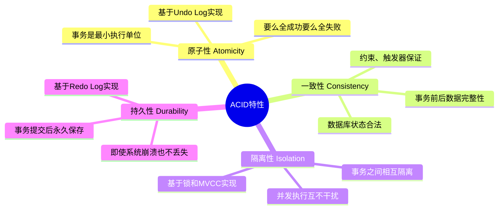

| 特性 | 英文 | 核心含义 | 实现机制 |
|------|------|----------|----------|
| **原子性** | Atomicity | 事务是不可分割的最小执行单位 | Undo Log |
| **一致性** | Consistency | 事务执行前后，数据库从一个一致状态变为另一个一致状态 | 约束、触发器 |
| **隔离性** | Isolation | 多个事务并发执行时，一个事务的执行不应影响其他事务 | 锁、MVCC |
| **持久性** | Durability | 事务一旦提交，对数据库的改变就是永久的 | Redo Log |

***

## 二、事务隔离级别

### 2. MySQL的事务隔离级别有哪些？默认是什么？

**答案：**

SQL标准定义了四种事务隔离级别：

| 隔离级别 | 脏读 | 不可重复读 | 幻读 | 加锁读 | 性能 |
|----------|------|------------|------|--------|------|
| **READ UNCOMMITTED** | ✅ 可能 | ✅ 可能 | ✅ 可能 | ❌ 否 | 最高 |
| **READ COMMITTED** | ❌ 否 | ✅ 可能 | ✅ 可能 | ❌ 否 | 较高 |
| **REPEATABLE READ** | ❌ 否 | ❌ 否 | ⚠️ 部分避免 | ❌ 否 | 中等 |
| **SERIALIZABLE** | ❌ 否 | ❌ 否 | ❌ 否 | ✅ 是 | 最低 |

**MySQL默认隔离级别：REPEATABLE READ（可重复读）**

> 注意：InnoDB 通过 Next-Key Lock 机制在很大程度上避免了幻读问题。

### 3. 什么是脏读、不可重复读、幻读？请分别举例说明。

**答案：**

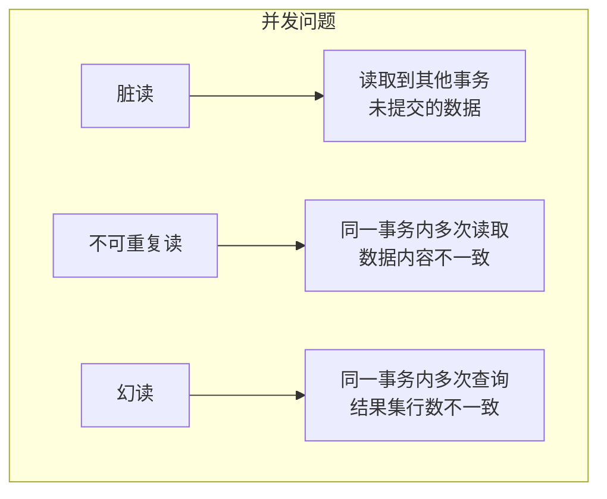

**脏读（Dirty Read）：**

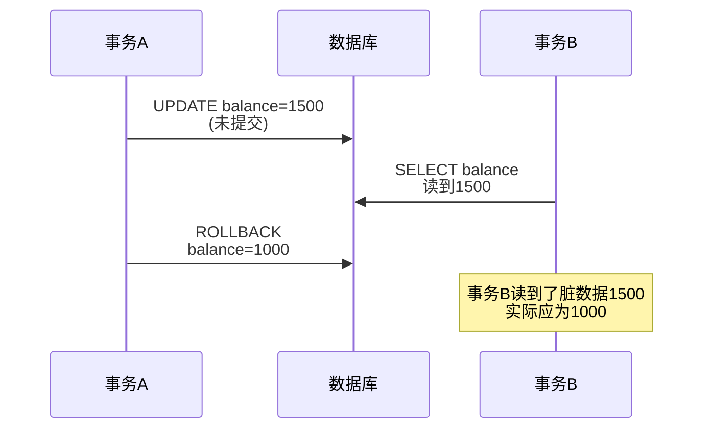

**不可重复读（Non-repeatable Read）：**

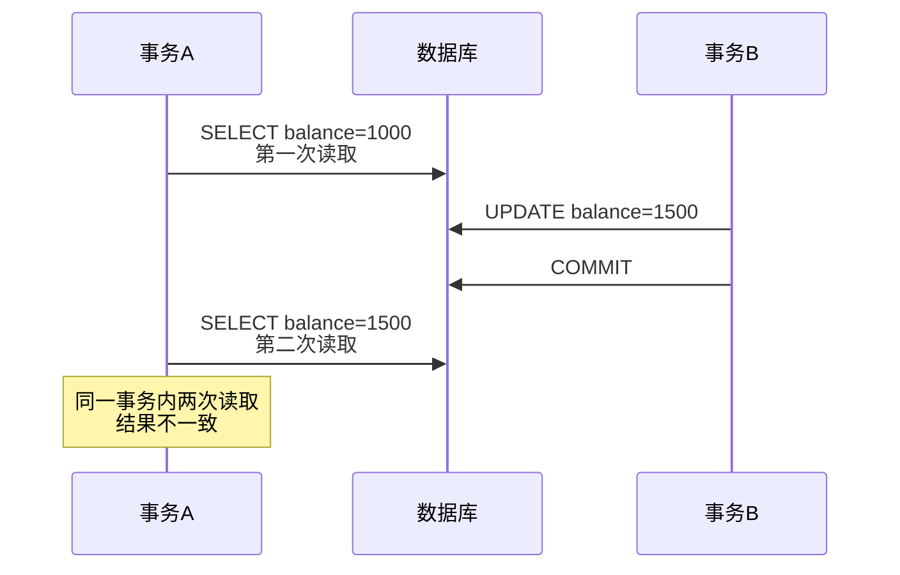

**幻读（Phantom Read）：**

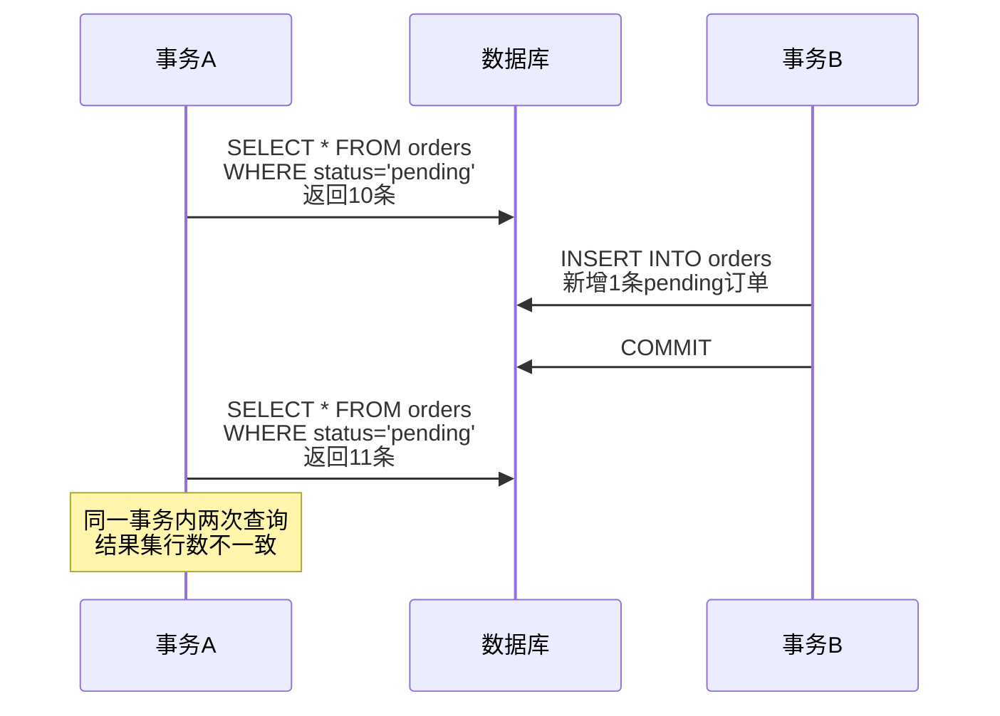

**三者的区别：**

| 问题 | 定义 | 侧重点 | 解决隔离级别 |
|------|------|--------|-------------|
| **脏读** | 读取未提交数据 | 数据是否已提交 | READ COMMITTED |
| **不可重复读** | 同一事务多次读取，数据内容变化 | 数据内容变化 | REPEATABLE READ |
| **幻读** | 同一事务多次查询，结果集行数变化 | 结果集行数变化 | SERIALIZABLE |

### 4. 为什么MySQL默认使用REPEATABLE READ而不是READ COMMITTED？

**答案：**

1. **数据一致性更强**：REPEATABLE READ 保证事务内多次读取同一数据结果一致，适合对账、报表等场景
2. **幻读问题已解决**：InnoDB 通过 Next-Key Lock（行锁+间隙锁）机制在很大程度上避免了幻读
3. **MVCC支持**：通过 Read View 实现，性能开销可接受
4. **主从复制一致性**：基于语句的复制在 READ COMMITTED 下可能出现问题

### 5. REPEATABLE READ是如何实现可重复读的？

**答案：**

**实现机制：**

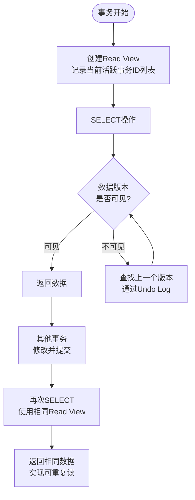

**核心原理：**
- 事务开始时创建一致性视图（Read View）
- 记录当前活跃的事务ID列表
- 后续所有读取操作都基于该视图判断数据可见性
- 通过 Undo Log 获取历史版本数据

***

## 三、死锁相关

### 6. 什么是死锁？死锁产生的四个必要条件是什么？

**答案：**

**死锁定义：**
死锁是指两个或多个事务在同一资源上相互占用，并请求锁定对方占用的资源，从而导致恶性循环的现象。

**死锁示例：**

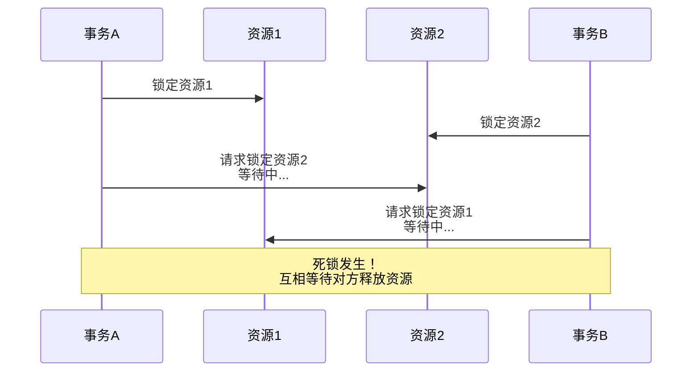

**死锁产生的四个必要条件：**

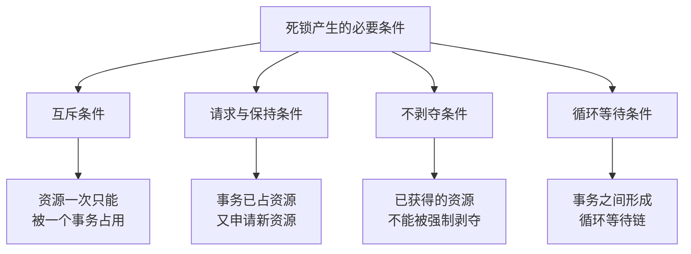

| 条件 | 说明 |
|------|------|
| **互斥条件** | 资源一次只能被一个事务占用 |
| **请求与保持条件** | 事务已持有资源，又申请新的资源 |
| **不剥夺条件** | 已获得的资源不能被其他事务强行剥夺 |
| **循环等待条件** | 事务之间形成循环等待链 |

### 7. MySQL如何检测和处理死锁？

**答案：**

**死锁检测机制：**

InnoDB 通过 **等待图（Wait-for Graph）** 算法自动检测死锁：


当检测到循环等待时，即判定发生死锁。

**死锁处理策略：**

1. **自动检测与回滚**：InnoDB 自动检测死锁，选择**代价最小**的事务进行回滚（通常是 Undo Log 较小的事务）
2. **超时回滚**：设置 `innodb_lock_wait_timeout`（默认50秒），超时后自动回滚

**查看死锁信息：**
```sql
-- 查看死锁日志
SHOW ENGINE INNODB STATUS;
-- 查找 LATEST DETECTED DEADLOCK 部分
```

### 8. 如何预防死锁？

**答案：**

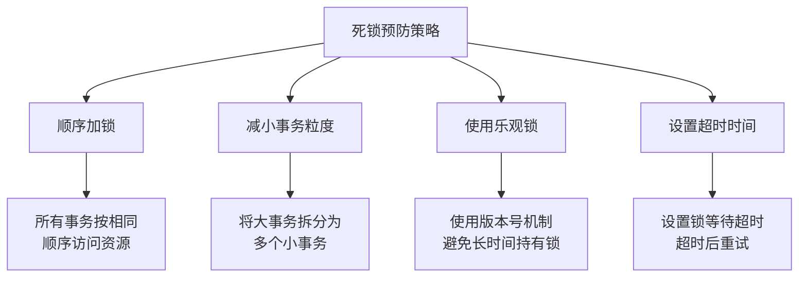

**具体策略：**

1. **固定加锁顺序**：确保所有事务以相同的顺序访问表和行
   ```sql
   -- 按主键升序加锁
   SELECT * FROM account WHERE id IN (3,1,2) ORDER BY id FOR UPDATE;
   ```

2. **减小事务粒度**：将大事务拆分为多个小事务，缩短锁持有时间

3. **使用乐观锁**：通过版本号机制避免长时间持有锁
   ```sql
   UPDATE account SET balance = balance - 100, version = version + 1 
   WHERE id = 1 AND version = 1;
   ```

4. **设置合理的超时时间**：
   ```sql
   SET innodb_lock_wait_timeout = 10; -- 设置10秒超时
   ```

5. **避免在事务中进行用户交互**：减少事务执行时间

***

## 四、事务日志

### 9. Redo Log、Undo Log、Binlog有什么区别？

**答案：**

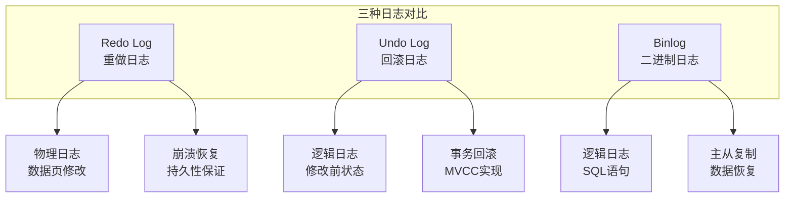

**详细对比：**

| 特性 | Redo Log | Undo Log | Binlog |
|------|----------|----------|--------|
| **层级** | 存储引擎层 | 存储引擎层 | Server 层 |
| **类型** | 物理日志 | 逻辑日志 | 逻辑日志 |
| **内容** | 数据页物理修改 | 修改前的数据状态 | 执行的SQL语句 |
| **用途** | 崩溃恢复 | 事务回滚、MVCC | 主从复制、数据恢复 |
| **写入方式** | 循环写 | 回滚段管理 | 追加写 |
| **文件** | ib_logfile0/1 | 回滚段 | mysql-bin.xxx |

### 10. 什么是WAL（预写式日志）机制？

**答案：**

**WAL核心思想：**


**先写日志，再写磁盘：** 当数据修改时，先将修改记录到 Redo Log，事务即可提交成功，数据页可以稍后异步刷盘。

**优势：**
1. **性能提升**：顺序写代替随机写
2. **持久性保证**：日志写入成功即可认为事务提交成功
3. **崩溃恢复**：通过 Redo Log 恢复未刷盘的数据

### 11. 什么是两阶段提交？为什么需要两阶段提交？

**答案：**

**两阶段提交（2PC）流程：**

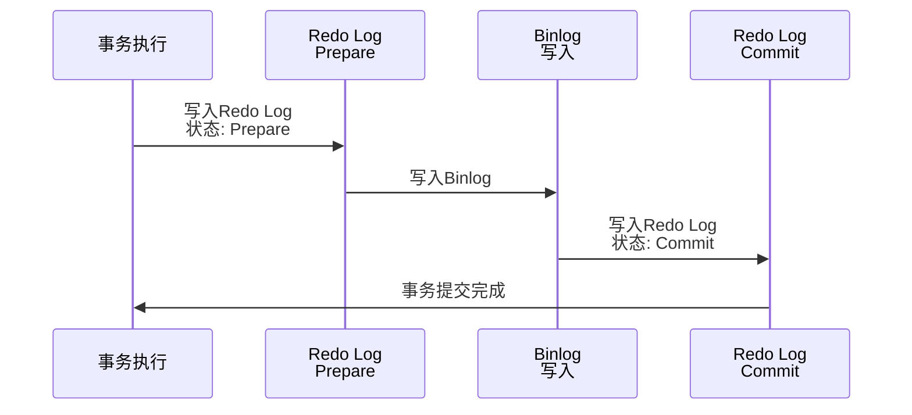

**阶段说明：**

| 阶段 | 操作 | 目的 |
|------|------|------|
| **Prepare 阶段** | 写入 Redo Log，状态标记为 PREPARE | 记录事务准备提交 |
| **Commit 阶段** | 写入 Binlog，Redo Log 标记为 COMMIT | 完成事务提交 |

**为什么需要两阶段提交？**

为了保证 Redo Log 和 Binlog 的一致性，避免出现"一个日志已写入，另一个未写入"的情况：

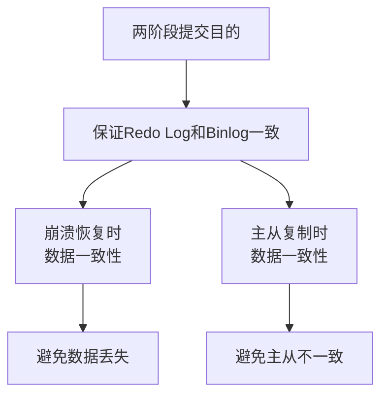

**崩溃恢复机制：**

```sql
-- 崩溃后恢复时：
-- 1. 如果Redo Log是Prepare状态，且Binlog存在该事务记录 → 提交事务
-- 2. 如果Redo Log是Prepare状态，但Binlog不存在该事务记录 → 回滚事务
```

### 12. Redo Log的刷盘策略有哪些？

**答案：**

通过 `innodb_flush_log_at_trx_commit` 参数控制：

| 值 | 策略 | 安全性 | 性能 | 适用场景 |
|----|------|--------|------|----------|
| **0** | 每秒刷盘 | 低 | 最高 | 对性能要求极高，可接受少量数据丢失 |
| **1** | 每次事务提交刷盘 | 最高 | 较低 | 默认设置，数据安全优先 |
| **2** | 每次提交写入OS Buffer | 较高 | 较高 | 平衡性能和安全性 |


***

## 五、综合面试题

### 13. 事务隔离级别越高越好吗？为什么？

**答案：**

**不是越高越好。**

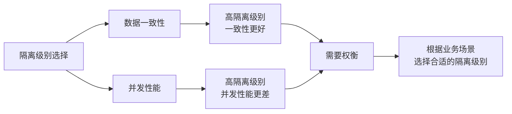

**原因：**

1. **并发性能下降**：隔离级别越高，锁的粒度越大、持有时间越长，并发性能越差
2. **死锁概率增加**：SERIALIZABLE 级别下，死锁概率显著增加
3. **业务场景不同**：不同业务对数据一致性的要求不同

**选择建议：**
- 一般业务：REPEATABLE READ（MySQL默认）
- 对实时性要求高：READ COMMITTED
- 对一致性要求极高：SERIALIZABLE

### 14. 在REPEATABLE READ隔离级别下，事务A提交的数据，事务B能看到吗？

**答案：**

**分情况讨论：快照读 vs 当前读**

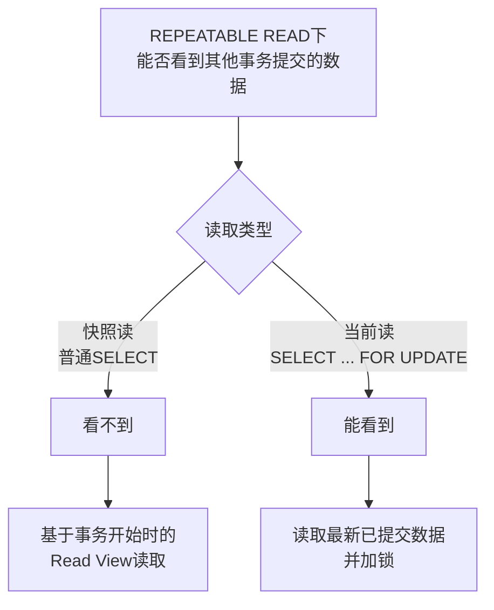

**情况1：快照读（普通SELECT）→ 看不到**
```sql
-- 事务B
START TRANSACTION;
SELECT balance FROM account WHERE user_id = 'A';  -- 结果：1000
-- 生成Read View
-- 事务A提交修改 balance = 1500
SELECT balance FROM account WHERE user_id = 'A';  -- 结果：1000（看不到变化）
COMMIT;
```

**情况2：当前读（SELECT ... FOR UPDATE）→ 能看到**
```sql
-- 事务B
START TRANSACTION;
SELECT balance FROM account WHERE user_id = 'A' FOR UPDATE;  -- 结果：1500
-- 读取最新已提交数据并加锁
COMMIT;
```

### 15. MyISAM存储引擎支持事务吗？为什么不支持？

**答案：**

**MyISAM不支持事务。**

**原因：**

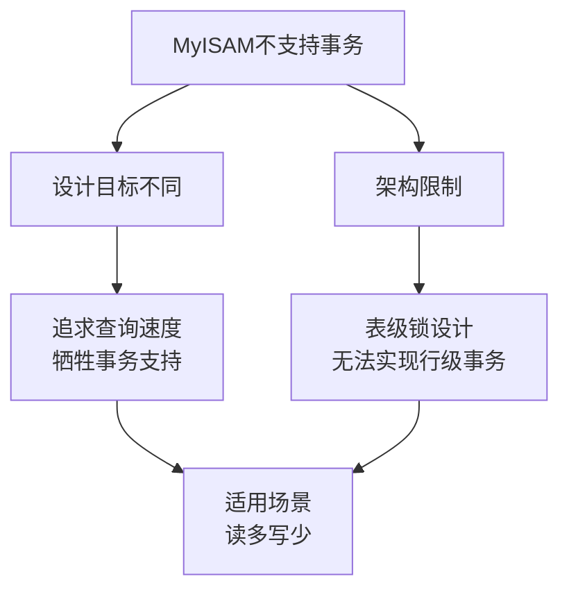

1. **设计目标**：MyISAM 设计目标是查询速度，而非事务完整性
2. **锁机制**：MyISAM 只支持表级锁，无法支持行级事务
3. **日志机制**：MyISAM 没有 Redo Log 和 Undo Log 机制
4. **崩溃恢复**：MyISAM 崩溃后无法自动恢复，需要手动修复

**对比：**

| 特性 | InnoDB | MyISAM |
|------|--------|--------|
| 事务支持 | ✅ 完整ACID | ❌ 不支持 |
| 锁粒度 | 行级锁 | 表级锁 |
| 崩溃恢复 | ✅ 自动恢复 | ❌ 需手动修复 |
| 适用场景 | OLTP、高并发 | 读多写少、报表 |

***

## 六、面试技巧总结

### 高频考点分布

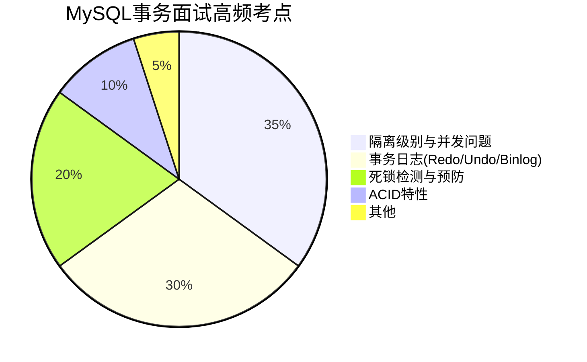

### 答题要点

1. **理解原理**：不仅要记住概念，还要理解实现机制（如MVCC、Next-Key Lock）

2. **结合实际**：举例说明问题场景和解决方案

3. **对比分析**：善于对比不同隔离级别、不同日志类型的区别

4. **关注细节**：注意MySQL默认隔离级别是REPEATABLE READ，与Oracle不同

5. **性能权衡**：理解隔离级别与并发性能的权衡关系

### 常见陷阱

| 陷阱 | 正确理解 |
|------|----------|
| REPEATABLE READ完全避免幻读 | InnoDB通过Next-Key Lock**很大程度上**避免，但不是完全避免 |
| 所有存储引擎都支持事务 | 只有InnoDB支持完整事务，MyISAM不支持 |
| 隔离级别越高越好 | 需要在一致性和性能之间权衡 |
| 死锁可以完全避免 | 死锁是并发下的正常现象，应设计重试机制 |

***

## 参考资源

- [高性能MySQL（第3版）第1章 1.3节](https://book.douban.com/subject/23008813/)
- [MySQL官方文档 - 事务隔离级别](https://dev.mysql.com/doc/refman/8.0/en/innodb-transaction-isolation-levels.html)
- [JavaGuide - MySQL事务隔离级别详解](https://github.com/Snailclimb/JavaGuide/blob/main/docs/database/mysql/transaction-isolation-level.md)
