# 1.3 事务

> 本文档基于《高性能MySQL》（第3版）第1章1.3节内容整理总结

事务是数据库管理系统执行过程中的一个逻辑单位，由一个有限的数据库操作序列构成。事务将多个操作捆绑在一起，确保这些操作要么全部成功执行，要么全部不执行，从而维护数据库的完整性。

***

## 1.3.1 隔离级别

SQL标准定义了四种事务隔离级别，每种级别都规定了事务中所做的修改在何时对其他事务可见，以及在事务内能够看到其他事务所做修改的程度。

### 四种隔离级别对比

| 隔离级别 | 脏读 | 不可重复读 | 幻读 | 加锁读 | 性能 |
|----------|------|------------|------|--------|------|
| READ UNCOMMITTED | ✅ 可能 | ✅ 可能 | ✅ 可能 | ❌ 否 | 最高 |
| READ COMMITTED | ❌ 否 | ✅ 可能 | ✅ 可能 | ❌ 否 | 较高 |
| REPEATABLE READ | ❌ 否 | ❌ 否 | ⚠️ 部分避免 | ❌ 否 | 中等 |
| SERIALIZABLE | ❌ 否 | ❌ 否 | ❌ 否 | ✅ 是 | 最低 |

> **注意：** MySQL InnoDB 的默认隔离级别是 **REPEATABLE READ**，通过 Next-Key Lock 机制在很大程度上避免了幻读问题。

### 1. READ UNCOMMITTED（读未提交）

**定义：** 最低的隔离级别，事务可以读取到其他事务尚未提交的数据。

**特点：**
- 事务对数据的修改即使未提交，也会立即被其他事务看到
- 会导致脏读、不可重复读和幻读所有问题
- 性能最高，但数据一致性最差

**脏读示例：**

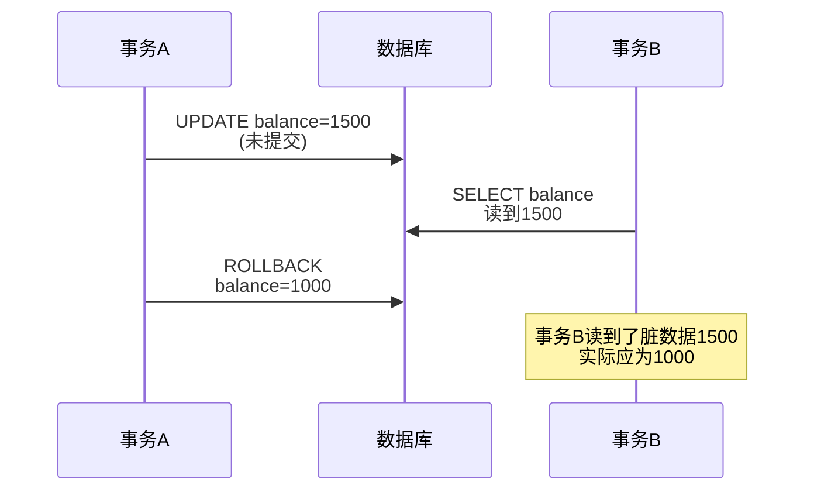

**适用场景：** 对数据一致性要求极低、主要用于统计分析且允许数据暂时不一致的场景。

### 2. READ COMMITTED（读已提交）

**定义：** 事务只能读取到其他事务已经提交的数据，避免了脏读。

**特点：**
- 每次 SELECT 都会创建一个新的数据快照
- 避免了脏读，但仍可能出现不可重复读和幻读
- Oracle、PostgreSQL 等数据库的默认隔离级别

**不可重复读示例：**

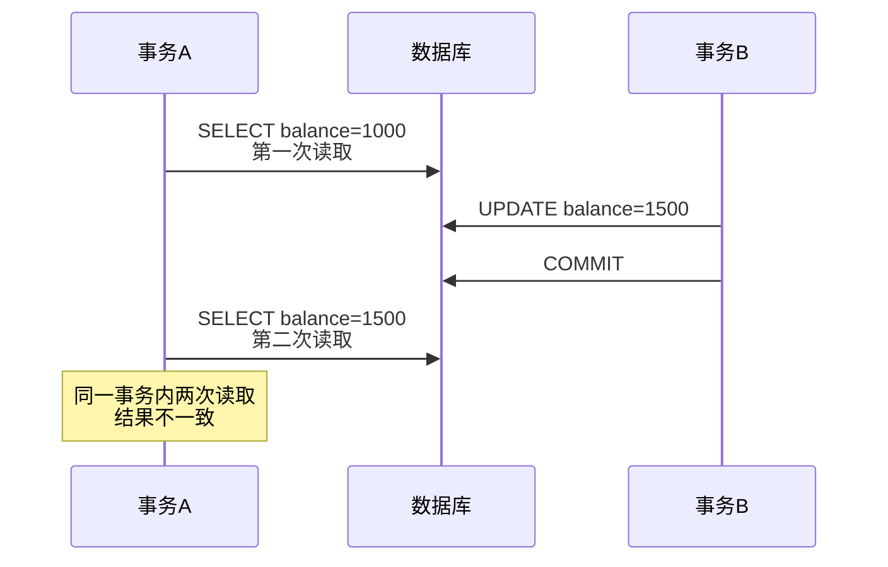

**适用场景：** 大多数业务系统，适用于对数据实时性要求较高、能够接受同一事务内多次查询结果可能变化的场景。

### 3. REPEATABLE READ（可重复读）

**定义：** MySQL InnoDB 的默认隔离级别，保证在同一个事务中多次读取同一数据的结果一致。

**特点：**
- 事务开始时创建一致性视图（Read View），后续所有读取都基于该视图
- 避免了脏读和不可重复读
- 通过 Next-Key Lock 机制在很大程度上避免了幻读

**实现机制：**

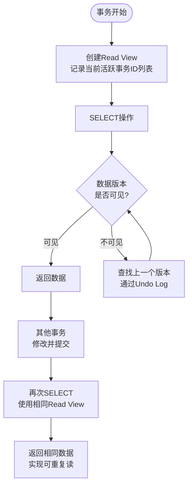

**Next-Key Lock 机制：**


Next-Key Lock = 行锁 + 间隙锁，防止其他事务在锁定范围内插入新记录。

**适用场景：** 需要保证事务内多次读取相同数据结果一致的场景，如对账、报表生成等。

### 4. SERIALIZABLE（串行化）

**定义：** 最高的隔离级别，强制所有事务串行执行，完全避免并发问题。

**特点：**
- 所有的 SELECT 语句都会被隐式转换为 SELECT ... LOCK IN SHARE MODE
- 读取的数据会加共享锁，写操作会加排他锁
- 解决了脏读、不可重复读和幻读所有问题
- 并发性能最差，容易导致锁等待和死锁

**适用场景：** 对数据准确性要求极高、并发量不大、可以接受性能损失的场景，如银行核心系统的资金调拨。

***

## 1.3.2 死锁

### 什么是死锁

死锁是指两个或多个事务在同一资源上相互占用，并请求锁定对方占用的资源，从而导致恶性循环的现象。

### 死锁示例

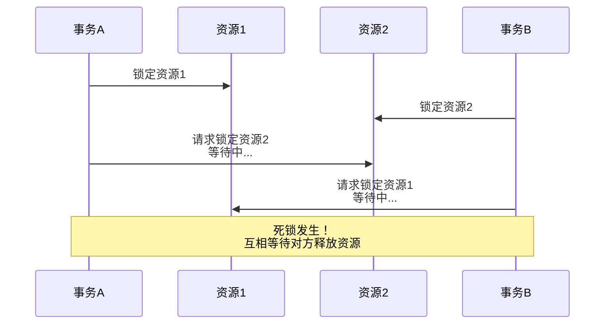

### 死锁产生的四个必要条件

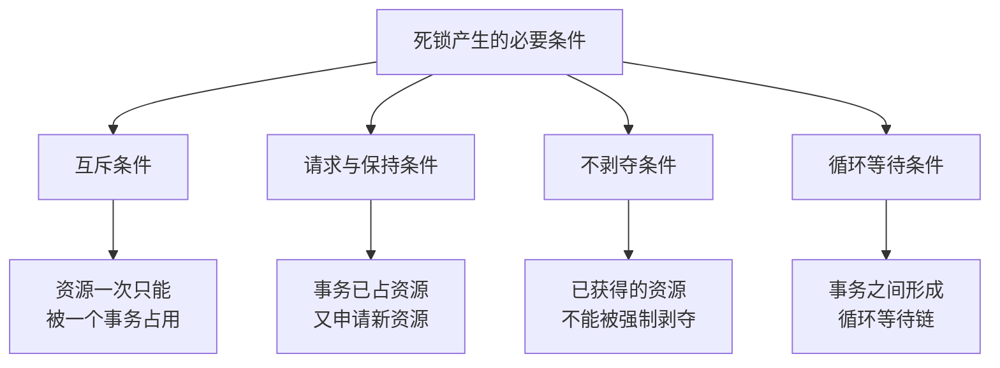

### 死锁检测与处理

**1. 死锁检测机制**

InnoDB 存储引擎通过 **等待图（Wait-for Graph）** 算法自动检测死锁：


当检测到循环等待时，即判定发生死锁。

**2. 死锁处理策略**

- **超时回滚：** 设置 `innodb_lock_wait_timeout`（默认50秒），超时后自动回滚
- **主动检测：** InnoDB 自动检测死锁，选择**代价最小**的事务进行回滚
- **死锁日志：** 通过 `SHOW ENGINE INNODB STATUS` 查看死锁信息

**3. 死锁预防策略**

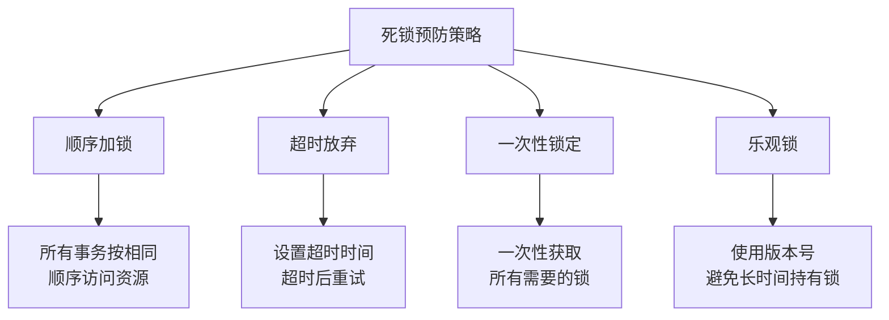

### 死锁与事务隔离级别

| 隔离级别 | 死锁可能性 | 原因 |
|----------|------------|------|
| READ UNCOMMITTED | 极低 | 几乎不加锁 |
| READ COMMITTED | 较低 | 锁持有时间短 |
| REPEATABLE READ | 中等 | 间隙锁增加锁范围 |
| SERIALIZABLE | 高 | 大量共享锁和排他锁冲突 |

***

## 1.3.3 事务日志

事务日志是 InnoDB 存储引擎实现事务持久性和崩溃恢复的核心机制，采用 **预写式日志（Write-Ahead Logging, WAL）** 策略。

### WAL 核心思想


**先写日志，再写磁盘：** 当数据修改时，先将修改记录到日志，事务即可提交成功，数据页可以稍后异步刷盘。

### Redo Log（重做日志）

**定义：** InnoDB 引擎特有的物理日志，记录"在某个数据页上做了什么修改"。

**核心作用：**

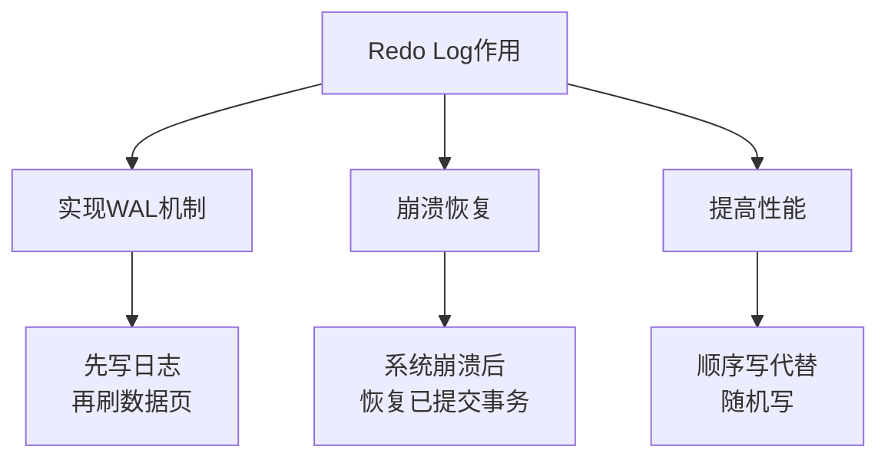

**Redo Log 结构：**

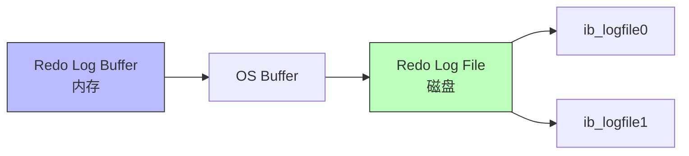

**刷盘策略（`innodb_flush_log_at_trx_commit`）：**

| 值 | 策略 | 安全性 | 性能 |
|----|------|--------|------|
| 0 | 每秒刷盘 | 低 | 最高 |
| 1 | 每次事务提交刷盘 | 最高 | 较低 |
| 2 | 每次提交写入OS Buffer | 较高 | 较高 |

### Undo Log（回滚日志）

**定义：** 逻辑日志，记录"修改前的数据状态"，用于事务回滚和MVCC。

**核心作用：**

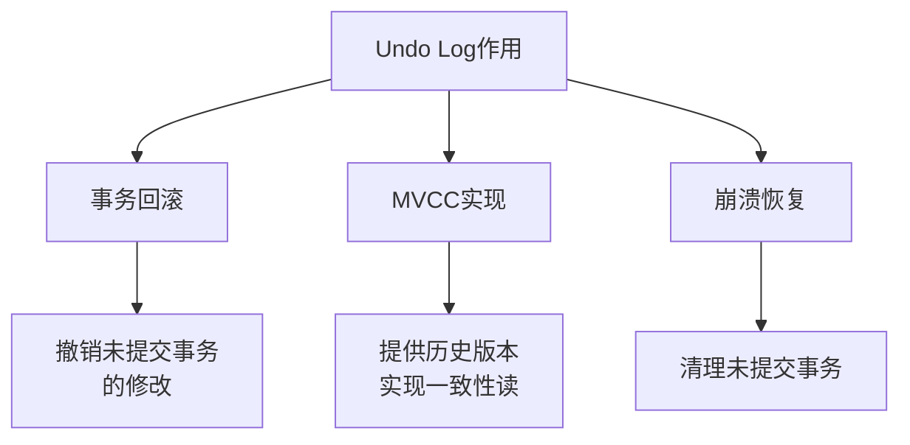

**Undo Log 与 MVCC：**


每个数据行的隐藏列中包含指向 Undo Log 的指针，形成版本链。

### Binlog（二进制日志）

**定义：** MySQL Server 层的逻辑日志，记录所有修改数据的 SQL 语句。

**与 Redo Log 的区别：**

| 特性 | Redo Log | Binlog |
|------|----------|--------|
| 层级 | 存储引擎层 | Server 层 |
| 类型 | 物理日志 | 逻辑日志 |
| 内容 | 数据页修改 | SQL语句 |
| 用途 | 崩溃恢复 | 主从复制、数据恢复 |
| 写入方式 | 循环写 | 追加写 |

**两阶段提交：**

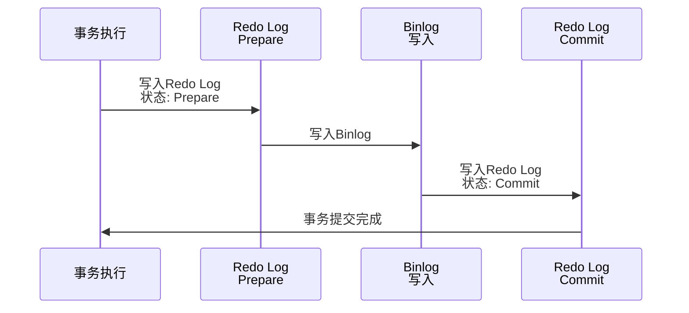

两阶段提交保证了 Redo Log 和 Binlog 的一致性，避免主从数据不一致。

***

## 1.3.4 MySQL 中的事务

### 自动提交（AUTOCOMMIT）

MySQL 默认采用自动提交模式，每条 SQL 语句都会被当作一个独立的事务自动提交。

```sql
-- 查看自动提交状态
SHOW VARIABLES LIKE 'autocommit';

-- 关闭自动提交
SET autocommit = 0;

-- 开启事务
START TRANSACTION;
-- 或
BEGIN;

-- 提交事务
COMMIT;

-- 回滚事务
ROLLBACK;
```

### 事务控制语句

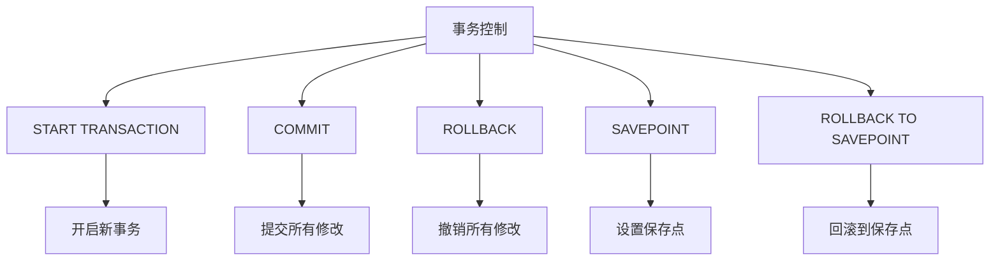

### 隐式提交

某些语句会导致当前事务被隐式提交：

- DDL 语句（CREATE、ALTER、DROP 等）
- 隐式使用或修改 mysql 数据库中的表
- 事务控制或锁定语句（BEGIN、START TRANSACTION 等）
- 加载数据的语句（LOAD DATA）
- 复制相关的语句

### 事务与存储引擎

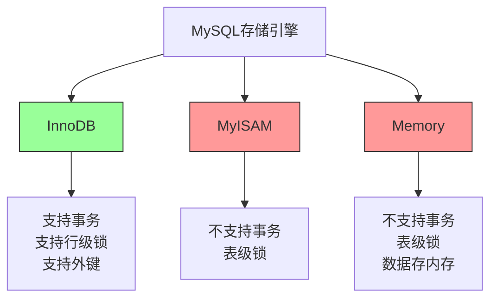

**重要提示：** 只有 InnoDB 存储引擎支持完整的事务功能，MyISAM 不支持事务。

### 长事务的风险

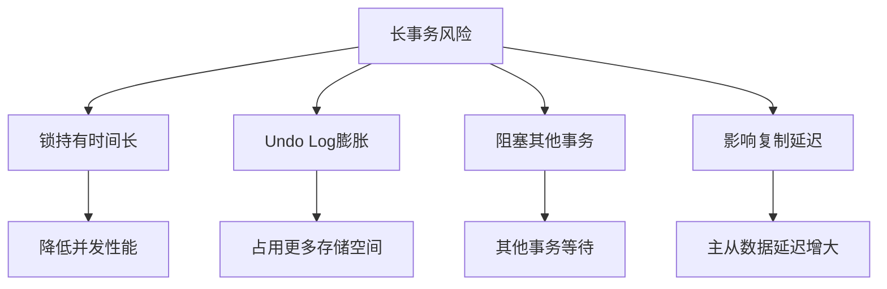

**最佳实践：**
- 尽量缩短事务执行时间
- 避免在事务中进行用户交互
- 将大事务拆分为多个小事务
- 及时提交或回滚事务

***

## 总结

### 事务核心概念图

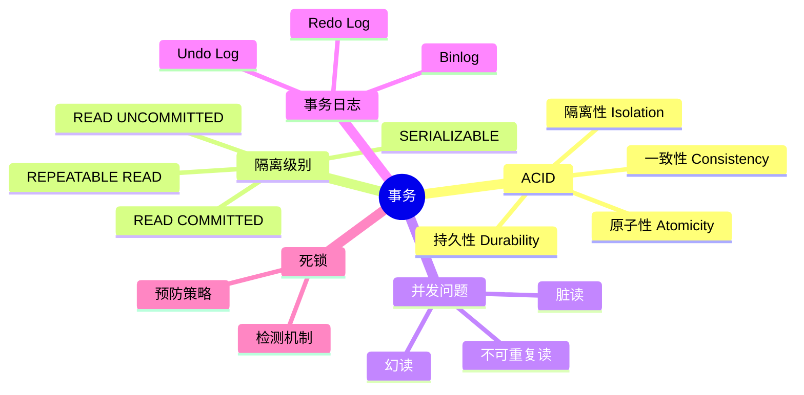

### 关键要点

1. **隔离级别选择：** 根据业务需求选择合适的隔离级别，在一致性和性能之间取得平衡
2. **死锁处理：** 应用程序应设计为重试机制，而不是试图完全避免死锁
3. **日志机制：** 理解 Redo Log、Undo Log 和 Binlog 的作用和区别
4. **存储引擎：** 需要事务支持时，必须使用 InnoDB 存储引擎
5. **事务设计：** 保持事务短小精悍，避免长事务带来的各种问题

### 参考资源

- 《高性能MySQL》（第3版）第1章 1.3节
- MySQL 官方文档：[Transaction Isolation Levels](https://dev.mysql.com/doc/refman/8.0/en/innodb-transaction-isolation-levels.html)
- InnoDB 事务模型：[InnoDB Transaction Model](https://dev.mysql.com/doc/refman/8.0/en/innodb-transaction-model.html)
