# 1.4 多版本并发控制（MVCC）

> 本文档基于《高性能MySQL》（第3版）第1章1.4节内容整理总结

多版本并发控制（Multi-Version Concurrency Control，MVCC）是MySQL InnoDB存储引擎实现高并发、高性能事务处理的核心机制。它通过保存数据在某个时间点的快照来实现并发控制，使得读操作不会阻塞写操作，写操作也不会阻塞读操作，从而大大提高了数据库的并发性能。

***

## 什么是MVCC

MVCC的本质是**"多版本数据隔离"**——InnoDB为表中的每一行数据维护多个历史版本，每个版本都关联一个事务ID。当事务读取数据时，不会直接读取最新版本，而是根据自身事务的隔离级别，读取符合条件的"历史版本"，从而避免与写操作产生锁竞争。

### 核心特点

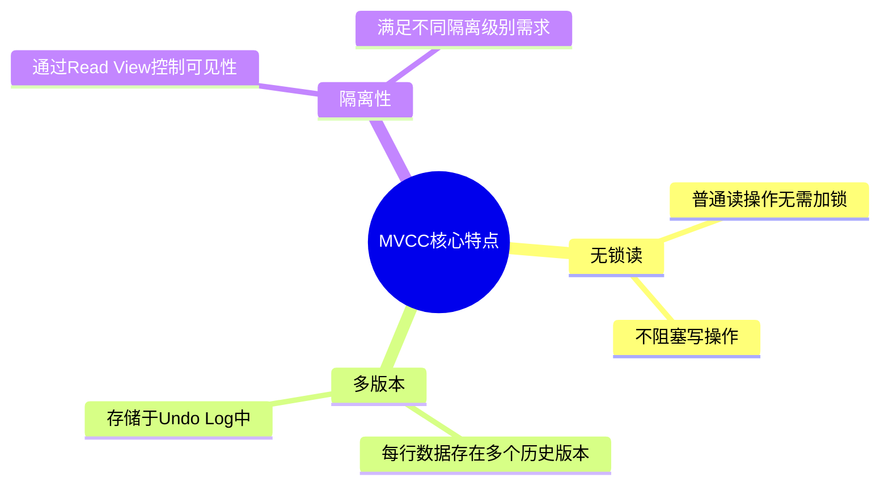

| 特性 | 说明 |
|------|------|
| **无锁读** | 普通读操作（快照读）无需加锁，不阻塞写操作 |
| **多版本** | 每行数据存在多个历史版本，存储于Undo Log中 |
| **隔离性** | 通过Read View控制不同事务对数据版本的可见性 |

### 为什么需要MVCC

在没有MVCC的情况下，MySQL只能通过"加锁"来解决读写冲突：

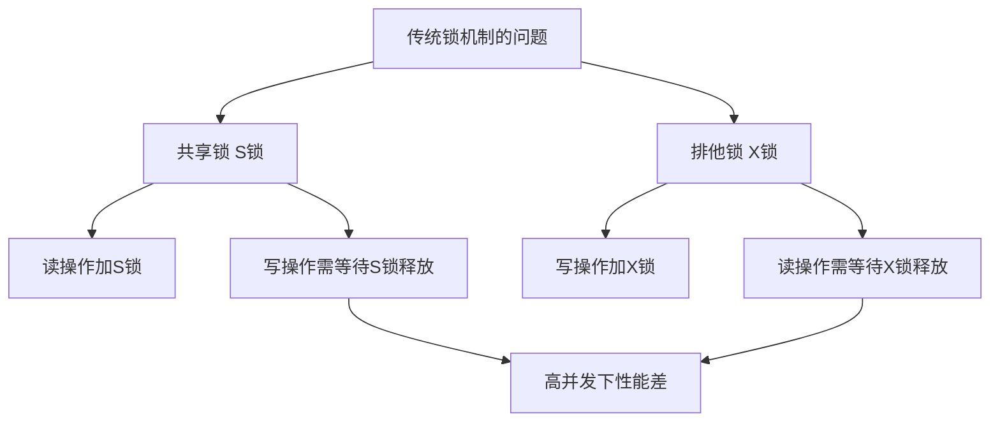

**MVCC的解决方案：**
- 读操作（快照读）读取历史版本，无需加锁
- 写操作修改数据时，生成新的版本
- 不影响旧版本的读取，实现"读写并行"

***

## MVCC的核心组件

MVCC的实现依赖InnoDB的三个核心组件，三者协同工作，完成"版本生成→版本串联→版本筛选"的全流程。

### 1. 隐藏字段（版本的基础）

InnoDB会为表中的每一行数据自动添加三个隐藏字段：

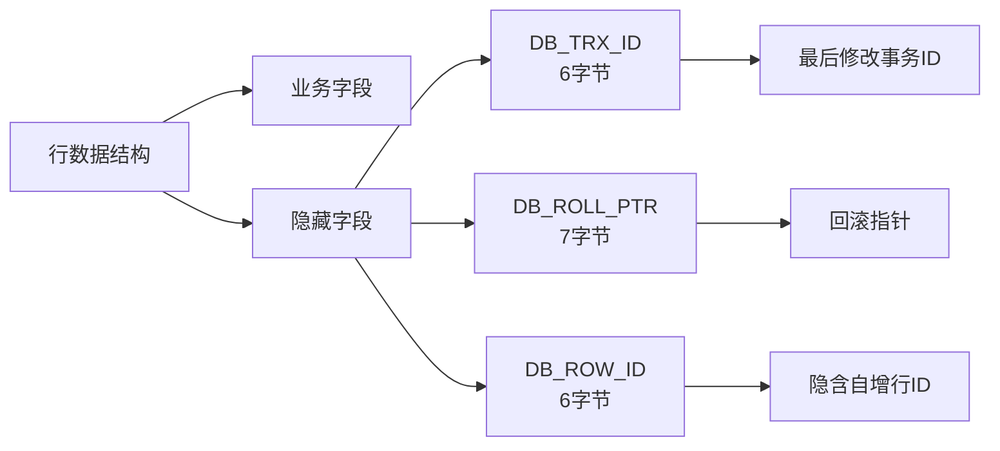

| 隐藏字段 | 长度 | 含义 | 核心作用 |
|----------|------|------|----------|
| **DB_TRX_ID** | 6字节 | 最近修改该行数据的事务ID | 标识该版本由哪个事务生成 |
| **DB_ROLL_PTR** | 7字节 | 回滚指针，指向Undo Log中该数据的上一个版本 | 串联多个历史版本，形成版本链 |
| **DB_ROW_ID** | 6字节 | 隐含自增行ID（表无主键时自动生成） | 用于唯一标识行 |

### 2. Undo Log（版本的存储载体）

Undo Log是InnoDB用于存储数据历史版本的日志文件，当事务对数据进行修改时，InnoDB会先将修改前的旧版本数据写入Undo Log。

**Undo Log的两种类型：**

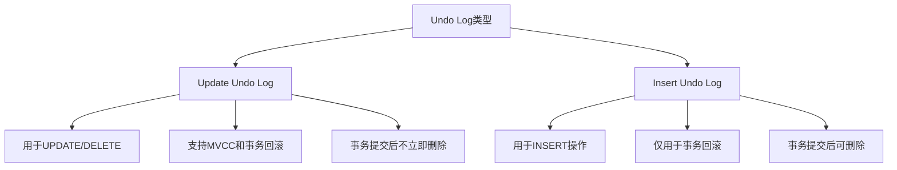

**版本链的形成：**

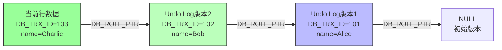

### 3. Read View（版本的筛选规则）

Read View是事务执行快照读时生成的一个"一致性视图"，它定义了当前事务能看到哪些版本的数据。

**Read View包含4个核心属性：**

| 属性 | 说明 |
|------|------|
| **trx_ids** | 生成Read View时，当前系统中所有活跃（未提交）的事务ID列表 |
| **min_trx_id** | trx_ids中的最小事务ID（当前最老的活跃事务） |
| **max_trx_id** | 下一个将要分配的事务ID（当前最大事务ID+1） |
| **creator_trx_id** | 生成该Read View的当前事务ID |

**可见性判断算法：**

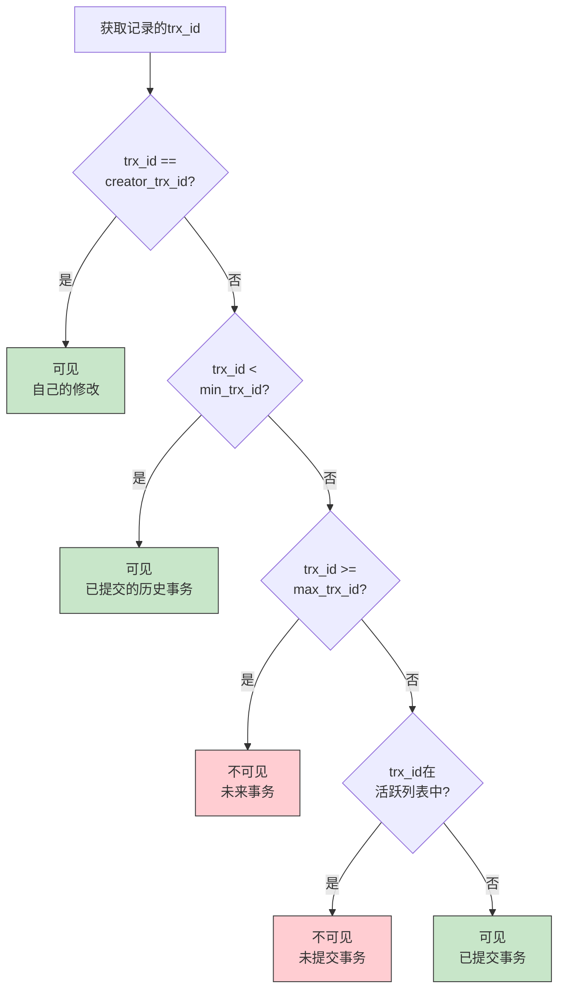

***

## MVCC的工作原理

### 快照读（Snapshot Read）

快照读是MVCC实现无锁读的核心机制，普通的SELECT语句就是快照读。

**快照读流程：**

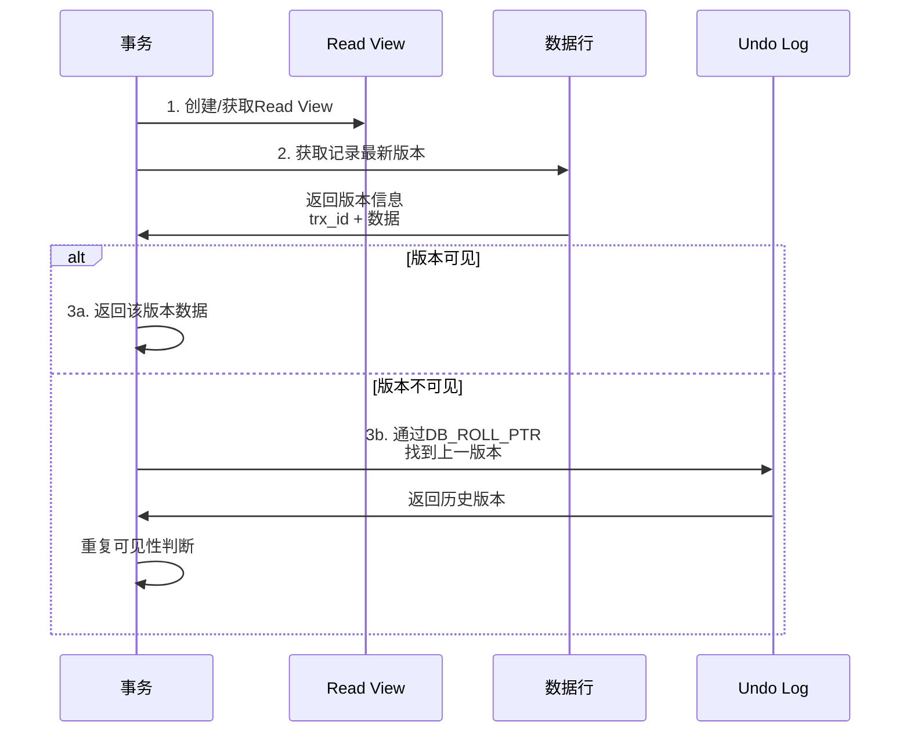

### 当前读（Current Read）

当前读读取的是最新版本的数据，需要加锁。以下操作属于当前读：
- SELECT ... FOR UPDATE
- SELECT ... LOCK IN SHARE MODE
- INSERT、UPDATE、DELETE

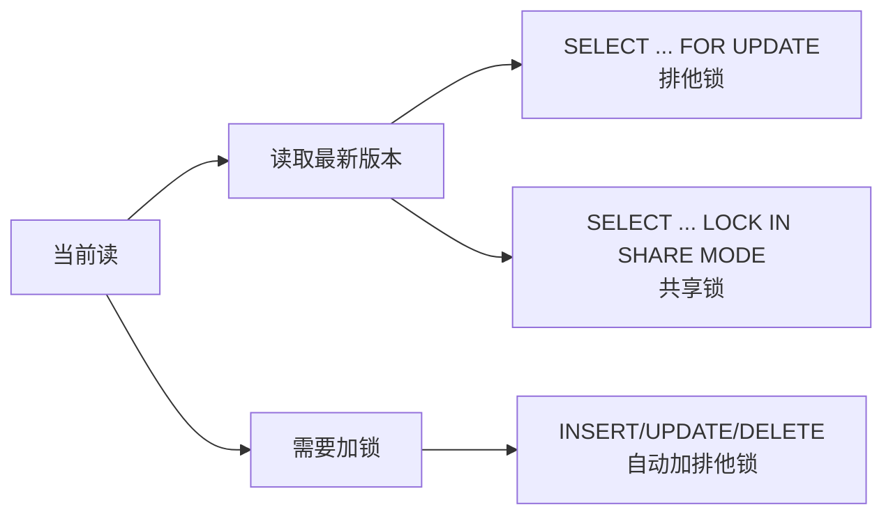

### MVCC与事务隔离级别

不同隔离级别下，Read View的生成时机不同：

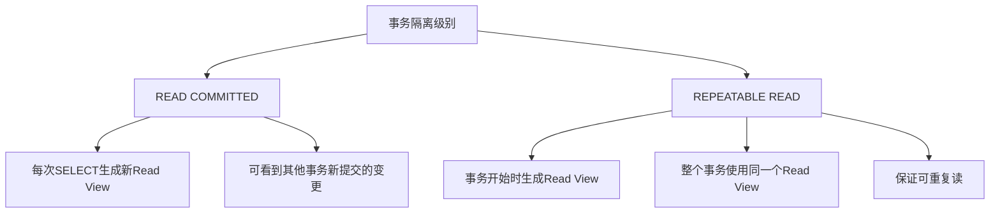

| 隔离级别 | Read View生成时机 | 效果 |
|----------|-------------------|------|
| **READ COMMITTED** | 每次SELECT时生成 | 可看到其他事务新提交的变更 |
| **REPEATABLE READ** | 事务开始时生成 | 整个事务看到的数据保持一致 |

### MVCC解决并发问题

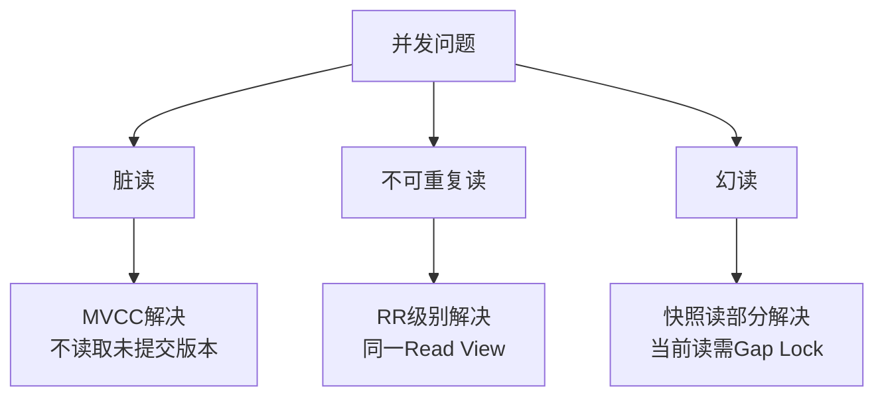

| 并发问题 | MVCC是否解决 | 说明 |
|----------|--------------|------|
| **脏读** | ✅ 解决 | 不读取未提交事务的版本 |
| **不可重复读** | ✅ RR级别解决 | 同一事务使用同一个Read View |
| **幻读** | ⚠️ 部分解决 | 快照读解决，当前读需要Gap Lock配合 |

***

## MVCC的实际应用

### 场景1：读写并发

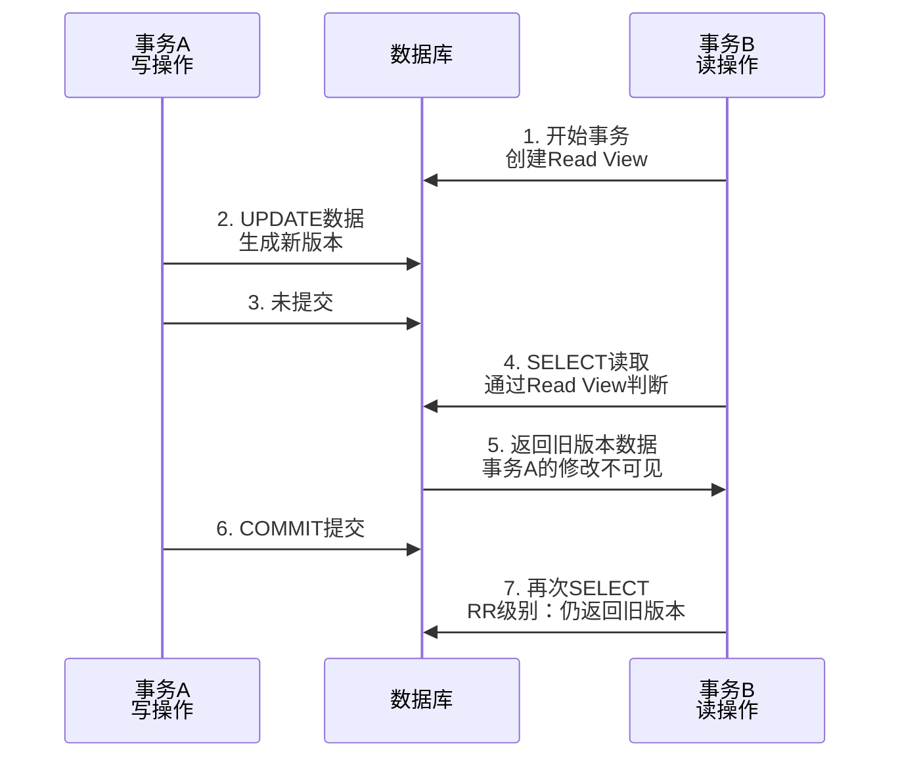

### 场景2：可重复读保证

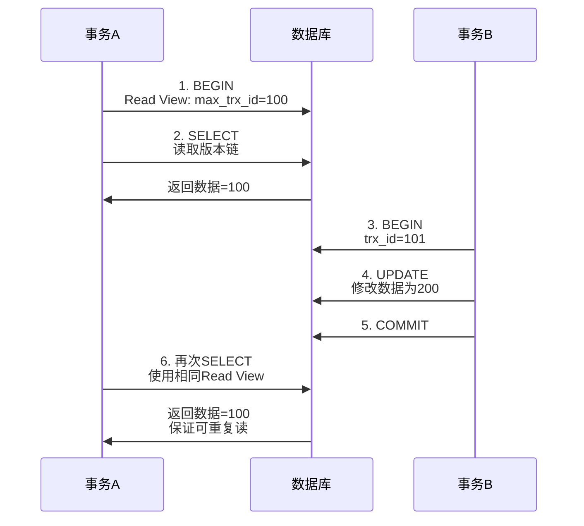

### 场景3：版本链遍历

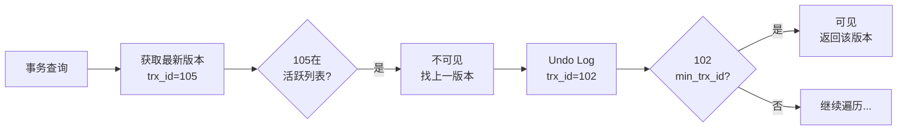

***

## MVCC的优势与局限性

### 优势

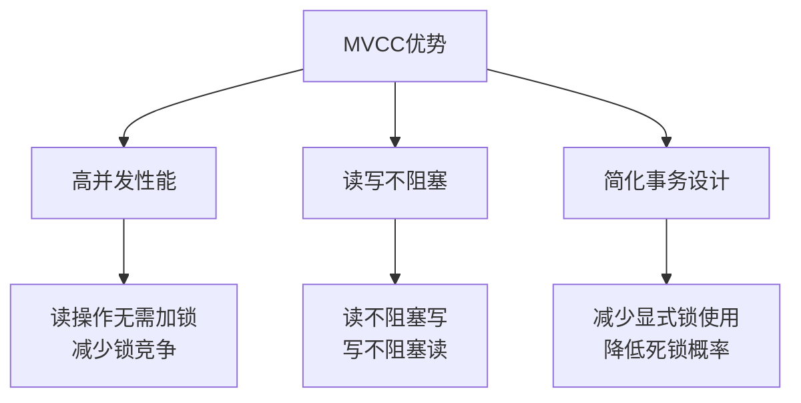

| 优势 | 说明 |
|------|------|
| **高并发性能** | 读操作无需加锁，减少锁竞争 |
| **读写不阻塞** | 读不阻塞写，写不阻塞读 |
| **简化事务设计** | 减少显式锁使用，降低死锁概率 |

### 局限性

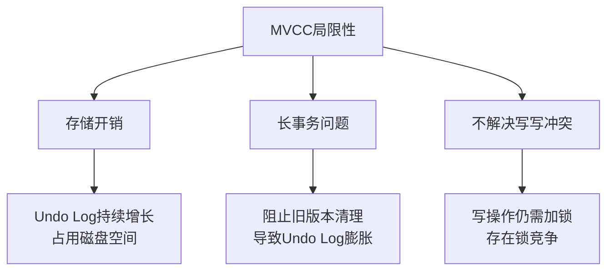

| 局限性 | 说明 | 解决方案 |
|--------|------|----------|
| **存储开销** | Undo Log持续增长，占用磁盘空间 | 合理设置Purge线程参数 |
| **长事务问题** | 长事务阻止旧版本清理 | 避免超长事务，及时提交 |
| **不解决写写冲突** | 写操作仍需加锁 | 使用行锁或乐观锁 |

### 最佳实践

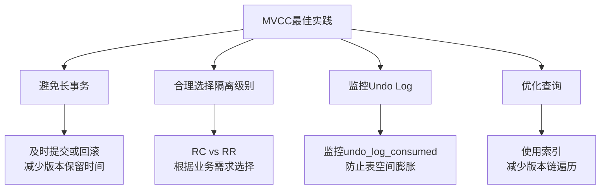

1. **避免长事务**：及时提交或回滚事务，减少版本保留时间
2. **合理选择隔离级别**：根据业务需求选择READ COMMITTED或REPEATABLE READ
3. **监控Undo Log**：关注`undo_log_consumed`指标，防止表空间膨胀
4. **优化查询**：使用索引减少版本链遍历深度

***

## 总结

### MVCC核心概念图

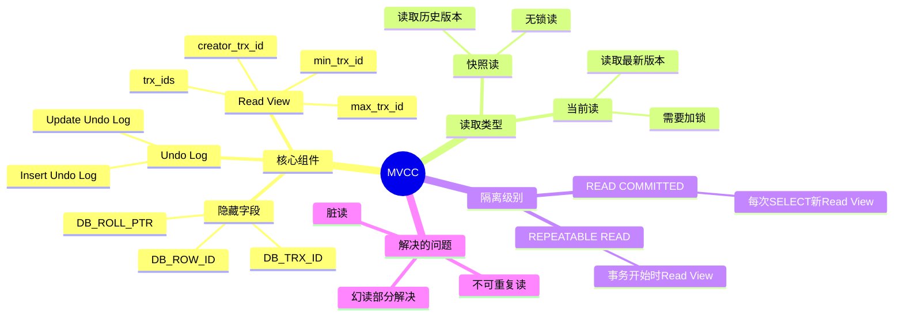

### 关键要点

1. **MVCC本质**：通过保存数据历史版本+控制版本可见性，实现高效并发控制
2. **核心组件**：隐藏字段、Undo Log、Read View三者协同工作
3. **读写分离**：快照读无锁，当前读加锁
4. **隔离级别差异**：RC每次SELECT生成新Read View，RR事务开始时生成
5. **注意事项**：避免长事务，监控Undo Log，合理选择隔离级别

### 参考资源

- 《高性能MySQL》（第3版）第1章 1.4节
- MySQL 官方文档：[InnoDB Multi-Versioning](https://dev.mysql.com/doc/refman/8.0/en/innodb-multi-versioning.html)
- InnoDB 事务模型：[Consistent Nonlocking Reads](https://dev.mysql.com/doc/refman/8.0/en/innodb-consistent-read.html)
