# 1.5 MySQL 的存储引擎

> 本文档基于《高性能MySQL》（第3版）第1章1.5节内容整理总结

MySQL 的存储引擎是数据库的核心组件，负责数据的存储、检索、索引管理和并发控制。MySQL 采用**可插拔存储引擎架构**，允许用户根据具体应用场景选择最合适的存储引擎。不同的存储引擎在事务支持、锁机制、索引实现、崩溃恢复等方面有着显著差异。

***

## 什么是存储引擎

存储引擎是 MySQL 中用于管理数据存储和检索的底层软件组件。它定义了：
- 数据如何在磁盘上存储
- 如何建立和维护索引
- 如何执行查询和更新操作
- 如何管理并发访问和事务

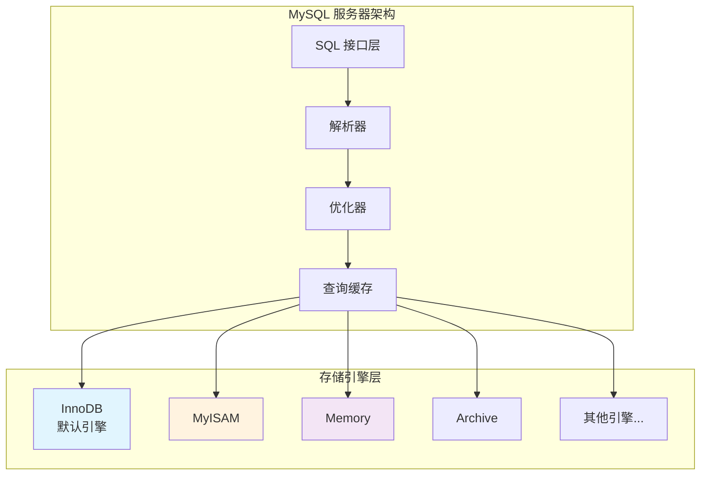

### 查看支持的存储引擎

```sql
-- 查看所有支持的存储引擎
SHOW ENGINES;

-- 查看默认存储引擎
SHOW VARIABLES LIKE 'default_storage_engine';

-- 查看特定表的存储引擎
SHOW TABLE STATUS LIKE 'table_name';

-- 查看表的创建语句（包含引擎信息）
SHOW CREATE TABLE table_name;
```

***

## 1.5.1 InnoDB 存储引擎

InnoDB 是 MySQL 5.5 及以后版本的**默认存储引擎**，也是目前最广泛使用的存储引擎。它专为高并发、事务密集型应用设计。

### 核心特性

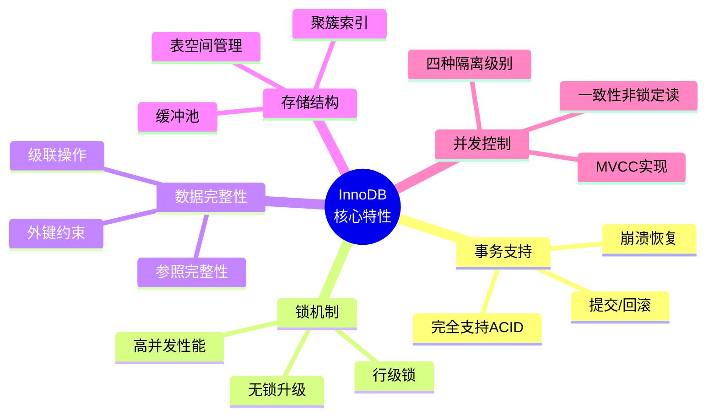

### 事务支持（ACID）

| 特性 | 说明 | 实现机制 |
|------|------|----------|
| **原子性** | 事务中的操作要么全部成功，要么全部失败回滚 | Undo Log |
| **一致性** | 事务执行前后，数据库始终处于一致状态 | 约束检查、触发器 |
| **隔离性** | 多个并发事务之间互不干扰 | MVCC、锁机制 |
| **持久性** | 事务提交后，数据永久保存 | Redo Log、Binlog |

### 存储结构

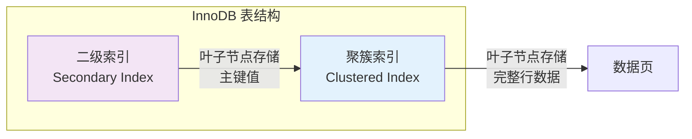

**聚簇索引特点：**
- 主键索引即聚簇索引，数据按主键顺序物理存储
- 主键查询性能极高，无需回表
- 二级索引叶子节点存储主键值，查询可能需要回表

### 适用场景

- ✅ 需要事务支持的应用（银行、电商订单）
- ✅ 高并发读写操作
- ✅ 需要外键约束的复杂关系数据库
- ✅ 对数据一致性和完整性要求高的场景

***

## 1.5.2 MyISAM 存储引擎

MyISAM 是 MySQL 5.5 之前的默认存储引擎，以其简单高效的结构在特定场景下仍有应用价值。

### 核心特性

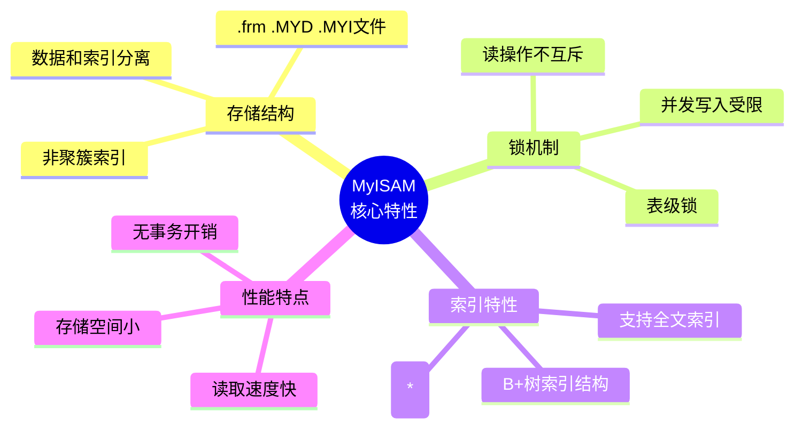

### 存储文件结构

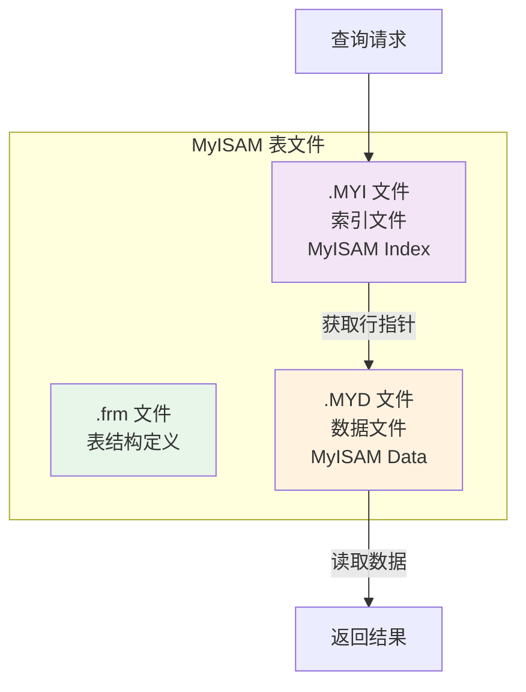

### 与 InnoDB 对比

| 特性 | InnoDB | MyISAM |
|------|--------|--------|
| **事务支持** | ✅ 完整 ACID | ❌ 不支持 |
| **锁粒度** | 行级锁 | 表级锁 |
| **外键约束** | ✅ 支持 | ❌ 不支持 |
| **崩溃恢复** | ✅ 自动恢复 | ❌ 需手动修复 |
| **存储结构** | 聚簇索引 | 非聚簇索引 |
| **全文索引** | 5.6+ 支持 | ✅ 原生支持 |
| **COUNT(*)** | 需扫描 | ✅ 快速统计 |
| **写性能** | 高并发优秀 | 并发写受限 |
| **读性能** | 优秀 | 简单查询更快 |

### 适用场景

- ✅ 只读或读多写少的应用
- ✅ 数据仓库、报表系统
- ✅ 日志记录、统计分析
- ✅ 不需要事务的小型应用

***

## 1.5.3 MySQL 内建的其他存储引擎

除 InnoDB 和 MyISAM 外，MySQL 还内置了多种专用存储引擎：

### Memory（HEAP）引擎


**适用场景：**
- 临时数据处理（会话存储、计算中间结果）
- 高速缓存层（热点数据缓存）
- 查找表、配置表

**配置优化：**
```sql
-- 设置最大内存表大小
SET max_heap_table_size = 64 * 1024 * 1024;  -- 64MB

-- 临时表优先使用 Memory 引擎
SET default_tmp_storage_engine = MEMORY;
```

### Archive 引擎

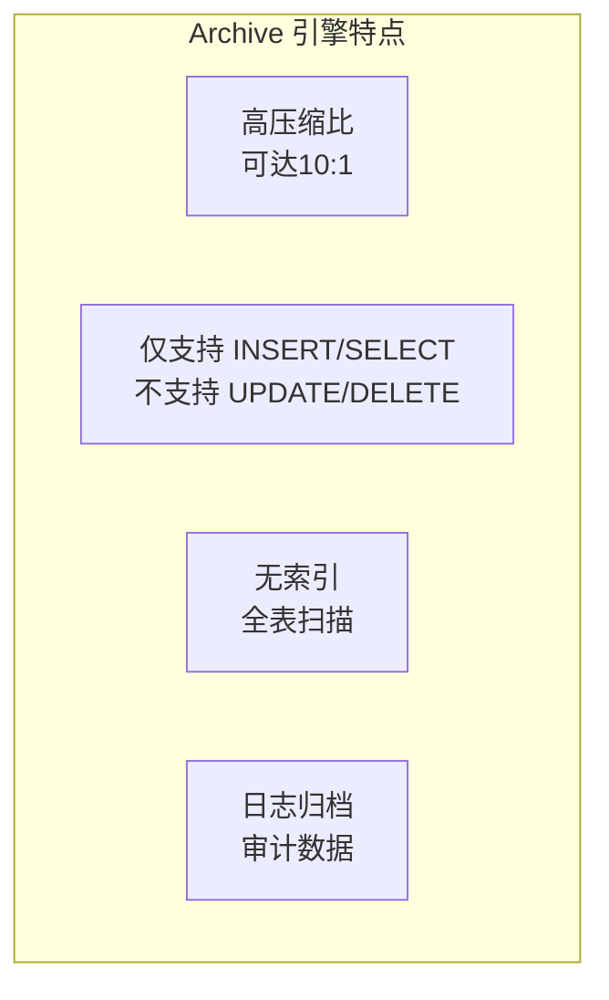

**适用场景：**
- 日志归档（应用日志、审计日志）
- 历史数据存储（长期保存、很少查询）
- 合规性存储（法律要求的只读数据存档）

### CSV 引擎


**适用场景：**
- 数据交换中转站
- 与其他系统共享数据
- 简单的导入导出

### Blackhole 引擎

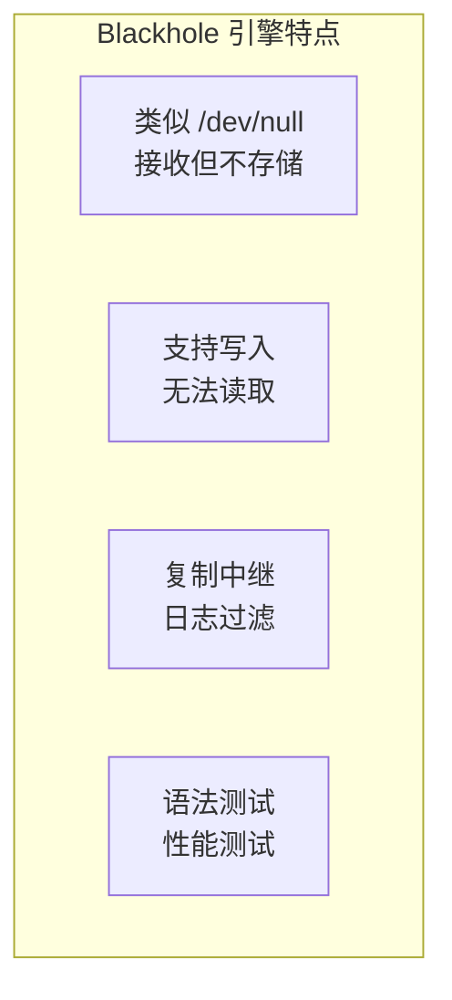

**适用场景：**
- 主从复制中的中间节点
- 测试 SQL 语句语法
- 安全审计或日志丢弃

### Federated 引擎

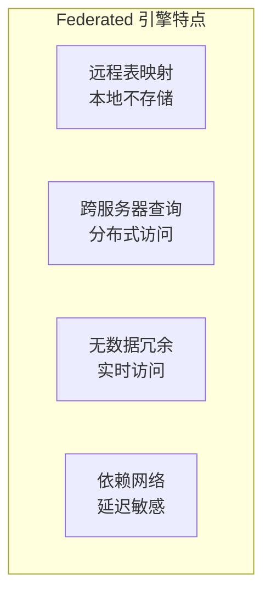

**适用场景：**
- 跨数据库查询整合
- 分布式环境下的数据访问
- 微服务间少量数据关联

### Merge（MRG_MyISAM）引擎

将多个结构相同的 MyISAM 表逻辑合并为一个表，适用于：
- 日志分表查询
- 大数据量分表管理
- 历史数据分区访问

***

## 1.5.4 第三方存储引擎

除 MySQL 官方提供的存储引擎外，还有一些优秀的第三方存储引擎：

### TokuDB

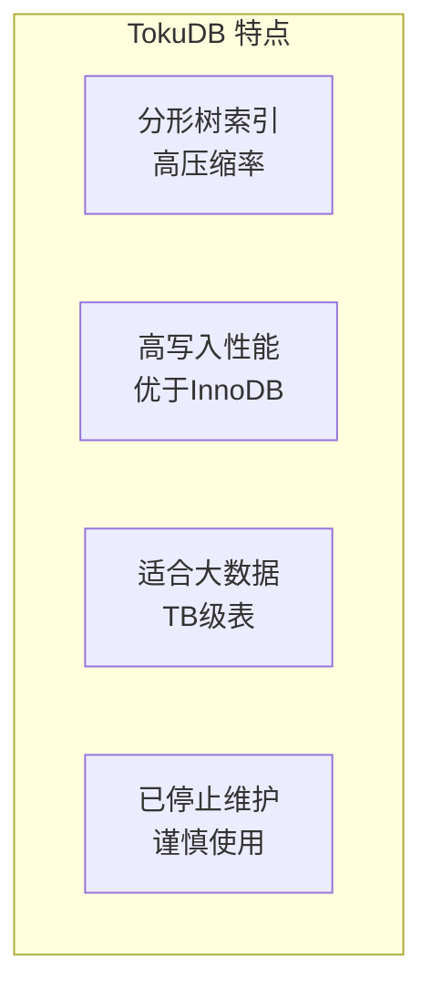

**特点：**
- 使用分形树（Fractal Tree）索引，非 B+树
- 极高的数据压缩率（通常 5-10 倍）
- 高写入性能，适合写入密集型应用
- **注意：Percona 已停止维护 TokuDB**

### MyRocks

Facebook 开发的存储引擎，基于 RocksDB：
- 使用 LSM-Tree 结构，写放大低
- 高压缩率，节省存储空间
- 适合写入密集型、大容量数据场景

### ColumnStore

面向列式存储的引擎（MariaDB）：
- 列式存储，适合 OLAP 分析查询
- 大规模并行处理（MPP）架构
- 适合数据仓库、BI 分析场景

### NDB Cluster

MySQL Cluster 使用的存储引擎：
- 分布式内存数据库
- 高可用、高可扩展
- 实时数据访问

***

## 1.5.5 选择合适的引擎

### 存储引擎选择决策树

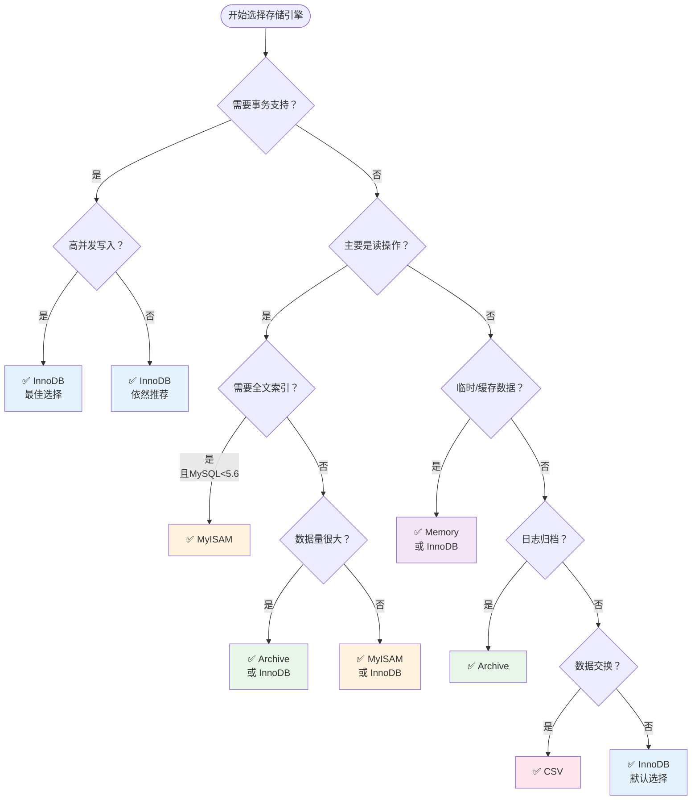

### 各引擎适用场景总结

| 引擎 | 最佳适用场景 | 不推荐场景 |
|------|-------------|-----------|
| **InnoDB** | 高并发事务、OLTP系统 | 纯只读且数据量极小的场景 |
| **MyISAM** | 只读报表、数据仓库 | 高并发写入、需要事务 |
| **Memory** | 临时表、会话缓存 | 需要持久化的数据 |
| **Archive** | 日志归档、历史数据 | 频繁查询、需要索引 |
| **CSV** | 数据交换、导入导出 | 性能要求高的生产环境 |
| **Blackhole** | 复制中继、日志过滤 | 需要存储数据的场景 |

### 现代应用的最佳实践

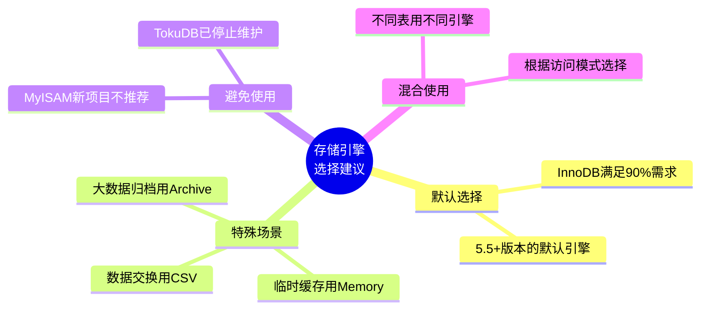

**建议：**
1. **默认选择 InnoDB**：除非有特殊需求，否则优先使用 InnoDB
2. **避免 MyISAM**：新项目不建议使用，旧项目考虑迁移
3. **混合使用**：可以在一个数据库中使用多种存储引擎
4. **定期评估**：根据业务变化重新评估存储引擎选择

***

## 1.5.6 转换表的引擎

### 使用 ALTER TABLE 转换

```sql
-- 将表转换为 InnoDB
ALTER TABLE table_name ENGINE=InnoDB;

-- 将表转换为 MyISAM
ALTER TABLE table_name ENGINE=MyISAM;

-- 查看转换进度（MySQL 8.0）
SHOW PROCESSLIST;
```

### 转换过程说明

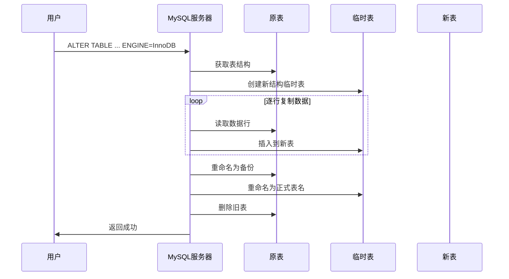

### 转换注意事项

| 注意事项 | 说明 | 解决方案 |
|----------|------|----------|
| **锁表时间** | 转换期间会锁定表 | 选择低峰期执行 |
| **磁盘空间** | 需要额外空间存储临时表 | 确保磁盘空间充足 |
| **全文索引** | MyISAM 和 InnoDB 全文索引不兼容 | 5.6+ 需重建索引 |
| **外键约束** | MyISAM 不支持外键 | 转换前检查外键 |
| **性能影响** | 大表转换耗时长 | 使用 pt-online-schema-change |

### 批量转换脚本

```sql
-- 生成所有 MyISAM 表的转换语句
SELECT 
    CONCAT('ALTER TABLE `', table_schema, '`.`', table_name, '` ENGINE=InnoDB;') AS alter_statement
FROM information_schema.tables 
WHERE engine = 'MyISAM' 
AND table_schema NOT IN ('mysql', 'information_schema', 'performance_schema', 'sys');
```

### 在线 DDL 工具

对于大表的存储引擎转换，推荐使用在线 DDL 工具减少停机时间：

```bash
# 使用 pt-online-schema-change（Percona Toolkit）
pt-online-schema-change \
    --alter "ENGINE=InnoDB" \
    --execute \
    D=database_name,t=table_name
```

### 转换后的验证

```sql
-- 验证存储引擎已更改
SHOW TABLE STATUS LIKE 'table_name';

-- 验证表结构完整性
CHECK TABLE table_name;

-- 验证数据完整性（行数对比）
SELECT COUNT(*) FROM table_name;

-- 测试基本操作
SELECT * FROM table_name LIMIT 10;
INSERT INTO table_name ...;
UPDATE table_name SET ...;
```

***

## 总结

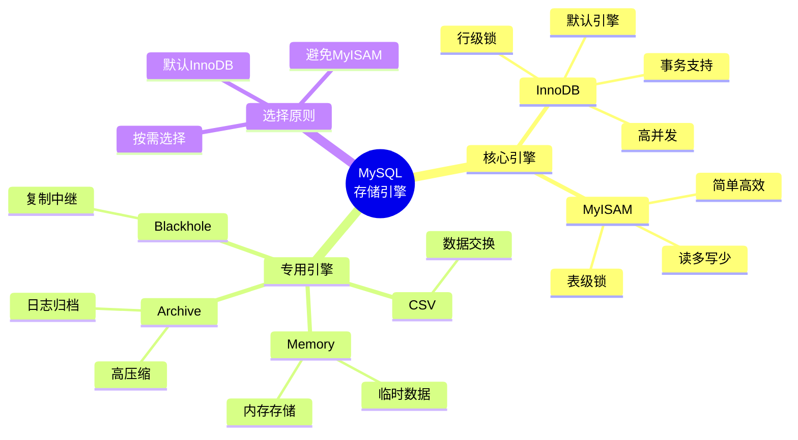

### 关键要点

1. **InnoDB 是现代首选**：MySQL 5.5+ 的默认引擎，支持事务、行级锁、MVCC，适合绝大多数场景

2. **MyISAM 逐渐淘汰**：仅适用于特定只读场景，新项目不建议使用

3. **专用引擎按需使用**：Memory、Archive、CSV 等在特定场景下能发挥独特价值

4. **存储引擎可混合使用**：一个数据库中不同表可以使用不同存储引擎

5. **引擎转换需谨慎**：大表转换会锁表，需要选择合适时机或使用在线工具

### 参考资源

- [MySQL 官方文档 - 存储引擎](https://dev.mysql.com/doc/refman/8.0/en/storage-engines.html)
- [高性能MySQL（第3版）第1章](https://book.douban.com/subject/23008813/)
- [InnoDB 存储引擎详解](https://dev.mysql.com/doc/refman/8.0/en/innodb-storage-engine.html)
