# 1.6 MySQL 时间线（Timeline）

> 本文档基于《高性能MySQL》（第3版）第1章1.6节内容整理总结

MySQL 的发展历程是一部开源数据库技术的演进史。从1995年诞生至今，MySQL 经历了多次重大版本更新、公司收购和技术革新，逐步成长为全球最流行的开源关系型数据库管理系统。

***

## MySQL 的起源与发展历程

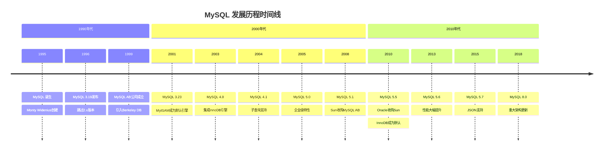

### 关键里程碑

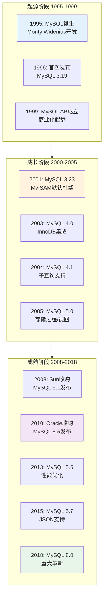

***

## 早期版本：从诞生到成熟（1995-2003）

### MySQL 的诞生（1995）

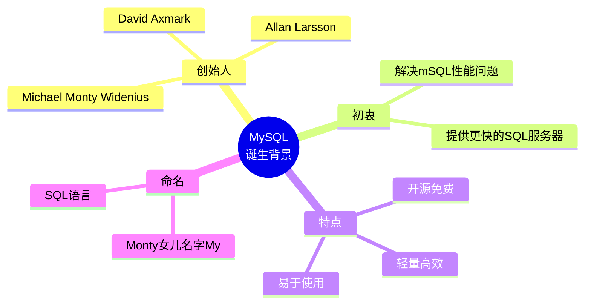

1995年，Michael "Monty" Widenius 在瑞典创建了 MySQL。最初的目的是开发一个比 mSQL（mini SQL）更快、更高效的 SQL 服务器。MySQL 的名字来源于 Monty 的女儿 **My**，加上 **SQL**（Structured Query Language，结构化查询语言）。

### 版本 3.19（1996）

- 首次公开发布版本
- 跳过了 2.x 版本号，直接从 3.x 开始
- 基于 ISAM 存储引擎

### 版本 3.23（2001）

这是 MySQL 发展史上的一个重要里程碑版本：

| 特性 | 说明 |
|------|------|
| **MyISAM 引擎** | 取代 ISAM 成为默认存储引擎 |
| **全文索引** | 支持全文搜索功能 |
| **Berkeley DB** | 引入事务支持（通过 BDB 引擎） |
| **复制功能** | 支持主从复制 |
| **查询缓存** | 引入查询缓存机制 |

### 版本 4.0（2003）

2003年发布的 MySQL 4.0 是另一个重要版本：

- **InnoDB 集成**：正式集成 InnoDB 存储引擎，提供事务支持
- **UNION 语法**：支持 UNION 操作
- **多表 DELETE**：支持多表删除操作
- **SSL 支持**：增强安全性

***

## 企业级特性时代（2004-2008）

### 版本 4.1（2004-2005）

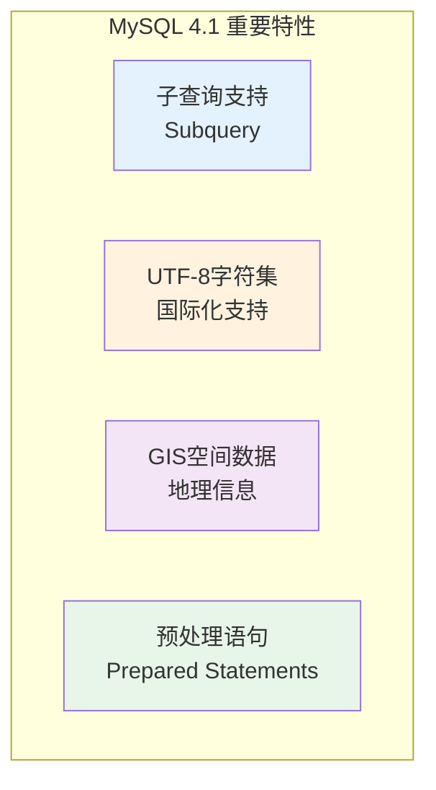

主要新特性：
- **子查询支持**：引入子查询功能，SQL 能力大幅提升
- **UTF-8 字符集**：开始支持 UTF-8，国际化能力增强
- **预处理语句**：支持 Prepared Statements，提升性能和安全性
- **GIS 支持**：引入空间数据类型和函数

### 版本 5.0（2005）

MySQL 5.0 标志着 MySQL 正式进入企业级数据库行列：

| 企业级特性 | 说明 |
|-----------|------|
| **存储过程** | 支持 Stored Procedures |
| **存储函数** | 支持 Stored Functions |
| **触发器** | 支持 Triggers |
| **视图** | 支持 Views |
| **游标** | 支持 Cursors |
| **XA 事务** | 支持分布式事务 |
| **Information Schema** | 标准信息模式 |

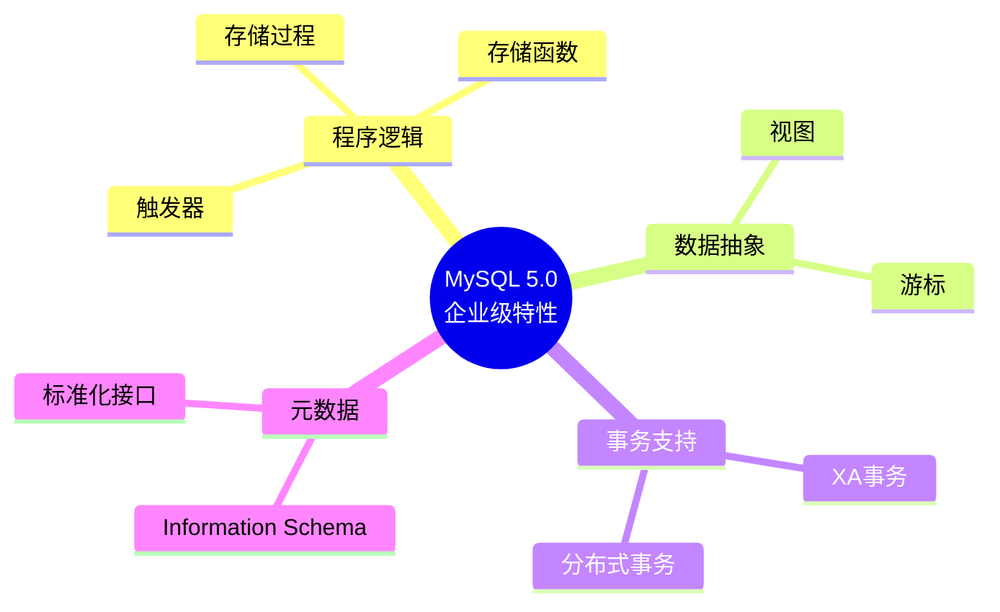

### 版本 5.1（2008）

2008年发布的 MySQL 5.1 是 **Sun 公司收购 MySQL AB 后的第一个版本**：

- **分区表**：支持表分区功能
- **事件调度器**：支持 Event Scheduler
- **插件式存储引擎**：存储引擎架构更加灵活
- **行级复制**：支持基于行的复制

***

## Oracle 时代与现代化（2010-至今）

### Sun 与 Oracle 的收购

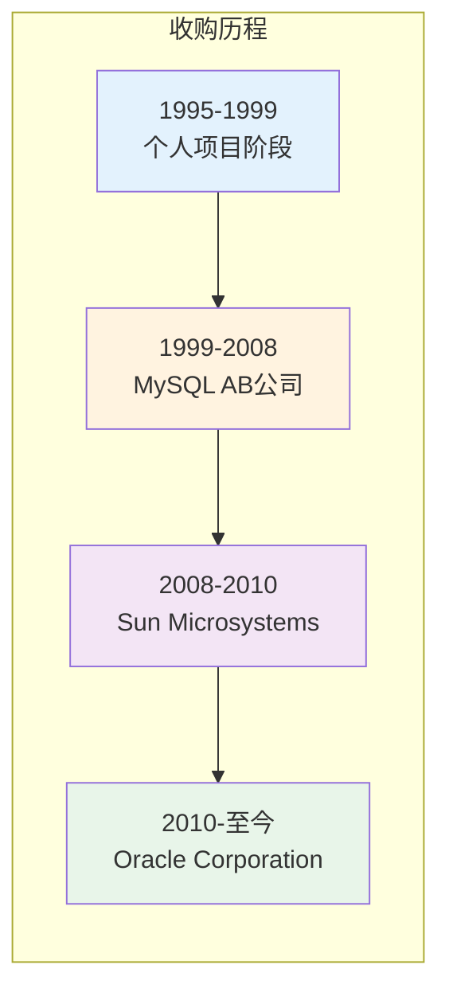

**重要收购事件：**

| 时间 | 事件 | 影响 |
|------|------|------|
| 2008年 | Sun 收购 MySQL AB | 金额约 10 亿美元 |
| 2010年 | Oracle 收购 Sun | MySQL 归入 Oracle 旗下 |

### 版本 5.5（2010）

这是 **Oracle 收购 Sun 后发布的第一个版本**，具有里程碑意义：

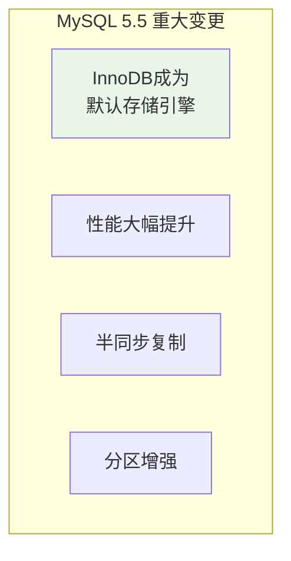

**核心变化：**
- **InnoDB 成为默认引擎**：标志着 MySQL 从事务支持可选到事务支持默认的转变
- **性能优化**：多核 CPU 扩展性大幅提升
- **半同步复制**：增强数据安全性
- **分区功能增强**：RANGE、LIST、HASH、KEY 分区

### 版本 5.6（2013）

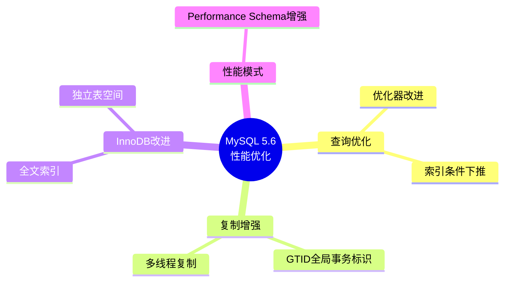

主要新特性：
- **GTID（全局事务标识）**：简化复制管理
- **多线程复制**：提升从库性能
- **InnoDB 全文索引**：InnoDB 支持全文搜索
- **索引条件下推（ICP）**：减少磁盘 I/O
- **Performance Schema 增强**：更强大的性能监控

### 版本 5.7（2015）

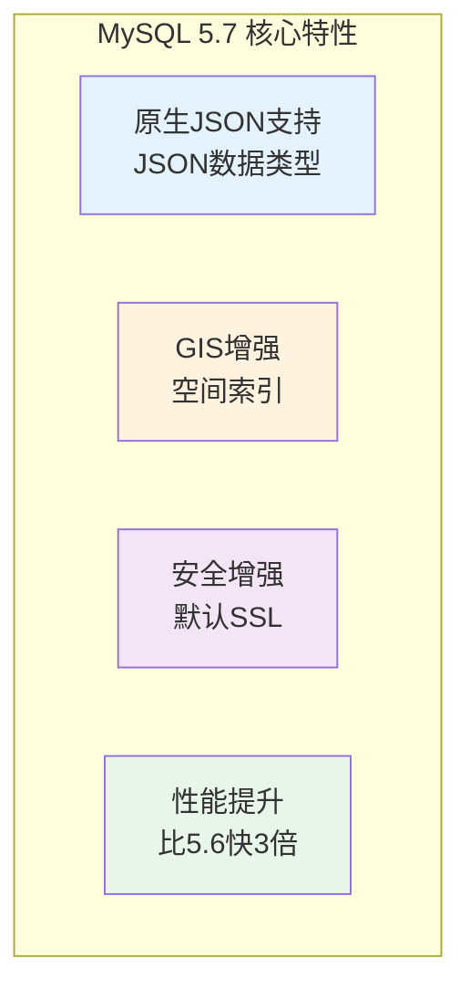

主要新特性：
- **原生 JSON 支持**：引入 JSON 数据类型和函数
- **GIS 增强**：支持空间索引
- **安全增强**：默认启用 SSL，密码策略增强
- **性能提升**：比 5.6 版本快 3 倍
- **多源复制**：支持从多个主库复制

### 版本 8.0（2018）

MySQL 8.0 是 MySQL 历史上最大的架构更新之一：

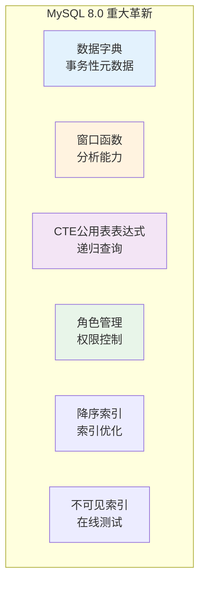

**架构级更新：**

| 特性 | 说明 |
|------|------|
| **事务性数据字典** | 用 InnoDB 表存储元数据，替代 .frm 文件 |
| **窗口函数** | 支持 ROW_NUMBER()、RANK()、LAG()、LEAD() 等 |
| **CTE（公用表表达式）** | 支持 WITH 语句，递归查询 |
| **角色管理** | 支持角色（Roles）进行权限管理 |
| **降序索引** | 支持 DESC 索引 |
| **不可见索引** | 支持标记索引为不可见，用于测试 |
| **默认字符集** | 默认 utf8mb4 |
| **默认认证插件** | caching_sha2_password |

***

## MySQL 版本演进对比

### 各版本核心特性对比

| 版本 | 年份 | 核心特性 | 里程碑意义 |
|------|------|----------|-----------|
| 3.23 | 2001 | MyISAM、复制、查询缓存 | MySQL 真正成熟 |
| 4.0 | 2003 | InnoDB、UNION | 事务支持起步 |
| 4.1 | 2004 | 子查询、UTF-8 | SQL 能力增强 |
| 5.0 | 2005 | 存储过程、视图、触发器 | 企业级特性 |
| 5.1 | 2008 | 分区表、事件调度器 | Sun 收购 |
| 5.5 | 2010 | InnoDB 默认、半同步复制 | Oracle 收购 |
| 5.6 | 2013 | GTID、多线程复制、全文索引 | 性能飞跃 |
| 5.7 | 2015 | JSON、GIS、安全增强 | 现代化数据库 |
| 8.0 | 2018 | 数据字典、窗口函数、CTE | 架构革新 |

### 存储引擎演变

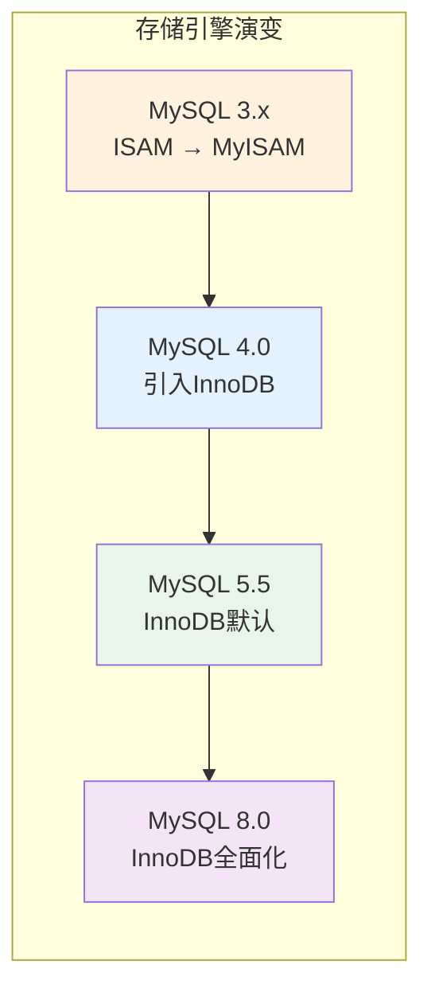

### 功能成熟度演进

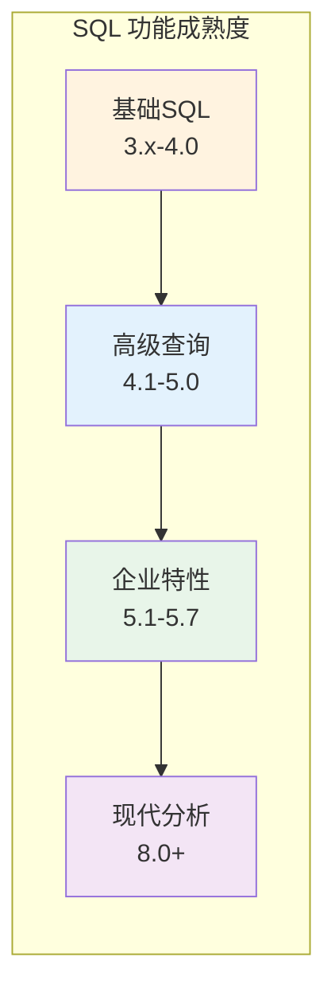

***

## MySQL 生态与分支

### 主要分支

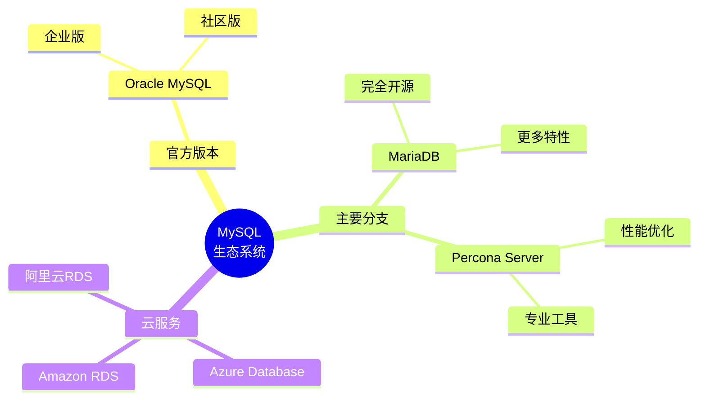

### MariaDB

2010年，MySQL 创始人 Monty Widenius 在 Oracle 收购 Sun 后创建了 **MariaDB**：

- 完全兼容 MySQL
- 更多存储引擎（Aria、ColumnStore、Spider 等）
- 更快的发布周期
- 完全开源，社区驱动

### Percona Server

Percona 公司发布的 MySQL 分支：

- 专注于性能优化
- 包含 Percona Toolkit、XtraDB Cluster、XtraBackup 等工具
- 更详细的性能统计
- 线程池、审计日志等增强功能

***

## 总结

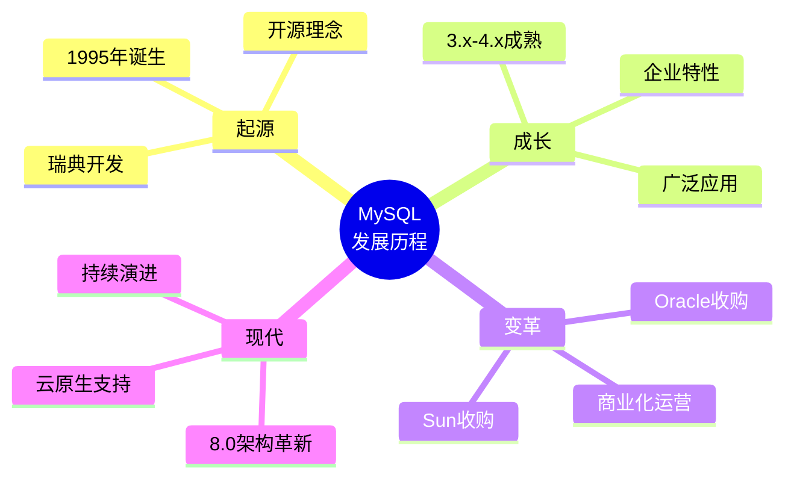

### 关键要点

1. **从个人项目到企业级数据库**：MySQL 用 20 多年时间从一个简单的 SQL 服务器成长为全球最流行的开源数据库

2. **存储引擎的演变**：从 ISAM 到 MyISAM，再到 InnoDB 成为默认，体现了从事务可选到事务必需的趋势

3. **企业级特性的完善**：5.0 版本引入的存储过程、视图、触发器等特性，使 MySQL 具备了企业级数据库的能力

4. **Oracle 时代的持续发展**：尽管经历了收购，MySQL 在 Oracle 旗下依然保持快速发展，8.0 版本带来了架构级革新

5. **生态系统的繁荣**：MariaDB、Percona Server 等分支的出现，保证了 MySQL 技术的开放性和多样性

### 版本选择建议

| 场景 | 推荐版本 |
|------|----------|
| 生产环境新项目 | MySQL 8.0 LTS |
| 稳定优先的老项目 | MySQL 5.7 |
| 需要特定功能 | MariaDB 10.x |
| 性能优化需求 | Percona Server 8.0 |

### 参考资源

- [MySQL 官方文档 - 版本历史](https://dev.mysql.com/doc/relnotes/mysql/8.0/en/)
- [高性能MySQL（第3版）第1章](https://book.douban.com/subject/23008813/)
- [MariaDB 官网](https://mariadb.org/)
- [Percona 官网](https://www.percona.com/)
