# 1.7 MySQL 的开发模式

> 本文档基于《高性能MySQL》（第3版）第1章1.7节内容整理总结

MySQL 的开发模式经历了从开源社区驱动到企业级产品开发的转变。理解 MySQL 的开发模式对于选择合适的版本、评估新特性的稳定性以及规划升级策略都具有重要意义。

***

## MySQL 开发模式概述

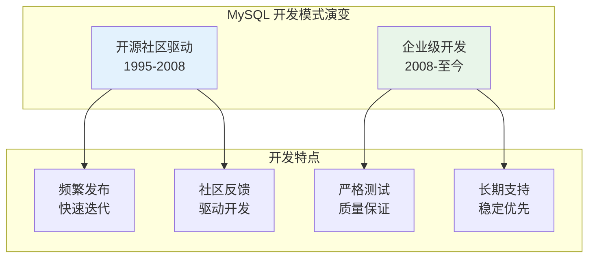

MySQL 的开发模式在 2008 年前后发生了显著变化：

- **2008 年之前（MySQL AB 时期）**：开源社区驱动，发布周期相对灵活
- **2008 年之后（Sun/Oracle 时期）**：企业级开发流程，强调质量控制和长期支持

***

## 版本发布阶段

MySQL 的版本发布遵循严格的阶段划分，每个阶段都有明确的质量标准和目标用户群体。

### 开发阶段流程图

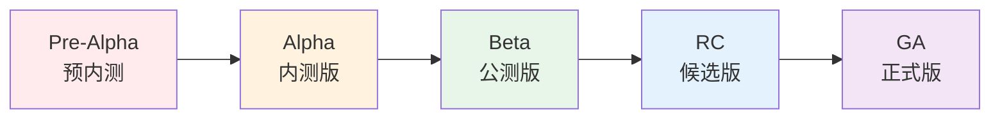

### 各阶段详解

| 阶段 | 名称 | 特点 | 适用场景 |
|------|------|------|----------|
| **Pre-Alpha** | 预内测版 | 功能极不完善，可能有严重 Bug | 仅限核心开发者 |
| **Alpha** | 内测版 | 主要功能完成，但未经充分测试 | 早期测试、功能验证 |
| **Beta** | 公测版 | 功能完整，需要广泛测试 | 兼容性测试、性能评估 |
| **RC** | 候选版 | 接近发布质量，修复已知问题 | 生产环境预演 |
| **GA** | 正式版 | 生产就绪，质量稳定 | 生产环境使用 |

### 详细阶段说明

#### 1. Pre-Alpha（预内测版）

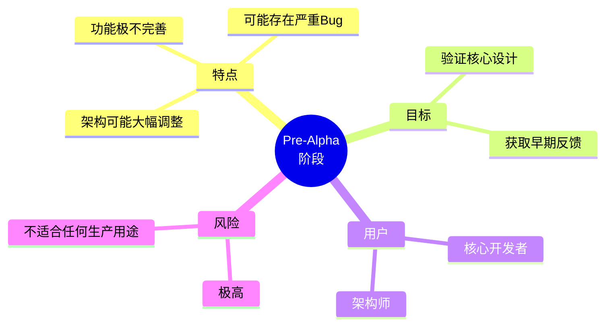

**特点：**
- 功能非常不完善
- 可能存在严重 Bug
- 软件架构可能大幅调整
- 也称为 Development Release 或 Technical Preview（技术预览版）

#### 2. Alpha（内测版）

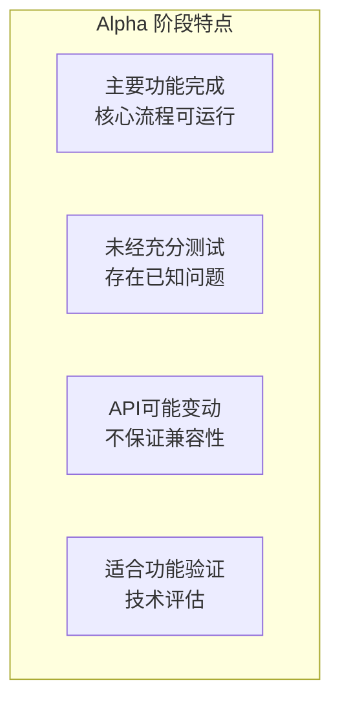

**特点：**
- 主要功能开发完成
- 核心流程可以正常运行
- 但未经充分测试，存在已知问题
- API 和接口可能发生变化
- 适合早期测试和功能验证

#### 3. Beta（公测版）

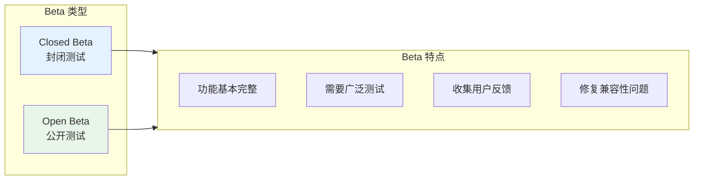

**特点：**
- 功能基本完整
- 需要更广泛的用户场景测试
- 发现并修复兼容性、性能瓶颈问题
- 分为 Closed Beta（封闭测试）和 Open Beta（公开测试）

#### 4. RC（Release Candidate，候选版）

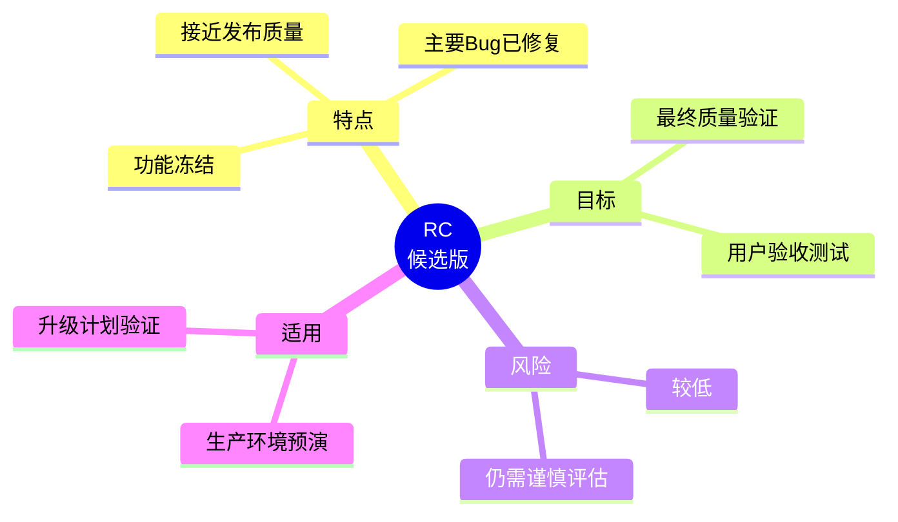

**特点：**
- 接近正式发布质量
- 主要 Bug 已修复
- 功能基本冻结
- 适合生产环境预演和升级计划验证

#### 5. GA（General Availability，正式版）

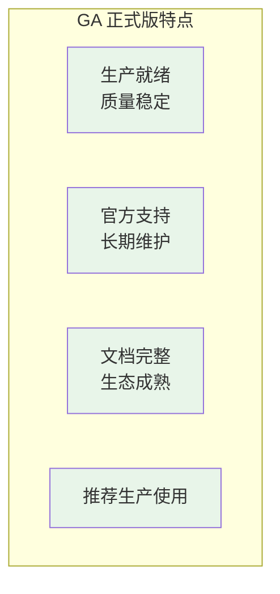

**特点：**
- 生产环境就绪
- 质量稳定可靠
- 官方提供长期支持
- 文档完整，生态成熟
- **唯一推荐用于生产环境的版本**

***

## MySQL 现代开发周期

### 开发流程

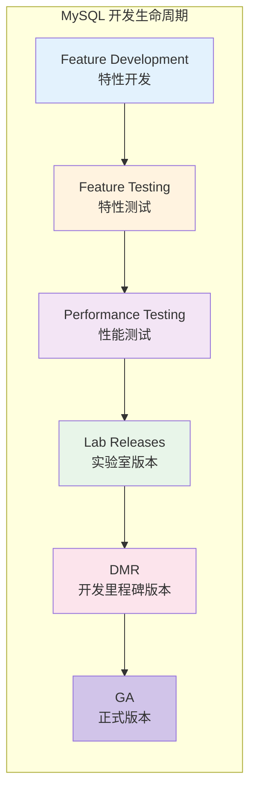

### 各阶段说明

| 阶段 | 全称 | 说明 |
|------|------|------|
| **Feature Development** | 特性开发 | 开发新特性和功能 |
| **Feature Testing** | 特性测试 | 验证功能正确性 |
| **Performance Testing** | 性能测试 | 确保性能不衰退 |
| **Lab Releases** | 实验室版本 | 内部测试版本 |
| **DMR** | Development Milestone Release | 开发里程碑版本 |
| **GA** | General Availability | 正式版本 |

### DMR（开发里程碑版本）

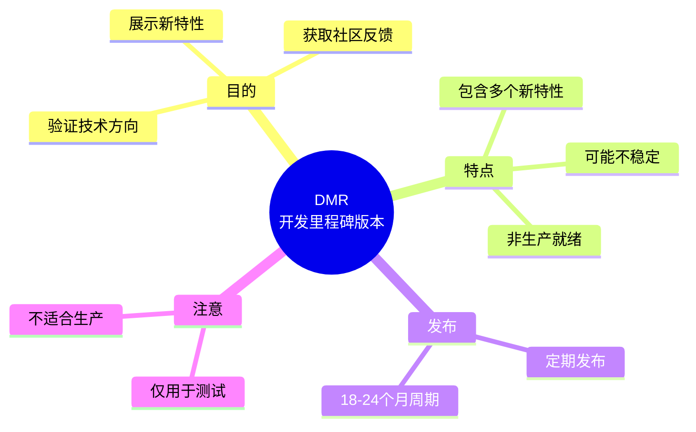

**DMR 特点：**
- 展示新特性和改进
- 获取社区反馈
- 可能包含不稳定代码
- **不适合生产环境**
- 通常每 18-24 个月发布一个 GA 版本，期间会有多个 DMR

### GA 发布流程

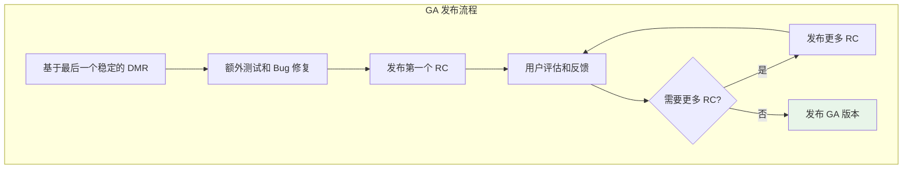

**GA 发布标准：**
- 基于稳定的 DMR 版本
- 经过充分的额外测试
- 修复所有关键 Bug
- 通过用户验收测试
- 质量达到生产环境要求

***

## 版本选择建议

### 生产环境版本选择

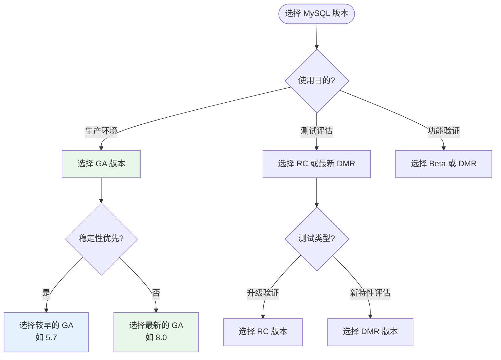

### 各场景推荐版本

| 使用场景 | 推荐版本类型 | 示例版本 | 说明 |
|----------|-------------|----------|------|
| **生产环境（稳定优先）** | 较早的 GA | MySQL 5.7 | 经过长期验证，生态成熟 |
| **生产环境（功能优先）** | 最新的 GA | MySQL 8.0 LTS | 新特性丰富，官方长期支持 |
| **升级准备测试** | RC 版本 | 8.0.x RC | 验证升级兼容性 |
| **新特性评估** | DMR 版本 | 8.1.x DMR | 评估新功能适用性 |
| **开发测试** | Beta 版本 | 8.x Beta | 功能验证和反馈 |

### 版本选择检查清单

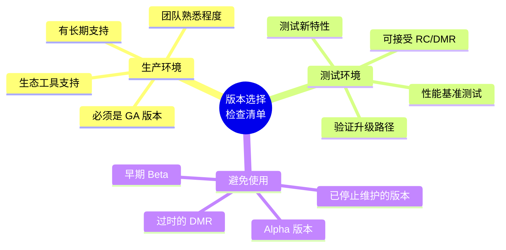

***

## MySQL 版本支持周期

### 支持周期说明

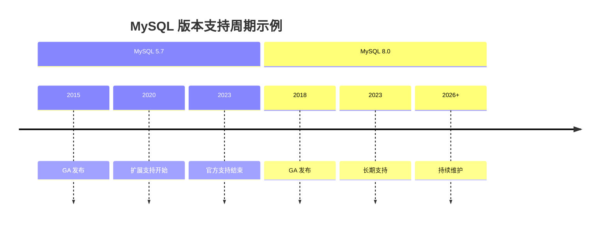

### 支持类型

| 支持类型 | 说明 | 持续时间 |
|----------|------|----------|
| **完整支持** | 新特性、Bug 修复、安全更新 | 约 5 年 |
| **扩展支持** | Bug 修复、安全更新 | 约 3 年 |
| **长期支持（LTS）** | 仅安全更新和关键 Bug 修复 | 视版本而定 |

### 版本生命周期

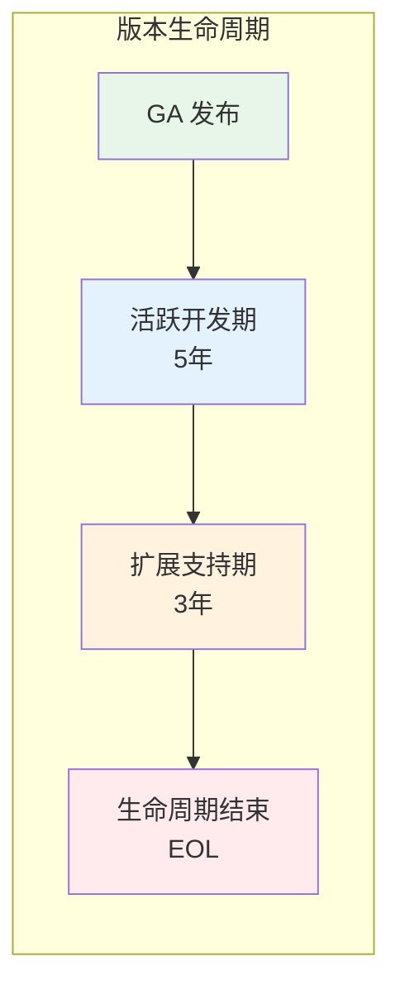

***

## 开发模式对用户的意义

### 对用户的影响

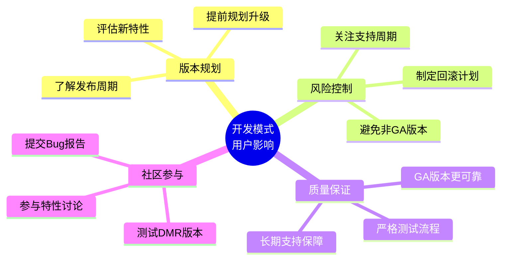

### 最佳实践建议

1. **生产环境只使用 GA 版本**
   - DMR、RC、Beta 版本仅用于测试
   - GA 版本经过充分验证，质量有保障

2. **关注版本支持周期**
   - 避免使用即将停止支持的版本
   - 提前规划升级路径

3. **参与社区测试**
   - 在非生产环境测试 DMR 版本
   - 向社区反馈问题和建议

4. **制定升级策略**
   - 等待新版本发布 3-6 个月后再升级
   - 先在测试环境充分验证

***

## 总结

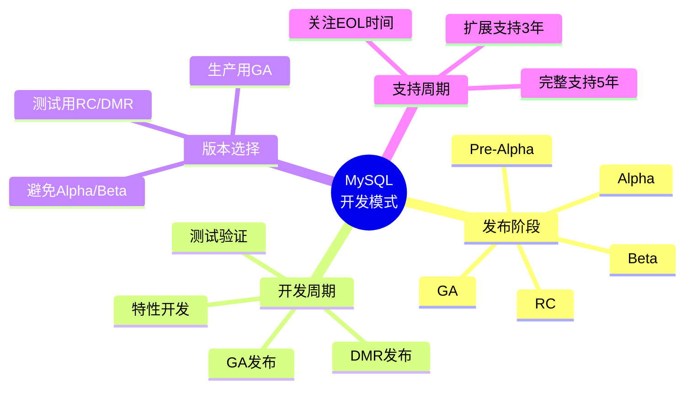

### 关键要点

1. **严格的发布阶段**：MySQL 遵循 Pre-Alpha → Alpha → Beta → RC → GA 的发布流程，每个阶段都有明确的质量标准

2. **DMR 与 GA 的区别**：DMR（开发里程碑版本）用于展示新特性和获取反馈，**不适合生产**；GA（正式版本）才是生产就绪的版本

3. **现代开发周期**：特性开发 → 特性测试 → 性能测试 → 实验室版本 → DMR → GA，通常 18-24 个月发布一个 GA 版本

4. **版本选择原则**：
   - 生产环境：**只使用 GA 版本**
   - 测试评估：可使用 RC 或 DMR
   - 功能验证：可使用 Beta 版本

5. **支持周期规划**：了解版本的生命周期，提前规划升级，避免使用已停止维护的版本

### 参考资源

- [MySQL 官方开发周期文档](https://dev.mysql.com/doc/mysql-development-cycle/en/)
- [MySQL 版本发布说明](https://dev.mysql.com/doc/relnotes/mysql/8.0/en/)
- [高性能MySQL（第3版）第1章](https://book.douban.com/subject/23008813/)
- [MySQL 生命周期政策](https://www.mysql.com/support/supportedplatforms/database.html)
