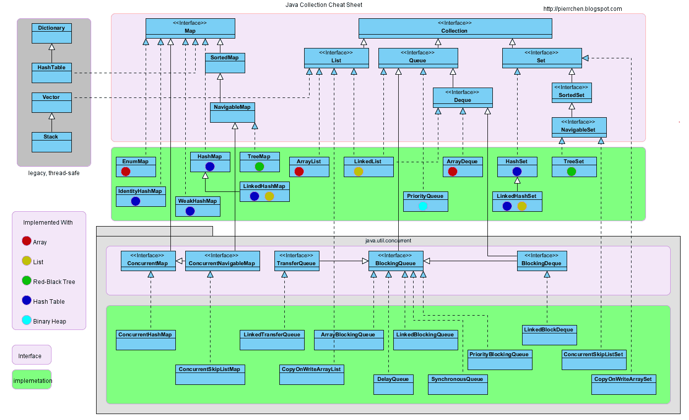
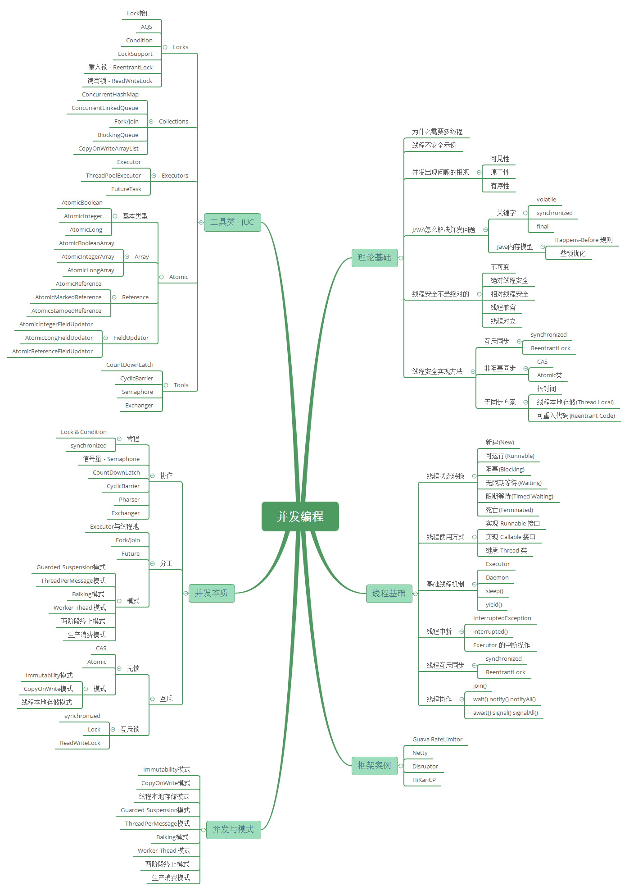

Java基础部分，包括语法基础，泛型，注解，异常，反射和其它（如SPI机制等）。

### 1.1 语法基础

#### 面向对象特性？

封装
- 利用抽象数据类型将数据和基于数据的操作封装在一起，使其构成一个不可分割的独立实体。数据被保护在抽象数据类型的内部，尽可能地隐藏内部的细节，只保留一些对外接口使之与外部发生联系。用户无需知道对象内部的细节，但可以通过对象对外提供的接口来访问该对象。

优点:
- 减少耦合: 可以独立地开发、测试、优化、使用、理解和修改减轻维护的负担: 可以更容易被程序员理解，并且在调试的时候可以不影响其他模块有效地调节性能: 可以通过剖析确定哪些模块影响了系统的性能提高软件的可重用性降低了构建大型系统的风险: 即使整个系统不可用，但是这些独立的模块却有可能是可用的
------

继承

- 继承实现了 IS-A 关系，例如 Cat 和 Animal 就是一种 IS-A 关系，因此 Cat 可以继承自 Animal，从而获得 Animal 非 private 的属性和方法。继承应该遵循里氏替换原则，子类对象必须能够替换掉所有父类对象。Cat 可以当做 Animal 来使用，也就是说可以使用 Animal 引用 Cat 对象。父类引用指向子类对象称为 向上转型 。
------

多态

 - 多态分为编译时多态和运行时多态:编译时多态主要指方法的重载运行时多态指程序中定义的对象引用所指向的具体类型在运行期间才确定运行时多态有三个条件:继承覆盖(重写)向上转型下面的代码中，乐器类(Instrument)有两个子类: Wind 和 Percussion，它们都覆盖了父类的 play() 方法，并且在 main() 方法中使用父类 Instrument 来引用 Wind 和 Percussion 对象。在 Instrument 引用调用 play() 方法时，会执行实际引用对象所在类的 play() 方法，而不是 Instrument 类的方法。
------

------

注解是JDK1.5版本开始引入的一个特性，用于对代码进行说明，可以对包、类、接口、字段、方法参数、局部变量等进行注解。它是框架学习和设计者必须掌握的基础。@pdai

- Java自带的标准注解，包括@Override、@Deprecated和@SuppressWarnings，分别用于标明重写某个方法、标明某个类或方法过时、标明要忽略的警告，用这些注解标明后编译器就会进行检查

- Target注解的作用是：描述注解的使用范围（即：被修饰的注解可以用在什么地方） 。

- 反射调用流程小结最后，用几句话总结反射的实现原理：反射类及反射方法的获取，都是通过从列表中搜寻查找匹配的方法，所以查找性能会随类的大小方法多少而变化；每个类都会有一个与之对应的Class实例，从而每个类都可以获取method反射方法，并作用到其他实例身上；反射也是考虑了线程安全的，放心使用；反射使用软引用relectionData缓存class信息，避免每次重新从jvm获取带来的开销；反射调用多次生成新代理Accessor, 而通过字节码生存的则考虑了卸载功能，所以会使用独立的类加载器；当找到需要的方法，都会copy一份出来，而不是使用原来的实例，从而保证数据隔离；调度反射方法，最终是由jvm执行invoke0()执行
------
- SPI机制 - Spring中SPI机制在springboot的自动装配过程中，最终会加载META-INF/spring.factories文件，而加载的过程是由SpringFactoriesLoader加载的。从CLASSPATH下的每个Jar包中搜寻所有META-INF/spring.factories配置文件，然后将解析properties文件，找到指定名称的配置后返回。需要注意的是，其实这里不仅仅是会去ClassPath路径下查找，会扫描所有路径下的Jar包，只不过这个文件只会在Classpath下的jar包中。
------

- 介绍
  - 介绍容器，就是可以容纳其他Java对象的对象。
  - *Java Collections Framework(JCF)*为Java开发者提供了通用的容器，其始于JDK 1.2，优点是:降低编程难度提高程序性能提高API间的互操作性降低学习难度降低设计和实现相关API的难度增加程序的重用性Java容器里只能放对象，对于基本类型(int, long, float, double等)，需要将其包装成对象类型后(Integer, Long, Float, Double等)才能放到容器里。很多时候拆包装和解包装能够自动完成。这虽然会导致额外的性能和空间开销，但简化了设计和编程。
------

------

- 并发

- 比较1. 锁的实现synchronized 是 JVM 实现的，而 ReentrantLock 是 JDK 实现的。
- 2. 性能新版本 Java 对 synchronized 进行了很多优化，例如自旋锁等，synchronized 与 ReentrantLock 大致相同。3. 等待可中断当持有锁的线程长期不释放锁的时候，正在等待的线程可以选择放弃等待，改为处理其他事情。ReentrantLock 可中断，而 synchronized 不行。4. 公平锁公平锁是指多个线程在等待同一个锁时，必须按照申请锁的时间顺序来依次获得锁。synchronized 中的锁是非公平的，ReentrantLock 默认情况下也是非公平的，但是也可以是公平的。5. 锁绑定多个条件一个 ReentrantLock 可以同时绑定多个 Condition 对象。# 使用选择除非需要使用 ReentrantLock 的高级功能，否则优先使用 synchronized。这是因为 synchronized 是 JVM 实现的一种锁机制，JVM 原生地支持它，而 ReentrantLock 不是所有的 JDK 版本都支持。并且使用 synchronized 不用担心没有释放锁而导致死锁问题，因为 JVM 会确保锁的释放。# 线程之间的协作当多个线程可以一起工作去解决某个问题时，如果某些部分必须在其它部分之前完成，那么就需要对线程进行协调。
------