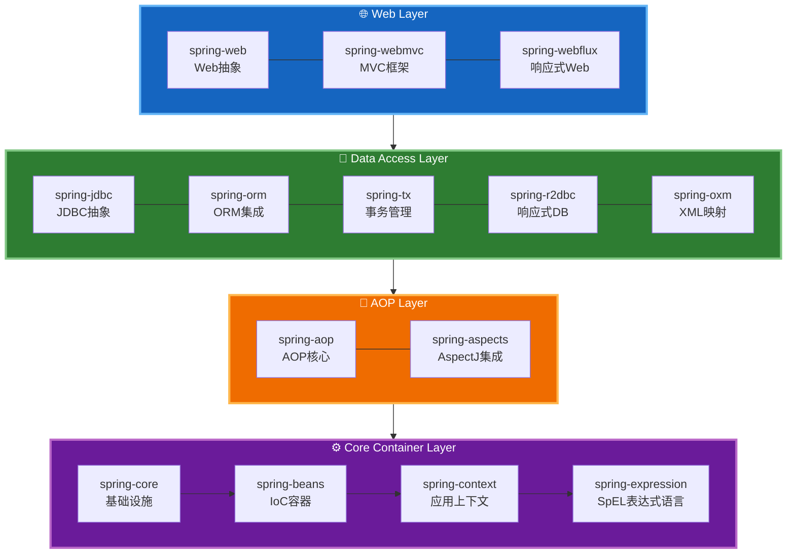
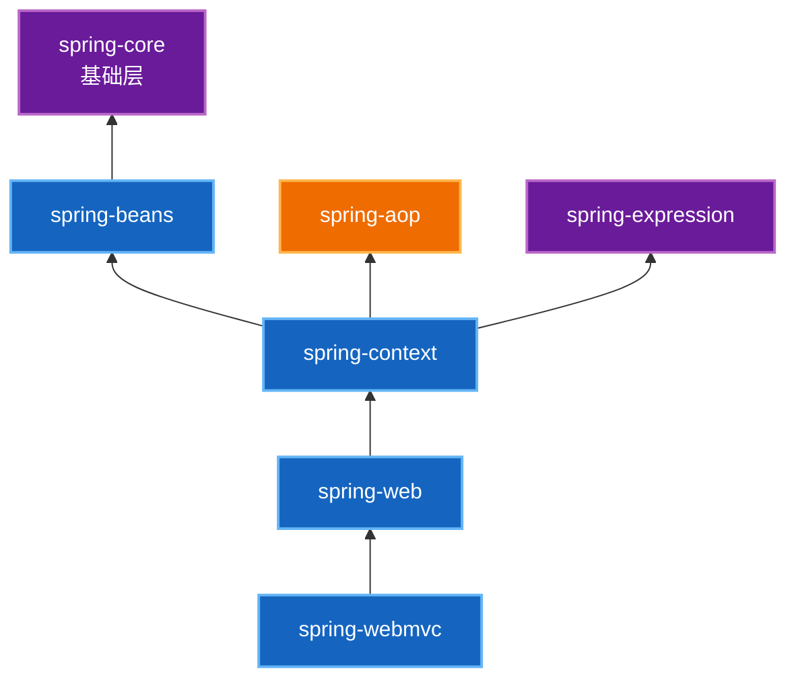
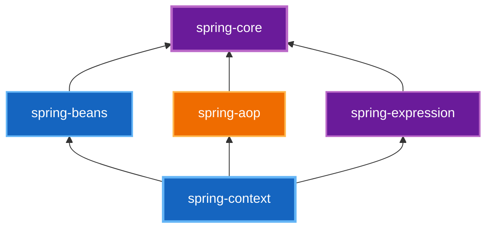
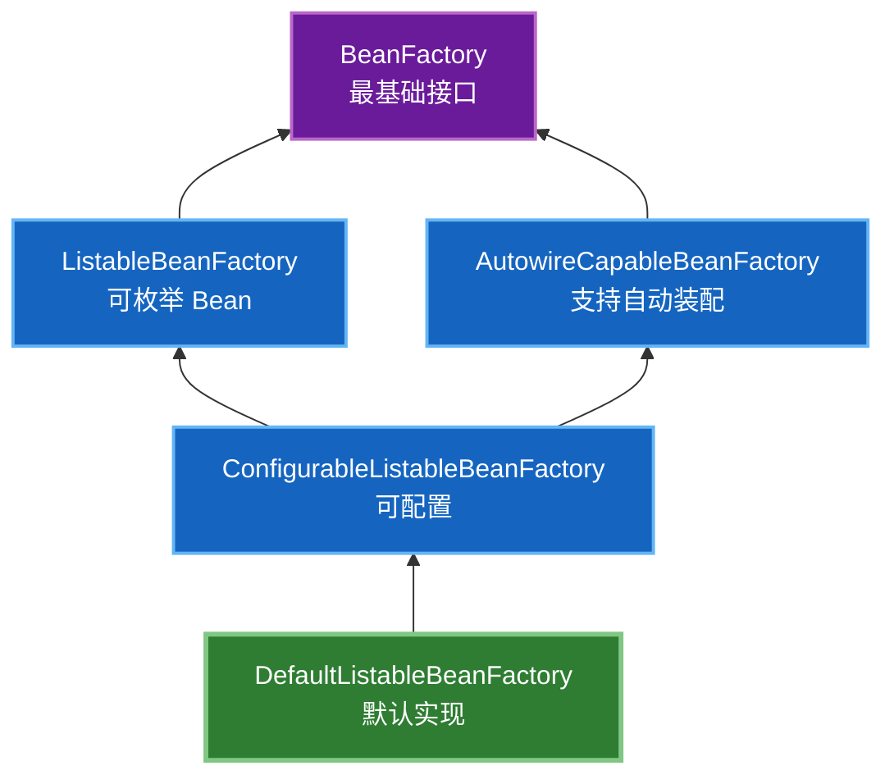
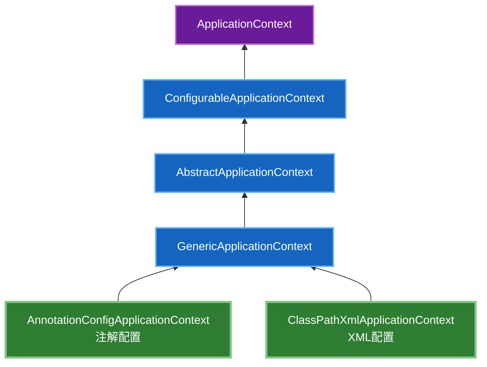
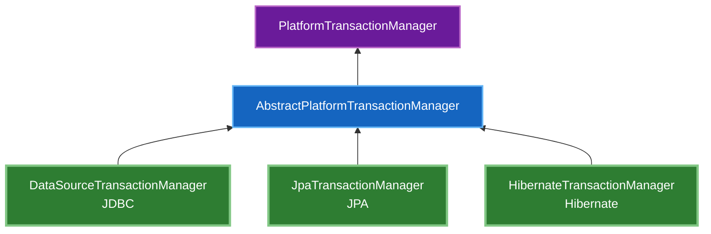

# Spring Framework 分析

本章节深入分析 Spring Framework 的源码架构、核心模块和设计思想，为 Linsir Framework 的封装提供理论基础。

## 分析目标

通过对 Spring Framework 源码的深入分析，达到以下目标：

1. **理解架构设计** - 掌握 Spring 的模块化设计思想和各模块职责
2. **学习设计模式** - 分析 Spring 中运用的经典设计模式
3. **掌握核心机制** - 深入理解 IoC、AOP、事务等核心机制的实现原理
4. **指导封装实践** - 基于源码分析，设计合理的封装方案

## Spring Framework 版本

当前分析基于 **Spring Framework 6.1.5**，对应：

- **JDK 版本**: 17+
- **Spring Boot**: 3.2.x
- **Jakarta EE**: 9+ (包名从 `javax.*` 改为 `jakarta.*`)

## 架构总览

Spring Framework 采用**分层模块化架构**，各模块职责清晰，依赖关系明确：



## 各核心模块职责详解

| 模块 | 核心职责 | 关键组件 |
|------|----------|----------|
| **spring-core** | 基础设施层，提供工具类、资源加载、类型转换 | `ResourceLoader`, `ResolvableType`, `Assert`, `ClassUtils` |
| **spring-beans** | IoC容器核心，Bean定义与生命周期管理 | `BeanFactory`, `BeanDefinition`, `DefaultListableBeanFactory` |
| **spring-context** | 应用上下文，事件、国际化、注解配置 | `ApplicationContext`, `ApplicationEvent`, `@Configuration` |
| **spring-expression** | SpEL表达式语言 | `SpelExpressionParser`, `EvaluationContext` |
| **spring-aop** | 面向切面编程 | `AopProxy`, `Advisor`, `Pointcut`, `MethodInterceptor` |
| **spring-tx** | 事务管理抽象 | `PlatformTransactionManager`, `@Transactional` |
| **spring-jdbc** | JDBC抽象与模板 | `JdbcTemplate`, `DataSourceUtils` |
| **spring-web** | Web基础抽象 | `HttpMessageConverter`, `RestTemplate`, `WebClient` |
| **spring-webmvc** | MVC框架实现 | `DispatcherServlet`, `@Controller`, `HandlerMapping` |

## 模块依赖关系

### 核心层依赖



### 完整依赖图



## 核心设计思想

### 1. 控制反转 (IoC)

**IoC (Inversion of Control)** 是 Spring Framework 的核心理念。

**传统方式：**
```java
public class UserService {
    private UserDao userDao = new UserDaoImpl(); // 直接依赖具体实现
}
```

**IoC 方式：**
```java
public class UserService {
    private UserDao userDao; // 依赖接口，由容器注入
    
    // 通过构造器注入
    public UserService(UserDao userDao) {
        this.userDao = userDao;
    }
}
```

**优势：**
- 解耦组件之间的依赖关系
- 便于单元测试
- 支持 AOP 代理

### 2. 面向切面编程 (AOP)

**AOP (Aspect-Oriented Programming)** 将横切关注点从业务逻辑中分离。

**横切关注点：**
- 事务管理
- 日志记录
- 权限检查
- 性能监控

**示例：**
```java
@Aspect
@Component
public class LoggingAspect {
    
    @Around("execution(* com.example.service.*.*(..))")
    public Object logAround(ProceedingJoinPoint joinPoint) throws Throwable {
        // 前置日志
        log.info("Method {} started", joinPoint.getSignature());
        
        try {
            Object result = joinPoint.proceed();
            // 后置日志
            log.info("Method {} completed", joinPoint.getSignature());
            return result;
        } catch (Exception e) {
            // 异常日志
            log.error("Method {} failed", joinPoint.getSignature(), e);
            throw e;
        }
    }
}
```

### 3. 模板方法模式

Spring 大量使用**模板方法模式**简化资源管理：

```java
// JDBC 模板
jdbcTemplate.query("SELECT * FROM users", rs -> {
    // 处理结果集，无需关心连接关闭
});

// 事务模板
transactionTemplate.execute(status -> {
    // 执行业务逻辑，自动管理事务
    return result;
});
```

### 4. 策略模式

Spring 使用**策略模式**提供可插拔的实现：

```java
// 资源加载策略
ResourceLoader loader = new DefaultResourceLoader();
Resource resource = loader.getResource("classpath:config.xml");

// 视图解析策略
ViewResolver resolver = new InternalResourceViewResolver();
View view = resolver.resolveViewName("home", Locale.CHINA);
```

## 核心接口设计

### 1. BeanFactory 体系



### 2. ApplicationContext 体系



### 3. 事务管理器体系



## 设计模式总结

| 设计模式 | 应用场景 | Spring 中的示例 |
|----------|----------|-----------------|
| **工厂模式** | 创建复杂对象 | `BeanFactory`, `FactoryBean` |
| **单例模式** | 确保只有一个实例 | Spring 的 Singleton Bean |
| **代理模式** | AOP 实现 | `JdkDynamicAopProxy`, `CglibAopProxy` |
| **模板方法** | 定义算法骨架 | `JdbcTemplate`, `TransactionTemplate` |
| **策略模式** | 可替换算法 | `ResourceLoader`, `ViewResolver` |
| **观察者模式** | 事件驱动 | `ApplicationEvent`, `ApplicationListener` |
| **适配器模式** | 接口转换 | `HandlerAdapter`, `AdvisorAdapter` |
| **装饰器模式** | 动态增强 | `TransactionAwareDataSourceProxy` |

## 扩展机制

### 1. BeanPostProcessor

在 Bean 初始化前后进行自定义处理：

```java
public interface BeanPostProcessor {
    default Object postProcessBeforeInitialization(Object bean, String beanName) {
        return bean;
    }
    
    default Object postProcessAfterInitialization(Object bean, String beanName) {
        return bean;
    }
}
```

### 2. BeanFactoryPostProcessor

在 BeanFactory 创建后、Bean 实例化前进行自定义处理：

```java
@FunctionalInterface
public interface BeanFactoryPostProcessor {
    void postProcessBeanFactory(ConfigurableListableBeanFactory beanFactory);
}
```

### 3. ApplicationListener

监听应用事件：

```java
@FunctionalInterface
public interface ApplicationListener<E extends ApplicationEvent> {
    void onApplicationEvent(E event);
}
```

## 分析内容

### 核心模块源码分析

- [spring-core](./spring-core/) - 核心基础设施
- [spring-beans](./spring-beans/) - IoC 容器实现
- [spring-context](./spring-context/) - 应用上下文
- [spring-aop](./spring-aop/) - 面向切面编程
- [spring-tx](./spring-tx/) - 事务管理
- [spring-web](./spring-web/) - Web 基础
- [spring-webmvc](./spring-webmvc/) - MVC 框架

### 核心机制分析

- IoC 容器启动流程
- Bean 生命周期管理
- 依赖注入实现原理
- AOP 代理机制
- 事务传播机制
- 事件驱动机制

## 学习方法

### 1. 自上而下

先理解整体架构，再深入具体模块，最后分析核心类。


### 2. 带着问题阅读

- 这个模块解决什么问题？
- 核心接口是什么？有哪些实现？
- 使用了哪些设计模式？
- 如何扩展和定制？

### 3. 结合实践

- 编写测试用例验证理解
- 绘制类图和时序图
- 总结核心流程

## 参考资源

- [Spring Framework GitHub](https://github.com/spring-projects/spring-framework)
- [Spring Framework 文档](https://docs.spring.io/spring-framework/reference/)
- [Spring Framework API](https://docs.spring.io/spring-framework/docs/current/javadoc-api/)

## 下一步

- [spring-core](./spring-core/) - 从最核心的模块开始分析
