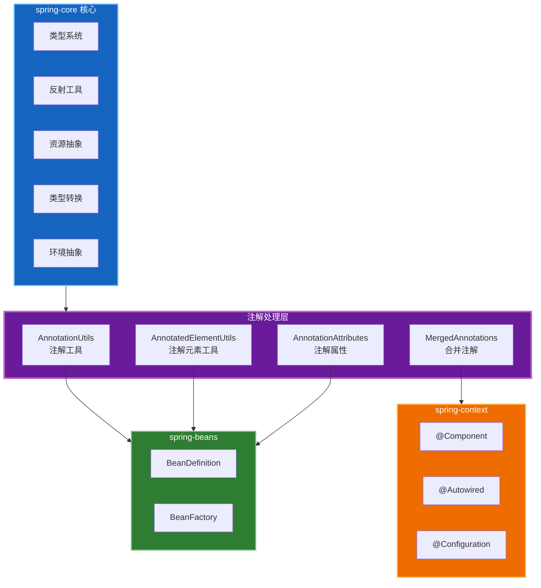

# 注解处理模块概述

## 1. 模块定位

注解处理是 Spring Framework 核心基础设施的重要组成部分，位于 `spring-core` 模块的 `annotation` 包中。它为整个 Spring 生态提供统一的注解元数据获取、解析和处理能力，是 Spring 注解驱动编程模型的基石。

### 1.1 核心能力矩阵定位

| 能力 | 核心类 | 解决的问题 | 使用频率 | 学习优先级 |
|------|--------|-----------|----------|-----------|
| **注解处理** | `AnnotationUtils` | 注解元数据获取 | 中 | 中 |

注解处理模块主要解决以下问题：
- **注解元数据获取**: 统一获取类、方法、字段上的注解信息
- **注解属性解析**: 解析注解的属性和默认值
- **注解继承处理**: 处理注解的继承和组合关系
- **重复注解支持**: 支持同一元素的重复注解
- **注解别名处理**: 处理注解属性别名和覆盖

### 1.2 在 Spring 生态中的位置



## 2. 核心组件架构

### 2.1 包结构全景

```
org.springframework.core.annotation
├── AnnotationUtils.java           # 注解工具类（核心入口）
├── AnnotatedElementUtils.java     # 注解元素工具类
├── MergedAnnotations.java         # 合并注解接口
├── MergedAnnotation.java          # 单个合并注解
├── AnnotationAttributes.java      # 注解属性映射
├── AnnotationAttributesProvider.java  # 属性提供者接口
├── AnnotationFilter.java          # 注解过滤器
├── AnnotationTypeMapping.java     # 注解类型映射
├── AnnotationTypeMappings.java    # 注解类型映射集合
├── RepeatableContainers.java      # 重复注解容器
├── SynthesizedAnnotation.java     # 合成注解标记
└── SynthesizingMethodParameter.java   # 合成方法参数
```

### 2.2 核心类职责

| 类/接口 | 职责 | 使用场景 |
|---------|------|----------|
| `AnnotationUtils` | 提供静态方法获取注解 | 最常用的注解获取工具 |
| `AnnotatedElementUtils` | 处理注解元素的组合注解 | 处理 `@AliasFor` 和组合注解 |
| `MergedAnnotations` | 表示元素上的所有合并注解 | 遍历和筛选注解 |
| `MergedAnnotation` | 表示单个合并后的注解 | 获取注解属性和元数据 |
| `AnnotationAttributes` | 注解属性的 Map 实现 | 存储和传递注解属性 |
| `AnnotationFilter` | 过滤不需要的注解 | 性能优化和筛选 |
| `RepeatableContainers` | 处理 Java 8 重复注解 | `@Repeatable` 支持 |

## 3. 核心功能详解

### 3.1 注解获取

Spring 提供了多层次的注解获取能力：

#### 3.1.1 基础获取（AnnotationUtils）

```java
// 获取直接声明的注解
AnnotationUtils.getAnnotation(element, MyAnnotation.class);

// 获取包含继承的注解
AnnotationUtils.findAnnotation(element, MyAnnotation.class);

// 获取注解属性
AnnotationUtils.getAnnotationAttributes(annotation);
```

#### 3.1.2 高级获取（AnnotatedElementUtils）

```java
// 获取合并后的注解（处理 @AliasFor）
AnnotatedElementUtils.getMergedAnnotation(element, MyAnnotation.class);

// 判断是否包含注解（考虑元注解）
AnnotatedElementUtils.hasAnnotation(element, MyAnnotation.class);

// 获取所有重复注解
AnnotatedElementUtils.getMergedRepeatableAnnotations(element, MyAnnotation.class);
```

### 3.2 注解合并（MergedAnnotations）

Spring 4.2 引入的注解合并机制，用于处理注解的继承和组合：

```java
// 获取元素上的所有合并注解
MergedAnnotations annotations = MergedAnnotations.from(element);

// 遍历注解
annotations.stream()
    .filter(MergedAnnotationPredicates.typeIn(Component.class))
    .forEach(annotation -> {
        String value = annotation.getString("value");
    });
```

### 3.3 注解属性别名（@AliasFor）

Spring 4.2 引入的注解属性别名机制：

```java
@Target(ElementType.TYPE)
@Retention(RetentionPolicy.RUNTIME)
public @interface MyComponent {
    @AliasFor(annotation = Component.class, attribute = "value")
    String name() default "";
}
```

### 3.4 重复注解支持

Java 8 重复注解的 Spring 支持：

```java
// 定义容器注解
@Retention(RetentionPolicy.RUNTIME)
@Target(ElementType.TYPE)
public @interface MyAnnotations {
    MyAnnotation[] value();
}

// 定义可重复注解
@Retention(RetentionPolicy.RUNTIME)
@Target(ElementType.TYPE)
@Repeatable(MyAnnotations.class)
public @interface MyAnnotation {
    String value();
}
```

## 4. 典型应用场景

### 4.1 Spring 注解驱动编程

```java
// @Component 扫描
@ComponentScan(basePackages = "com.example")

// @Autowired 注入
@Autowired
private MyService myService;

// @Value 属性注入
@Value("${app.name}")
private String appName;

// @Configuration 配置类
@Configuration
public class AppConfig {
    @Bean
    public MyBean myBean() {
        return new MyBean();
    }
}
```

### 4.2 自定义组合注解

```java
// 创建组合注解
@Target(ElementType.TYPE)
@Retention(RetentionPolicy.RUNTIME)
@Component
@Scope("prototype")
@Transactional
public @interface ServiceFacade {
    @AliasFor(annotation = Component.class, attribute = "value")
    String value() default "";
}

// 使用组合注解
@ServiceFacade("userService")
public class UserServiceFacade {
    // 同时具有 @Component、@Scope("prototype")、@Transactional 的效果
}
```

### 4.3 注解属性覆盖

```java
// 元注解
@Target(ElementType.TYPE)
@Retention(RetentionPolicy.RUNTIME)
public @interface MetaAnnotation {
    String value() default "default";
    int priority() default 0;
}

// 派生注解覆盖属性
@Target(ElementType.TYPE)
@Retention(RetentionPolicy.RUNTIME)
@MetaAnnotation(priority = 10)
public @interface DerivedAnnotation {
    @AliasFor(annotation = MetaAnnotation.class, attribute = "value")
    String name() default "derived";
}
```

## 5. 设计亮点

### 5.1 统一抽象

- **MergedAnnotation 接口**: 统一表示原始注解和合并后的注解
- **AnnotationAttributes**: 统一的属性存储结构
- **AnnotationFilter**: 可插拔的注解过滤机制

### 5.2 性能优化

- **缓存机制**: 注解解析结果缓存
- **延迟加载**: 按需解析注解属性
- **过滤器**: 快速跳过不需要的注解

### 5.3 扩展性

- **SynthesizedAnnotation**: 标记接口支持自定义合成注解
- **AnnotationAttributesProvider**: 属性提供者接口支持自定义属性源
- **RepeatableContainers**: 可扩展的重复注解容器

## 6. 与 Java 标准注解的对比

| 特性 | Java 标准反射 | Spring 注解处理 |
|------|--------------|----------------|
| 基础获取 | `AnnotatedElement.getAnnotation()` | `AnnotationUtils.getAnnotation()` |
| 元注解支持 | 不支持 | 完整支持 |
| 属性别名 | 不支持 | `@AliasFor` 支持 |
| 重复注解 | Java 8+ 支持 | 完整支持 |
| 注解合并 | 不支持 | `MergedAnnotations` |
| 性能 | 无优化 | 缓存优化 |

## 7. 学习路径建议

### 7.1 入门阶段

1. 理解 Java 注解基础（`@Retention`、`@Target`、`@Inherited`）
2. 学习 `AnnotationUtils` 的基本用法
3. 掌握 `@AliasFor` 的使用场景

### 7.2 进阶阶段

1. 深入理解 `MergedAnnotations` 机制
2. 学习自定义组合注解的创建
3. 掌握 `AnnotatedElementUtils` 的高级特性

### 7.3 高级阶段

1. 研究注解处理的源码实现
2. 理解注解类型映射和合成机制
3. 学习如何扩展注解处理框架

## 8. 参考资源

- [Spring Framework 官方文档 - 注解支持](https://docs.spring.io/spring-framework/docs/current/reference/html/core.html#beans-annotation-config)
- [Spring 注解编程模型](https://docs.spring.io/spring-framework/docs/current/reference/html/core.html#annotation-programming-model)
- [Java 注解官方教程](https://docs.oracle.com/javase/tutorial/java/annotations/)

## 9. 总结

注解处理模块是 Spring Framework 实现注解驱动编程模型的核心基础设施。它通过提供统一的注解获取、合并、属性解析能力，使得 Spring 能够支持复杂的注解组合、属性别名、重复注解等高级特性。理解注解处理模块对于深入掌握 Spring 的注解机制、开发自定义注解和组合注解至关重要。
