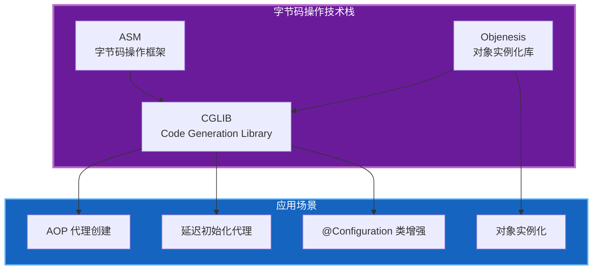

# 字节码操作概述

## 1. 模块定位

字节码操作是 Spring Framework 的核心基础设施之一，位于 `spring-core` 模块中。它为 Spring 的 AOP 代理、Bean 实例化等高级功能提供底层支持，是实现运行时类增强和动态代理的基础。

## 2. 核心能力矩阵

| 能力 | 核心类/工具 | 解决的问题 | 使用频率 | 学习优先级 |
|------|------------|-----------|----------|-----------|
| **CGLIB 代理** | `CglibAopProxy`, `Enhancer` | 无接口类的动态代理 | 中 | 高 |
| **ASM 字节码操作** | `ClassReader`, `ClassWriter` | 直接操作字节码，高效生成类 | 低 | 中 |
| **Objenesis 实例化** | `ObjenesisStd`, `ObjectInstantiator` | 绕过构造器创建对象实例 | 中 | 中 |
| **类加载器管理** | `OverridingClassLoader`, `ClassLoader` | 隔离和重载类定义 | 低 | 低 |

## 3. 技术栈全景

Spring 字节码操作采用多技术栈组合策略，针对不同场景选择最优方案：



## 4. 包结构全景

```
org.springframework.core
├── cglib/                           # CGLIB 字节码生成库（内嵌）
│   ├── core/                        # CGLIB 核心类
│   │   ├── AbstractClassGenerator   # 抽象类生成器
│   │   ├── DebuggingClassWriter     # 调试类写入器
│   │   └── GeneratorStrategy        # 生成策略接口
│   ├── proxy/                       # 代理相关
│   │   ├── Enhancer                 # 增强器，创建代理类
│   │   ├── MethodInterceptor        # 方法拦截器接口
│   │   ├── MethodProxy              # 方法代理
│   │   └── Callback                 # 回调接口
│   ├── reflect/                     # 反射支持
│   │   ├── FastClass                # 快速类，优化反射调用
│   │   └── FastMethod               # 快速方法
│   └── transform/                   # 类转换
│       └── ClassTransformer         # 类转换器
├── objenesis/                       # Objenesis 实例化库（内嵌）
│   ├── Objenesis                    # 实例化器接口
│   ├── ObjenesisStd                 # 标准实例化器
│   ├── ObjectInstantiator           # 对象实例化器接口
│   └── instantiator/                # 各种实例化策略
│       ├── SunReflectionFactoryInstantiator
│       └── UnsafeFactoryInstantiator
└── asm/                             # ASM 字节码操作（内嵌）
    ├── ClassReader                  # 类读取器
    ├── ClassWriter                  # 类写入器
    ├── ClassVisitor                 # 类访问器
    ├── MethodVisitor                # 方法访问器
    ├── FieldVisitor                 # 字段访问器
    ├── Opcodes                      # 字节码操作码
    └── Type                         # 类型描述
```

## 5. 技术选型分析

### 5.1 为什么使用 CGLIB？

| 特性 | JDK 动态代理 | CGLIB |
|------|-------------|-------|
| 代理目标 | 必须实现接口 | 无需接口，代理普通类 |
| 实现方式 | 实现接口 | 继承目标类，生成子类 |
| 性能 | 反射调用 | FastClass 优化，接近直接调用 |
| final 方法 | 支持 | 无法代理 final 方法 |
| 依赖 | JDK 内置 | 第三方库（Spring 内嵌）|

**Spring 的选择策略**：
- 目标类实现接口 → 优先使用 JDK 动态代理
- 目标类无接口 → 使用 CGLIB 代理
- 可通过配置强制使用 CGLIB

### 5.2 为什么使用 ASM？

ASM 是 Java 字节码操作的事实标准，Spring 内嵌 ASM 用于：

1. **CGLIB 底层支持**：CGLIB 基于 ASM 生成字节码
2. **类元数据读取**：高效读取类文件元数据，无需加载类
3. **零依赖**：内嵌后无外部依赖，避免版本冲突

### 5.3 为什么使用 Objenesis？

Objenesis 专门解决对象实例化问题：

| 场景 | 传统方式 | Objenesis |
|------|---------|-----------|
| 私有构造器 | 反射设置 accessible | 直接分配内存 |
| 抽象类 | 无法实例化 | 创建具体子类 |
| 构造器副作用 | 必然执行 | 完全绕过 |
| 性能 | 反射较慢 | 接近 new 操作 |

**Spring 使用场景**：
- `@Configuration` 类代理对象创建
- 延迟初始化代理
- 避免执行构造器中的业务逻辑

## 6. 核心组件详解

### 6.1 CGLIB Enhancer

`Enhancer` 是 CGLIB 的核心类，用于创建代理类：

```java
// 基本使用模式
Enhancer enhancer = new Enhancer();
enhancer.setSuperclass(TargetClass.class);  // 设置父类
enhancer.setCallback((MethodInterceptor) (obj, method, args, proxy) -> {
    // 拦截逻辑
    return proxy.invokeSuper(obj, args);    // 调用父类方法
});
Object proxy = enhancer.create();           // 创建代理实例
```

### 6.2 CGLIB FastClass

`FastClass` 是 CGLIB 的反射优化方案：

```java
// 为类生成 FastClass
FastClass fastClass = FastClass.create(TargetClass.class);

// 通过索引调用方法（避免反射）
int methodIndex = fastClass.getIndex("methodName", paramTypes);
fastClass.invoke(methodIndex, targetInstance, args);
```

**性能对比**：
- 反射调用：~100ns
- FastClass：~10ns
- 直接调用：~5ns

### 6.3 ASM ClassReader/ClassWriter

ASM 的核心读写类：

```java
// 读取类文件
ClassReader reader = new ClassReader(classFileBytes);
ClassWriter writer = new ClassWriter(ClassWriter.COMPUTE_FRAMES);

// 通过 Visitor 模式处理类
reader.accept(new ClassVisitor(Opcodes.ASM9, writer) {
    @Override
    public MethodVisitor visitMethod(int access, String name, 
            String descriptor, String signature, String[] exceptions) {
        // 处理方法
        return super.visitMethod(access, name, descriptor, signature, exceptions);
    }
}, ClassReader.EXPAND_FRAMES);

// 获取修改后的字节码
byte[] modifiedBytes = writer.toByteArray();
```

### 6.4 Objenesis 实例化器

Objenesis 的标准使用方式：

```java
// 创建实例化器
Objenesis objenesis = new ObjenesisStd();

// 获取特定类的实例化器
ObjectInstantiator<MyClass> instantiator = 
    objenesis.getInstantiatorOf(MyClass.class);

// 创建实例（不调用构造器）
MyClass instance = instantiator.newInstance();
```

## 7. 在 Spring 中的应用场景

### 7.1 AOP 代理创建

```
目标 Bean → 检查是否需要代理 → 选择代理策略 → 创建代理
                              ↓
                    ┌─────────┴─────────┐
                    ↓                   ↓
              有接口              无接口或强制 CGLIB
                    ↓                   ↓
              JDK 代理            CGLIB Enhancer
                    ↓                   ↓
              InvocationHandler    MethodInterceptor
```

### 7.2 @Configuration 类增强

Spring 使用 CGLIB 增强 `@Configuration` 类：

```java
@Configuration
public class AppConfig {
    @Bean
    public Service service() {
        return new Service(repository()); // 内部调用
    }
    
    @Bean
    public Repository repository() {
        return new Repository();
    }
}
```

**增强效果**：
- 内部 `@Bean` 方法调用会被拦截
- 确保单例 Bean 只被创建一次
- 通过代理实现方法拦截

### 7.3 延迟初始化代理

对于 `@Lazy` 注解的 Bean，Spring 创建延迟代理：

```java
@Component
@Lazy
public class HeavyService {
    // 构造器耗时操作
    public HeavyService() {
        // 初始化耗时资源
    }
}

// 注入的是代理对象
@Autowired
private HeavyService service; // 实际使用时才创建真实对象
```

## 8. 性能考量

### 8.1 类生成开销

| 操作 | 开销 | 优化策略 |
|------|------|---------|
| 生成代理类 | 高（首次） | 缓存生成的类 |
| 加载类 | 中 | 使用自定义 ClassLoader |
| 创建实例 | 低 | 使用 Objenesis |
| 方法调用 | 极低 | FastClass 优化 |

### 8.2 内存占用

- 每个代理类：~10-50KB（取决于方法数量）
- 元空间占用：与类数量成正比
- 建议：控制代理类数量，避免过度代理

## 9. 学习路径建议

### 9.1 基础阶段

1. **理解动态代理概念**
   - JDK 动态代理原理
   - 代理模式 vs 装饰器模式

2. **掌握 CGLIB 基本使用**
   - Enhancer 创建代理
   - MethodInterceptor 实现

### 9.2 进阶阶段

1. **深入 ASM 字节码**
   - 字节码结构
   - Visitor 模式
   - 常用字节码操作

2. **理解 Spring 代理机制**
   - AopProxy 体系
   - 代理创建流程
   - 拦截器链

### 9.3 高级阶段

1. **自定义字节码操作**
   - 扩展 CGLIB
   - 直接操作 ASM
   - 类加载器隔离

2. **性能优化**
   - 代理缓存策略
   - FastClass 原理
   - 内存优化

## 10. 参考资源

- [CGLIB 官方文档](https://github.com/cglib/cglib)
- [ASM 官方文档](https://asm.ow2.io/)
- [Objenesis 官方文档](http://objenesis.org/)
- [JVM 字节码指令集](https://docs.oracle.com/javase/specs/jvms/se17/html/jvms-6.html)
- [Spring Framework AOP 文档](https://docs.spring.io/spring-framework/reference/core/aop.html)
