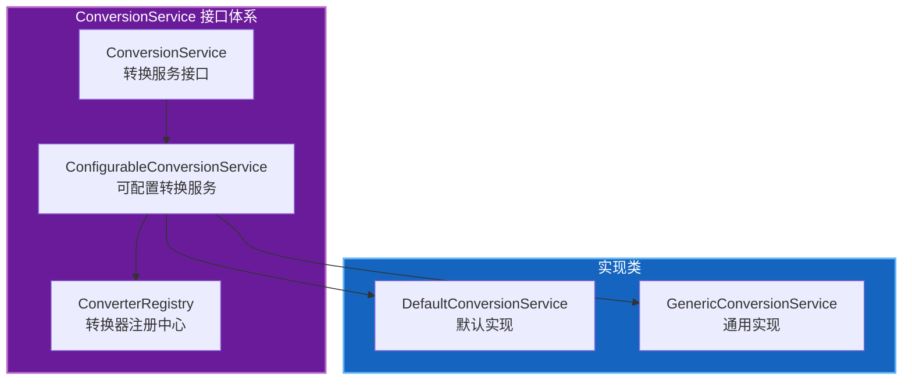
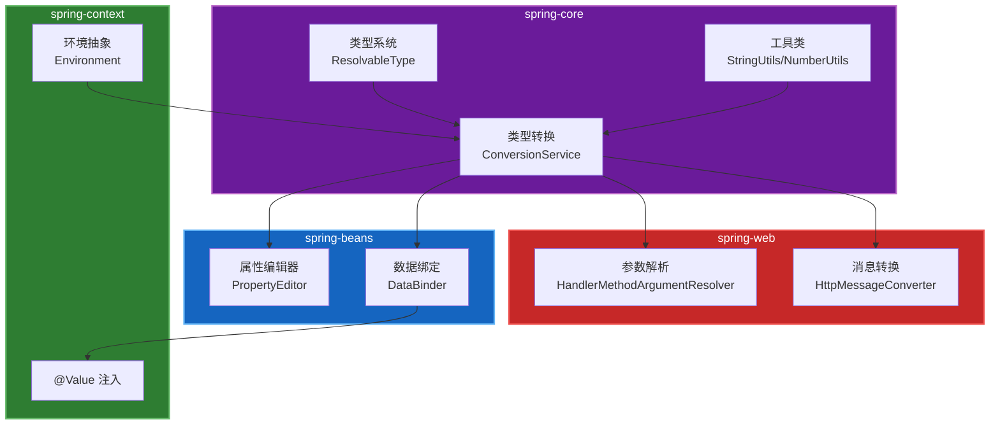

# Spring 类型转换深度分析

## 一、概述

### 1.1 定位与价值

类型转换（Type Conversion）是 Spring Framework `spring-core` 模块的核心能力之一，位于 `org.springframework.core.convert` 包下。它解决了 Java 开发中类型转换的以下痛点：

| 痛点 | 原生 Java | Spring 类型转换 |
|------|-----------|----------------|
| 转换逻辑分散 | 各处重复编写转换代码 | 统一 ConversionService 接口 |
| 类型判断繁琐 | 需要手动判断源类型和目标类型 | 自动类型匹配和选择 |
| 集合转换复杂 | 需要遍历处理每个元素 | 支持泛型集合自动转换 |
| 扩展困难 | 新增类型需要修改多处 | 通过 Converter 接口灵活扩展 |
| 线程安全 | 需要自行处理并发 | 内置线程安全支持 |

### 1.2 核心类矩阵

| 类名 | 职责 | 使用频率 | 学习优先级 |
|------|------|----------|-----------|
| `ConversionService` | 类型转换服务接口 | 高 | 高 |
| `Converter` | 单向转换器接口 | 高 | 高 |
| `ConverterFactory` | 转换器工厂接口 | 中 | 中 |
| `GenericConverter` | 通用转换器接口 | 中 | 中 |
| `ConditionalConverter` | 条件转换器接口 | 中 | 中 |
| `ConversionServiceFactoryBean` | 工厂 Bean 配置 | 中 | 中 |
| `DefaultConversionService` | 默认实现 | 高 | 高 |
| `Formatter` | 格式化接口 | 中 | 中 |

---

## 二、ConversionService 接口详解

### 2.1 接口设计



### 2.2 核心方法

```java
public interface ConversionService {
    /**
     * 判断是否可以将源类型转换为目标类型
     */
    boolean canConvert(Class<?> sourceType, Class<?> targetType);
    
    /**
     * 判断是否可以将源类型转换为目标类型（支持泛型）
     */
    boolean canConvert(TypeDescriptor sourceType, TypeDescriptor targetType);
    
    /**
     * 执行类型转换
     */
    <T> T convert(Object source, Class<T> targetType);
    
    /**
     * 执行类型转换（支持泛型）
     */
    Object convert(Object source, TypeDescriptor sourceType, TypeDescriptor targetType);
}
```

### 2.3 使用示例

```java
// 创建转换服务
ConversionService conversionService = new DefaultConversionService();

// 基本类型转换
Integer number = conversionService.convert("123", Integer.class);

// 集合转换
List<String> stringList = Arrays.asList("1", "2", "3");
List<Integer> integerList = conversionService.convert(stringList, 
    TypeDescriptor.collection(List.class, TypeDescriptor.valueOf(String.class)),
    TypeDescriptor.collection(List.class, TypeDescriptor.valueOf(Integer.class)));

// 自定义对象转换
User user = conversionService.convert("zhangsan,25", User.class);
```

---

## 三、Converter 转换器详解

### 3.1 接口设计

```java
/**
 * 单向转换器接口
 * S: 源类型
 * T: 目标类型
 */
@FunctionalInterface
public interface Converter<S, T> {
    /**
     * 执行类型转换
     */
    T convert(S source);
}
```

### 3.2 内置转换器

Spring 提供了丰富的内置转换器：

| 转换器 | 源类型 | 目标类型 | 说明 |
|--------|--------|----------|------|
| `StringToInteger` | String | Integer | 字符串转整数 |
| `StringToLong` | String | Long | 字符串转长整数 |
| `StringToBoolean` | String | Boolean | 字符串转布尔值 |
| `StringToDate` | String | Date | 字符串转日期 |
| `StringToEnum` | String | Enum | 字符串转枚举 |
| `NumberToNumber` | Number | Number | 数字类型互转 |
| `ArrayToCollection` | Array | Collection | 数组转集合 |
| `CollectionToArray` | Collection | Array | 集合转数组 |
| `StringToResource` | String | Resource | 字符串转资源 |
| `ObjectToString` | Object | String | 对象转字符串 |

### 3.3 自定义转换器

```java
/**
 * 字符串转用户对象转换器
 */
public class StringToUserConverter implements Converter<String, User> {
    
    @Override
    public User convert(String source) {
        if (source == null || source.isEmpty()) {
            return null;
        }
        
        String[] parts = source.split(",");
        User user = new User();
        user.setName(parts[0]);
        user.setAge(Integer.parseInt(parts[1]));
        return user;
    }
}

/**
 * 注册自定义转换器
 */
DefaultConversionService conversionService = new DefaultConversionService();
conversionService.addConverter(new StringToUserConverter());
```

---

## 四、ConverterFactory 转换器工厂

### 4.1 设计目的

当需要将一种类型转换为多种相关类型时（如 String 转各种 Number 子类），使用 ConverterFactory 可以避免创建多个类似的转换器。

### 4.2 接口设计

```java
/**
 * 转换器工厂接口
 * S: 源类型
 * R: 目标类型的基类
 */
public interface ConverterFactory<S, R> {
    /**
     * 获取指定目标类型的转换器
     */
    <T extends R> Converter<S, T> getConverter(Class<T> targetType);
}
```

### 4.3 使用示例

```java
/**
 * 字符串转数字工厂
 */
public class StringToNumberConverterFactory implements ConverterFactory<String, Number> {
    
    @Override
    public <T extends Number> Converter<String, T> getConverter(Class<T> targetType) {
        return new StringToNumberConverter<>(targetType);
    }
    
    private static class StringToNumberConverter<T extends Number> implements Converter<String, T> {
        private final Class<T> targetType;
        
        public StringToNumberConverter(Class<T> targetType) {
            this.targetType = targetType;
        }
        
        @Override
        public T convert(String source) {
            if (source == null || source.isEmpty()) {
                return null;
            }
            
            if (targetType == Integer.class) {
                return (T) Integer.valueOf(source);
            } else if (targetType == Long.class) {
                return (T) Long.valueOf(source);
            } else if (targetType == Double.class) {
                return (T) Double.valueOf(source);
            }
            // ... 其他数字类型
            
            throw new IllegalArgumentException("Unsupported number type: " + targetType);
        }
    }
}
```

---

## 五、GenericConverter 通用转换器

### 5.1 设计目的

当转换逻辑需要同时访问源类型和目标类型的泛型信息时，使用 GenericConverter。

### 5.2 接口设计

```java
/**
 * 通用转换器接口
 * 支持复杂的类型转换场景
 */
public interface GenericConverter {
    /**
     * 获取支持的转换对
     */
    Set<ConvertiblePair> getConvertibleTypes();
    
    /**
     * 执行转换
     */
    Object convert(Object source, TypeDescriptor sourceType, TypeDescriptor targetType);
    
    /**
     * 可转换类型对
     */
    final class ConvertiblePair {
        private final Class<?> sourceType;
        private final Class<?> targetType;
        
        public ConvertiblePair(Class<?> sourceType, Class<?> targetType) {
            this.sourceType = sourceType;
            this.targetType = targetType;
        }
        
        // getter 方法
    }
}
```

### 5.3 使用示例

```java
/**
 * Map 转对象转换器
 */
public class MapToObjectConverter implements GenericConverter {
    
    @Override
    public Set<ConvertiblePair> getConvertibleTypes() {
        return Collections.singleton(
            new ConvertiblePair(Map.class, Object.class)
        );
    }
    
    @Override
    public Object convert(Object source, TypeDescriptor sourceType, TypeDescriptor targetType) {
        if (source == null) {
            return null;
        }
        
        Map<?, ?> sourceMap = (Map<?, ?>) source;
        Class<?> targetClass = targetType.getObjectType();
        
        try {
            Object target = targetClass.getDeclaredConstructor().newInstance();
            
            for (Map.Entry<?, ?> entry : sourceMap.entrySet()) {
                String propertyName = entry.getKey().toString();
                Object propertyValue = entry.getValue();
                
                // 使用反射设置属性
                Field field = targetClass.getDeclaredField(propertyName);
                field.setAccessible(true);
                field.set(target, propertyValue);
            }
            
            return target;
        } catch (Exception e) {
            throw new ConversionFailedException(sourceType, targetType, source, e);
        }
    }
}
```

---

## 六、ConditionalConverter 条件转换器

### 6.1 设计目的

当转换器需要根据运行时条件判断是否支持转换时，实现 ConditionalConverter 接口。

### 6.2 接口设计

```java
/**
 * 条件转换器接口
 */
public interface ConditionalConverter {
    /**
     * 判断是否匹配转换条件
     */
    boolean matches(TypeDescriptor sourceType, TypeDescriptor targetType);
}

/**
 * 条件通用转换器
 */
public interface ConditionalGenericConverter extends GenericConverter, ConditionalConverter {
}
```

### 6.3 使用示例

```java
/**
 * 带条件的对象转 Map 转换器
 * 只有当目标类型是 Map 且源对象有特定注解时才转换
 */
public class AnnotatedObjectToMapConverter implements ConditionalGenericConverter {
    
    @Override
    public Set<ConvertiblePair> getConvertibleTypes() {
        return Collections.singleton(
            new ConvertiblePair(Object.class, Map.class)
        );
    }
    
    @Override
    public boolean matches(TypeDescriptor sourceType, TypeDescriptor targetType) {
        // 检查源类型是否有 @Convertible 注解
        return sourceType.getAnnotation(Convertible.class) != null;
    }
    
    @Override
    public Object convert(Object source, TypeDescriptor sourceType, TypeDescriptor targetType) {
        // 执行转换逻辑
        Map<String, Object> result = new HashMap<>();
        // ... 转换实现
        return result;
    }
}
```

---

## 七、Formatter 格式化接口

### 7.1 与 Converter 的区别

| 特性 | Converter | Formatter |
|------|-----------|-----------|
| 方向 | 单向或双向 | 双向（解析和打印） |
| 场景 | 任意类型转换 | 字符串与对象互转 |
| 上下文 | 无 | 支持 Locale 上下文 |
| 典型用途 | 数据转换 | 展示格式化 |

### 7.2 接口设计

```java
/**
 * 格式化接口
 * T: 目标类型
 */
public interface Formatter<T> extends Printer<T>, Parser<T> {
}

/**
 * 打印接口（对象转字符串）
 */
public interface Printer<T> {
    String print(T object, Locale locale);
}

/**
 * 解析接口（字符串转对象）
 */
public interface Parser<T> {
    T parse(String text, Locale locale) throws ParseException;
}
```

### 7.3 使用示例

```java
/**
 * 日期格式化器
 */
public class DateFormatter implements Formatter<Date> {
    
    private final String pattern;
    
    public DateFormatter(String pattern) {
        this.pattern = pattern;
    }
    
    @Override
    public String print(Date object, Locale locale) {
        return new SimpleDateFormat(pattern, locale).format(object);
    }
    
    @Override
    public Date parse(String text, Locale locale) throws ParseException {
        return new SimpleDateFormat(pattern, locale).parse(text);
    }
}

// 使用
DateFormatter formatter = new DateFormatter("yyyy-MM-dd");
String dateStr = formatter.print(new Date(), Locale.CHINA);
Date date = formatter.parse("2026-03-23", Locale.CHINA);
```

---

## 八、ConversionService 配置与扩展

### 8.1 默认转换服务

```java
// 创建默认转换服务
DefaultConversionService conversionService = new DefaultConversionService();

// 添加 Spring 内置转换器
DefaultConversionService.addDefaultConverters(conversionService);

// 添加自定义转换器
conversionService.addConverter(new StringToUserConverter());
conversionService.addConverterFactory(new StringToNumberConverterFactory());
conversionService.addConverter(new MapToObjectConverter());
```

### 8.2 Spring Boot 自动配置

```java
@Configuration
public class ConversionConfig {
    
    @Bean
    public ConversionService conversionService() {
        DefaultConversionService service = new DefaultConversionService();
        
        // 添加自定义转换器
        service.addConverter(new StringToUserConverter());
        service.addConverter(new StringToDateConverter());
        
        return service;
    }
}
```

### 8.3 使用 FormatterRegistrar

```java
/**
 * 格式化器注册器
 */
public class DateFormatterRegistrar implements FormatterRegistrar {
    
    @Override
    public void registerFormatters(FormatterRegistry registry) {
        registry.addFormatter(new DateFormatter("yyyy-MM-dd"));
        registry.addFormatterForFieldType(LocalDate.class, new LocalDateFormatter());
    }
}

// Spring Boot 配置
@Configuration
public class WebConfig implements WebMvcConfigurer {
    
    @Override
    public void addFormatters(FormatterRegistry registry) {
        new DateFormatterRegistrar().registerFormatters(registry);
    }
}
```

---

## 九、实际应用场景

### 9.1 Web 层参数绑定

```java
@Controller
public class UserController {
    
    @GetMapping("/user/{id}")
    public User getUser(@PathVariable Long id) {
        // Spring 自动将 String 类型的路径参数转换为 Long
        return userService.findById(id);
    }
    
    @PostMapping("/user")
    public User createUser(@RequestBody UserDTO dto) {
        // Spring 自动处理 JSON 到对象的转换
        return userService.create(dto);
    }
}
```

### 9.2 配置文件属性绑定

```java
@Component
@ConfigurationProperties(prefix = "app")
public class AppProperties {
    
    private String name;
    private Integer port;
    private List<String> features;
    private Map<String, String> metadata;
    
    // Spring 自动将配置文件中的字符串转换为对应类型
    // name=MyApp -> String
    // port=8080 -> Integer
    // features=a,b,c -> List<String>
    // metadata.key=value -> Map<String, String>
}
```

### 9.3 数据层类型转换

```java
@Repository
public class UserRepository {
    
    @Autowired
    private ConversionService conversionService;
    
    public User findById(String id) {
        // 手动使用 ConversionService
        Long userId = conversionService.convert(id, Long.class);
        return jdbcTemplate.queryForObject(
            "SELECT * FROM user WHERE id = ?",
            new UserRowMapper(),
            userId
        );
    }
}
```

---

## 十、最佳实践

### 10.1 转换器设计原则

1. **单一职责**：每个转换器只负责一种转换逻辑
2. **空值处理**：明确处理 null 和空字符串
3. **异常处理**：抛出 ConversionFailedException
4. **线程安全**：转换器应该是无状态的

```java
public class BestPracticeConverter implements Converter<String, TargetType> {
    
    @Override
    public TargetType convert(String source) {
        // 1. 空值检查
        if (!StringUtils.hasText(source)) {
            return null;
        }
        
        try {
            // 2. 转换逻辑
            return doConvert(source);
        } catch (Exception e) {
            // 3. 异常处理
            throw new ConversionFailedException(
                TypeDescriptor.forObject(source),
                TypeDescriptor.valueOf(TargetType.class),
                source,
                e
            );
        }
    }
}
```

### 10.2 性能优化

1. **缓存转换器**：避免重复查找转换器
2. **避免过度转换**：在边界处统一转换
3. **使用原始类型**：避免不必要的装箱拆箱

### 10.3 测试策略

```java
@SpringBootTest
public class ConverterTest {
    
    @Autowired
    private ConversionService conversionService;
    
    @Test
    public void testStringToInteger() {
        Integer result = conversionService.convert("123", Integer.class);
        assertEquals(Integer.valueOf(123), result);
    }
    
    @Test
    public void testInvalidConversion() {
        assertThrows(ConversionFailedException.class, () -> {
            conversionService.convert("abc", Integer.class);
        });
    }
    
    @Test
    public void testNullConversion() {
        assertNull(conversionService.convert(null, Integer.class));
    }
}
```

---

## 十一、与其他模块的关系



---

## 十二、总结

Spring 类型转换系统提供了强大而灵活的机制：

1. **统一接口**：ConversionService 提供统一入口
2. **多种转换器**：Converter、ConverterFactory、GenericConverter 满足不同场景
3. **条件转换**：ConditionalConverter 支持运行时条件判断
4. **格式化支持**：Formatter 处理展示层面的转换
5. **易于扩展**：通过注册自定义转换器轻松扩展
6. **广泛集成**：与 Spring 各模块深度集成

掌握类型转换系统对于理解 Spring 数据绑定、Web 参数处理、配置属性注入等功能至关重要。
