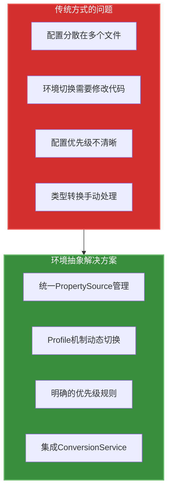
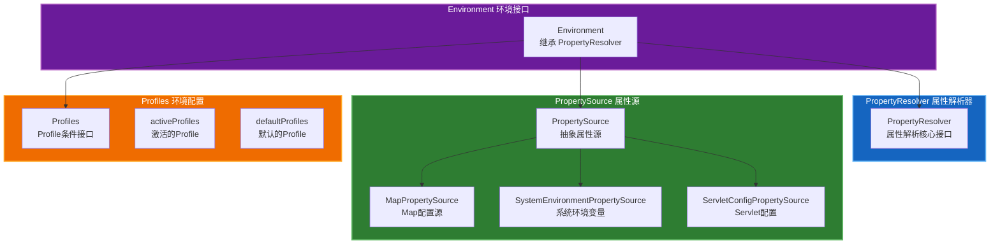
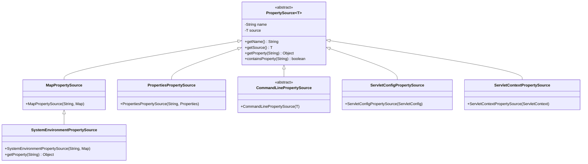
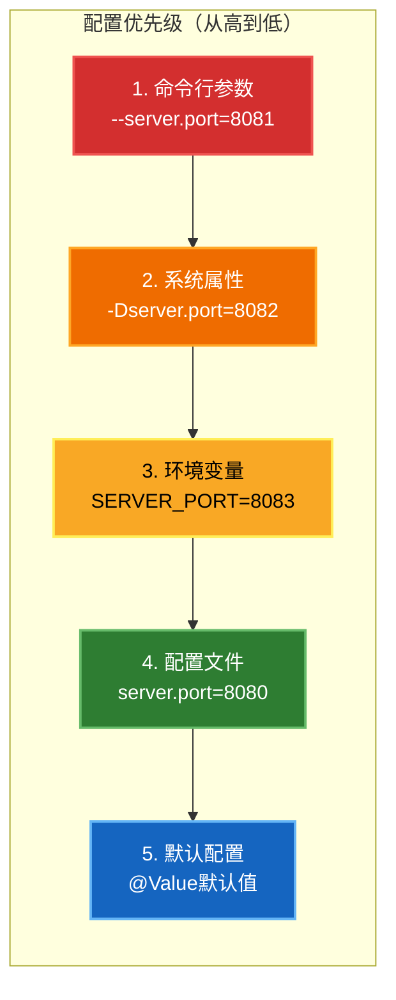
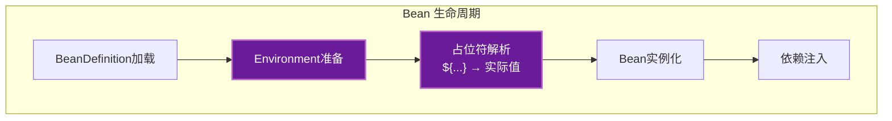

# 环境抽象模块概述

## 1. 模块定位

环境抽象（Environment Abstraction）是 Spring Framework 核心能力之一，位于 `spring-core` 模块的 `org.springframework.core.env` 包中。它提供了一套统一的配置管理抽象，解决了应用程序在不同环境（开发、测试、生产）中配置管理的复杂性。

### 1.1 核心价值

- **配置集中管理**：统一管理属性配置，支持多种配置源
- **环境隔离**：通过 Profile 机制实现不同环境的配置隔离
- **优先级管理**：支持配置源的优先级排序和覆盖
- **类型安全**：支持属性值的类型转换

### 1.2 解决的问题



## 2. 核心架构

### 2.1 架构概览



### 2.2 核心接口与类

| 组件 | 类型 | 职责 | 关键方法 |
|------|------|------|----------|
| **Environment** | 接口 | 环境抽象，整合配置和Profile | `getActiveProfiles()`, `getDefaultProfiles()` |
| **PropertyResolver** | 接口 | 属性解析核心能力 | `getProperty()`, `resolvePlaceholders()` |
| **PropertySource** | 抽象类 | 属性源的抽象基类 | `getName()`, `getProperty()`, `containsProperty()` |
| **MutablePropertySources** | 类 | 可变的属性源集合 | `addFirst()`, `addLast()`, `remove()` |
| **Profiles** | 接口 | Profile条件判断 | `matches()` |
| **ConfigurableEnvironment** | 接口 | 可配置的环境 | `setActiveProfiles()`, `addActiveProfile()` |

## 3. 配置源体系

### 3.1 PropertySource 继承体系



### 3.2 常见配置源

| 配置源 | 来源 | 优先级 | 典型用途 |
|--------|------|--------|----------|
| **命令行参数** | JVM启动参数 | 最高 | 运行时动态配置 |
| **系统属性** | System.getProperties() | 高 | JVM级别配置 |
| **环境变量** | System.getenv() | 高 | 操作系统配置 |
| **配置文件** | application.properties | 中 | 应用默认配置 |
| **Servlet配置** | web.xml | 低 | Web应用配置 |

### 3.3 配置优先级示例



## 4. Profile 机制

### 4.1 Profile 概念

Profile 是 Spring 提供的多环境支持机制，允许定义不同环境（开发、测试、生产）的配置，并在运行时激活特定环境。

### 4.2 Profile 激活方式

```mermaid
flowchart TB
    subgraph Activation["Profile 激活方式"]
        direction TB
        a1["编程式激活<br/>env.setActiveProfiles\"dev\")"]
        a2["配置文件激活<br/>spring.profiles.active=dev"]
        a3["环境变量激活<br/>SPRING_PROFILES_ACTIVE=dev"]
        a4["命令行激活<br/>--spring.profiles.active=dev"]
        a5["注解激活<br/>@ActiveProfiles\"dev\")"]
    end

    style Activation fill:#6a1b9a,stroke:#ba68c8,stroke-width:2px,color:#fff
```

### 4.3 Profile 使用场景

| 场景 | Profile 名称 | 配置特点 |
|------|-------------|----------|
| 本地开发 | `dev` | 启用调试日志，使用本地数据库 |
| 测试环境 | `test` | 使用内存数据库，禁用外部服务 |
| 预发布 | `staging` | 接近生产配置，用于验收测试 |
| 生产环境 | `prod` | 启用缓存，连接生产数据库 |

### 4.4 Profile 条件配置示例

```yaml
# application.yml
spring:
  profiles:
    active: dev

---
spring:
  config:
    activate:
      on-profile: dev
server:
  port: 8080
datasource:
  url: jdbc:mysql://localhost:3306/dev_db

---
spring:
  config:
    activate:
      on-profile: prod
server:
  port: 80
datasource:
  url: jdbc:mysql://prod-server:3306/prod_db
```

## 5. 占位符解析

### 5.1 占位符语法

| 语法 | 说明 | 示例 |
|------|------|------|
| `${key}` | 简单占位符 | `${server.port}` |
| `${key:default}` | 带默认值 | `${server.port:8080}` |
| `${key1:${key2}}` | 嵌套占位符 | `${app.name:${spring.application.name}}` |

### 5.2 解析流程

```mermaid
sequenceDiagram
    participant App as Application
    participant Env as Environment
    resolver as PropertyResolver
    sources as PropertySources
    source as PropertySource

    App->>Env: getProperty("db.url")
    Env->>resolver: resolveProperty()
    resolver->>sources: 遍历所有PropertySource
    loop 遍历PropertySources
        sources->>source: getProperty(key)
        source-->>sources: 返回值或null
    end
    sources-->>resolver: 找到第一个匹配值
    resolver-->>Env: 返回属性值
    Env-->>App: 返回解析后的值
```

## 6. 与 Spring 生态的集成

### 6.1 与 Bean 生命周期的集成



### 6.2 与类型转换的集成

环境抽象与类型转换系统（ConversionService）紧密集成，支持将属性值自动转换为目标类型。

```java
// 自动类型转换示例
@Value("${server.port:8080}")
private int port;  // String → int 自动转换

@Value("${feature.enabled:false}")
private boolean enabled;  // String → boolean 自动转换
```

## 7. 使用场景

### 7.1 典型应用场景

| 场景 | 解决方案 | 涉及组件 |
|------|----------|----------|
| 多环境配置管理 | Profile + PropertySource | Environment, Profiles |
| 配置外部化 | 系统属性 + 环境变量 | SystemEnvironmentPropertySource |
| 配置优先级 | MutablePropertySources | addFirst(), addLast() |
| 动态配置刷新 | Environment事件监听 | ApplicationEvent |
| 敏感信息加密 | 自定义PropertySource | 继承PropertySource |

### 7.2 最佳实践

1. **配置分层**：将配置按优先级分层，命令行 > 环境变量 > 配置文件
2. **敏感信息外部化**：密码等敏感信息使用环境变量或密钥管理服务
3. **合理的默认值**：为所有配置提供合理的默认值
4. **Profile 命名规范**：使用简短、清晰的 Profile 名称（dev, test, prod）
5. **配置文档化**：维护配置项的说明文档

## 8. 参考资源

- [Spring Framework - Environment Abstraction](https://docs.spring.io/spring-framework/reference/core/beans/environment.html)
- [Spring Boot - Externalized Configuration](https://docs.spring.io/spring-boot/docs/current/reference/html/features.html#features.external-config)
- [PropertySource JavaDoc](https://docs.spring.io/spring-framework/docs/current/javadoc-api/org/springframework/core/env/PropertySource.html)
- [Environment JavaDoc](https://docs.spring.io/spring-framework/docs/current/javadoc-api/org/springframework/core/env/Environment.html)

## 9. 下一步

接下来将实现环境抽象模块的示例代码，包括：

1. **PropertySource 实现**：自定义配置源
2. **Environment 实现**：可配置的环境
3. **Profile 支持**：多环境配置管理
4. **占位符解析**：配置值动态解析
5. **集成测试**：验证配置加载和解析
