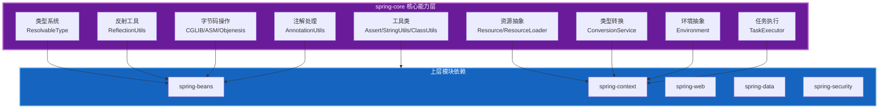

# spring-core 源码深度分析

本文档深入分析 Spring Framework 的 `spring-core` 模块，这是整个 Spring 生态的**基础设施层**，为其他所有模块提供基础能力支持。

## 模块概述

### 定位与价值

Spring Framework 采用分层模块化架构，各模块职责清晰，依赖关系明确。




### 核心能力矩阵

| 能力 | 核心类 | 解决的问题 | 使用频率 | 学习优先级 |
|------|--------|-----------|----------|-----------|
| **类型系统** | `ResolvableType` | Java 泛型擦除问题 | 高 | 高 |
| **反射工具** | `ReflectionUtils` | 反射操作繁琐、异常处理 | 高 | 高 |
| **资源抽象** | `Resource/ResourceLoader` | 资源访问不统一 | 中 | 中 |
| **类型转换** | `ConversionService` | 类型转换重复代码 | 中 | 中 |
| **断言工具** | `Assert` | 参数校验样板代码 | 高 | 高 |
| **环境抽象** | `Environment/PropertySource` | 配置管理 | 中 | 中 |
| **注解处理** | `AnnotationUtils` | 注解元数据获取 | 中 | 中 |
| **任务执行** | `TaskExecutor` | 异步任务执行 | 低 | 低 |
| **字节码操作** | `CglibAopProxy` | 动态代理 | 低 | 低 |

### 包结构全景

```
org.springframework.core
├── core/                    # 核心接口和基础类
│   ├── AttributeAccessor           # 属性访问器接口
│   ├── DecoratorProxy              # 装饰器代理标记
│   ├── InfrastructureProxy         # 基础设施代理标记
│   ├── Ordered                     # 排序接口
│   └── PriorityOrdered             # 高优先级排序
├── io/                      # 资源IO抽象
│   ├── Resource                    # 资源接口
│   ├── ResourceLoader              # 资源加载器
│   ├── DefaultResourceLoader       # 默认实现
│   ├── PathMatchingResourcePatternResolver  # 路径匹配
│   └── PropertySourceFactory       # 属性源工厂
├── convert/                 # 类型转换系统
│   ├── ConversionService           # 转换服务接口
│   ├── Converter                   # 转换器接口
│   ├── GenericConverter            # 通用转换器
│   ├── ConverterFactory            # 转换器工厂
│   └── support/                    # 支持类
├── env/                     # 环境抽象
│   ├── Environment                 # 环境接口
│   ├── PropertySource              # 属性源
│   ├── MutablePropertySources      # 可变属性源
│   └── Profiles                    # Profile支持
├── type/                    # 类型系统
│   ├── ResolvableType              # 可解析类型
│   ├── ClassMetadata               # 类元数据
│   ├── AnnotationMetadata          # 注解元数据
│   └── filter/                     # 类型过滤器
├── annotation/              # 注解处理
│   ├── AnnotationUtils             # 注解工具
│   ├── AnnotatedElementUtils       # 注解元素工具
│   ├── MergedAnnotations           # 合并注解
│   └── AnnotationAttributes        # 注解属性
├── task/                    # 任务执行
│   ├── TaskExecutor                # 任务执行器
│   ├── AsyncTaskExecutor           # 异步执行器
│   └── support/                    # 支持类
├── util/                    # 工具类集合
│   ├── Assert                      # 断言
│   ├── ClassUtils                  # 类工具
│   ├── StringUtils                 # 字符串工具
│   ├── CollectionUtils             # 集合工具
│   ├── ObjectUtils                 # 对象工具
│   ├── ReflectionUtils             # 反射工具
│   ├── ConcurrentReferenceHashMap  # 并发引用HashMap
│   └── CompositeIterator           # 组合迭代器
├── cglib/                   # CGLIB字节码操作（内嵌）
├── objenesis/               # Objenesis实例化（内嵌）
└── asm/                     # ASM字节码操作（内嵌）
```

## 参考资源

- [Spring Framework GitHub](https://github.com/spring-projects/spring-framework)
- [Spring Framework 文档](https://docs.spring.io/spring-framework/reference/)
- [Spring Framework API](https://docs.spring.io/spring-framework/docs/current/javadoc-api/)
