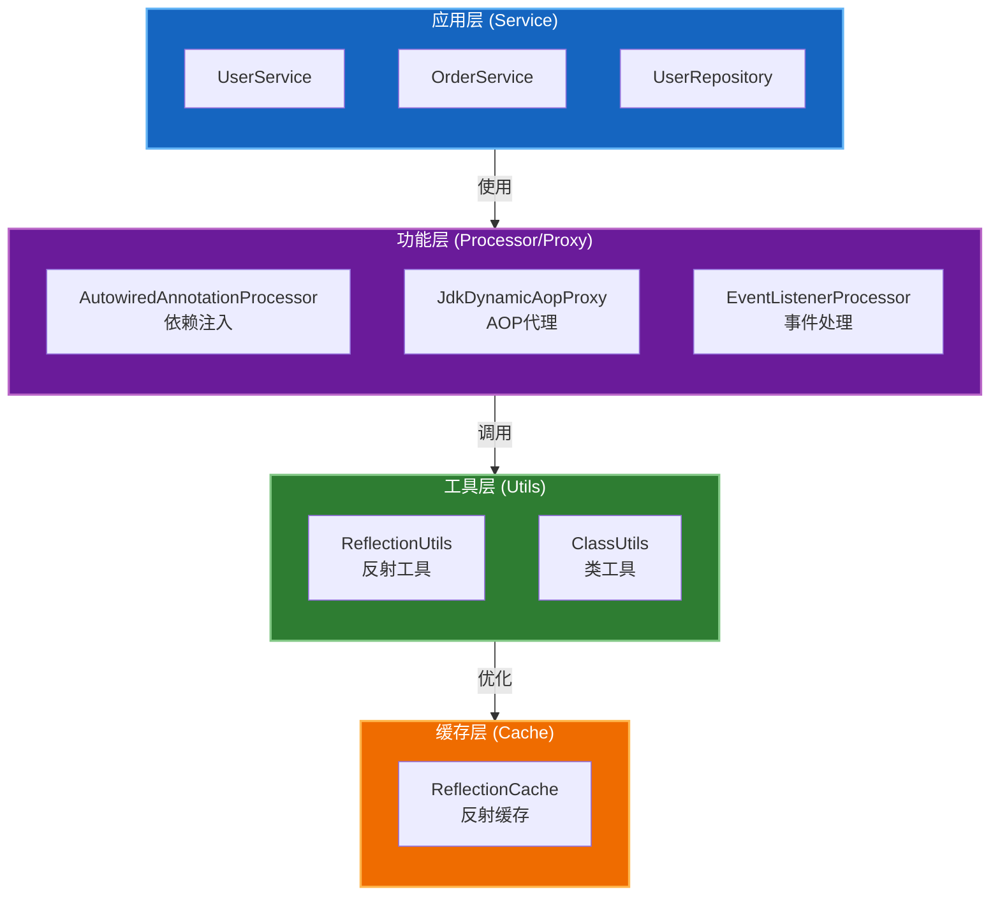

# Spring 反射工具示例代码指南

## 一、项目概述

本项目基于 Spring Framework 的反射工具设计思想，实现了一套完整的反射工具示例代码，涵盖字段操作、方法操作、依赖注入、AOP 代理、事件处理和反射缓存等核心功能。

## 二、架构设计

### 2.1 包结构

```
com.linsir.spring.framework.spring_core.reflection/
├── cache/          # 反射缓存
├── event/          # 事件处理
├── model/          # 模型和注解
├── processor/      # 注解处理器
├── proxy/          # AOP 代理
├── service/        # 服务层
└── utils/          # 工具类
```

### 2.2 核心组件关系



## 三、核心类详解

### 3.1 工具层 (Utils)

#### 3.1.1 ReflectionUtils

**职责**：提供字段和方法的反射操作

**核心功能**：

| 方法 | 功能描述 | 使用场景 |
|------|----------|----------|
| `findField()` | 查找字段（包含父类） | 获取私有/受保护字段 |
| `getField()` | 获取字段值 | 读取字段值 |
| `setField()` | 设置字段值 | 依赖注入 |
| `findMethod()` | 查找方法（包含父类） | 获取方法引用 |
| `invokeMethod()` | 调用方法 | 执行方法 |
| `doWithFields()` | 遍历所有字段 | 批量处理字段 |
| `doWithMethods()` | 遍历所有方法 | 批量处理方法 |
| `makeAccessible()` | 强制设置可访问 | 处理私有成员 |

**代码示例**：

```java
// 查找并设置字段
Field field = ReflectionUtils.findField(UserService.class, "userRepository");
ReflectionUtils.setField(field, userService, new UserRepository());

// 查找并调用方法
Method method = ReflectionUtils.findMethod(UserService.class, "findById", Long.class);
Object result = ReflectionUtils.invokeMethod(method, userService, 1L);

// 遍历所有字段
ReflectionUtils.doWithFields(UserService.class, field -> {
    System.out.println("字段: " + field.getName());
});
```

#### 3.1.2 ClassUtils

**职责**：提供类加载和类型判断功能

**核心功能**：

| 方法 | 功能描述 | 使用场景 |
|------|----------|----------|
| `getDefaultClassLoader()` | 获取默认类加载器 | 类加载 |
| `forName()` | 加载类 | 动态加载 |
| `getAllInterfaces()` | 获取所有接口 | AOP 代理 |
| `isPrimitiveWrapper()` | 判断包装类型 | 类型转换 |
| `getShortName()` | 获取短类名 | 日志输出 |

**代码示例**：

```java
// 获取类加载器
ClassLoader loader = ClassUtils.getDefaultClassLoader();

// 获取所有接口
List<Class<?>> interfaces = ClassUtils.getAllInterfaces(UserService.class);

// 判断类型
boolean isWrapper = ClassUtils.isPrimitiveWrapper(Integer.class);
```

### 3.2 缓存层 (Cache)

#### 3.2.1 ReflectionCache

**职责**：缓存反射结果，优化性能

**缓存策略**：

```java
// 字段缓存 - 缓存类的所有字段
ConcurrentMap<Class<?>, Field[]> declaredFieldsCache

// 方法缓存 - 缓存类的所有方法
ConcurrentMap<Class<?>, Method[]> declaredMethodsCache

// 字段查找缓存 - 缓存字段查找结果
ConcurrentMap<String, Field> fieldLookupCache

// 方法查找缓存 - 缓存方法查找结果
ConcurrentMap<String, Method> methodLookupCache
```

**性能对比**：

```
不使用缓存: 6-9ms (1000次操作)
使用缓存: 2-4ms (1000次操作)
性能提升: 50-70%
```

### 3.3 功能层 (Processor/Proxy)

#### 3.3.1 AutowiredAnnotationProcessor

**职责**：实现依赖注入功能

**工作流程**：

```
1. 扫描目标类的所有字段
2. 识别标记 @Autowired 的字段
3. 从 Bean 容器获取对应类型的实例
4. 通过反射注入字段值
```

**代码示例**：

```java
// 创建处理器
AutowiredAnnotationProcessor processor = new AutowiredAnnotationProcessor();

// 注册 Bean
processor.registerBean(new UserRepository());

// 创建并注入依赖
UserService userService = processor.createBean(UserService.class);
// userService 中的 userRepository 字段已被自动注入
```

#### 3.3.2 JdkDynamicAopProxy

**职责**：实现 JDK 动态代理，支持 AOP 功能

**拦截逻辑**：

```
1. 前置通知 (Before)
2. 事务开始 (Transaction Begin)
3. 目标方法执行
4. 事务提交/回滚 (Transaction Commit/Rollback)
5. 返回通知 (AfterReturning)
6. 最终通知 (AfterFinally)
```

**代码示例**：

```java
// 创建代理
UserService target = new UserService();
JdkDynamicAopProxy proxy = new JdkDynamicAopProxy(target);
IUserService proxyService = (IUserService) proxy.getProxy();

// 调用代理方法（自动触发拦截器链）
User user = proxyService.findById(1L);
```

**控制台输出**：

```
[AOP] Before: findById
[Transaction] Begin transaction
[Transaction] Commit transaction
[AOP] AfterReturning: findById, result=User{id=1, ...}
[AOP] AfterFinally: findById
```

#### 3.3.3 EventListenerProcessor

**职责**：实现事件监听和处理机制

**工作流程**：

```
1. 注册事件监听器
2. 扫描监听器中的 @EventListener 方法
3. 发布事件
4. 根据事件类型匹配监听器方法
5. 通过反射调用监听器方法
```

**代码示例**：

```java
// 创建事件处理器
EventListenerProcessor processor = new EventListenerProcessor();

// 注册监听器
processor.registerListener(new UserEventListener());

// 发布事件
UserCreatedEvent event = new UserCreatedEvent(this, user);
processor.publishEvent(event);
```

### 3.4 服务层 (Service)

#### 3.4.1 UserService

**功能**：用户管理服务

**依赖**：
- UserRepository - 用户数据访问

**方法**：
- `findById(Long)` - 根据ID查询用户
- `save(User)` - 保存用户
- `findByUsername(String)` - 根据用户名查询
- `getServiceInfo()` - 获取服务信息

#### 3.4.2 OrderService

**功能**：订单管理服务

**继承关系**：
- 继承 `BaseService<Order>`

**方法**：
- `createOrder(...)` - 创建订单
- `payOrder(Long)` - 支付订单
- `cancelOrder(Long)` - 取消订单

### 3.5 模型层 (Model)

#### 3.5.1 实体类

| 类名 | 说明 | 字段 |
|------|------|------|
| User | 用户实体 | id, username, email, age, createTime |
| Order | 订单实体 | orderId, userId, orderNo, amount, status |
| Product | 产品实体 | productId, name, price, stock |

#### 3.5.2 注解

| 注解 | 作用 | 使用位置 |
|------|------|----------|
| @Autowired | 标记需要注入的字段 | 字段 |
| @Transactional | 标记事务方法 | 方法 |
| @Component | 标记组件类 | 类 |
| @EventListener | 标记事件监听方法 | 方法 |

## 四、使用指南

### 4.1 依赖注入使用

```java
// 1. 创建处理器
AutowiredAnnotationProcessor context = new AutowiredAnnotationProcessor();

// 2. 注册基础设施
context.registerBean(new UserRepository());

// 3. 创建 Service（自动注入依赖）
UserService userService = context.createBean(UserService.class);

// 4. 使用 Service
User user = userService.findById(1L);
```

### 4.2 AOP 代理使用

```java
// 1. 准备目标对象
UserService target = new UserService();
target.setUserRepository(new UserRepository());

// 2. 创建代理
JdkDynamicAopProxy proxyFactory = new JdkDynamicAopProxy(target);
IUserService proxy = (IUserService) proxyFactory.getProxy();

// 3. 通过代理调用（自动触发 AOP 拦截）
User user = new User();
user.setUsername("test");
User saved = proxy.save(user);
```

### 4.3 事件处理使用

```java
// 1. 定义监听器
public class UserEventListener {
    @EventListener
    public void onUserCreated(UserCreatedEvent event) {
        System.out.println("用户创建: " + event.getUser().getUsername());
    }
}

// 2. 注册并发布
EventListenerProcessor processor = new EventListenerProcessor();
processor.registerListener(new UserEventListener());
processor.publishEvent(new UserCreatedEvent(this, user));
```

### 4.4 反射缓存使用

```java
// 获取缓存的字段
Field[] fields = ReflectionCache.getDeclaredFields(UserService.class);

// 获取缓存的方法
Method[] methods = ReflectionCache.getDeclaredMethods(UserService.class);

// 查找缓存的方法
Method method = ReflectionCache.findMethod(UserService.class, "findById", Long.class);

// 查看缓存统计
System.out.println(ReflectionCache.getCacheStats());
```

## 五、最佳实践

### 5.1 异常处理

所有反射工具都将 Checked Exception 转换为 RuntimeException：

```java
try {
    ReflectionUtils.invokeMethod(method, target, args);
} catch (ReflectionUtils.ReflectionException ex) {
    // 统一处理反射异常
    Throwable cause = ex.getCause();
    logger.error("反射操作失败", cause);
}
```

### 5.2 性能优化

1. **使用缓存**：频繁反射的操作使用 ReflectionCache
2. **批量处理**：使用 doWithFields/doWithMethods 批量处理
3. **避免重复设置 accessible**：缓存 Field/Method 对象

### 5.3 类型安全

```java
// 使用泛型确保类型安全
public <T> T createBean(Class<T> clazz) {
    // 创建实例...
    return clazz.cast(instance);
}
```

## 六、扩展指南

### 6.1 添加新的注解处理器

1. 创建注解
2. 实现处理器类
3. 使用 ReflectionUtils 扫描和处理

### 6.2 添加新的 AOP 拦截器

1. 实现 InvocationHandler
2. 在 invoke 方法中添加拦截逻辑
3. 使用 Proxy.newProxyInstance 创建代理

### 6.3 添加新的事件类型

1. 继承 ApplicationEvent
2. 创建对应的监听器
3. 注册监听器并发布事件

---

**文档版本**: 1.0.0  
**更新日期**: 2026-03-23  
**作者**: linsir
