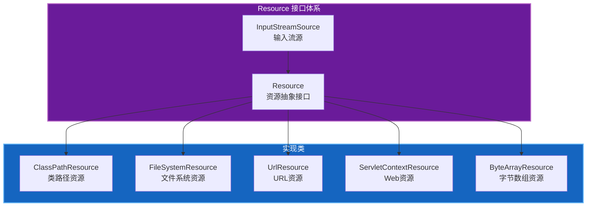
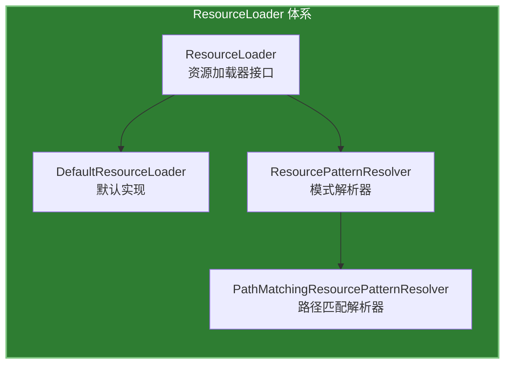
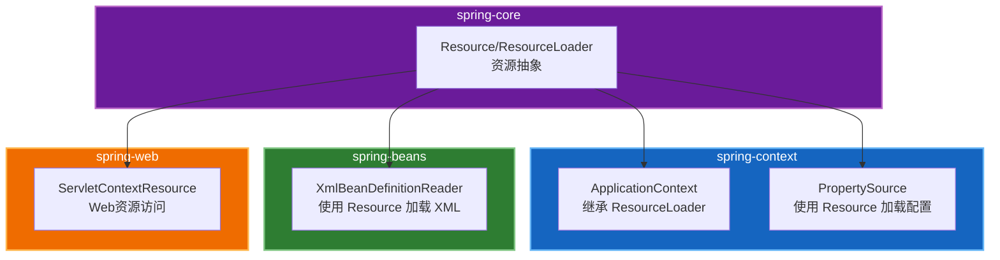

# Spring 资源抽象深度分析

## 一、概述

### 1.1 定位与价值

资源抽象（Resource Abstraction）是 Spring Framework `spring-core` 模块的核心能力之一，位于 `org.springframework.core.io` 包下。它解决了 Java 资源访问的以下痛点：

| 痛点 | 原生 Java | Spring 资源抽象 |
|------|-----------|----------------|
| 资源类型多样 | URL、File、InputStream 各自为政 | 统一 Resource 接口 |
| 路径解析复杂 | 不同资源类型路径格式不同 | 统一路径解析策略 |
| 资源加载繁琐 | 需要手动处理各类资源 | ResourceLoader 自动加载 |
| 缺乏通配符支持 | 无法批量加载资源 | Ant 风格通配符支持 |

### 1.2 核心类矩阵

| 类名 | 职责 | 使用频率 | 学习优先级 |
|------|------|----------|-----------|
| `Resource` | 资源抽象接口 | 高 | 高 |
| `ResourceLoader` | 资源加载器接口 | 高 | 高 |
| `DefaultResourceLoader` | 默认资源加载实现 | 高 | 高 |
| `ClassPathResource` | 类路径资源 | 高 | 高 |
| `FileSystemResource` | 文件系统资源 | 中 | 中 |
| `UrlResource` | URL 资源 | 中 | 中 |
| `ServletContextResource` | Web 应用资源 | 中 | 中 |
| `PathMatchingResourcePatternResolver` | 路径匹配资源解析器 | 中 | 中 |

---

## 二、Resource 接口详解

### 2.1 接口设计



### 2.2 核心方法

```java
public interface Resource extends InputStreamSource {
    /**
     * 判断资源是否存在
     */
    boolean exists();

    /**
     * 判断资源是否可读
     */
    default boolean isReadable() {
        return exists();
    }

    /**
     * 判断资源是否已打开
     */
    default boolean isOpen() {
        return false;
    }

    /**
     * 判断资源是否为文件
     */
    default boolean isFile() {
        return false;
    }

    /**
     * 获取资源 URL
     */
    URL getURL() throws IOException;

    /**
     * 获取资源 URI
     */
    URI getURI() throws IOException;

    /**
     * 获取资源文件
     */
    File getFile() throws IOException;

    /**
     * 获取资源内容长度
     */
    long contentLength() throws IOException;

    /**
     * 获取资源最后修改时间
     */
    long lastModified() throws IOException;

    /**
     * 创建相对资源
     */
    Resource createRelative(String relativePath) throws IOException;

    /**
     * 获取资源文件名
     */
    String getFilename();

    /**
     * 获取资源描述
     */
    String getDescription();
}
```

### 2.3 实现类详解

#### 2.3.1 ClassPathResource

**职责**：加载类路径下的资源

**使用场景**：
- 加载配置文件（application.properties）
- 加载静态资源（XML、JSON 等）
- 加载模板文件

**代码示例**：

```java
// 1. 通过类加载器加载
Resource resource = new ClassPathResource("application.properties");

// 2. 通过指定类加载器加载
Resource resource = new ClassPathResource("config.xml", MyClass.class.getClassLoader());

// 3. 相对于指定类的包路径加载
Resource resource = new ClassPathResource("config.xml", MyClass.class);

// 4. 读取资源内容
try (InputStream is = resource.getInputStream()) {
    String content = new String(is.readAllBytes(), StandardCharsets.UTF_8);
    System.out.println(content);
}
```

#### 2.3.2 FileSystemResource

**职责**：加载文件系统资源

**使用场景**：
- 加载外部配置文件
- 读取日志文件
- 访问用户上传的文件

**代码示例**：

```java
// 1. 通过文件路径创建
Resource resource = new FileSystemResource("/path/to/file.txt");

// 2. 通过 File 对象创建
File file = new File("/path/to/file.txt");
Resource resource = new FileSystemResource(file);

// 3. 获取文件信息
if (resource.exists()) {
    System.out.println("文件名: " + resource.getFilename());
    System.out.println("文件大小: " + resource.contentLength());
    System.out.println("最后修改: " + resource.lastModified());
}
```

#### 2.3.3 UrlResource

**职责**：加载 URL 资源

**使用场景**：
- 加载远程配置文件
- 访问 HTTP/HTTPS 资源
- 访问 FTP 资源

**代码示例**：

```java
// 1. 通过 URL 字符串创建
Resource resource = new UrlResource("https://example.com/config.json");

// 2. 通过 URL 对象创建
URL url = new URL("https://example.com/config.json");
Resource resource = new UrlResource(url);

// 3. 读取远程资源
if (resource.exists()) {
    try (InputStream is = resource.getInputStream()) {
        // 处理远程资源
    }
}
```

#### 2.3.4 ServletContextResource

**职责**：加载 Web 应用资源

**使用场景**：
- 加载 Web 应用中的静态资源
- 访问 WEB-INF 下的配置文件
- 读取 Web 应用上下文中的资源

**代码示例**：

```java
// 在 Servlet 环境中使用
@Autowired
private ServletContext servletContext;

public void loadResource() {
    // 加载 Web 应用资源
    Resource resource = new ServletContextResource(servletContext, "/WEB-INF/config.xml");
    
    if (resource.exists()) {
        // 处理资源
    }
}
```

---

## 三、ResourceLoader 详解

### 3.1 接口设计



### 3.2 核心接口

```java
public interface ResourceLoader {
    /** 类路径 URL 前缀 */
    String CLASSPATH_URL_PREFIX = "classpath:";

    /**
     * 根据位置加载资源
     * @param location 资源位置（支持 classpath:、file:、http: 等前缀）
     * @return Resource 对象
     */
    Resource getResource(String location);

    /**
     * 获取类加载器
     */
    ClassLoader getClassLoader();
}
```

### 3.3 DefaultResourceLoader

**职责**：默认的资源加载器实现，支持多种资源类型

**加载策略**：
1. 以 `classpath:` 开头 → 使用 ClassPathResource
2. 以 `/` 开头 → 使用 ClassPathResource（绝对路径）
3. 以 `file:` 开头 → 使用 UrlResource
4. 以 `http:`/`https:`/`ftp:` 开头 → 使用 UrlResource
5. 其他 → 尝试作为 ClassPathResource 加载

**代码示例**：

```java
// 1. 创建默认资源加载器
ResourceLoader loader = new DefaultResourceLoader();

// 2. 加载类路径资源
Resource classpathResource = loader.getResource("classpath:application.properties");

// 3. 加载文件系统资源
Resource fileResource = loader.getResource("file:/path/to/config.xml");

// 4. 加载 URL 资源
Resource urlResource = loader.getResource("https://example.com/config.json");

// 5. 简写形式（默认作为类路径资源）
Resource simpleResource = loader.getResource("config.properties");
```

### 3.4 PathMatchingResourcePatternResolver

**职责**：支持 Ant 风格路径模式的资源解析器

**Ant 风格通配符**：

| 通配符 | 说明 | 示例 |
|--------|------|------|
| `?` | 匹配单个字符 | `file?.txt` 匹配 `file1.txt`、`fileA.txt` |
| `*` | 匹配零个或多个字符 | `*.xml` 匹配所有 XML 文件 |
| `**` | 匹配任意层级目录 | `/**/*.xml` 匹配所有目录下的 XML 文件 |

**代码示例**：

```java
// 1. 创建模式解析器
PathMatchingResourcePatternResolver resolver = 
    new PathMatchingResourcePatternResolver();

// 2. 加载单个资源
Resource resource = resolver.getResource("classpath:application.properties");

// 3. 批量加载资源（使用通配符）
Resource[] resources = resolver.getResources("classpath*:/**/*.xml");

// 4. 加载特定包下的所有类
Resource[] classResources = resolver.getResources("classpath:com/example/**/*.class");

// 5. 加载配置文件
Resource[] configResources = resolver.getResources("classpath*:config-*.properties");

// 6. 遍历处理资源
for (Resource resource : resources) {
    System.out.println("资源: " + resource.getFilename());
    System.out.println("描述: " + resource.getDescription());
}
```

---

## 四、实际应用场景

### 4.1 配置文件加载

```java
@Component
public class ConfigLoader {
    
    @Autowired
    private ResourceLoader resourceLoader;
    
    public Properties loadApplicationConfig() throws IOException {
        Resource resource = resourceLoader.getResource("classpath:application.properties");
        Properties props = new Properties();
        
        try (InputStream is = resource.getInputStream()) {
            props.load(is);
        }
        
        return props;
    }
}
```

### 4.2 模板文件加载

```java
@Service
public class TemplateService {
    
    private final ResourcePatternResolver resolver = 
        new PathMatchingResourcePatternResolver();
    
    public String loadTemplate(String templateName) throws IOException {
        Resource resource = resolver.getResource(
            "classpath:templates/" + templateName + ".html");
        
        try (InputStream is = resource.getInputStream()) {
            return new String(is.readAllBytes(), StandardCharsets.UTF_8);
        }
    }
    
    public List<String> listAllTemplates() throws IOException {
        Resource[] resources = resolver.getResources("classpath:templates/*.html");
        
        return Arrays.stream(resources)
            .map(Resource::getFilename)
            .collect(Collectors.toList());
    }
}
```

### 4.3 多环境配置加载

```java
@Configuration
public class MultiEnvConfig {
    
    @Bean
    public Properties multiEnvProperties() throws IOException {
        PathMatchingResourcePatternResolver resolver = 
            new PathMatchingResourcePatternResolver();
        
        // 加载所有环境的配置文件
        Resource[] resources = resolver.getResources(
            "classpath*:config/application-*.properties");
        
        Properties mergedProps = new Properties();
        
        for (Resource resource : resources) {
            System.out.println("加载配置: " + resource.getFilename());
            
            try (InputStream is = resource.getInputStream()) {
                Properties props = new Properties();
                props.load(is);
                mergedProps.putAll(props);
            }
        }
        
        return mergedProps;
    }
}
```

---

## 五、最佳实践

### 5.1 资源路径规范

| 场景 | 推荐写法 | 说明 |
|------|---------|------|
| 类路径资源 | `classpath:config/app.properties` | 从类路径根目录开始 |
| 类路径通配 | `classpath*:/**/*.xml` | 加载所有类路径下的 XML |
| 文件系统 | `file:/absolute/path/file.txt` | 绝对路径 |
| 相对路径 | `file:./relative/path/file.txt` | 相对当前工作目录 |
| URL 资源 | `https://example.com/config.json` | 远程资源 |

### 5.2 异常处理

```java
public void safeLoadResource(String location) {
    ResourceLoader loader = new DefaultResourceLoader();
    Resource resource = loader.getResource(location);
    
    if (!resource.exists()) {
        logger.warn("资源不存在: {}", location);
        return;
    }
    
    if (!resource.isReadable()) {
        logger.warn("资源不可读: {}", location);
        return;
    }
    
    try (InputStream is = resource.getInputStream()) {
        // 处理资源
    } catch (IOException e) {
        logger.error("读取资源失败: {}", location, e);
    }
}
```

### 5.3 资源缓存

```java
@Component
public class CachedResourceLoader {
    
    private final ResourceLoader delegate = new DefaultResourceLoader();
    private final Map<String, Resource> cache = new ConcurrentHashMap<>();
    
    public Resource getResource(String location) {
        return cache.computeIfAbsent(location, delegate::getResource);
    }
    
    public void clearCache() {
        cache.clear();
    }
}
```

---

## 六、与其他模块的关系



---

## 七、总结

Spring 资源抽象提供了以下核心价值：

1. **统一接口**：Resource 接口统一了各类资源的访问方式
2. **灵活加载**：ResourceLoader 支持多种资源类型和路径格式
3. **批量处理**：PathMatchingResourcePatternResolver 支持通配符批量加载
4. **易于扩展**：可以通过实现 Resource 接口自定义资源类型

**使用建议**：
- 优先使用 ResourceLoader 而非直接创建 Resource 实现类
- 使用通配符批量加载时注意性能影响
- 对频繁访问的资源考虑添加缓存

---

**文档版本**: 1.0.0  
**更新日期**: 2026-03-23  
**作者**: linsir
