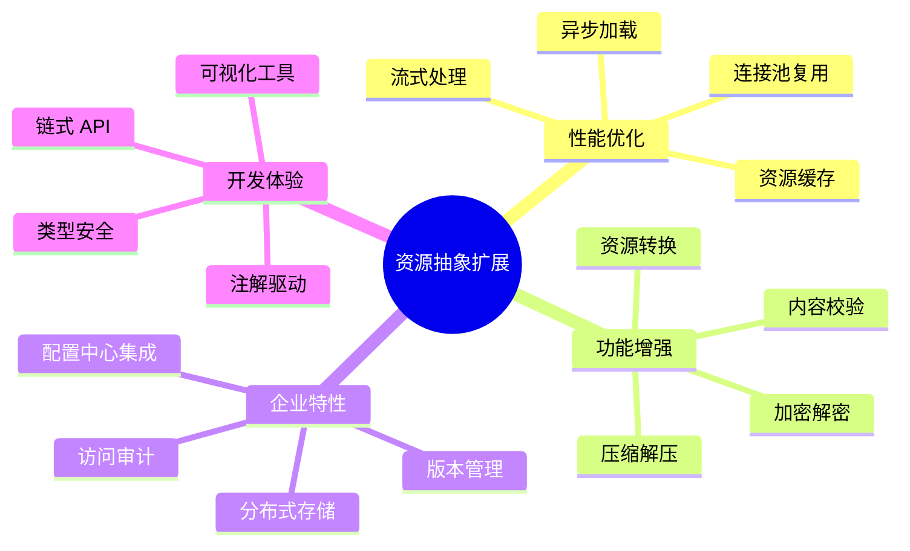
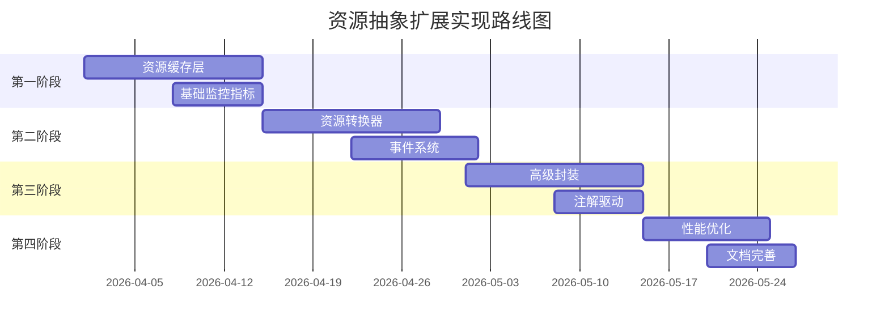

# Spring 资源抽象功能扩展设计文档

## 概述

本文档深入分析 Spring 资源抽象模块的扩展需求，提供系统性的功能增强设计方案和封装建议，以提升资源管理的灵活性、性能和可维护性。

---

## 1. 当前架构分析

### 1.1 现有能力矩阵

| 能力维度 | 当前支持 | 扩展空间 |
|----------|----------|----------|
| 资源类型 | 5 种 (ClassPath, FileSystem, URL, ByteArray, ServletContext) | 加密资源、压缩资源、远程存储 |
| 加载策略 | 前缀识别 + 默认策略 | 策略链、条件加载、懒加载 |
| 缓存机制 | 无内置缓存 | 多级缓存、智能刷新 |
| 监控能力 | 无 | 加载统计、性能指标 |
| 安全机制 | 基础权限检查 | 访问控制、审计日志 |
| 事件通知 | 无 | 生命周期事件、变更监听 |

### 1.2 扩展需求识别



---

## 2. 功能扩展设计方案

### 2.1 资源缓存层 (Resource Cache Layer)

#### 2.1.1 设计目标

- 减少重复资源加载
- 支持多级缓存策略
- 提供缓存失效机制
- 监控缓存命中率

#### 2.1.2 架构设计

```
┌─────────────────────────────────────────────────────────────┐
│                    ResourceCacheManager                     │
├─────────────────────────────────────────────────────────────┤
│  ┌─────────────┐  ┌─────────────┐  ┌─────────────────────┐ │
│  │ L1 Cache    │  │ L2 Cache    │  │ L3 Cache            │ │
│  │ (Memory)    │  │ (Local Disk)│  │ (Distributed)       │ │
│  │ Caffeine    │  │ Ehcache     │  │ Redis               │ │
│  └─────────────┘  └─────────────┘  └─────────────────────┘ │
├─────────────────────────────────────────────────────────────┤
│  Cache Strategy: LRU / LFU / TTL / Size-based               │
│  Refresh Policy: Active / Passive / Scheduled               │
└─────────────────────────────────────────────────────────────┘
```

#### 2.1.3 核心接口设计

```java
/**
 * 资源缓存管理器
 * 提供多级缓存管理能力
 */
public interface ResourceCacheManager {
    
    /**
     * 获取缓存的资源
     */
    CachedResource get(String key);
    
    /**
     * 缓存资源
     */
    void put(String key, Resource resource, CacheOptions options);
    
    /**
     * 使缓存失效
     */
    void invalidate(String key);
    
    /**
     * 批量使缓存失效（支持模式匹配）
     */
    void invalidatePattern(String pattern);
    
    /**
     * 获取缓存统计信息
     */
    CacheStatistics getStatistics();
    
    /**
     * 注册缓存监听器
     */
    void addListener(CacheEventListener listener);
}

/**
 * 缓存选项
 */
public class CacheOptions {
    private Duration ttl;                    // 生存时间
    private long maxSize;                    // 最大大小
    private RefreshPolicy refreshPolicy;     // 刷新策略
    private boolean compress;                // 是否压缩
    private EncryptionType encryption;       // 加密类型
    
    // Builder 模式
    public static Builder builder() { ... }
}

/**
 * 缓存的资源
 */
public interface CachedResource extends Resource {
    
    /**
     * 获取缓存元数据
     */
    CacheMetadata getCacheMetadata();
    
    /**
     * 刷新缓存
     */
    void refresh() throws IOException;
    
    /**
     * 检查缓存是否过期
     */
    boolean isExpired();
    
    /**
     * 获取原始资源
     */
    Resource getOriginalResource();
}
```

#### 2.1.4 实现类设计

```java
/**
 * Caffeine 内存缓存实现
 * 适用于高频访问的小资源
 */
@Component
public class CaffeineResourceCache implements ResourceCacheManager {
    
    private final Cache<String, CachedResource> cache;
    
    public CaffeineResourceCache(CacheConfiguration config) {
        this.cache = Caffeine.newBuilder()
            .maximumSize(config.getMaxSize())
            .expireAfterWrite(config.getTtl())
            .recordStats()
            .build();
    }
    
    @Override
    public CachedResource get(String key) {
        return cache.getIfPresent(key);
    }
    
    @Override
    public void put(String key, Resource resource, CacheOptions options) {
        CachedResource cached = new DefaultCachedResource(resource, options);
        cache.put(key, cached);
    }
    
    // ... 其他方法实现
}

/**
 * 带缓存的资源加载器装饰器
 */
public class CachingResourceLoader implements ResourceLoader {
    
    private final ResourceLoader delegate;
    private final ResourceCacheManager cacheManager;
    private final CacheOptions defaultOptions;
    
    @Override
    public Resource getResource(String location) {
        // 尝试从缓存获取
        CachedResource cached = cacheManager.get(location);
        if (cached != null && !cached.isExpired()) {
            return cached;
        }
        
        // 从委托加载器获取
        Resource resource = delegate.getResource(location);
        if (resource.exists()) {
            cacheManager.put(location, resource, defaultOptions);
        }
        
        return resource;
    }
}
```

#### 2.1.5 使用示例

```java
// 配置缓存管理器
@Bean
public ResourceCacheManager resourceCacheManager() {
    CompositeResourceCacheManager manager = new CompositeResourceCacheManager();
    
    // L1: 内存缓存
    manager.addCache(new CaffeineResourceCache(
        CacheConfiguration.builder()
            .maxSize(1000)
            .ttl(Duration.ofMinutes(5))
            .build()
    ));
    
    // L2: 本地磁盘缓存
    manager.addCache(new DiskResourceCache(
        Paths.get("/tmp/resource-cache"),
        CacheConfiguration.builder()
            .maxSize(100 * 1024 * 1024)  // 100MB
            .ttl(Duration.ofHours(1))
            .build()
    ));
    
    return manager;
}

// 使用带缓存的资源加载器
@Bean
public ResourceLoader cachingResourceLoader(
        ResourceCacheManager cacheManager) {
    return new CachingResourceLoader(
        new DefaultResourceLoader(),
        cacheManager,
        CacheOptions.builder()
            .ttl(Duration.ofMinutes(10))
            .compress(true)
            .build()
    );
}

// 代码中使用
@Autowired
private ResourceLoader resourceLoader;

public String loadConfig(String path) throws IOException {
    // 自动使用缓存
    Resource resource = resourceLoader.getResource(path);
    return ResourceUtils.readAsString(resource);
}
```

---

### 2.2 资源转换器 (Resource Converter)

#### 2.2.1 设计目标

- 支持资源格式自动转换
- 提供可扩展的转换器链
- 支持条件转换和内容协商

#### 2.2.2 架构设计

```
┌─────────────────────────────────────────────────────────────┐
│                  ResourceConverterChain                     │
├─────────────────────────────────────────────────────────────┤
│                                                             │
│   Input Resource → [Converter1] → [Converter2] → Output    │
│                      ↓              ↓                       │
│                  条件判断        条件判断                   │
│                                                             │
│   Converters:                                               │
│   • EncodingConverter      (编码转换)                       │
│   • CompressionConverter   (压缩/解压)                      │
│   • EncryptionConverter    (加密/解密)                      │
│   • FormatConverter        (格式转换)                       │
│   • TemplateConverter      (模板渲染)                       │
│                                                             │
└─────────────────────────────────────────────────────────────┘
```

#### 2.2.3 核心接口设计

```java
/**
 * 资源转换器
 */
public interface ResourceConverter {
    
    /**
     * 判断是否支持转换
     */
    boolean canConvert(Resource source, ConversionContext context);
    
    /**
     * 执行转换
     */
    Resource convert(Resource source, ConversionContext context) throws IOException;
    
    /**
     * 获取转换器优先级
     */
    int getOrder();
    
    /**
     * 获取转换器名称
     */
    String getName();
}

/**
 * 转换上下文
 */
public class ConversionContext {
    private MediaType targetType;           // 目标媒体类型
    private Charset targetEncoding;         // 目标编码
    private Map<String, Object> parameters; // 转换参数
    private ConversionOptions options;      // 转换选项
    
    // Builder 模式
    public static Builder builder() { ... }
}

/**
 * 转换选项
 */
public class ConversionOptions {
    private boolean preserveOriginal;       // 保留原始资源
    private boolean cacheResult;            // 缓存转换结果
    private int bufferSize;                 // 缓冲区大小
    private ProgressListener listener;      // 进度监听器
}

/**
 * 转换后的资源
 */
public interface ConvertedResource extends Resource {
    
    /**
     * 获取原始资源
     */
    Resource getSourceResource();
    
    /**
     * 获取转换链信息
     */
    List<ConversionRecord> getConversionChain();
    
    /**
     * 获取转换后的媒体类型
     */
    MediaType getTargetMediaType();
}
```

#### 2.2.4 转换器实现

```java
/**
 * 编码转换器
 * 自动检测并转换字符编码
 */
@Component
public class EncodingConverter implements ResourceConverter {
    
    private final CharsetDetector charsetDetector;
    
    @Override
    public boolean canConvert(Resource source, ConversionContext context) {
        return isTextResource(source) && 
               context.getTargetEncoding() != null;
    }
    
    @Override
    public Resource convert(Resource source, ConversionContext context) throws IOException {
        Charset sourceEncoding = charsetDetector.detect(source);
        Charset targetEncoding = context.getTargetEncoding();
        
        if (sourceEncoding.equals(targetEncoding)) {
            return source;
        }
        
        String content = ResourceUtils.readAsString(source, sourceEncoding);
        byte[] bytes = content.getBytes(targetEncoding);
        
        return new ConvertedByteArrayResource(
            bytes, 
            source,
            MediaType.TEXT_PLAIN,
            getConversionRecord(sourceEncoding, targetEncoding)
        );
    }
}

/**
 * Gzip 压缩转换器
 */
@Component
public class GzipCompressionConverter implements ResourceConverter {
    
    @Override
    public boolean canConvert(Resource source, ConversionContext context) {
        String action = (String) context.getParameters().get("compression");
        return "gzip".equals(action) || "gunzip".equals(action);
    }
    
    @Override
    public Resource convert(Resource source, ConversionContext context) throws IOException {
        String action = (String) context.getParameters().get("compression");
        
        if ("gzip".equals(action)) {
            return compress(source);
        } else {
            return decompress(source);
        }
    }
    
    private Resource compress(Resource source) throws IOException {
        ByteArrayOutputStream baos = new ByteArrayOutputStream();
        try (GZIPOutputStream gzos = new GZIPOutputStream(baos);
             InputStream is = source.getInputStream()) {
            StreamUtils.copy(is, gzos);
        }
        
        return new ConvertedByteArrayResource(
            baos.toByteArray(),
            source,
            MediaType.APPLICATION_GZIP,
            createRecord("gzip-compress")
        );
    }
    
    private Resource decompress(Resource source) throws IOException {
        ByteArrayOutputStream baos = new ByteArrayOutputStream();
        try (GZIPInputStream gzis = new GZIPInputStream(source.getInputStream())) {
            StreamUtils.copy(gzis, baos);
        }
        
        return new ConvertedByteArrayResource(
            baos.toByteArray(),
            source,
            MediaType.TEXT_PLAIN,
            createRecord("gzip-decompress")
        );
    }
}

/**
 * AES 加密转换器
 */
@Component
public class AesEncryptionConverter implements ResourceConverter {
    
    private final EncryptionService encryptionService;
    
    @Override
    public boolean canConvert(Resource source, ConversionContext context) {
        return context.getParameters().containsKey("encrypt") ||
               context.getParameters().containsKey("decrypt");
    }
    
    @Override
    public Resource convert(Resource source, ConversionContext context) throws IOException {
        String key = (String) context.getParameters().get("key");
        
        if (context.getParameters().containsKey("encrypt")) {
            return encrypt(source, key);
        } else {
            return decrypt(source, key);
        }
    }
    
    private Resource encrypt(Resource source, String key) throws IOException {
        byte[] data = ResourceUtils.readAsBytes(source);
        byte[] encrypted = encryptionService.encrypt(data, key);
        
        return new EncryptedResource(source, encrypted, "AES");
    }
}
```

#### 2.2.5 使用示例

```java
@Service
public class DocumentService {
    
    @Autowired
    private ResourceConverterChain converterChain;
    
    /**
     * 加载并转换文档
     */
    public String loadDocument(String path, Charset encoding) throws IOException {
        Resource resource = resourceLoader.getResource(path);
        
        ConversionContext context = ConversionContext.builder()
            .targetEncoding(encoding)
            .targetType(MediaType.TEXT_PLAIN)
            .parameter("detectBom", true)
            .build();
        
        Resource converted = converterChain.convert(resource, context);
        return ResourceUtils.readAsString(converted);
    }
    
    /**
     * 压缩并加密文件
     */
    public Resource compressAndEncrypt(Resource source, String key) throws IOException {
        ConversionContext context = ConversionContext.builder()
            .parameter("compression", "gzip")
            .parameter("encrypt", true)
            .parameter("key", key)
            .build();
        
        return converterChain.convert(source, context);
    }
}
```

---

### 2.3 资源事件系统 (Resource Event System)

#### 2.3.1 设计目标

- 监听资源生命周期事件
- 支持资源变更通知
- 实现观察者模式

#### 2.3.2 事件类型定义

```java
/**
 * 资源事件类型
 */
public enum ResourceEventType {
    // 生命周期事件
    BEFORE_LOAD,           // 加载前
    AFTER_LOAD,            // 加载后
    BEFORE_READ,           // 读取前
    AFTER_READ,            // 读取后
    
    // 变更事件
    CREATED,               // 资源创建
    MODIFIED,              // 资源修改
    DELETED,               // 资源删除
    
    // 缓存事件
    CACHED,                // 已缓存
    CACHE_INVALIDATED,     // 缓存失效
    CACHE_REFRESHED,       // 缓存刷新
    
    // 错误事件
    LOAD_FAILED,           // 加载失败
    READ_FAILED,           // 读取失败
    CONVERSION_FAILED      // 转换失败
}

/**
 * 资源事件
 */
public class ResourceEvent {
    private final ResourceEventType type;
    private final Resource resource;
    private final String location;
    private final Instant timestamp;
    private final Map<String, Object> metadata;
    private final Throwable error;           // 错误事件时使用
    
    // 构造方法和 getter
}

/**
 * 资源事件监听器
 */
public interface ResourceEventListener {
    
    /**
     * 处理资源事件
     */
    void onResourceEvent(ResourceEvent event);
    
    /**
     * 是否支持该事件类型
     */
    default boolean supports(ResourceEventType type) {
        return true;
    }
    
    /**
     * 获取监听器优先级
     */
    default int getOrder() {
        return 0;
    }
}
```

#### 2.3.3 事件发布器实现

```java
/**
 * 资源事件发布器
 */
@Component
public class ResourceEventPublisher {
    
    private final List<ResourceEventListener> listeners = new CopyOnWriteArrayList<>();
    private final ExecutorService executor;
    
    public ResourceEventPublisher() {
        this.executor = Executors.newFixedThreadPool(
            Runtime.getRuntime().availableProcessors()
        );
    }
    
    /**
     * 发布事件（同步）
     */
    public void publishEvent(ResourceEvent event) {
        listeners.stream()
            .filter(l -> l.supports(event.getType()))
            .sorted(Comparator.comparingInt(ResourceEventListener::getOrder))
            .forEach(l -> {
                try {
                    l.onResourceEvent(event);
                } catch (Exception e) {
                    log.error("Event listener failed", e);
                }
            });
    }
    
    /**
     * 发布事件（异步）
     */
    public void publishEventAsync(ResourceEvent event) {
        executor.submit(() -> publishEvent(event));
    }
    
    /**
     * 注册监听器
     */
    public void addListener(ResourceEventListener listener) {
        listeners.add(listener);
    }
    
    /**
     * 注销监听器
     */
    public void removeListener(ResourceEventListener listener) {
        listeners.remove(listener);
    }
}

/**
 * 事件感知的资源加载器
 */
public class EventAwareResourceLoader implements ResourceLoader {
    
    private final ResourceLoader delegate;
    private final ResourceEventPublisher eventPublisher;
    
    @Override
    public Resource getResource(String location) {
        // 发布加载前事件
        eventPublisher.publishEvent(new ResourceEvent(
            ResourceEventType.BEFORE_LOAD,
            null,
            location,
            Instant.now(),
            null,
            null
        ));
        
        try {
            Resource resource = delegate.getResource(location);
            
            // 发布加载后事件
            eventPublisher.publishEvent(new ResourceEvent(
                ResourceEventType.AFTER_LOAD,
                resource,
                location,
                Instant.now(),
                Map.of("exists", resource.exists()),
                null
            ));
            
            // 包装为事件感知资源
            return new EventAwareResource(resource, eventPublisher);
            
        } catch (Exception e) {
            // 发布加载失败事件
            eventPublisher.publishEvent(new ResourceEvent(
                ResourceEventType.LOAD_FAILED,
                null,
                location,
                Instant.now(),
                null,
                e
            ));
            throw e;
        }
    }
}
```

#### 2.3.4 监听器实现示例

```java
/**
 * 资源访问审计监听器
 */
@Component
public class ResourceAccessAuditListener implements ResourceEventListener {
    
    @Autowired
    private AuditLogRepository auditLogRepository;
    
    @Override
    public void onResourceEvent(ResourceEvent event) {
        if (event.getType() == ResourceEventType.AFTER_LOAD) {
            AuditLog log = new AuditLog();
            log.setResourceLocation(event.getLocation());
            log.setTimestamp(event.getTimestamp());
            log.setUser(getCurrentUser());
            log.setSuccess(true);
            
            auditLogRepository.save(log);
        } else if (event.getType() == ResourceEventType.LOAD_FAILED) {
            AuditLog log = new AuditLog();
            log.setResourceLocation(event.getLocation());
            log.setTimestamp(event.getTimestamp());
            log.setUser(getCurrentUser());
            log.setSuccess(false);
            log.setErrorMessage(event.getError().getMessage());
            
            auditLogRepository.save(log);
        }
    }
    
    @Override
    public boolean supports(ResourceEventType type) {
        return type == ResourceEventType.AFTER_LOAD ||
               type == ResourceEventType.LOAD_FAILED;
    }
}

/**
 * 资源变更检测监听器
 */
@Component
public class ResourceChangeDetectionListener implements ResourceEventListener {
    
    private final Map<String, Long> resourceTimestamps = new ConcurrentHashMap<>();
    
    @Autowired
    private ResourceEventPublisher eventPublisher;
    
    @Override
    public void onResourceEvent(ResourceEvent event) {
        if (event.getType() != ResourceEventType.AFTER_LOAD) {
            return;
        }
        
        String location = event.getLocation();
        Resource resource = event.getResource();
        
        try {
            long currentModified = resource.lastModified();
            Long previousModified = resourceTimestamps.put(location, currentModified);
            
            if (previousModified == null) {
                // 新资源
                eventPublisher.publishEvent(new ResourceEvent(
                    ResourceEventType.CREATED,
                    resource,
                    location,
                    Instant.now(),
                    null,
                    null
                ));
            } else if (currentModified > previousModified) {
                // 资源已修改
                eventPublisher.publishEvent(new ResourceEvent(
                    ResourceEventType.MODIFIED,
                    resource,
                    location,
                    Instant.now(),
                    Map.of("previousModified", previousModified),
                    null
                ));
            }
        } catch (IOException e) {
            log.warn("Failed to detect resource change", e);
        }
    }
}
```

---

### 2.4 资源监控与指标 (Resource Metrics)

#### 2.4.1 设计目标

- 收集资源加载性能指标
- 监控资源使用统计
- 提供健康检查能力

#### 2.4.2 指标定义

```java
/**
 * 资源指标收集器
 */
public interface ResourceMetricsCollector {
    
    /**
     * 记录加载操作
     */
    void recordLoad(String location, long durationNanos, boolean success);
    
    /**
     * 记录读取操作
     */
    void recordRead(String location, long bytesRead, long durationNanos);
    
    /**
     * 记录缓存命中
     */
    void recordCacheHit(String location);
    
    /**
     * 记录缓存未命中
     */
    void recordCacheMiss(String location);
    
    /**
     * 获取统计信息
     */
    ResourceMetrics getMetrics();
    
    /**
     * 重置统计
     */
    void reset();
}

/**
 * 资源指标
 */
public class ResourceMetrics {
    // 加载指标
    private long totalLoads;
    private long successfulLoads;
    private long failedLoads;
    private double averageLoadTimeMs;
    private long maxLoadTimeMs;
    
    // 读取指标
    private long totalReads;
    private long totalBytesRead;
    private double averageReadTimeMs;
    
    // 缓存指标
    private long cacheHits;
    private long cacheMisses;
    private double cacheHitRate;
    
    // 资源统计
    private Map<String, ResourceTypeMetrics> typeMetrics;
    
    // Getter 方法
}

/**
 * Micrometer 指标收集器实现
 */
@Component
public class MicrometerResourceMetrics implements ResourceMetricsCollector {
    
    private final MeterRegistry meterRegistry;
    
    private final Counter loadCounter;
    private final Counter loadSuccessCounter;
    private final Counter loadFailureCounter;
    private final Timer loadTimer;
    private final DistributionSummary bytesReadSummary;
    private final Counter cacheHitCounter;
    private final Counter cacheMissCounter;
    
    public MicrometerResourceMetrics(MeterRegistry meterRegistry) {
        this.meterRegistry = meterRegistry;
        
        this.loadCounter = Counter.builder("resource.loads")
            .description("Total number of resource loads")
            .register(meterRegistry);
        
        this.loadSuccessCounter = Counter.builder("resource.loads.success")
            .description("Number of successful resource loads")
            .register(meterRegistry);
        
        this.loadFailureCounter = Counter.builder("resource.loads.failure")
            .description("Number of failed resource loads")
            .register(meterRegistry);
        
        this.loadTimer = Timer.builder("resource.load.time")
            .description("Resource load time")
            .publishPercentiles(0.5, 0.95, 0.99)
            .register(meterRegistry);
        
        this.bytesReadSummary = DistributionSummary.builder("resource.read.bytes")
            .description("Bytes read from resources")
            .baseUnit("bytes")
            .register(meterRegistry);
        
        this.cacheHitCounter = Counter.builder("resource.cache.hits")
            .description("Number of cache hits")
            .register(meterRegistry);
        
        this.cacheMissCounter = Counter.builder("resource.cache.misses")
            .description("Number of cache misses")
            .register(meterRegistry);
    }
    
    @Override
    public void recordLoad(String location, long durationNanos, boolean success) {
        loadCounter.increment();
        loadTimer.record(durationNanos, TimeUnit.NANOSECONDS);
        
        if (success) {
            loadSuccessCounter.increment();
        } else {
            loadFailureCounter.increment();
        }
        
        // 按资源类型记录
        String type = getResourceType(location);
        meterRegistry.counter("resource.loads.by.type", "type", type).increment();
    }
    
    @Override
    public void recordCacheHit(String location) {
        cacheHitCounter.increment();
    }
    
    @Override
    public void recordCacheMiss(String location) {
        cacheMissCounter.increment();
    }
    
    // ... 其他方法实现
}
```

#### 2.4.3 健康检查

```java
/**
 * 资源健康指示器
 */
@Component
public class ResourceHealthIndicator implements HealthIndicator {
    
    @Autowired
    private ResourceMetricsCollector metricsCollector;
    
    @Override
    public Health health() {
        ResourceMetrics metrics = metricsCollector.getMetrics();
        
        // 检查失败率
        double failureRate = (double) metrics.getFailedLoads() / 
                            Math.max(1, metrics.getTotalLoads());
        
        if (failureRate > 0.5) {
            return Health.down()
                .withDetail("failureRate", failureRate)
                .withDetail("failedLoads", metrics.getFailedLoads())
                .withDetail("totalLoads", metrics.getTotalLoads())
                .withDetail("message", "Resource load failure rate is too high")
                .build();
        }
        
        // 检查平均加载时间
        if (metrics.getAverageLoadTimeMs() > 5000) {
            return Health.down()
                .withDetail("averageLoadTimeMs", metrics.getAverageLoadTimeMs())
                .withDetail("message", "Resource load time is too high")
                .build();
        }
        
        return Health.up()
            .withDetail("totalLoads", metrics.getTotalLoads())
            .withDetail("cacheHitRate", metrics.getCacheHitRate())
            .build();
    }
}
```

---

## 3. 高级封装方案

### 3.1 资源仓库模式 (Resource Repository)

#### 3.1.1 设计思路

提供类似 Spring Data 的资源访问模式，通过接口定义自动生成实现。

```java
/**
 * 资源仓库接口
 */
public interface ResourceRepository<T extends Resource> {
    
    /**
     * 根据 ID 查找资源
     */
    Optional<T> findById(String id);
    
    /**
     * 查找所有资源
     */
    List<T> findAll();
    
    /**
     * 根据条件查找
     */
    List<T> findByPattern(String pattern);
    
    /**
     * 保存资源
     */
    T save(String id, T resource);
    
    /**
     * 删除资源
     */
    void deleteById(String id);
    
    /**
     * 检查资源是否存在
     */
    boolean existsById(String id);
}

/**
 * 配置资源仓库
 */
@ResourceRepository
public interface ConfigResourceRepository extends ResourceRepository<ClassPathResource> {
    
    /**
     * 根据文件名查找
     */
    List<ClassPathResource> findByFilename(String filename);
    
    /**
     * 查找所有属性文件
     */
    @Pattern("classpath*:config/*.properties")
    List<ClassPathResource> findAllProperties();
    
    /**
     * 查找最新修改的配置
     */
    @OrderBy("lastModified DESC")
    List<ClassPathResource> findLatestConfigs(@Limit int limit);
}
```

### 3.2 资源流式处理 (Resource Streaming)

```java
/**
 * 资源流式处理 API
 */
public interface ResourceStream {
    
    /**
     * 过滤资源
     */
    ResourceStream filter(Predicate<Resource> predicate);
    
    /**
     * 转换资源
     */
    <R> ResourceStream map(Function<Resource, R> mapper);
    
    /**
     * 扁平化映射
     */
    <R> ResourceStream flatMap(Function<Resource, Stream<R>> mapper);
    
    /**
     * 排序
     */
    ResourceStream sorted(Comparator<Resource> comparator);
    
    /**
     * 限制数量
     */
    ResourceStream limit(long maxSize);
    
    /**
     * 跳过指定数量
     */
    ResourceStream skip(long n);
    
    /**
     * 并行处理
     */
    ResourceStream parallel();
    
    /**
     * 收集结果
     */
    <R, A> R collect(Collector<? super Resource, A, R> collector);
    
    /**
     * 转换为列表
     */
    List<Resource> toList();
    
    /**
     * 遍历执行
     */
    void forEach(Consumer<? super Resource> action);
    
    /**
     * 查找第一个
     */
    Optional<Resource> findFirst();
    
    /**
     * 计数
     */
    long count();
    
    /**
     * 检查是否匹配
     */
    boolean anyMatch(Predicate<? super Resource> predicate);
}

/**
 * 使用示例
 */
public class ResourceStreamExample {
    
    @Autowired
    private ResourcePatternResolver resolver;
    
    public List<Resource> findLargeConfigs() throws IOException {
        return ResourceStream.of(resolver.getResources("classpath*:config/*"))
            .filter(r -> r.getFilename().endsWith(".properties"))
            .filter(r -> {
                try {
                    return r.contentLength() > 1024;
                } catch (IOException e) {
                    return false;
                }
            })
            .sorted((r1, r2) -> {
                try {
                    return Long.compare(r2.lastModified(), r1.lastModified());
                } catch (IOException e) {
                    return 0;
                }
            })
            .limit(10)
            .toList();
    }
}
```

### 3.3 资源注解驱动 (Resource Annotations)

```java
/**
 * 注入资源注解
 */
@Target({ElementType.FIELD, ElementType.PARAMETER})
@Retention(RetentionPolicy.RUNTIME)
@Documented
public @interface ResourceValue {
    
    /**
     * 资源路径
     */
    String value();
    
    /**
     * 编码
     */
    String encoding() default "UTF-8";
    
    /**
     * 是否必需
     */
    boolean required() default true;
    
    /**
     * 默认值
     */
    String defaultValue() default "";
}

/**
 * 配置属性注解
 */
@Target(ElementType.FIELD)
@Retention(RetentionPolicy.RUNTIME)
public @interface ConfigProperty {
    
    /**
     * 属性键
     */
    String value();
    
    /**
     * 配置文件路径
     */
    String config() default "classpath:application.properties";
    
    /**
     * 默认值
     */
    String defaultValue() default "";
}

/**
 * 使用示例
 */
@Component
public class ApplicationConfig {
    
    @ResourceValue("classpath:template/email.html")
    private Resource emailTemplate;
    
    @ResourceValue(value = "classpath:config/app.json", encoding = "UTF-8")
    private String appConfigJson;
    
    @ConfigProperty("server.port")
    private int serverPort;
    
    @ConfigProperty(value = "app.name", defaultValue = "MyApp")
    private String appName;
}
```

---

## 4. 实现路线图

### 4.1 阶段规划



### 4.2 优先级矩阵

| 功能 | 业务价值 | 实现复杂度 | 优先级 |
|------|----------|------------|--------|
| 资源缓存层 | 高 | 中 | P0 |
| 基础监控指标 | 高 | 低 | P0 |
| 资源转换器 | 中 | 高 | P1 |
| 事件系统 | 中 | 中 | P1 |
| 资源仓库模式 | 中 | 高 | P2 |
| 流式处理 API | 低 | 中 | P2 |
| 注解驱动 | 低 | 低 | P3 |

---

## 5. 总结

本文档提供了 Spring 资源抽象模块的深度扩展设计方案，包括：

1. **资源缓存层** - 多级缓存策略，提升资源访问性能
2. **资源转换器** - 灵活的格式转换链，支持编码、压缩、加密
3. **事件系统** - 完整的生命周期事件和变更监听
4. **监控指标** - 基于 Micrometer 的性能监控和健康检查
5. **高级封装** - 仓库模式、流式 API、注解驱动

通过这些扩展，资源抽象模块将具备企业级的资源管理能力，满足复杂应用场景的需求。
