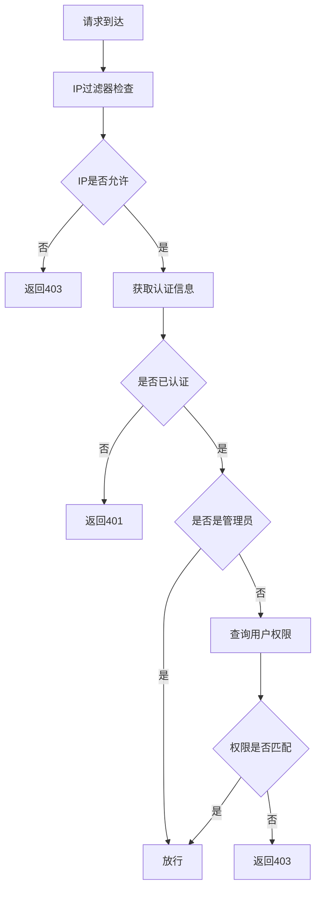
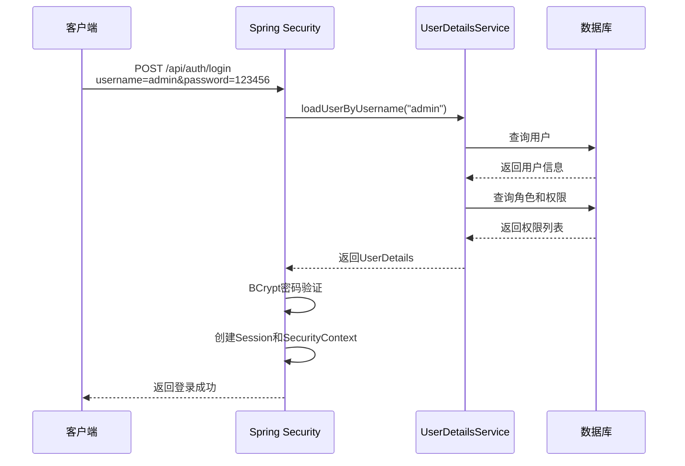
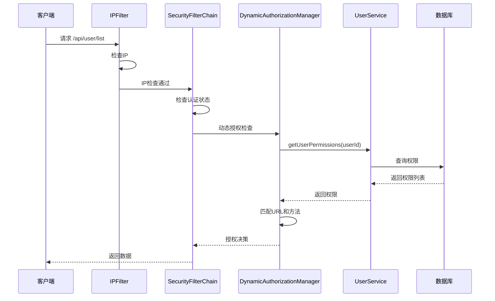

# Spring Security 项目实战指南

## 一、项目概述

### 1.1 项目简介

`linsir-spring-security-server` 是一个基于 Spring Security 6.x 的完整权限管理示例项目，采用前后端分离架构，实现了基于 RBAC（Role-Based Access Control）模型的动态权限管理系统。

### 1.2 技术栈

| 技术 | 版本 | 说明 |
|------|------|------|
| Spring Boot | 4.0.0 | 基础框架 |
| Spring Security | 6.x | 安全框架 |
| MyBatis Plus | 3.5.7 | ORM 框架 |
| MySQL | 8.x | 数据库 |
| JWT | - | Token 认证（预留）|
| EasyUI | - | 前端框架 |

### 1.3 项目结构

```
linsir-spring-security-server/
├── src/main/java/com/linsir/security/
│   ├── config/                          # 配置类
│   │   ├── SecurityConfig.java          # 核心安全配置
│   │   ├── authorization/               # 授权管理器配置
│   │   │   └── DynamicAuthorizationManagerConfig.java
│   │   └── ...
│   ├── controller/                      # 控制器层
│   │   ├── UserController.java          # 用户管理
│   │   ├── RoleController.java          # 角色管理
│   │   └── PermissionController.java    # 权限管理
│   ├── service/                         # 业务层
│   │   ├── CustomUserDetailsService.java # 用户详情服务
│   │   ├── UserService.java             # 用户服务
│   │   └── ...
│   ├── entity/                          # 实体类
│   │   ├── User.java                    # 用户实体
│   │   ├── Role.java                    # 角色实体
│   │   └── Permission.java              # 权限实体
│   ├── filter/                          # 过滤器
│   │   └── IpFilter.java                # IP 过滤器
│   ├── handler/                         # 处理器
│   │   ├── CustomAuthenticationEntryPoint.java  # 认证入口
│   │   ├── CustomAccessDeniedHandler.java       # 访问拒绝
│   │   └── ...
│   └── SecurityServerApplication.java   # 启动类
├── src/main/resources/
│   ├── sql/
│   │   └── init.sql                     # 数据库初始化脚本
│   └── templates/                       # 页面模板
└── pom.xml
```

## 二、RBAC 权限模型

### 2.1 模型设计

本项目采用经典的 RBAC（基于角色的访问控制）模型：

```
用户 (User) ←→ 角色 (Role) ←→ 权限 (Permission)
   ↓              ↓                ↓
sys_user    sys_role        sys_permission
   ↓              ↓                ↓
sys_user_role  sys_role_permission
```

### 2.2 数据库表结构

#### 2.2.1 用户表 (sys_user)

```sql
CREATE TABLE `sys_user` (
    `id` BIGINT PRIMARY KEY AUTO_INCREMENT,
    `username` VARCHAR(50) NOT NULL COMMENT '用户名',
    `password` VARCHAR(100) NOT NULL COMMENT '密码（BCrypt加密）',
    `nickname` VARCHAR(50) COMMENT '昵称',
    `email` VARCHAR(100) COMMENT '邮箱',
    `phone` VARCHAR(20) COMMENT '手机号',
    `status` INT DEFAULT 1 COMMENT '状态：0-禁用，1-启用',
    `create_time` DATETIME DEFAULT CURRENT_TIMESTAMP,
    `update_time` DATETIME DEFAULT CURRENT_TIMESTAMP ON UPDATE CURRENT_TIMESTAMP
);
```

#### 2.2.2 角色表 (sys_role)

```sql
CREATE TABLE `sys_role` (
    `id` BIGINT PRIMARY KEY AUTO_INCREMENT,
    `role_code` VARCHAR(50) NOT NULL COMMENT '角色编码（如：ROLE_ADMIN）',
    `role_name` VARCHAR(50) NOT NULL COMMENT '角色名称',
    `description` VARCHAR(200) COMMENT '描述',
    `status` INT DEFAULT 1 COMMENT '状态',
    `create_time` DATETIME DEFAULT CURRENT_TIMESTAMP
);
```

#### 2.2.3 权限表 (sys_permission)

```sql
CREATE TABLE `sys_permission` (
    `id` BIGINT PRIMARY KEY AUTO_INCREMENT,
    `parent_id` BIGINT DEFAULT 0 COMMENT '父权限ID，0表示顶级',
    `permission_code` VARCHAR(100) NOT NULL COMMENT '权限编码',
    `permission_name` VARCHAR(100) NOT NULL COMMENT '权限名称',
    `resource_type` VARCHAR(20) COMMENT '资源类型：menu/button/api',
    `url` VARCHAR(200) COMMENT '资源URL',
    `method` VARCHAR(10) COMMENT '请求方法：GET/POST/PUT/DELETE',
    `icon` VARCHAR(50) COMMENT '图标',
    `sort_order` INT DEFAULT 0 COMMENT '排序号',
    `status` INT DEFAULT 1 COMMENT '状态'
);
```

### 2.3 权限类型

本项目支持三种权限类型：

| 类型 | 说明 | 示例 |
|------|------|------|
| menu | 菜单权限 | 系统管理、用户列表页面 |
| button | 按钮权限 | 新增用户按钮、删除角色按钮 |
| api | 接口权限 | /api/user/list、/api/role/create |

## 三、核心配置详解

### 3.1 SecurityConfig - 安全配置中心

`SecurityConfig` 是整个 Spring Security 配置的核心类：

```java
@Configuration
@EnableWebSecurity
@EnableMethodSecurity
public class SecurityConfig {
    
    @Bean
    SecurityFilterChain filterChain(HttpSecurity http) throws Exception {
        http
            // 1. 添加自定义过滤器
            .addFilterBefore(ipFilter, UsernamePasswordAuthenticationFilter.class)
            
            // 2. 禁用 CSRF（前后端分离）
            .csrf(csrf -> csrf.disable())
            
            // 3. 配置请求授权
            .authorizeHttpRequests(auth -> auth
                // 静态资源放行
                .requestMatchers("/static/**").permitAll()
                // 登录接口放行
                .requestMatchers("/api/auth/**").permitAll()
                // 其他请求使用动态授权
                .anyRequest().access(dynamicAuthorizationManager)
            )
            
            // 4. 异常处理
            .exceptionHandling(exception -> exception
                .authenticationEntryPoint(authenticationEntryPoint)
                .accessDeniedHandler(accessDeniedHandler)
            )
            
            // 5. 表单登录配置
            .formLogin(form -> form
                .loginProcessingUrl("/api/auth/login")
                .successHandler(loginSuccessHandler)
                .failureHandler(loginFailureHandler)
            )
            
            // 6. 登出配置
            .logout(logout -> logout
                .logoutUrl("/api/auth/logout")
                .logoutSuccessHandler(logoutSuccessHandler)
            );
        
        return http.build();
    }
}
```

#### 关键配置说明

| 配置项 | 说明 |
|--------|------|
| `@EnableWebSecurity` | 启用 Spring Security |
| `@EnableMethodSecurity` | 启用方法级安全注解 |
| `addFilterBefore` | 在指定过滤器前添加自定义过滤器 |
| `csrf().disable()` | 禁用 CSRF（前后端分离场景）|
| `authorizeHttpRequests` | 配置请求授权规则 |
| `exceptionHandling` | 配置异常处理器 |
| `formLogin` | 配置表单登录 |
| `logout` | 配置登出 |

### 3.2 动态授权管理器

`DynamicAuthorizationManagerConfig` 实现了基于数据库权限的动态授权：

```java
@Configuration
public class DynamicAuthorizationManagerConfig {
    
    @Bean
    public AuthorizationManager<RequestAuthorizationContext> dynamicAuthorizationManager() {
        return new AuthorizationManager<RequestAuthorizationContext>() {
            @Override
            public AuthorizationDecision authorize(
                    Supplier<? extends Authentication> authenticationSupplier,
                    RequestAuthorizationContext context) {
                
                // 1. 获取当前认证信息
                Authentication authentication = authenticationSupplier.get();
                
                // 2. 检查是否已认证
                if (authentication == null || !authentication.isAuthenticated()) {
                    return new AuthorizationDecision(false);
                }
                
                // 3. 获取请求信息
                String requestUri = context.getRequest().getRequestURI();
                String requestMethod = context.getRequest().getMethod();
                
                // 4. 超级管理员直接放行
                boolean isAdmin = authentication.getAuthorities().stream()
                        .anyMatch(auth -> auth.getAuthority().equals("ROLE_ADMIN"));
                if (isAdmin) {
                    return new AuthorizationDecision(true);
                }
                
                // 5. 从数据库获取用户权限
                List<Permission> userPermissions = userService.getUserPermissions(user.getId());
                
                // 6. 检查权限匹配
                boolean hasPermission = userPermissions.stream()
                        .anyMatch(permission -> matchPermission(permission, requestUri, requestMethod));
                
                return new AuthorizationDecision(hasPermission);
            }
        };
    }
}
```

#### 授权流程



### 3.3 用户详情服务

`CustomUserDetailsService` 实现从数据库加载用户信息：

```java
@Service
public class CustomUserDetailsService implements UserDetailsService {
    
    @Autowired
    private UserService userService;
    
    @Override
    public UserDetails loadUserByUsername(String username) throws UsernameNotFoundException {
        // 1. 查询用户
        User user = userService.getUserByUsername(username);
        if (user == null) {
            throw new UsernameNotFoundException("用户不存在：" + username);
        }
        
        // 2. 获取角色
        List<Role> roles = userService.getUserRoles(user.getId());
        String[] roleNames = roles.stream()
                .map(Role::getRoleName)
                .toArray(String[]::new);
        
        // 3. 获取权限
        List<Permission> permissions = userService.getUserPermissions(user.getId());
        List<SimpleGrantedAuthority> authorities = permissions.stream()
                .map(p -> new SimpleGrantedAuthority(p.getPermissionCode()))
                .collect(Collectors.toList());
        
        // 4. 构建 UserDetails
        return org.springframework.security.core.userdetails.User.builder()
                .username(user.getUsername())
                .password(user.getPassword())  // 加密密码
                .roles(roleNames)
                .authorities(authorities)
                .build();
    }
}
```

#### 重要说明

- **密码加密**：数据库中存储的是 BCrypt 加密后的密码
- **权限加载**：同时加载角色权限和功能权限
- **缓存建议**：生产环境建议缓存权限列表

## 四、过滤器与处理器

### 4.1 IP 过滤器

实现 IP 黑白名单过滤：

```java
@Component
public class IpFilter extends OncePerRequestFilter {
    
    private final Set<String> whiteList = new HashSet<>();
    private final Set<String> blackList = new HashSet<>(Arrays.asList("192.168.1.3"));
    private final boolean whiteListMode = false;
    
    @Override
    protected void doFilterInternal(HttpServletRequest request,
                                    HttpServletResponse response,
                                    FilterChain filterChain) throws ServletException, IOException {
        
        String clientIp = getClientIp(request);
        
        if (!isAllowed(clientIp)) {
            response.setStatus(HttpServletResponse.SC_FORBIDDEN);
            response.setContentType("application/json;charset=UTF-8");
            response.getWriter().write("{\"code\":403,\"message\":\"IP被禁止访问\"}");
            return;
        }
        
        filterChain.doFilter(request, response);
    }
}
```

### 4.2 认证异常处理器

```java
@Component
public class CustomAuthenticationEntryPoint implements AuthenticationEntryPoint {
    
    @Override
    public void commence(HttpServletRequest request,
                         HttpServletResponse response,
                         AuthenticationException authException) throws IOException {
        // 未认证时重定向到首页
        response.sendRedirect("/");
    }
}
```

### 4.3 访问拒绝处理器

```java
@Component
public class CustomAccessDeniedHandler implements AccessDeniedHandler {
    
    @Override
    public void handle(HttpServletRequest request,
                       HttpServletResponse response,
                       AccessDeniedException accessDeniedException) throws IOException {
        
        response.setStatus(HttpServletResponse.SC_FORBIDDEN);
        response.setContentType("application/json;charset=UTF-8");
        
        String json = "{\"code\":403,\"message\":\"访问被拒绝\"}";
        response.getWriter().write(json);
    }
}
```

## 五、实战示例

### 5.1 用户登录流程



### 5.2 权限验证流程



## 六、最佳实践

### 6.1 安全配置建议

1. **密码加密**：始终使用 BCrypt 等强哈希算法
2. **HTTPS**：生产环境强制使用 HTTPS
3. **Session 管理**：合理设置 Session 超时时间
4. **权限最小化**：只授予用户必要的权限

### 6.2 性能优化

1. **权限缓存**：使用 Redis 缓存用户权限
2. **数据库索引**：为权限查询添加索引
3. **懒加载**：延迟加载非必要权限

### 6.3 常见问题

| 问题 | 原因 | 解决方案 |
|------|------|----------|
| 登录后无权限 | 权限未正确加载 | 检查 UserDetailsService |
| 动态授权不生效 | 配置顺序问题 | 确保在 SecurityConfig 中正确配置 |
| 密码验证失败 | 密码未加密或加密方式不匹配 | 检查 PasswordEncoder 配置 |

## 七、总结

本项目完整展示了 Spring Security 在实际项目中的应用，包括：

- ✅ 基于 RBAC 的权限模型设计
- ✅ 动态授权实现
- ✅ 前后端分离的认证方案
- ✅ 完整的用户-角色-权限管理
- ✅ IP 过滤等安全增强

通过本项目，你可以深入理解 Spring Security 的核心概念和实际应用。