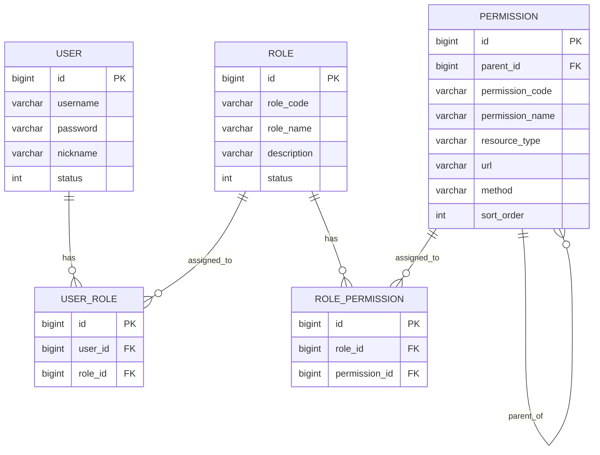

# RBAC 权限模型实战实现

## 一、RBAC 模型概述

### 1.1 什么是 RBAC

RBAC（Role-Based Access Control，基于角色的访问控制）是一种广泛使用的权限管理模型，通过角色作为中介，将用户与权限解耦。

```
用户 ←→ 角色 ←→ 权限
```

### 1.2 RBAC 的优势

| 优势 | 说明 |
|------|------|
| 简化管理 | 通过角色批量管理权限 |
| 职责分离 | 不同角色对应不同职责 |
| 易于维护 | 用户变动只需调整角色 |
| 支持继承 | 角色可以继承其他角色权限 |

### 1.3 RBAC 的演进

```
RBAC0（基础模型）
    ↓
RBAC1（角色继承）
    ↓
RBAC2（角色约束）
    ↓
RBAC3（完整模型）
```

本项目实现的是 **RBAC0 + 部分 RBAC1** 特性。

## 二、数据库设计

### 2.1 实体关系图



### 2.2 权限类型设计

```
权限
├── 菜单权限 (menu)
│   ├── 系统管理
│   ├── 用户管理
│   └── 角色权限
├── 按钮权限 (button)
│   ├── 新增按钮
│   ├── 编辑按钮
│   └── 删除按钮
└── 接口权限 (api)
    ├── /api/user/list
    ├── /api/user/create
    └── /api/user/delete
```

### 2.3 权限树结构

```
系统管理 (parent_id=0)
├── 系统首页 (parent_id=1)
├── 系统信息 (parent_id=1)
└── 接口权限
    ├── /api/system/info GET
    └── /api/system/status GET

用户管理 (parent_id=0)
├── 用户列表页面 (parent_id=4)
├── 添加用户页面 (parent_id=4)
└── 接口权限
    ├── /api/user/list GET
    ├── /api/user/create POST
    ├── /api/user/update PUT
    └── /api/user/delete DELETE
```

## 三、核心代码实现

### 3.1 实体类

#### 用户实体

```java
@Data
@TableName("sys_user")
public class User extends BaseEntity {
    @TableId(type = IdType.AUTO)
    private Long id;
    private String username;
    private String password;  // BCrypt 加密
    private String nickname;
    private String email;
    private String phone;
    private Integer status;   // 0-禁用 1-启用
}
```

#### 角色实体

```java
@Data
@TableName("sys_role")
public class Role extends BaseEntity {
    @TableId(type = IdType.AUTO)
    private Long id;
    private String roleCode;    // ROLE_ADMIN
    private String roleName;    // 超级管理员
    private String description;
    private Integer status;
}
```

#### 权限实体

```java
@Data
@TableName("sys_permission")
public class Permission extends BaseEntity {
    @TableId(type = IdType.AUTO)
    private Long id;
    private Long parentId;          // 0 表示顶级
    private String permissionCode;  // api:user:list
    private String permissionName;  // 用户列表接口
    private String resourceType;    // menu/button/api
    private String url;             // /api/user/list
    private String method;          // GET/POST/PUT/DELETE
    private String icon;
    private Integer sortOrder;
    private Integer status;
}
```

### 3.2 关联实体

#### 用户角色关联

```java
@Data
@TableName("sys_user_role")
public class UserRole {
    @TableId(type = IdType.AUTO)
    private Long id;
    private Long userId;
    private Long roleId;
    private LocalDateTime createTime;
}
```

#### 角色权限关联

```java
@Data
@TableName("sys_role_permission")
public class RolePermission {
    @TableId(type = IdType.AUTO)
    private Long id;
    private Long roleId;
    private Long permissionId;
    private LocalDateTime createTime;
}
```

### 3.3 数据访问层

#### UserMapper

```java
@Mapper
public interface UserMapper extends BaseMapper<User> {
    
    /**
     * 根据用户名查询用户
     */
    @Select("SELECT * FROM sys_user WHERE username = #{username}")
    User selectByUsername(String username);
    
    /**
     * 查询用户的角色列表
     */
    @Select("SELECT r.* FROM sys_role r " +
            "INNER JOIN sys_user_role ur ON r.id = ur.role_id " +
            "WHERE ur.user_id = #{userId}")
    List<Role> selectRolesByUserId(Long userId);
    
    /**
     * 查询用户的权限列表
     */
    @Select("SELECT DISTINCT p.* FROM sys_permission p " +
            "INNER JOIN sys_role_permission rp ON p.id = rp.permission_id " +
            "INNER JOIN sys_user_role ur ON rp.role_id = ur.role_id " +
            "WHERE ur.user_id = #{userId} AND p.status = 1")
    List<Permission> selectPermissionsByUserId(Long userId);
}
```

### 3.4 业务层实现

#### UserService

```java
public interface UserService extends IService<User> {
    
    /**
     * 根据用户名获取用户
     */
    User getUserByUsername(String username);
    
    /**
     * 获取用户的角色列表
     */
    List<Role> getUserRoles(Long userId);
    
    /**
     * 获取用户的权限列表
     */
    List<Permission> getUserPermissions(Long userId);
    
    /**
     * 给用户分配角色
     */
    void assignRoles(Long userId, List<Long> roleIds);
    
    /**
     * 创建用户（密码加密）
     */
    boolean createUser(User user);
    
    /**
     * 更新密码
     */
    boolean updatePassword(Long userId, String newPassword);
}
```

#### UserServiceImpl

```java
@Service
public class UserServiceImpl extends ServiceImpl<UserMapper, User> 
        implements UserService {
    
    @Autowired
    private PasswordEncoder passwordEncoder;
    
    @Autowired
    private UserRoleMapper userRoleMapper;
    
    @Override
    public User getUserByUsername(String username) {
        LambdaQueryWrapper<User> wrapper = new LambdaQueryWrapper<>();
        wrapper.eq(User::getUsername, username);
        return this.getOne(wrapper);
    }
    
    @Override
    public List<Role> getUserRoles(Long userId) {
        return baseMapper.selectRolesByUserId(userId);
    }
    
    @Override
    public List<Permission> getUserPermissions(Long userId) {
        return baseMapper.selectPermissionsByUserId(userId);
    }
    
    @Override
    @Transactional
    public void assignRoles(Long userId, List<Long> roleIds) {
        // 1. 删除原有角色
        LambdaQueryWrapper<UserRole> wrapper = new LambdaQueryWrapper<>();
        wrapper.eq(UserRole::getUserId, userId);
        userRoleMapper.delete(wrapper);
        
        // 2. 添加新角色
        if (CollectionUtils.isNotEmpty(roleIds)) {
            for (Long roleId : roleIds) {
                UserRole userRole = new UserRole();
                userRole.setUserId(userId);
                userRole.setRoleId(roleId);
                userRoleMapper.insert(userRole);
            }
        }
    }
    
    @Override
    public boolean createUser(User user) {
        // 密码加密
        user.setPassword(passwordEncoder.encode(user.getPassword()));
        user.setStatus(1);
        return this.save(user);
    }
    
    @Override
    public boolean updatePassword(Long userId, String newPassword) {
        User user = new User();
        user.setId(userId);
        user.setPassword(passwordEncoder.encode(newPassword));
        return this.updateById(user);
    }
}
```

## 四、动态授权实现

### 4.1 授权决策器

```java
@Component
public class DynamicAuthorizationManager implements 
        AuthorizationManager<RequestAuthorizationContext> {
    
    @Autowired
    private UserService userService;
    
    @Override
    public AuthorizationDecision check(Supplier<Authentication> authentication, 
                                       RequestAuthorizationContext context) {
        
        // 获取认证信息
        Authentication auth = authentication.get();
        if (auth == null || !auth.isAuthenticated()) {
            return new AuthorizationDecision(false);
        }
        
        // 获取请求信息
        HttpServletRequest request = context.getRequest();
        String uri = request.getRequestURI();
        String method = request.getMethod();
        
        // 管理员放行
        if (isAdmin(auth)) {
            return new AuthorizationDecision(true);
        }
        
        // 获取用户权限
        String username = auth.getName();
        User user = userService.getUserByUsername(username);
        List<Permission> permissions = userService.getUserPermissions(user.getId());
        
        // 权限匹配
        boolean hasPermission = permissions.stream()
                .anyMatch(p -> matchPermission(p, uri, method));
        
        return new AuthorizationDecision(hasPermission);
    }
    
    private boolean isAdmin(Authentication auth) {
        return auth.getAuthorities().stream()
                .anyMatch(a -> a.getAuthority().equals("ROLE_ADMIN"));
    }
    
    private boolean matchPermission(Permission permission, String uri, String method) {
        String permUrl = permission.getUrl();
        String permMethod = permission.getMethod();
        
        if (permUrl == null || permUrl.isEmpty()) {
            return false;
        }
        
        // URL 匹配
        boolean urlMatch = matchUrl(permUrl, uri);
        
        // 方法匹配
        boolean methodMatch = permMethod == null || 
                              permMethod.isEmpty() || 
                              permMethod.equals("*") ||
                              permMethod.equalsIgnoreCase(method);
        
        return urlMatch && methodMatch;
    }
    
    private boolean matchUrl(String pattern, String uri) {
        // 精确匹配
        if (pattern.equals(uri)) {
            return true;
        }
        
        // Ant 风格匹配
        if (pattern.contains("*")) {
            String regex = pattern.replace("**", ".*")
                                  .replace("*", "[^/]*");
            return uri.matches(regex);
        }
        
        return false;
    }
}
```

### 4.2 配置使用

```java
@Configuration
@EnableWebSecurity
public class SecurityConfig {
    
    @Autowired
    private DynamicAuthorizationManager dynamicAuthorizationManager;
    
    @Bean
    SecurityFilterChain filterChain(HttpSecurity http) throws Exception {
        http
            .authorizeHttpRequests(auth -> auth
                .requestMatchers("/api/auth/**").permitAll()
                // 使用动态授权
                .anyRequest().access(dynamicAuthorizationManager)
            );
        return http.build();
    }
}
```

## 五、权限缓存优化

### 5.1 为什么需要缓存

```
问题：每次请求都查询数据库
影响：性能开销大，数据库压力大
解决：使用 Redis 缓存权限
```

### 5.2 缓存实现

```java
@Service
public class CachedUserServiceImpl extends UserServiceImpl {
    
    @Autowired
    private StringRedisTemplate redisTemplate;
    
    private static final String PERMISSION_KEY = "user:permission:";
    private static final long PERMISSION_TTL = 30; // 30分钟
    
    @Override
    public List<Permission> getUserPermissions(Long userId) {
        String key = PERMISSION_KEY + userId;
        
        // 1. 从缓存获取
        String cached = redisTemplate.opsForValue().get(key);
        if (cached != null) {
            return JSON.parseArray(cached, Permission.class);
        }
        
        // 2. 从数据库获取
        List<Permission> permissions = super.getUserPermissions(userId);
        
        // 3. 存入缓存
        redisTemplate.opsForValue().set(
            key, 
            JSON.toJSONString(permissions),
            PERMISSION_TTL,
            TimeUnit.MINUTES
        );
        
        return permissions;
    }
    
    /**
     * 清除权限缓存
     */
    public void clearPermissionCache(Long userId) {
        redisTemplate.delete(PERMISSION_KEY + userId);
    }
}
```

### 5.3 缓存更新策略

```java
@Service
public class RoleServiceImpl implements RoleService {
    
    @Autowired
    private CachedUserServiceImpl userService;
    
    @Override
    @Transactional
    public void assignPermissions(Long roleId, List<Long> permissionIds) {
        // 1. 更新角色权限
        // ...
        
        // 2. 获取拥有该角色的所有用户
        List<Long> userIds = getUserIdsByRoleId(roleId);
        
        // 3. 清除这些用户的权限缓存
        for (Long userId : userIds) {
            userService.clearPermissionCache(userId);
        }
    }
}
```

## 六、前端权限控制

### 6.1 菜单权限

```javascript
// 获取用户菜单
const getUserMenus = async () => {
    const response = await fetch('/api/permission/menu/list');
    const menus = await response.json();
    return buildMenuTree(menus);
};

// 渲染菜单
const renderMenu = (menus) => {
    return menus.map(menu => {
        if (hasPermission(menu.permissionCode)) {
            return <MenuItem key={menu.id} {...menu} />;
        }
        return null;
    });
};
```

### 6.2 按钮权限

```javascript
// 权限检查指令
const vPermission = {
    mounted(el, binding) {
        const permission = binding.value;
        if (!hasPermission(permission)) {
            el.remove(); // 无权限则移除按钮
        }
    }
};

// 使用
<button v-permission="'user:create'">新增用户</button>
<button v-permission="'user:delete'">删除用户</button>
```

### 6.3 路由权限

```javascript
// 路由守卫
router.beforeEach(async (to, from, next) => {
    const requiresAuth = to.meta.requiresAuth;
    const requiredPermission = to.meta.permission;
    
    if (requiresAuth && !isAuthenticated()) {
        next('/login');
        return;
    }
    
    if (requiredPermission && !hasPermission(requiredPermission)) {
        next('/403');
        return;
    }
    
    next();
});
```

## 七、测试验证

### 7.1 单元测试

```java
@SpringBootTest
public class RBACServiceTest {
    
    @Autowired
    private UserService userService;
    
    @Test
    void testUserRoles() {
        List<Role> roles = userService.getUserRoles(1L);
        assertThat(roles).isNotEmpty();
        assertThat(roles).extracting("roleCode")
                         .contains("ROLE_ADMIN");
    }
    
    @Test
    void testUserPermissions() {
        List<Permission> permissions = userService.getUserPermissions(1L);
        assertThat(permissions).isNotEmpty();
        assertThat(permissions).extracting("resourceType")
                               .contains("api", "menu", "button");
    }
}
```

### 7.2 集成测试

```java
@AutoConfigureMockMvc
@SpringBootTest
public class RBACIntegrationTest {
    
    @Autowired
    private MockMvc mockMvc;
    
    @Test
    @WithMockUser(username = "admin", roles = "ADMIN")
    void adminCanAccessAdminApi() throws Exception {
        mockMvc.perform(get("/api/admin/users"))
               .andExpect(status().isOk());
    }
    
    @Test
    @WithMockUser(username = "user", roles = "USER")
    void userCannotAccessAdminApi() throws Exception {
        mockMvc.perform(get("/api/admin/users"))
               .andExpect(status().isForbidden());
    }
}
```

## 八、最佳实践

### 8.1 权限设计原则

1. **最小权限原则**：只授予必要的权限
2. **职责分离**：不同角色职责清晰
3. **权限继承**：利用角色继承简化配置
4. **定期审计**：定期检查和清理无用权限

### 8.2 安全建议

1. **密码安全**：使用 BCrypt 等强哈希算法
2. **权限缓存**：使用 Redis 缓存提升性能
3. **操作审计**：记录权限变更日志
4. **敏感操作**：二次确认敏感权限操作

### 8.3 性能优化

1. **数据库索引**：为常用查询字段添加索引
2. **权限缓存**：缓存用户权限列表
3. **批量查询**：使用 JOIN 减少查询次数
4. **延迟加载**：非必要权限延迟加载

## 九、总结

RBAC 权限模型的实现要点：

1. **数据库设计**：合理的表结构和关联关系
2. **权限加载**：从数据库加载用户权限
3. **动态授权**：运行时判断权限
4. **缓存优化**：提升权限检查性能
5. **前端控制**：前后端配合实现权限控制

通过完整的 RBAC 实现，可以构建灵活、安全的权限管理系统。