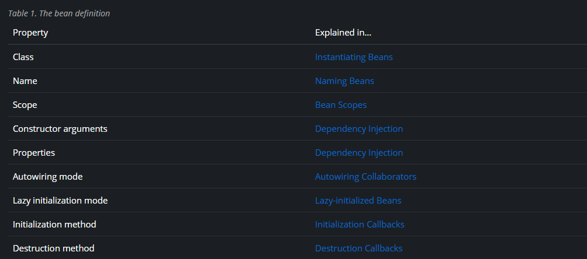
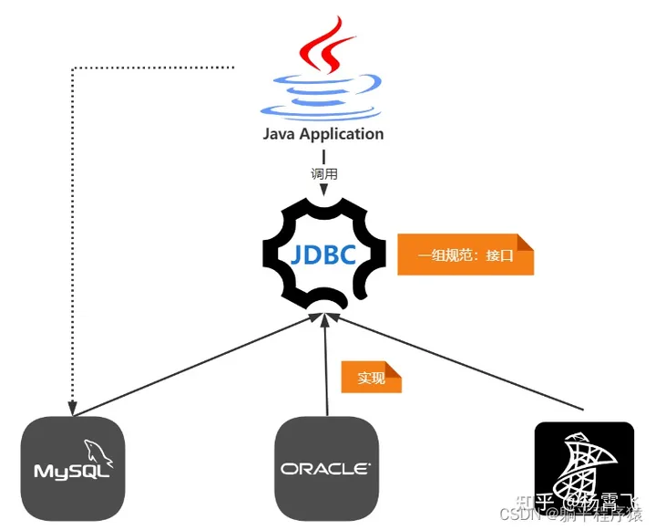
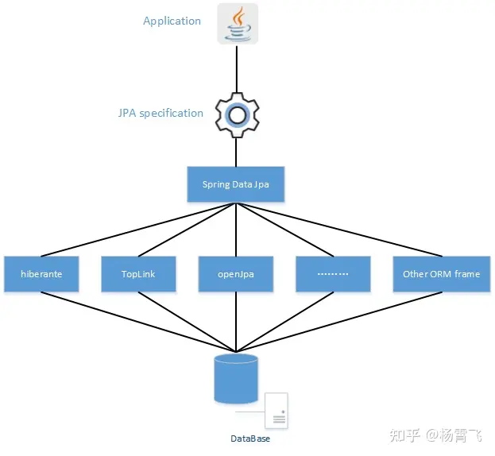

https://docs.spring.io/spring-framework/reference/index.html

Spring Framework Versions

- Spring Framework 6.2.x: JDK 17-25 (expected)
- Spring Framework 6.1.x: JDK 17-23
- Spring Framework 6.0.x: JDK 17-21
- Spring Framework 5.3.x: JDK 8-21 (as of 5.3.26)

   通过类路径中的组件扫描，Spring 遵循前面描述的规则，为未命名的组件生成 bean 名称：本质上，采用简单的类名称并将其首字符转换为小写。但是，在（不寻常的）特殊情况下，当有多个字符并且第一个和第二个字符均为大写时，原始大小写将被保留。java.beans.Introspector.decapitalize这些规则与（Spring 在此使用的） 定义的规则相同。
   

什么是JPA？什么是Spring Data？hibernate和JPA的关系？
在初学java时JDBC、ORM、JPA、SpringDataJPA、Hibernate傻傻分不清楚

JDBC : SUN官方推出的操作数据库的一套接口，具体的实现由各个数据库厂商提供。JDBC 是为了解决 如何从关系型数据库中获取数据 而设计的，设计的重心是如何更好的使用 SQL，取回来的数据以 ResultSet 的形态存在于内存中，仅此而已.

- ORM :ORM是一种思想全称 O:Object R: Relational M:mapping 即对象关系映射，这里的关系特指关系型数据库中的关系，而对象呢，是指面向对象语言中的对象，不限于 Java，其他的面向对象语言，比如 Python，Ruby 等，也有自己的 ORM 框架。在java中的ORM框架它们底层调用JDBC来实现ORM工作,我们直接使用这些工具,就省去了之间使用JDBC的繁琐细节,提高了开发效率。
- JPA ：SUN官方推出的一种ORM规范，可以理解为是JDBC的升华版接口，目的是为了希望持久化技术能够统一，实现天下归一，结束现在Hibernate、TopLink等ORM框架各自为营的局面。
- Hibernate : JPA规范的一种实现，特点是强大、方便、高效、复杂、绕弯子、全自动，Hibernate已获得Sun的JPA兼容认证
- Spring Data：Spring Data项目是为了简化构建基于Spring框架应用的数据访问技术，是Spring官方提供的一套数据层的综合解决方案。它支持关系型数据库、非关系型数据库、Map-Reduce框架、云数据服务等。
- Spring Data JPA ：Spring Data JPA 是Spring Data的一个模块，主要目的是简化Spring框架和JPA实现（Hibernate、TopLink等）的整合。相较于JPA只有接口和注解，Spring Data JPA提供了Hibernate的默认实现整合，也可以使用其他持久层框架。
（MyBatis不是完整的ORM框架，MyBatis只是将数据库中的内容映射为实体，没有将实体映射为数据库中的字段。或者说是sql语句和方法互相映射）

