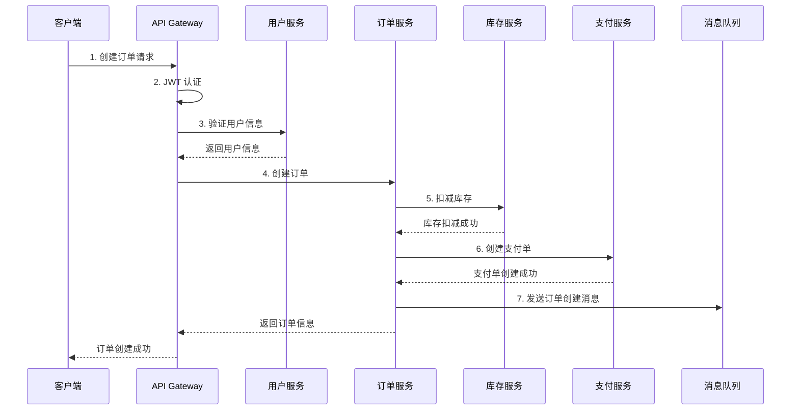

# 实战案例

本章节通过实际项目案例，演示如何使用 Linsir Spring Cloud 构建微服务应用。

## 案例概述

我们将构建一个简化的电商系统，包含以下服务：

| 服务 | 端口 | 功能 |
|------|------|------|
| linsir-gateway | 8080 | API 网关，统一入口 |
| linsir-user-service | 8081 | 用户服务，用户注册、登录、信息管理 |
| linsir-order-service | 8082 | 订单服务，订单创建、查询、取消 |
| linsir-payment-service | 8083 | 支付服务，支付处理、退款 |
| linsir-inventory-service | 8084 | 库存服务，库存扣减、查询 |

## 系统架构

```
┌─────────────────────────────────────────────────────────────┐
│                         客户端层                             │
│              (Web / App / 小程序 / 第三方)                    │
└─────────────────────────────────────────────────────────────┘
                              │
                              ▼
┌─────────────────────────────────────────────────────────────┐
│                      API Gateway                             │
│  ┌─────────────┐  ┌─────────────┐  ┌─────────────┐         │
│  │  路由转发    │  │  JWT 认证   │  │  限流熔断   │         │
│  └─────────────┘  └─────────────┘  └─────────────┘         │
└─────────────────────────────────────────────────────────────┘
                              │
          ┌───────────────────┼───────────────────┐
          │                   │                   │
          ▼                   ▼                   ▼
┌─────────────────┐ ┌─────────────────┐ ┌─────────────────┐
│  User Service   │ │  Order Service  │ │ Payment Service │
│    用户服务      │ │    订单服务      │ │    支付服务      │
└────────┬────────┘ └────────┬────────┘ └────────┬────────┘
         │                   │                   │
         │         ┌─────────┴─────────┐         │
         │         │                   │         │
         │         ▼                   ▼         │
         │  ┌─────────────┐    ┌─────────────┐  │
         │  │   MySQL     │    │    Redis    │  │
         │  │  (主数据库)  │    │   (缓存)    │  │
         │  └─────────────┘    └─────────────┘  │
         │                                       │
         └───────────────────┬───────────────────┘
                             │
                             ▼
                   ┌─────────────────┐
                   │  RocketMQ       │
                   │  (消息队列)      │
                   └─────────────────┘
```

## 数据流转

### 下单流程



## 项目初始化

### 1. 创建数据库

```sql
-- 用户库
CREATE DATABASE linsir_user CHARACTER SET utf8mb4 COLLATE utf8mb4_unicode_ci;

-- 订单库
CREATE DATABASE linsir_order CHARACTER SET utf8mb4 COLLATE utf8mb4_unicode_ci;

-- 支付库
CREATE DATABASE linsir_payment CHARACTER SET utf8mb4 COLLATE utf8mb4_unicode_ci;

-- 库存库
CREATE DATABASE linsir_inventory CHARACTER SET utf8mb4 COLLATE utf8mb4_unicode_ci;
```

### 2. 初始化 Nacos 配置

在 Nacos 控制台创建以下配置文件：

**linsir-gateway.yaml**
```yaml
server:
  port: 8080

spring:
  cloud:
    gateway:
      routes:
        - id: user-service
          uri: lb://linsir-user-service
          predicates:
            - Path=/api/user/**
          filters:
            - StripPrefix=1
        - id: order-service
          uri: lb://linsir-order-service
          predicates:
            - Path=/api/order/**
          filters:
            - StripPrefix=1
```

### 3. 启动顺序

```bash
# 1. 启动基础设施
docker-compose up -d nacos mysql redis rocketmq

# 2. 启动网关
cd linsir-gateway && mvn spring-boot:run

# 3. 启动业务服务
cd linsir-user-service && mvn spring-boot:run
cd linsir-order-service && mvn spring-boot:run
cd linsir-payment-service && mvn spring-boot:run
```

## 案例列表

- [用户服务](./user-service) - 用户注册、登录、信息管理
- [订单服务](./order-service) - 订单创建、查询、分布式事务
- [支付服务](./payment-service) - 支付处理、回调、退款

## 最佳实践

- [服务拆分](./service-splitting) - 微服务拆分原则与实践
- [分布式事务](./distributed-transaction) - Seata 分布式事务实战
- [限流降级](./rate-limiting) - Sentinel 流量控制
- [灰度发布](./canary-deployment) - 平滑升级策略
